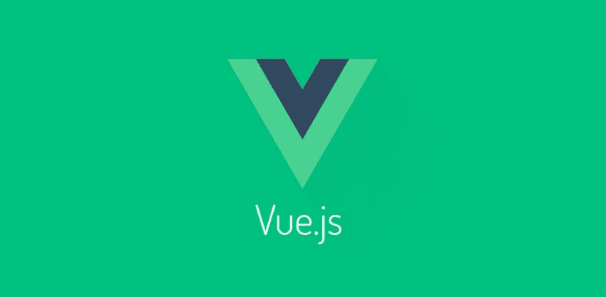

# VueJS:第一印象

> 原文：<https://dev.to/remejuan/vuejs-first-impressions-dao>

[T2】](https://res.cloudinary.com/practicaldev/image/fetch/s--4NnSv6Qd--/c_limit%2Cf_auto%2Cfl_progressive%2Cq_auto%2Cw_880/https://thepracticaldev.s3.amazonaws.com/i/gzic0j1dmzjhd0p2i727.jpeg)

有了这么多新的库和框架，很难跟上它们的步伐，如果你甚至能决定哪些值得花时间的话。在过去的一年多时间里，我接触了许多新的技术堆栈，包括 React for work 和 React-Native、Aurelia 和 Angular2。他们每个人都参与了一个新项目，部分原因是想尝试一下或者形成自己的观点。

之前我写过关于奥雷利亚的文章，在角 2 灾难之后，我印象非常深刻，如果你喜欢，你可以在这里阅读更多信息:

奥雷利亚:第一印象

这一次，我决定投入进去。JS ，网上有很多关于它的好消息，它显然比 react 更快，它实现了 [Snabbdom](https://github.com/snabbdom/snabbdom) ，这是一个简单而强大的虚拟 dom，专注于性能。最重要的是，它明显小于 React，大约 14kb。

在我多年来使用过的所有框架和库当中，有一件事让我对 Vue 印象深刻。JS 是文档，非常详细且易于理解，涵盖了多种用例以及适用于每个内置方法的各种选项。

现在来看一下代码，下面的例子是一个非常简单的组件，是用最基本的代码编写的，只是为了让你对事物的结构有一个概念。

```
<template>
  <div>
    <header-bar></header-bar>
    <main>
      <search-bar :submit="search" :term="searchTerm"></search-bar>
        <list-data v-for="item in list" :event="item"></list-item>
    </main>
    <footer-bar></footer-bar>
  </div> </template> 
<script>
import Vue from 'vue';
import { Search } from './components';
import { Header, Footer, List } from '~/shared';
import './styles.scss';
export default {
  name: 'Events',
  components: {
    'header-bar': Header,
    'search-bar': Search,
    'list-data': List,
    'footer-bar': Footer,
  },
  data() {
    return {
      data: [],
      searchTerm: {},
    }
  },
  created() {
    // API/Service calls would go here
    return {
      data: [
        {},
        {}
      ],
    };
  },
  methods: {
    search() {
      // Search method written here
    },
  }
};
</script> 
```

Enter fullscreen mode Exit fullscreen mode

Vue。JS 使用一个包含模板主体和脚本部分的模板文件，这些文件用一个**保存。vue** 分机。

Vue。JS 本身是完全与模板无关的，你可以像上面一样使用把手/指令模板，你也可以使用 **JSX** ，或者如果你喜欢，甚至可以使用 es5 或 es6 字符串插值手动构建它。

这个文件基本上处理了所有的事情，您将定义 HTML 结构以及相关的脚本逻辑，并定义一个`<style>`块或者导入一个样式表，就像示例中那样。

脚本标签是所有真正工作开始的地方，我们从导入 Vue 和我们打算在组件中使用的任何组件开始。

```
name: 'Events',
 components: {
    'header-bar': Header,
    'search-bar': Search,
    'list-data': List,
    'footer-bar': Footer,
 }, 
```

Enter fullscreen mode Exit fullscreen mode

上面我们有一个默认导出对象的片段，我们从`components`名称开始，后面是一个组件对象。这个对象定义了一个键，它是我们模板中 HTML 元素的标记名，它的值是我们前面导入的组件。

接下来，我们有一些控制初始逻辑和定义可用函数的方法。

```
data() {
  return {
    data: [],
    searchTerm: {},
  }
}, 
```

Enter fullscreen mode Exit fullscreen mode

`data()`函数用于设置组件初始渲染的默认数据，此处数据键将自身设置为一个空数组，稍后当我们获取数据时，它将成为一个对象数组，我们不希望因默认无效数据类型而中断渲染。

```
created() {
  // API/Service calls would go here
  return {
    data: [
      {},
      {}
    ],
  };
}, 
```

Enter fullscreen mode Exit fullscreen mode

`created()`类似于 reacts `componentWillMount`生命周期方法，这是组件生命周期内获取组件启动时不可用的任何数据的最佳位置，在这种情况下，获取实际的列表项。

```
methods: {
  search() {
    // Search method written here
  },
} 
```

Enter fullscreen mode Exit fullscreen mode

`methods()`是定义函数的地方，这些函数将在组件本身中使用，或者作为道具传递给子组件，就像`search()`一样，子组件`Search`将通过道具接收这个方法，然后当用户与搜索组件交互时，这个方法将被触发。

例子中没有明确包括但被引用的一件事是 props，像 react 和现阶段可能还有许多其他库，Vue。JS 也支持 props，像 react 一样，它们可以是子组件需要的任何东西，可以是静态文本、函数、需要循环的数据数组，也可以是具有简单动态显示的键值对的对象。

道具的定义非常简单，在`default export`中你可以添加另一个名为‘props’的键，该键包含了它期望接收到的所有道具。

```
<template>
  <form novalidate @submit.stop.prevent="submit">
    <label>Search term...</label>
    <input v-model="term.value"></input>
  </form> </template> 
<script>
export default {
  name: 'Search',
  props: ['submit', 'term'],
}
</script> 
```

Enter fullscreen mode Exit fullscreen mode

上面是一个搜索组件的例子，你可以看到它有两个属性，submit 方法和 term，这是一个处理搜索值的模型，搜索值将被传递到函数中。

这只是对 Vue 可能实现的功能的一个尝试。JS，通过访问他们在 [Vue 的文档，你会看到更多的例子。JS 文档](https://vuejs.org/v2/guide/)。

如果你想快速启动一个应用程序并开始使用 Vue。JS，我可以建议看一下 [FountainJS](https://github.com/fountainjs/generator-fountain-vue) 创造的约曼发电机。

和 Vue 一起工作。JS 是一个很大的乐趣，我发现学习曲线很浅，然而这可能纯粹是基于我的经验，正如我以前提到过的，我过去和一些人一起工作过。

默认的模板结构与 Angular 的工作方式非常相似，因此来自该背景的开发人员可能会比他们的反应更快地掌握它。我真的不能不学习 react，看看它是否会影响学习 Vue.JS 的容易程度。

最初发布于[媒体](https://hackernoon.com/vuejs-first-impressions-ef59822e94e6)