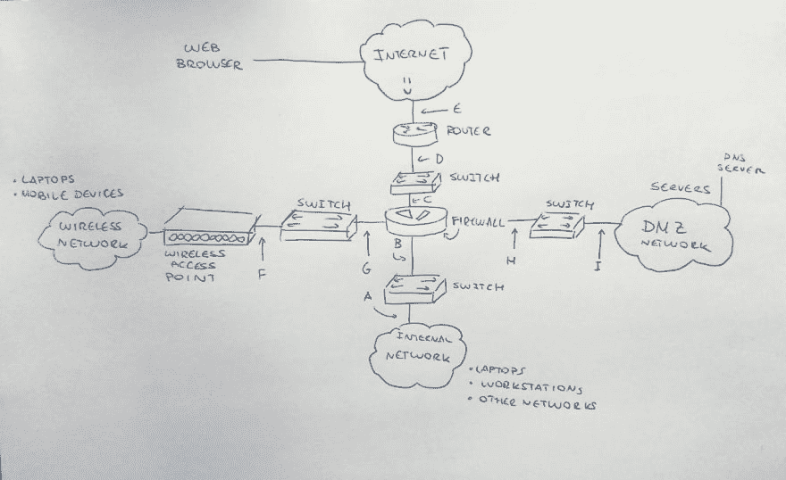

# 安全冲刺:第 2 周-选择一个好的嗅探点并使用 tcpdump 进行数据包分析

> 原文:[https://dev.to/terceranexus6/security-sprint-week-2 选择一个好点进行嗅探并使用 tcpdump 进行数据包分析- e9](https://dev.to/terceranexus6/security-sprint-week-2---choosing-a-nice-point-to-sniff-and-using-tcpdump-for-packet-analysis--e9)

在我安全强化学习的第二周，我的生活中出现了一个巨大的机会！偶然地，我被要求指导一群学生学习网络监控和取证，这已经是我最喜欢的安全模块。正如我在第一周已经说过的，我想在更广的范围内学习，但现在我应该把大部分精力放在团队目标上，我也很高兴有机会向这些人学习。

无论如何，我想在这篇文章的开头简单解释一下“在哪里嗅探”，我们应该从网络的哪里收集数据。这是一个困难的决定，也不是所有的网络都是一样的...让我们看一个例子。
加里漫画店网络(抱歉这个蹩脚的草图):

[T2】](https://res.cloudinary.com/practicaldev/image/fetch/s--9mh0TqqX--/c_limit%2Cf_auto%2Cfl_progressive%2Cq_auto%2Cw_880/https://github.com/terceranexus6/cosicas/blob/mastimg/network.jpg%3Fraw%3Dtrue)

好的，这是加里漫画书店网络的方案(我完全虚构了这个名字，抱歉，如果我猜中了一个真实的店铺名称)，我们应该注意不同的路径，这取决于我们的兴趣。例如，如果我们对从工作站到服务器的路径感兴趣，我们应该负责监控从 A 到 E 的两个方向，以及互联网和 WEB 服务器本身之间的另一个新路径。

从加里的笔记本电脑到网络服务器，我们将负责双向监控**F-G-C-D-E+互联网/网络服务器**，或者从本地 DNS 服务器到互联网上的网络服务器**I-H-C-D-E+互联网/DNS** 双向监控。

安全专家的职责是识别网络可能受到威胁的地方，然后采取行动应对。我们指出的每个网段都有一组地址，我们称之为“网络块”。防火墙将*将*(**NAT**-网络地址转换)地址转换为不同的值，例如 192.168.2.100 到 192.168.1.100。同理，我们可以找到无线和内部网络的 **NPAT** (网络端口地址翻译)。

无论如何，基于这一点，从丢弃监控点 C、D 和 E 开始是一个不错的选择，因为它们保存在公司内部。无论如何，在我们的情况下**，我会说监控 G、B 和 H 是最好的选择**，因为它们包含真正的目的 IP 地址。

我将把物理访问的麻烦和选项留待下一次讨论，因为现在我的观点暴露了，我想介绍 tcpdump。根据我们希望关注的分析阶段，有几种网络系统监控工具。今天我想重点介绍一下**数据展示**。这将有助于分析人员暴露数据。

当在实时网络上工作时，Tcpdump 实时显示结果(或写日志),或为取证保存跟踪文件，这对 CTF 的游戏很方便。安装 tcpdump(在 debian jessie 中，但我猜在 ubuntu 等其他常见系统中也是如此)就像:

```
 sudo apt-get install tcpdump 
```

<svg width="20px" height="20px" viewBox="0 0 24 24" class="highlight-action crayons-icon highlight-action--fullscreen-on"><title>Enter fullscreen mode</title></svg> <svg width="20px" height="20px" viewBox="0 0 24 24" class="highlight-action crayons-icon highlight-action--fullscreen-off"><title>Exit fullscreen mode</title></svg>

一旦我们拥有了它，我们实际上就拥有了**手册页**中的大部分信息。例如:

```
 tcpdump -n -i eth1 -c 5 
```

<svg width="20px" height="20px" viewBox="0 0 24 24" class="highlight-action crayons-icon highlight-action--fullscreen-on"><title>Enter fullscreen mode</title></svg> <svg width="20px" height="20px" viewBox="0 0 24 24" class="highlight-action crayons-icon highlight-action--fullscreen-off"><title>Exit fullscreen mode</title></svg>

在这个命令中，我们告诉 tcpdump **n** ot 通过 DNS 查询将 IP 地址解析为主机名，其中 **i** 接口监控 hand 到**c**count 它应该捕获多少个包。啊，顺便说一下，你将需要使用 **sudo** 进行 tcpdump。我们应该收到五个包，第一个是 UDP(用户数据报协议)包，其余的是 TCP(传输控制协议)包。有了这些信息，我们可以研究连接的性质，并从协议、IP、数据长度中推断出一些东西...如果我们想将这些数据保存在日志中以备后用，我们可以使用-w。

```
 sudo tcpdump -n -i eth1 -c 5 -w example.pcap 
```

<svg width="20px" height="20px" viewBox="0 0 24 24" class="highlight-action crayons-icon highlight-action--fullscreen-on"><title>Enter fullscreen mode</title></svg> <svg width="20px" height="20px" viewBox="0 0 24 24" class="highlight-action crayons-icon highlight-action--fullscreen-off"><title>Exit fullscreen mode</title></svg>

并使用-r 来打开它，以便以后阅读。

```
 tcpdump -n -r example.pcap 
```

<svg width="20px" height="20px" viewBox="0 0 24 24" class="highlight-action crayons-icon highlight-action--fullscreen-on"><title>Enter fullscreen mode</title></svg> <svg width="20px" height="20px" viewBox="0 0 24 24" class="highlight-action crayons-icon highlight-action--fullscreen-off"><title>Exit fullscreen mode</title></svg>

除此之外，你们可以使用过滤器，或者强制使用不同的信息样式(比如时间戳样式)等等。无论如何，我希望你们喜欢这个关于 NSM 的基础教程。乖乖的，tho！

[T2】](https://res.cloudinary.com/practicaldev/image/fetch/s--rNdFVJAY--/c_limit%2Cf_auto%2Cfl_progressive%2Cq_66%2Cw_880/https://i.imgur.com/GsJSEuc.gif)