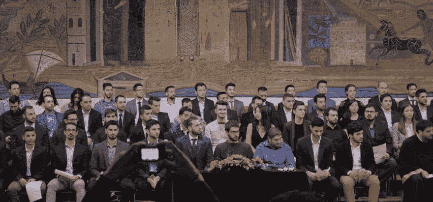
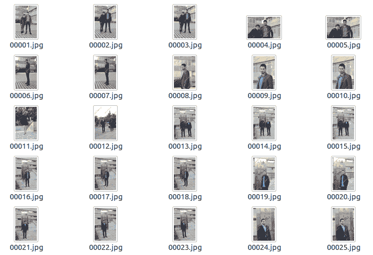
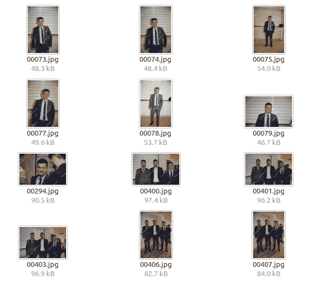

# 30 秒内浏览 10，000 张照片

> 原文:[https://dev . to/kmavrodis/30 秒内浏览 10000 张图片-ad8](https://dev.to/kmavrodis/going-through-10000-pictures-in-30-seconds-ad8)

在过去的 5 年里，我一直在学习电子和计算机工程，它在很多方面改变了我。我交了新朋友，遇到了有趣的人，工作和学习了很多。长话短说，在无数次的早起上课和深夜喝酒之后，上周我毕业了！

感觉棒极了！这所大学举行了一个盛大的毕业典礼，所有这些重要的学者、亲戚、朋友和 90 多名即将毕业的学生都参加了。我喜欢这些仪式。每个人看起来都很开心。有什么更好的方法来保持这种快乐，用照片捕捉它呢？专业摄影师当然意识到了，并且一直在。哦，天啊，总是有很多。
[T3】](https://res.cloudinary.com/practicaldev/image/fetch/s--j-9WMlSo--/c_limit%2Cf_auto%2Cfl_progressive%2Cq_auto%2Cw_880/https://i.imgur.com/hQ2DT7O.jpg)

工作方式是几十个摄影师拍下数千张快乐的毕业生和他们家人的照片。他们随后将低分辨率的拷贝上传到网站上，学生可以查看，甚至购买一些。但是有一个问题...有太多的照片，他们没有被标记。

看看我毕业时的照片。我们说的是 436 页，每一页有 24 张图片，总共大约有 10，400 张照片。最糟糕的是，找到某个人的唯一方法是手动浏览所有这些照片。粗略估计，这个过程需要三个小时。我的意思是，我不是世界上最忙的人，但看起来要花很多时间来挑选几张照片。

我读到第 20 页，已经厌倦了。我想，一定有别的办法。此外，如果你不得不多次做同样的事情，计算机可以做得比你更好。所以，我想到了一个简单的主意。如果我写一个脚本来抓取所有照片，并通过某种算法来检测我的脸，然后只返回我所在的照片，会怎么样呢？理论上它应该工作，理论上它应该花我不到三个小时。

## 下载照片

正如我已经提到的，我的目标网站是按页面组织的，每个页面包含 24 张照片。我需要的是一个脚本，可以迭代通过所有这些网页，并下载照片。

起初，我打算用 Python 写所有的东西，但是在意识到利用 wget 的强大功能编写一个简单的 bash 脚本是多么容易之后，我想，为什么不这样做呢？这就是:

```
#!/bin/bash

for i in {1..436}
do wget -r -l1 -A.jpg https://www.example.com/events/view/1545?page=$i
done 
```

老实说，这没什么大不了的。该脚本遍历 436 页中的每一页，并运行一个简单的 wget 命令来下载所有 jpg 图像。请注意，它使用 wget 的检索选项，这意味着 wget 会沿着链接和目录搜索网页。你可以在这里了解这个有趣的算法[。这样 wget 不仅可以下载图片的缩略图，还可以下载原始图片。一些额外的像素对于我稍后打算使用的[剧透]机器学习算法来说至关重要[/剧透]。](https://www.gnu.org/software/wget/manual/html_node/Recursive-Download.html#Recursive-Download)

在执行之后，这个脚本已经用大约 10，400 张照片填充了一个文件夹，准备进行分析。以下是从网站上删除的 10，400 张图片中的一小部分。

[T2】](https://res.cloudinary.com/practicaldev/image/fetch/s--VakO6uz1--/c_limit%2Cf_auto%2Cfl_progressive%2Cq_auto%2Cw_880/https://thepracticaldev.s3.amazonaws.com/i/rr3a5in14m5rtnfu5qjn.png)

## 人脸识别

现在唯一缺少的是找到一种方法在所有这些图像中检测我的脸。好在我们有机器学习来解决这个问题！到处都有预先训练好的模型和现成的库，你可以在你的项目中使用它们，并赋予它们神奇的技能。

[人脸识别](https://github.com/ageitgey/face_recognition)是一个优秀的开源 python 库，可以做到这一点，并被宣传为具有 99.38%的准确率，同时工作在著名的 [dlib](http://dlib.net/) 库之上。它基本上提供对一组算法的访问，并作为黑盒运行，允许以下操作:

*   在图片中查找面孔
*   操纵面部特征
*   通过人脸识别人

在不深入太多细节的情况下，我将试着解释这个系统是如何工作的，所以希望它不再是一个黑匣子。为了找到人脸，该算法将图片转换为黑白，旨在处理亮度而不是颜色。通过绘制亮度如何变化(梯度)的小向量，它创建了一个由特征组成的新图像，现在可以与一组预处理的人脸图片进行比较。如果它们接近，则检测到人脸。

为了识别一个人，该算法在已知人的数据库中搜索与新测量值最接近的人。机器学习(对...没有深度学习，对不起，我知道它现在很热，但它不是所有问题的解决方案)用于使用线性 [SVM 分类器](https://en.wikipedia.org/wiki/Support_vector_machine)进行分类。要了解这个过程的更多信息，我推荐阅读亚当·盖特基[的更准确、更深入的解释。](https://medium.com/@ageitgey/machine-learning-is-fun-part-4-modern-face-recognition-with-deep-learning-c3cffc121d78)

## 应用人脸识别

现在回到最初的问题。这个想法是使用我的一张脸的图像，最好是毕业那天的一张，来训练人脸识别库，然后通过算法传递 10，400 张照片中的每一张，这将返回我所在的照片。

我的脸被用来训练:
[](https://res.cloudinary.com/practicaldev/image/fetch/s--XBnRbyvH--/c_limit%2Cf_auto%2Cfl_progressive%2Cq_auto%2Cw_880/https://thepracticaldev.s3.amazonaws.com/i/av4rgh8redpi9hscc9my.png)

有些照片包含几个面孔，所以确保所有的面孔都与我的相比较是很重要的。最后，我的所有照片都存储在一个单独的文件夹中，这样以后检查它们会更容易。实现这些的 python 代码可以在下面找到。

```
#import face_recognition from shutil import copyfile

# Create an encoding of my facial features that can be compared to other faces picture_of_me = face_recognition.load_image_file("mavrodis.jpg")
my_face_encoding = face_recognition.face_encodings(picture_of_me)[0]

# Iterate through all the 10,460 pictures for i in range(1, 10461):
    # Construct the picture name and print it
    file_name = str(i).zfill(5) + ".jpg"
    print(file_name)

    # Load this picture
    new_picture = face_recognition.load_image_file(file_name)

    # Iterate through every face detected in the new picture
    for face_encoding in face_recognition.face_encodings(new_picture):

        # Run the algorithm of face comaprison for the detected face, with 0.5 tolerance
        results = face_recognition.compare_faces([my_face_encoding], face_encoding, 0.5)

        # Save the image to a seperate folder if there is a match
        if results[0] == True:
            copyfile(file_name, "/home/deeplearning/Desktop/my_face/mavrodis/" + file_name) 
```

差不多就是这样！请注意，在第 21 行，提供了一个特定值(0.5)。这是算法的容差(或阈值)。较高的容差告诉算法不太严格，而较低的容差意味着相反。它确实需要一些时间来运行，因为它必须检查所有 10，000 多张照片(但肯定有一些并行化的空间)。

自动检测到的部分照片:
[](https://res.cloudinary.com/practicaldev/image/fetch/s--0Fn4Cw9z--/c_limit%2Cf_auto%2Cfl_progressive%2Cq_auto%2Cw_880/https://thepracticaldev.s3.amazonaws.com/i/95y3vs7gof9hl4ardyrp.png) 
Tada！这是成功的！

有几件事我们应该注意。照片上有水印，但面部识别没有任何问题。此外，该算法对于团体照片，或者面部远离相机镜头的照片非常有效。

## 准确度

使用该算法检测了大约 160 张我的照片。如果你考虑到有 90 名学生(90*160 = 14，400 张照片，其中一些是集体照)，从统计学的角度来看这是有意义的。然而，我无法提供准确的百分比，因为这需要我仔细检查最初的 10，400 张照片中的每一张，这是我一开始就打算避免的。

我可以告诉你，有假阳性(人们最终出现在我的文件夹中，而不是我)，也可能有假阴性(我的照片没有出现在我的文件夹中)，但总的来说，似乎没有太多。

## 结论

现在，这很有趣！至少比手动浏览所有照片有趣得多。我认为它也花费更少的时间。更不用说我所有的朋友都让我为他们的脸运行脚本。我甚至为在场的一些父母做过。在照相馆的网站上看到这样的东西不是很好吗？

比尔·盖茨曾经说过:

> 我选择懒人去做困难的工作。因为懒人会找出简单的办法。

我说:

> 如果你是懒惰的人，把困难的工作交给电脑。这会节省你的时间和精力。

感谢阅读！现在，懒惰的人需要找到钱来买一些毕业照。我想，这不是机器学习...