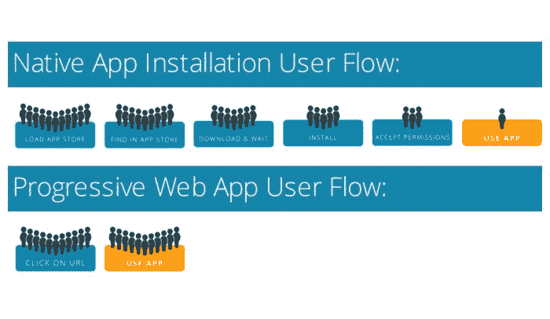
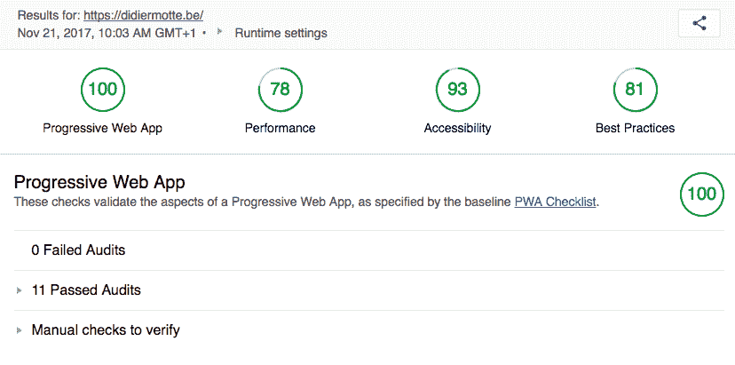
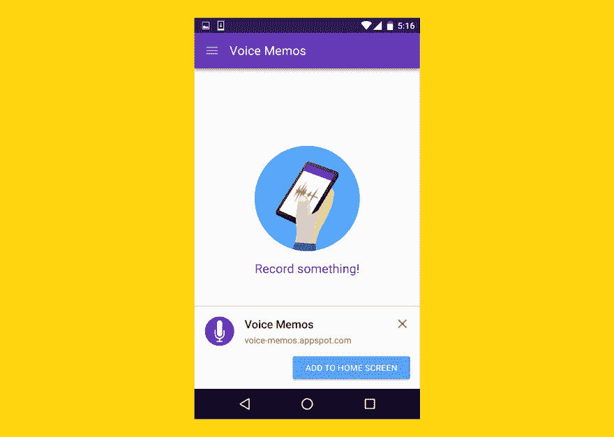
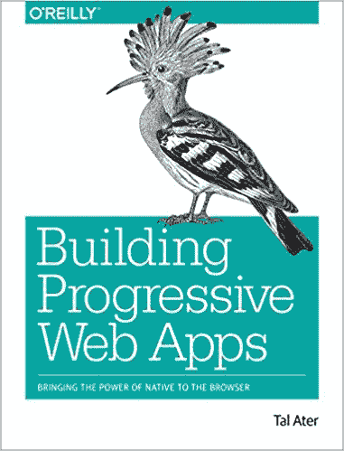

# 将网站转变为渐进式网络应用的简单方法

> 原文:[https://dev . to/becode org/the-easy-way-to-turn-a-website-into-a-progressive-we b-app-77g](https://dev.to/becodeorg/the-easy-way-to-turn-a-website-into-a-progressive-web-app-77g)

## 什么是渐进式 Web App？

基本上，PWA 是一个可以保存在用户设备(台式机、平板电脑或智能手机)上的网站，因此感觉和行为很像*原生应用*:加载屏幕，消除浏览器的界面混乱以增强用户的关注，并且，如果连接中断，它仍然显示(缓存的)内容，使用户能够继续离线工作。

## 为什么重要？

它往往会提高用户参与度:如果 Android 的 Chrome 浏览器(不确定其他移动浏览器)检测到该网站是 PWA，它会提示用户使用你选择的图标将其保存在设备的主屏幕上。

与移动应用相比，它简化了最终用户的设置过程，摆脱了应用商店的束缚。
[T3】](https://res.cloudinary.com/practicaldev/image/fetch/s--KbYccISX--/c_limit%2Cf_auto%2Cfl_progressive%2Cq_auto%2Cw_880/https://thepracticaldev.s3.amazonaws.com/i/1ndt3v1egn4exjfl1x3r.jpg)

PWA 对你客户的业务有好处。中国的亚马逊阿里巴巴注意到，由于浏览器提示“安装”网站，用户参与度增加了 48%([来源](https://developers.google.com/web/showcase/2016/alibaba))。

这使得努力完全值得为之奋斗！

多亏了一种叫做**服务工人**的技术，这种技术允许你在用户系统中保存静态资产(html，css，javascript，json...)，旁边还有一个`manifest.json`，指定网站作为一个已安装的应用程序应该如何运行。服务人员可以做更多的事情，比如离线时轮询用户操作，在线时在后台同步用户操作。

## 例子

著名的 pwa 有 Slack，Spotify，星巴克，纽约时报，还有更多...

这里有一些我自己用这里描述的相同技术做的 pwa。

*   [plancomptable Belgium . be](https://plancomptablebelge.be)(单页网站)
*   mathr.app (一款练习微积分的游戏，使用 Sveltekit 制作)

## 设置

把一个网站变成一个 PWA 听起来可能很复杂(服务人员 whaaaat？)，但也没那么难。在我的带领下，你将在这篇文章结束时拥有一个！

### 1。要求:https 而不是 http

PWA 只在安全域上运行的网站上工作(在 **https** 后面://而不是 http://)。
这些通常很难手动设置，但幸运的是，如果你有自己的服务器，你可以使用 [letsencrypt](https://letsencrypt.org/) 来实现超级简单和自动化。和...免费。

### 2。工具

#### 2.1 灯塔测试

*   灯塔测试是由谷歌创建和维护的自动化测试，测试网站的三个标准:进步性、性能、可访问性。它给出了每个问题的百分比分数，并建议如何解决每个问题。这是一个很好的学习工具。
*   [realfavicongenerator.net](https://realfavicongenerator.net)
*   UpUp.js 库

#### 2.2 realfavicongenerator.net

[realfavicongenerator.net](https://realfavicongenerator.net)负责你 PWA 的视觉层。它生成上面提到的 manifest.json 文件，以及将网站保存到任何移动设备上所需的所有版本的图标，以及添加到页面的`<head>`标签的 html 片段。

#### 2.3 服务人员，via upup.js

服务工作者是一种 javascript 技术。我发现这很难理解，因为我的大脑疲惫且缺乏耐心，但幸运的是，[一个来自德国的聪明女孩](https://vimeo.com/103221949)给我指了一个由 [Tal Atler](https://twitter.com/TalAter) 开发的 javascript 库，这使得*Uber*很容易让你的网站在连接中断时表现良好。*丹科舍恩，奥拉加西德罗！*

只需做快速 [UpUp 教程](https://www.talater.com/upup/getting-started-with-offline-first.html)就可以了。

#### 2.4 货单

编辑 RFG 为您生成的 manifest.json 文件。它应该至少包含这些条目:“范围”、“开始 url”、“短名称”、“显示”。下面是一个工作示例:

```
{  "name":  "My PWA Sample App",  "short_name"  :  "PWA",  "start_url":  "index.html?utm_source=homescreen",  "scope"  :  "./",  "icons":  [  {  "src":  "./android-chrome-192x192.png",  "sizes":  "192x192",  "type":  "image/png"  },  {  "src":  "./android-chrome-512x512.png",  "sizes":  "512x512",  "type":  "image/png"  }  ],  "theme_color":  "#ffee00",  "background_color":  "#ffee00",  "display":  "standalone"  } 
```

<svg width="20px" height="20px" viewBox="0 0 24 24" class="highlight-action crayons-icon highlight-action--fullscreen-on"><title>Enter fullscreen mode</title></svg> <svg width="20px" height="20px" viewBox="0 0 24 24" class="highlight-action crayons-icon highlight-action--fullscreen-off"><title>Exit fullscreen mode</title></svg>

更多信息请访问 developers.google.com。

### 3。方法学

1.  使用 Realfavicongenerator 并生成 html 和图像代码。将它们添加到您的网站代码中。
2.  在您的 https 域上发布。
3.  做灯塔测试。
4.  分析结果。
5.  逐一解决每个问题。
6.  回到 3，重复一遍。
7.  迭代，直到你在任何地方都接近 100，100 是“渐进的”。
8.  在你的手机上测试，看看会发生什么。如果有机会的话，在 Android 上你会在底部看到一个弹出窗口，邀请你将网站保存到你的手机主屏幕上！

## 深入兔子洞...

这是我用 Github 页面做的一个 PWA 项目的例子，在[为我的三年级学生现场编码，代码](http://www.becode.org) : [用你的手机访问它的 Github 页面](https://pixeline.github.io/pwa-example/index.html)来测试它。[访问它的仓库](https://github.com/pixeline/pwa-example)检查代码。

你可以在这本书里找到你需要的关于 PWA 的所有信息:

[构建渐进式网络应用

](https://www.amazon.fr/_/dp/1491961651?tag=oreilly20-20) 。

就是这样！祝你快乐！

* * *

您的 PWA 已经准备好了:您如何学习如何使用 Git 来自动化它的部署呢？