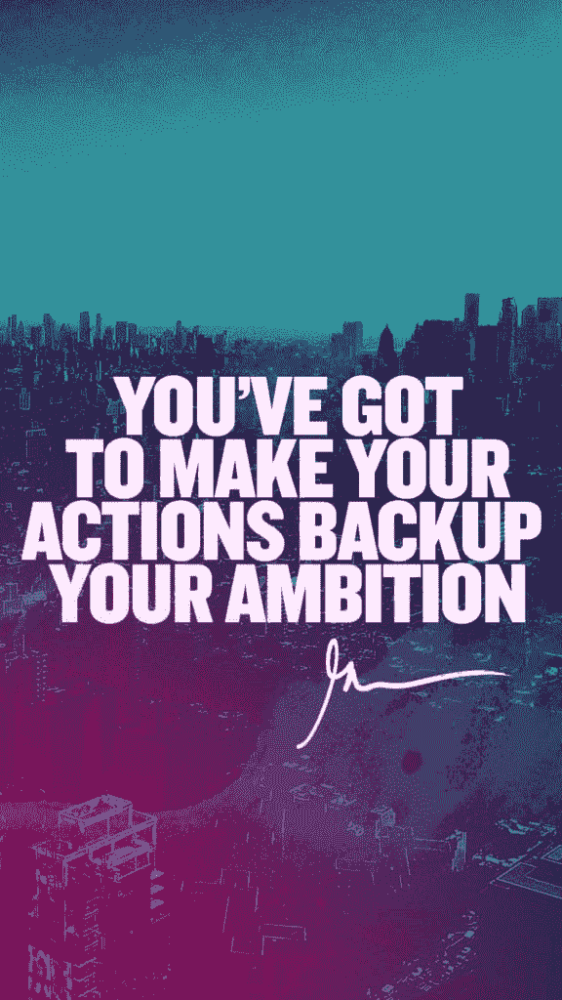

# 开始为初级开发人员建立一个简单的投资组合网站

> 原文：<https://dev.to/mrfrontend/start-building-a-simple-portfolio-website-for-a-junior-developer-e30>

[T2】](https://res.cloudinary.com/practicaldev/image/fetch/s--T_UhK8B8--/c_limit%2Cf_auto%2Cfl_progressive%2Cq_auto%2Cw_880/https://cdn-images-1.medium.com/max/1024/0%2Ay-X6lVPVctNYLKxN.jpg)

#### 初级开发人员

作为一名初级开发人员，你在网上搜索“**如何建立一个作品集网站**”！

这可能很有挑战性，因为你没有太多的项目可以展示！

在我的一个播客中，我告诉你一些如何获得项目的想法，但不要成为自由职业者。

“*我没什么可展示的*的借口都是**的屁话📢**！如果你想成为一名开发人员，并且想作为一名初级开发人员找到一份好工作，你必须把你的名字公布在公开的网络上！互联网！

#### 视频

[https://www.youtube.com/embed/1ibbd8CE6z4](https://www.youtube.com/embed/1ibbd8CE6z4)

当做现场视频和写这个的时候，我会把我的朋友萨米记在心里。我在 2016 年 2 月初开始创办《Frontend 先生》的时候就已经认识了 [Sami](https://twitter.com/SamiADelgado) 。

如果有任何初级开发人员需要任何帮助或指导，我会发一条推文。这并不傲慢，但我有一种感觉，我可以帮忙，并对人们的生活产生影响！

#### 对于初级开发人员来说，投资组合很重要

但是回到这篇文章的起源。我看到许多初级开发人员专注于不重要的东西。担心他们应该为自己的投资组合选择哪个框架。或者他们能多快学会另一个酷库？

但是这些都不是一个开发者应该做的最重要的事情！当你第一次开始使用 HTML、CSS 或者 JavaScript 进行开发时。学会编码更重要。学基础！

如果你专注于你需要做出更多改变来获得第一份工作或更好的工作，你必须投入时间和精力。

但是**不要专注于做完美**！用最少的信息做点简单的东西**发货** ( *我是说放到网上呵呵*)！

在把它放到网上后，你可以专注于让它更酷，更有趣。但是要尽快推出第一个版本！

如果你这么想得到一份工作，那么"**你必须让你的行动支持你的雄心壮志**"！

如果你只是在谈论你想要一份开发人员的工作，投入工作，有耐心，努力工作！追随你的梦想，相信你能做到！

加里·维纳查克的一句名言是:

[T2】](https://res.cloudinary.com/practicaldev/image/fetch/s--slW65SE5--/c_limit%2Cf_auto%2Cfl_progressive%2Cq_auto%2Cw_880/https://cdn-images-1.medium.com/max/576/0%2AFZ5wH4kQzB3AHacw.png)

你可以在这里找到更多盖瑞的壁纸。

#### 需要帮忙吗？

如果你需要一些指导，辅导或只是帮助你的投资组合，请在脸书，Twitter PM 或 Instagram DM 上满足我，我很乐意帮助！

你可以问萨米我如何对待我帮助的人🙏

如果你想让我审查你的投资组合，那么把你的链接放在评论里，我会花一整段视频来介绍你的投资组合，并给出可操作的反馈！

不要害羞！求我帮忙！！！！😉

*原载于* [*奥前端博客*](https://blog.mrfrontend.org/2017/11/start-building-simple-portfolio-website-junior-developer/) *。*

* * *