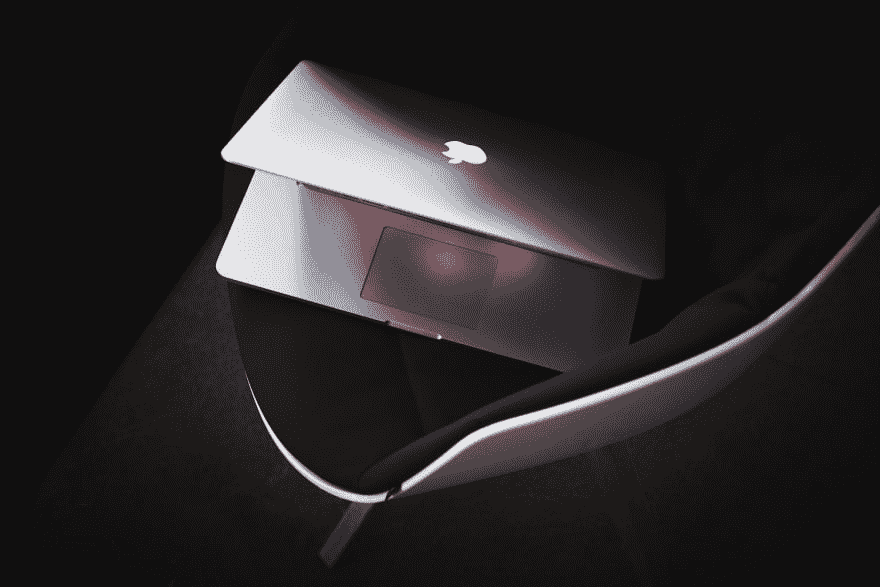
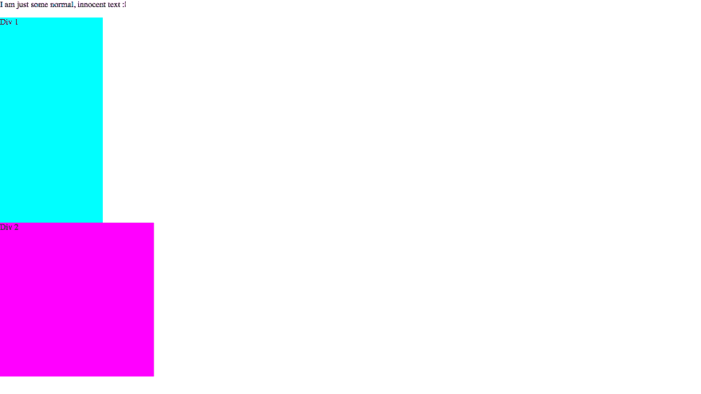
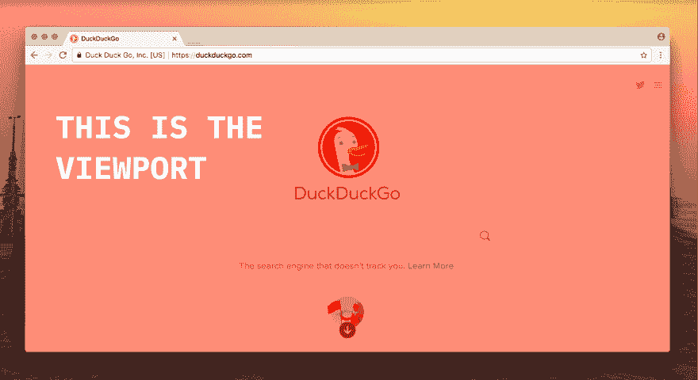
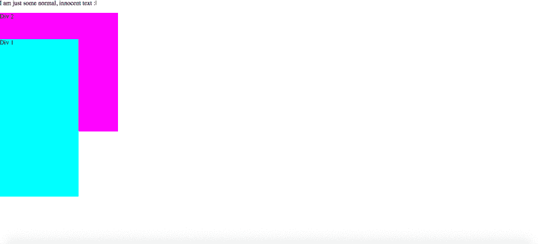
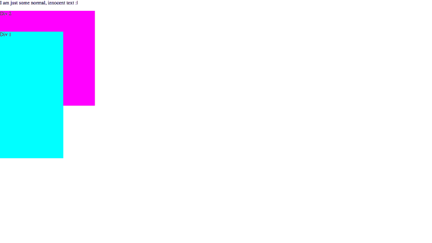
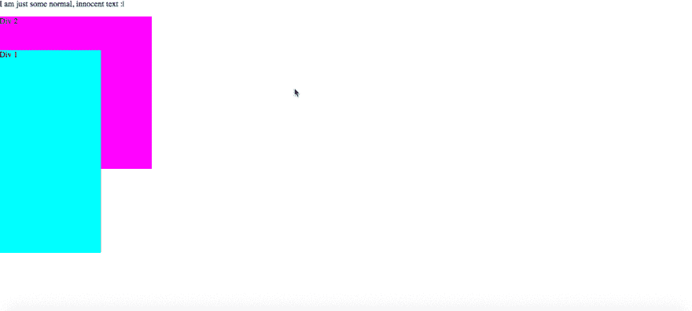
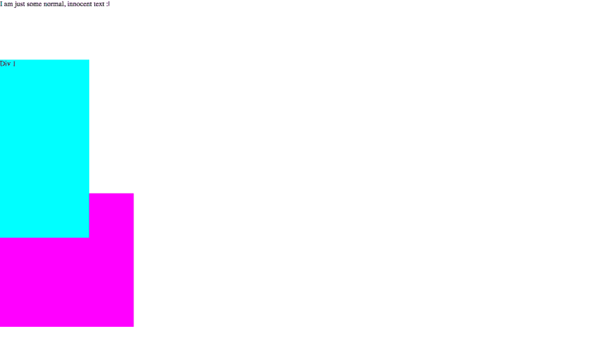
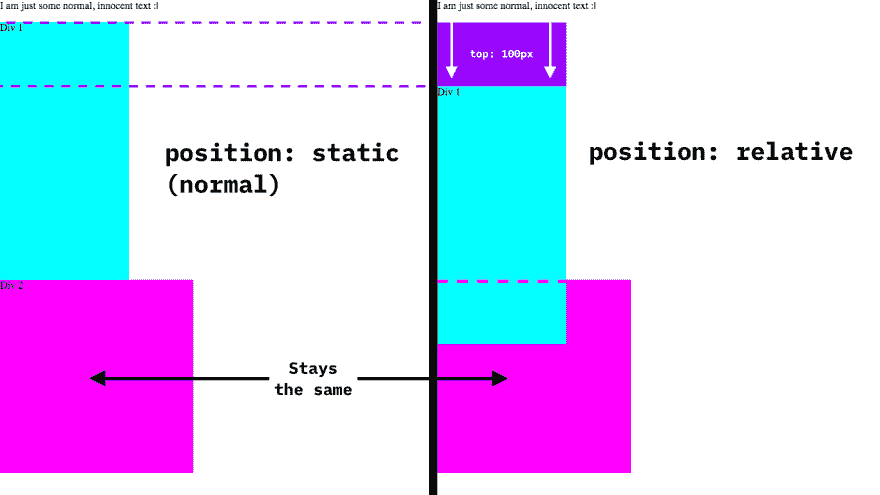
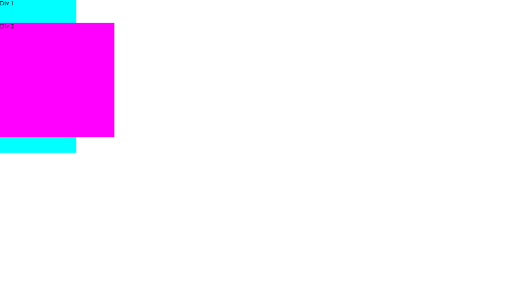

# 使用 position 属性的高级 CSS 定位

> 原文:[https://dev . to/code the web/advanced-CSS-positioning-using-the-position-property-1pk](https://dev.to/codetheweb/advanced-css-positioning-using-the-position-property-1pk)

[T2】](https://res.cloudinary.com/practicaldev/image/fetch/s--W550-fkD--/c_limit%2Cf_auto%2Cfl_progressive%2Cq_auto%2Cw_880/https://codetheweb.blog/assets/img/posts/css-position-property/cover.jpg)

## 入门

我认为最好是边做边学，所以我强烈建议在我的所有教程中遵循。按照下面的步骤，首先创建一个新的项目文件夹，其中包含`index.html`和`style.css`文件。将以下代码添加到您的`index.html` :

```
<!DOCTYPE html>
<html>
    <head>
        <title>CSS position property DEMO</title>
        <link rel="stylesheet" href="style.css">
    </head>
    <body>
        <p>I am just some normal, innocent text :|</p>
        <div class="div1">Div 1</div>
        <div class="div2">Div 2</div>
    </body>
</html> 
```

<svg width="20px" height="20px" viewBox="0 0 24 24" class="highlight-action crayons-icon highlight-action--fullscreen-on"><title>Enter fullscreen mode</title></svg> <svg width="20px" height="20px" viewBox="0 0 24 24" class="highlight-action crayons-icon highlight-action--fullscreen-off"><title>Exit fullscreen mode</title></svg>

接下来，给你添加下面的 CSS`style.css`，这样我们可以更好的看到我们的`<div>`:

```
body {
    margin: 0;
    height: 5000px;
}
.div1 {
    background-color: cyan;
    width: 200px;
    height: 400px;
}

.div2 {
    background-color: magenta;
    width: 300px;
    height: 300px;
} 
```

<svg width="20px" height="20px" viewBox="0 0 24 24" class="highlight-action crayons-icon highlight-action--fullscreen-on"><title>Enter fullscreen mode</title></svg> <svg width="20px" height="20px" viewBox="0 0 24 24" class="highlight-action crayons-icon highlight-action--fullscreen-off"><title>Exit fullscreen mode</title></svg>

设置`body`高度的原因是为了让我们可以在页面上滚动——稍后你会在教程中看到为什么这是相关的。如果你的屏幕高度大于`5000px`并且不能滚动，那么你的屏幕确实太大了😝。

酷！现在你已经准备好了！在网络浏览器中打开你的`index.html`——目前看起来应该是这样的:[T3】](https://res.cloudinary.com/practicaldev/image/fetch/s--1IobKjls--/c_limit%2Cf_auto%2Cfl_progressive%2Cq_auto%2Cw_880/https://codetheweb.blog/assets/img/posts/css-position-property/base-code.png)

请注意，根据您的屏幕大小和分辨率，它看起来可能会略有不同。不管怎样，我们走吧！

## 你将要学习的属性

在本教程中，您将学习如何使用:

*   `position`
*   `top`、`bottom`、`left`和`right`

所有这些属性共同赋予元素一个特定的位置。当您使用非默认值的`position`值时，您可以使用`top`、`bottom`、`left`和`right`属性对其进行定位。

## 上、下、左、右属性

这些属性用于定位元素。根据元素的`position`属性，它相对于不同的元素进行定位(稍后我会解释)。`top`、`bottom`、`left`和`right`属性接受所有的 [CSS 单位](https://codetheweb.blog/2017/12/04/css-units/)，但是对于本文，我们将使用`px`(像素)。

## 位置属性

`position`属性接受五个值:

*   `static`
*   `fixed`
*   `absolute`
*   `relative`
*   `sticky`

让我们来看看他们每个人都做了些什么…

### 位置:静态

`static`是默认的职位类型。所有的元素都有这种位置类型，除非你另外声明，所以你真的不需要担心它——这是你已经知道的默认行为，你几乎不需要使用它。

`top`、`bottom`、`left`和`right`属性不会对`position`为`static`的元素做任何事情。

### 位置:固定

[](https://res.cloudinary.com/practicaldev/image/fetch/s--w7DDn0Qo--/c_limit%2Cf_auto%2Cfl_progressive%2Cq_auto%2Cw_880/https://codetheweb.blog/assets/img/posts/css-position-property/viewport.png) 当一个元素的`position`属性为`fixed`时，它相对于视口定位(见上图，视口以红色突出显示)。

这意味着，假设一个元素的`top`值为`100px`，它将从视口顶部定位`100px`。但是如果你尝试向下滚动会发生什么呢？离屏幕上方还是`100px`。这意味着一个`position`值为`fixed`的元素即使在你向下滚动的时候也会停留在原地！

让我们看看我在 Div 1:
中谈到的例子

```
.div1 {
    background-color: cyan;
    width: 200px;
    height: 400px;
    position: fixed; /* Add this line */
    top: 100px; /* And this one */
} 
```

<svg width="20px" height="20px" viewBox="0 0 24 24" class="highlight-action crayons-icon highlight-action--fullscreen-on"><title>Enter fullscreen mode</title></svg> <svg width="20px" height="20px" viewBox="0 0 24 24" class="highlight-action crayons-icon highlight-action--fullscreen-off"><title>Exit fullscreen mode</title></svg>

将它添加到你的 CSS 中，重新加载页面并尝试向下滚动——Div 1 停留在屏幕上的同一个位置！

[T2】](https://res.cloudinary.com/practicaldev/image/fetch/s--UZOSCWyg--/c_limit%2Cf_auto%2Cfl_progressive%2Cq_66%2Cw_880/https://codetheweb.blog/assets/img/posts/css-position-property/fixed.gif)

您还会注意到，Div 1 覆盖了 Div 2 的一部分——我将在页面的更下方处理重叠和层(让我们先把所有的位置类型都处理掉)。

另一件要注意的事情是 Div 2 被上移了，因为**`absolute`元素被从文档流中移除了。**这意味着没有空间留给元素正常的位置。

### 位置:绝对

`absolute`定位是相对于它的一个祖先来定位的，而不是像`position: fixed`那样的视口。

等待什么？？？祖先？？？这是古代的埋葬仪式吗？？？？

不，祖先只是一个元素的*父*之一。比如:

```
<div>
    <ul>
        <li>Hello</li>
    </ul>
</div> 
```

<svg width="20px" height="20px" viewBox="0 0 24 24" class="highlight-action crayons-icon highlight-action--fullscreen-on"><title>Enter fullscreen mode</title></svg> <svg width="20px" height="20px" viewBox="0 0 24 24" class="highlight-action crayons-icon highlight-action--fullscreen-off"><title>Exit fullscreen mode</title></svg>

这里的`<div>`和`<ul>`都是`<li>`的*祖先*。

**那么，它用的是哪个祖先呢？**嗯，它是基于其最近的祖先来定位的，其`position`不同于`static`。如果没有符合条件的祖先，则相对于 body 元素定位它。 ***注意`<body>`与视口不同，因为它可以上下滚动(移动)*** 。

> 绝对定位可能有点复杂，但是不要分开！基本上，`position: absolute`是相对于主体定位的，除非它内部的元素有一个`position`值。傻瓜！

为了让事情更清楚，让我们做一个例子——更新你的 CSS 文件，给 Div 1 一个`absolute`的`position`:

```
.div1 {
    background-color: cyan;
    width: 200px;
    height: 400px;
    position: absolute; /* Change this line from fixed */
    top: 100px;
} 
```

<svg width="20px" height="20px" viewBox="0 0 24 24" class="highlight-action crayons-icon highlight-action--fullscreen-on"><title>Enter fullscreen mode</title></svg> <svg width="20px" height="20px" viewBox="0 0 24 24" class="highlight-action crayons-icon highlight-action--fullscreen-off"><title>Exit fullscreen mode</title></svg>

现在保存并重新加载页面:

[T2】](https://res.cloudinary.com/practicaldev/image/fetch/s--chJpw4Ot--/c_limit%2Cf_auto%2Cfl_progressive%2Cq_auto%2Cw_880/https://codetheweb.blog/assets/img/posts/css-position-property/absolute.png)

什么？但是看起来是一样的！没错…现在 Div 1 相对于`<body>`而不是*视口*。这意味着它看起来是一样的，但是现在当你滚动的时候它会向下移动-你自己试试吧！

[T2】](https://res.cloudinary.com/practicaldev/image/fetch/s--RNd0ZJuL--/c_limit%2Cf_auto%2Cfl_progressive%2Cq_66%2Cw_880/https://codetheweb.blog/assets/img/posts/css-position-property/absolute.gif)

正如你所看到的，大多数时候`fixed`和`absolute`的区别在于当你滚动的时候`absolute`会移动，而`fixed`不会——由于我上面提到的原因。

### 位置:相对

`relative`定位与`absolute`和`fixed`非常不同。它相对于*本身*定位，而不是另一个元素。与`absolute`和`fixed`不同，用`relative`定位的元素仍然是*文档流*的一部分。

基本上，`relative`定位的计算方法是一个两步过程:

1.  像正常一样渲染元素(就像没有`position`值一样)
2.  元素根据其`top`、`bottom`、`left`和`right`属性移动(如`100px`有`top: 100px`则向下移动)。请注意**其他元素不会移动以填充任何间隙或为该元素让路，它们会停留在原来的位置**。这将在文档流中创建一个与元素大小相同的空白空间。

示例时间！让我们给 Div 1 一个`relative`的`position`:

```
.div1 {
    background-color: cyan;
    width: 200px;
    height: 400px;
    position: relative; /* Change this line from absolute */
    top: 100px;
} 
```

<svg width="20px" height="20px" viewBox="0 0 24 24" class="highlight-action crayons-icon highlight-action--fullscreen-on"><title>Enter fullscreen mode</title></svg> <svg width="20px" height="20px" viewBox="0 0 24 24" class="highlight-action crayons-icon highlight-action--fullscreen-off"><title>Exit fullscreen mode</title></svg>

保存并重新加载页面，然后看一看: [](https://res.cloudinary.com/practicaldev/image/fetch/s--zO8uQ2uF--/c_limit%2Cf_auto%2Cfl_progressive%2Cq_auto%2Cw_880/https://codetheweb.blog/assets/img/posts/css-position-property/relative.png)

现在页面与开始时完全相同，除了 Div 1 被下移`100px`。如果这是通过设置`margin-top: 100px`来完成的，那么 Div 2 也会向下移动，但是因为我们使用了`relative`定位，所以不管怎样它都停留在同一个位置！

下面是形象化的区别: [](https://res.cloudinary.com/practicaldev/image/fetch/s--J5O7uTMP--/c_limit%2Cf_auto%2Cfl_progressive%2Cq_auto%2Cw_880/https://codetheweb.blog/assets/img/posts/css-position-property/relative-comparison.png)

我们继续吧！

### 位置:粘性

`position: sticky`实际上只是在其他两种定位类型之间切换:`fixed`和`relative`。`position: sticky`通常与`top`属性一起使用，当你滚动视窗时，如果你想让某些东西贴在视窗的顶部。

首先，我们来看一个例子。将你的 CSS `position`属性改为`sticky` :

```
.div1 {
    background-color: cyan;
    width: 200px;
    height: 400px;
    position: sticky; /* Change this line from relative */
    top: 0; /* Change this from 100px */
} 
```

<svg width="20px" height="20px" viewBox="0 0 24 24" class="highlight-action crayons-icon highlight-action--fullscreen-on"><title>Enter fullscreen mode</title></svg> <svg width="20px" height="20px" viewBox="0 0 24 24" class="highlight-action crayons-icon highlight-action--fullscreen-off"><title>Exit fullscreen mode</title></svg>

我们将`top`值更改为`0`的原因是，当我们滚动 Div 1 时，它会停留在顶部。保存，重新加载你的页面，看看会发生什么…

元素从`relative`定位开始，直到元素的顶部从视口顶部到达`0px`(因为`0`的`top`值)。之后，定位变为`fixed`，其`top`值为`0`(在屏幕顶部)。

干得好，现在你知道所有的 CSS `position`值和它们的作用了！这是相当复杂的东西，所以如果你感到困惑，那么你可以去读一遍，或者在评论中寻求帮助。

## 重叠

这是我将在本文中讨论的最后一件事。回头看看上面的——您会看到 Div 1 与 Div 2 重叠。但是，如果您希望 Div 2 与 Div 1 重叠呢？这就是`z-index`属性发挥作用的地方。

`z-index`接受整数，包括正数和负数。然而，它不支持任何类型的单位。还要注意的是，`z-index`只对具有`position`属性的元素有效。默认情况下，一个元素有一个`0`的`z-index`。

所以如果我们想让 Div 2 和 Div 1 重叠，我们必须给 Div 2 一个更高的`z-index`。我们可以通过将 Div 2 的`z-index`设置为`1`或者将 Div 1 的`z-index`设置为`-1`来实现这一点。在这种情况下，因为我们已经设计了 Div 1，所以让我们使用第二个选项。

添加一个`-1`的`z-index`到你的 Div 1 样式:

```
.div1 {
    background-color: cyan;
    width: 200px;
    height: 400px;
    position: sticky;
    top: 0;
    z-index: -1; /* Add this line */
} 
```

<svg width="20px" height="20px" viewBox="0 0 24 24" class="highlight-action crayons-icon highlight-action--fullscreen-on"><title>Enter fullscreen mode</title></svg> <svg width="20px" height="20px" viewBox="0 0 24 24" class="highlight-action crayons-icon highlight-action--fullscreen-off"><title>Exit fullscreen mode</title></svg>

保存，重新加载，向下滚动一点，这样`<div>`重叠在一起，看一看: [](https://res.cloudinary.com/practicaldev/image/fetch/s--WzyIHiW3--/c_limit%2Cf_auto%2Cfl_progressive%2Cq_auto%2Cw_880/https://codetheweb.blog/assets/img/posts/css-position-property/z-index.png)

你会看到现在 Div 2 和 Div 1 重叠了！

## 结论

好了，今天就到这里。我希望你学到了一些东西！

如果你喜欢这篇文章，我真的很感激你能分享它并注册简讯。

如果你有任何问题，反馈或者只是想打声招呼，你可以在下面的评论中提出。

玩得开心点，下次再见，届时我将谈论[一些有点不同的东西](https://codetheweb.blog/2017/11/24/devchat/) …到时见！

> ### 想要更多这样的帖子？[注册我的简讯](https://codetheweb.blog/newsletter/)。
> 
> 我一直在努力学习这些教程，但是到目前为止还没有赚到任何钱，所以如果你注册的话，我会非常感激；)

这篇文章最初发表在 [Code The Web](https://codetheweb.blog) 上，这是一个有趣且易于理解的博客，帮助你学习 Web 开发🚀
学:[HTML](https://codetheweb.blog/learn/html/)|[CSS](https://codetheweb.blog/learn/css/)|[JavaScript](https://codetheweb.blog/learn/javascript/)