# 用解析树在语法上扎根

> 原文:[https://dev . to/vaidehijoshi/grammatically-root-yourself-with-parse-trees-16a](https://dev.to/vaidehijoshi/grammatically-rooting-oneself-with-parse-trees-16a)

<figure>[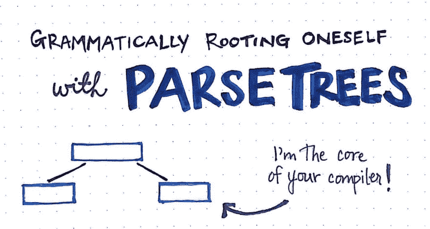](https://res.cloudinary.com/practicaldev/image/fetch/s--x7QWZlJP--/c_limit%2Cf_auto%2Cfl_progressive%2Cq_auto%2Cw_880/https://cdn-images-1.medium.com/max/1024/1%2AyKjaulmzLsRxN4JBvy5Q2w.jpeg) 

<figcaption>语法上用解析树生根！</figcaption>

</figure>

在技术世界中，思考我们周围的所有抽象概念有时会让人不知所措。当你试图将你的头脑包裹在一个新的范式中，或者解开你正在努力理解的一个或多个概念的层次时，尤其如此。

在学习计算机科学的背景下，有太多的抽象概念要知道、看到或认识它们——更不用说能够理解它们了！

当你能看到抽象之外的东西时，抽象是非常强大的，并且能够理解一些东西是如何被抽象出来的，为什么会让你成为一个更好的程序员。然而，出于同样的原因，每一个抽象的产生都是有原因的:这样我们就不用每天都担心它们了！我们不应该总是考虑抽象，而且在大多数情况下，我们中很少有人真的这么做。但是事情是这样的——一些抽象比另一些更平等。大多数工程师可能关心的是他们如何与计算机交流，以及他们的计算机如何理解他们。即使我们都不需要写[一个冒泡排序算法](https://dev.to/vaidehijoshi/bubbling-up-with-bubble-sorts)，如果我们写代码，那么我们必须与我们的机器交流。

好了，我们终于到了揭开这些秘密的时候了，并且理解了驱动我们作为程序员的工作流程的抽象概念。

### 解析为解析的意思

树数据结构是在我们的计算机科学冒险中不断出现的一种结构。我们已经看到它们使用[来存储各种类型的数据](https://dev.to/vaidehijoshi/how-to-not-be-stumped-by-trees)，我们已经看到[是自平衡的](https://dev.to/vaidehijoshi/busying-oneself-with-b-trees)，而其他的[已经针对空间](https://dev.to/vaidehijoshi/compressing-radix-trees-without-too-many-tears)和处理存储进行了优化。我们甚至研究了如何通过旋转和重新着色来操纵树，以确保它们符合一组规则。

但是，尽管有所有这些不同形式的数据结构植物群，有一个特殊的迭代树数据结构，我们还没有发现。即使我们对计算机科学一无所知，不知道如何平衡一棵树，也不知道树数据结构是如何工作的，所有程序员每天都与一种类型的树结构进行交互，这是因为每个编写代码的开发人员都需要确保他们的代码能被他们的机器理解。

这种数据结构被称为解析树，它是允许我们作为程序员编写的代码被我们的计算机“可读”的底层抽象之一。

<figure>[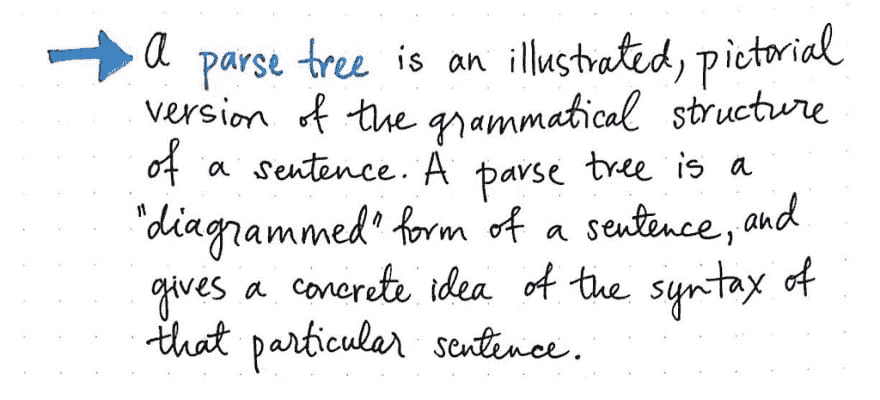](https://res.cloudinary.com/practicaldev/image/fetch/s--_wC-Bd1Z--/c_limit%2Cf_auto%2Cfl_progressive%2Cq_auto%2Cw_880/https://cdn-images-1.medium.com/max/1024/1%2ARJYEISGZl2qUxAaHselQug.jpeg) 

<figcaption>解析树:一个定义。</figcaption>

</figure>

在它的核心，一个 ***解析树*** 是一个句子语法结构的图示版本。解析树实际上植根于语言学领域，但也用于教育学，即研究教学的学科。解析树通常用于教学生如何识别句子的各个部分，并且是引入语法概念的一种常见方式。很可能我们每个人都从造句的角度和他们交流过，有些人可能在小学就已经学过了。

> 解析树实际上只是一个句子的“图解”形式；这个句子可以用任何语言书写，这意味着它可以遵循任何语法规则。

句子图解包括将一个句子分解成最小的、最明显的部分。如果我们从图解句子的角度来考虑解析树，我们会很快意识到，根据句子的语法和语言，解析树实际上可以用多种不同的方式来构造！

但是到底什么是电脑版的“句子”呢？我们到底该如何绘制它呢？

从一个我们已经熟悉的例子开始会有所帮助，所以让我们用一个正常的英语句子来刷新我们的记忆。

<figure>[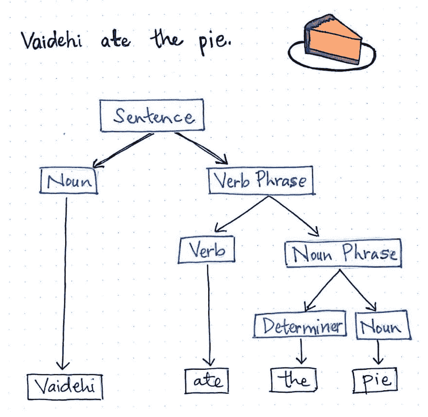](https://res.cloudinary.com/practicaldev/image/fetch/s--iRonogtD--/c_limit%2Cf_auto%2Cfl_progressive%2Cq_auto%2Cw_880/https://cdn-images-1.medium.com/max/1024/1%2AzQ_bUppUhjPj3JjJ-uQv0w.jpeg) 

<figcaption>用解析树表示简单句。</figcaption>

</figure>

在这里显示的插图中，我们有一个简单的句子:“Vaidehi 吃了馅饼”。因为我们知道解析树只是一个图表化的句子，所以我们可以从这个例句中构建一个解析树。请记住，实际上我们所要做的就是确定这个句子的不同部分，并把它分解成最小的、最明显的部分。

我们可以从把句子分成两部分开始:一个 ***名词***“Vaidehi”，一个 ***动词短语*** “吃了馅饼”。因为一个名词不能被进一步分解，我们将保留单词“Vaidehi”不变。另一种思考方式是这样一个事实，因为我们不能再进一步分解一个名词，所以不会有来自这个单词的子节点。

但是动词短语“吃了馅饼”呢？这个短语还没有被分解成最简单的形式，是吗？我们可以进一步分析。首先，“吃”这个词是一个动词，而“馅饼”更像是一个名词——事实上，它是一个 ***名词短语*** 来完全具体化。如果我们把“吃馅饼”分开，我们可以把它分成一个动词和一个名词短语。由于动词不能用任何额外的细节来表示，单词“ate”将成为解析树中的一个叶节点。

好了，现在剩下的是名词短语，“馅饼”。我们可以把这个短语分成两个不同的部分:一个名词“pie”和它的 ***限定词*** ，它被称为名词的任何修饰词。在这种情况下，限定词是单词“the”。

一旦我们划分了名词短语，我们就完成了句子的划分！换句话说，我们已经绘制好了解析树。当我们查看我们的解析树时，我们会注意到我们的句子读起来还是一样的，实际上我们根本没有修改它。我们只是把给我们的句子，用英语语法的规则把它分成最小的，最不同的部分。

> 以英语为例，每个句子的最小“部分”是一个单词；单词可以组合成短语，如名词短语或动词短语，这些短语又可以与其他短语结合在一起，构成句子成分。

<figure>[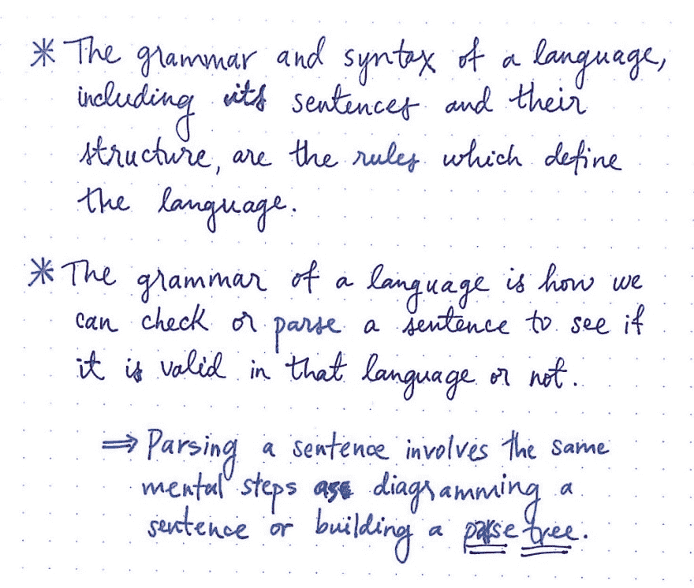](https://res.cloudinary.com/practicaldev/image/fetch/s--FMciFSUo--/c_limit%2Cf_auto%2Cfl_progressive%2Cq_auto%2Cw_880/https://cdn-images-1.medium.com/max/1024/1%2Ac259fXm_B_Ak2n-9jAtFQg.jpeg) 

<figcaption>解析某物的实际意思是什么？</figcaption>

</figure>

然而，这仅仅是一个例子，说明了一种特定语言中的一个特定的句子，有它自己的一套语法规则，如何被绘制成一个解析树。同一个句子在不同的语言中看起来会非常不同，尤其是如果它必须遵循自己的一套语法规则。

最终，一种语言的*语法*和*句法*——包括该语言的句子结构方式——成为规定该语言如何定义、我们如何用该语言写作以及我们这些说该语言的人最终如何理解和解释该语言的规则。

有趣的是，我们知道如何画出简单的句子，“Vaidehi 吃了馅饼。”因为我们已经熟悉了英语的语法。想象一下，如果我们的句子完全缺少一个名词或一个动词？会发生什么？嗯，我们很可能第一次读到这个句子，然后很快意识到它根本就不是一个句子！相反，我们会读它，并且几乎立即看到我们正在处理一个 ***句子片段*** ，或者一个句子的不完整片段。

然而，我们能够识别句子片段的唯一原因是，如果我们知道英语的规则，即(几乎)每个句子都需要一个名词和一个动词才被认为是有效的。一种语言的语法是我们如何检查一个句子在一种语言中是否有效；这个“检查”有效性的过程被称为 ***解析*** 一个句子。

当我们第一次阅读一个句子时，解析这个句子以理解它的过程涉及到与图解一个句子相同的思维步骤，而图解一个句子涉及到与建立一个解析树相同的步骤。当我们第一次阅读一个句子的时候，我们正在进行精神上的解构和解析。

事实证明，计算机对我们编写的代码做了完全相同的事情！

### 解析表情好像这是我们的工作

好了，我们现在知道了如何图解和解析一个英语句子。但是这如何应用于代码呢？在我们的代码中“句子”是什么？

好吧，我们可以把解析树看作是我们代码外观的图解“图片”。如果我们想象我们的代码，我们的程序，甚至是一个句子形式的最简单的脚本，我们可能会很快意识到我们写的所有代码都可以被简化成表达式集。

这对于一个例子来说更有意义，所以让我们看一个超级简单的计算器程序。使用单个表达式，我们可以使用数学的语法“规则”从该表达式创建一个解析树。我们需要找到最简单、最独特的表达式单元，这意味着我们需要将表达式分解成更小的片段，如下图所示。

<figure>[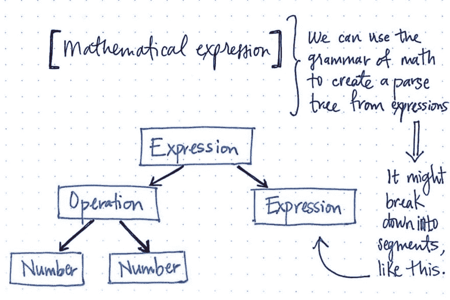](https://res.cloudinary.com/practicaldev/image/fetch/s--bFIA2rG7--/c_limit%2Cf_auto%2Cfl_progressive%2Cq_auto%2Cw_880/https://cdn-images-1.medium.com/max/1024/1%2APfSCFpmeTRe050GvziXgEA.jpeg) 

<figcaption>寻找数学表达式中的语法。</figcaption>

</figure>

我们会注意到，一个单独的数学表达式有它自己的语法规则可以遵循；甚至一个简单的表达式(比如两个数相乘，然后加到另一个数上)也可以分解成更简单的表达式。

<figure>[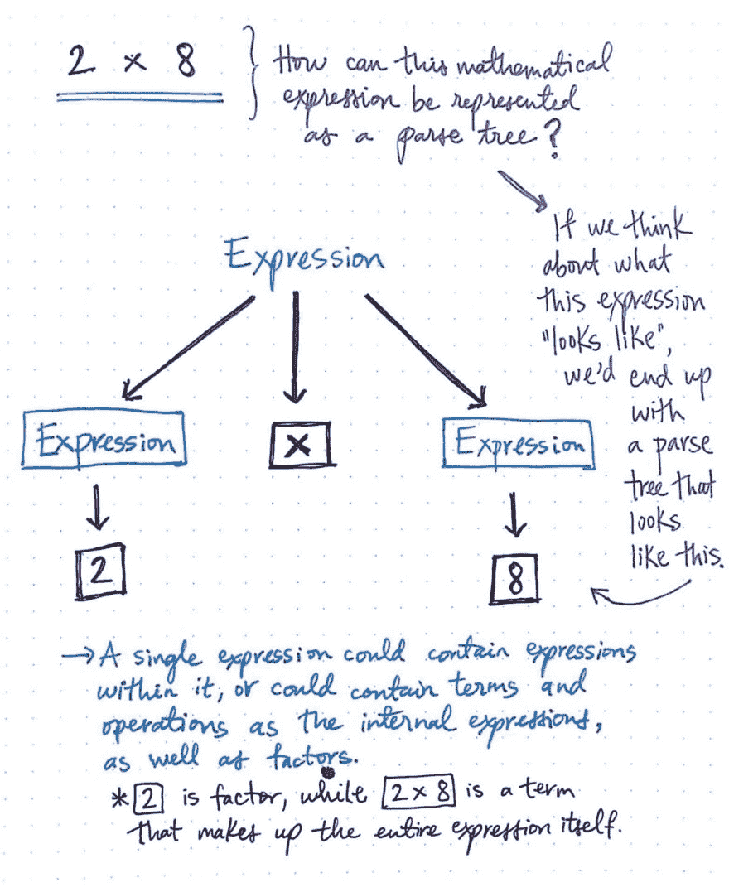](https://res.cloudinary.com/practicaldev/image/fetch/s--hpzeWVMe--/c_limit%2Cf_auto%2Cfl_progressive%2Cq_auto%2Cw_880/https://cdn-images-1.medium.com/max/1024/1%2ApZQeACNRqVdegpDMP4nHfg.jpeg) 

<figcaption>将数学表达式表示为一棵解析树。</figcaption>

</figure>

但是让我们从一个简单的计算开始。我们如何使用数学语法为像 2 x 8 这样的表达式创建解析树呢？

如果我们想一想这个表达式到底是什么样子，我们可以看到这里有三个不同的部分:左边的一个表达式，右边的一个表达式，以及将这两个表达式相乘的运算。

此处显示的图像将表达式 2 x 8 绘制成一棵解析树。我们将看到操作符 x 是表达式的一部分，不能再简化了，所以它没有任何子节点。

左边和右边的表达式可以简化成特定的术语，即 2 和 8。就像我们之前看的英语句子示例一样，一个数学表达式可以包含内部表达式以及单个的*项*，比如短语 2 x 8，或者*因子*，比如作为单个表达式的数字 2。

但是在我们创建了这个解析树之后会发生什么呢？我们会注意到，这里的子节点的层次比我们之前的句子示例中的要稍微不那么明显。2 和 8 都在同一水平上，那么我们该如何解释呢？

<figure>[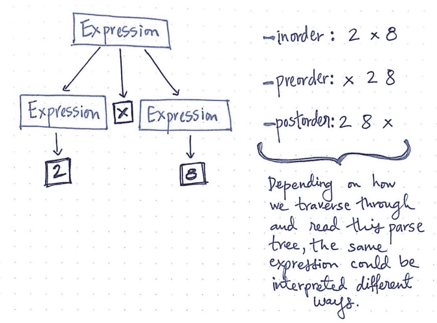](https://res.cloudinary.com/practicaldev/image/fetch/s--ydCehHzG--/c_limit%2Cf_auto%2Cfl_progressive%2Cq_auto%2Cw_880/https://cdn-images-1.medium.com/max/1024/1%2AkbeiQA0pBr--lGGSjdUg6A.jpeg) 

<figcaption>同一个表达式可以赋值给不同的解析树。</figcaption>

</figure>

我们已经知道，深度优先遍历树有各种不同的方式。取决于我们如何遍历这棵树，这个单一的数学表达式，2 x 8 可以有多种解释和解读方式。例如，如果我们使用*遍历这棵树，以便*遍历，我们将读取左边的树，根级别，然后是右边的树，结果是 2 - > x - > 8。

但是如果我们选择使用 *preorder* 遍历来遍历这棵树，我们将首先读取根级别的值，然后是左子树，然后是右子树，这将给我们 x - > 2 - > 8。如果我们使用*后序*遍历，我们将读取左边的子树，右边的子树，然后最终读取根层，这将导致 2 - > 8 - > x

解析树向我们展示了我们的表达式*看起来像什么*，揭示了我们表达式的具体语法，这通常意味着单个解析树可以用各种不同的方式表达一个“句子”。因此，解析树通常也被称为 ***具体语法树*** ，或简称为 ***CSTs*** 。当我们的机器解释或“读取”这些树时，需要有严格的规则来解析这些树，以便我们最终得到正确的表达式，所有术语都处于正确的顺序和正确的位置！

但是我们处理的大多数表达式都比 2 x 8 更复杂。即使对于一个计算器程序，我们也可能需要做更复杂的计算。例如，如果我们想求解一个像 5 + 1 x 12 这样的表达式，会发生什么？我们的解析树会是什么样子？

事实证明，解析树的问题在于，有时候你可能会有不止一个解析树。

<figure>[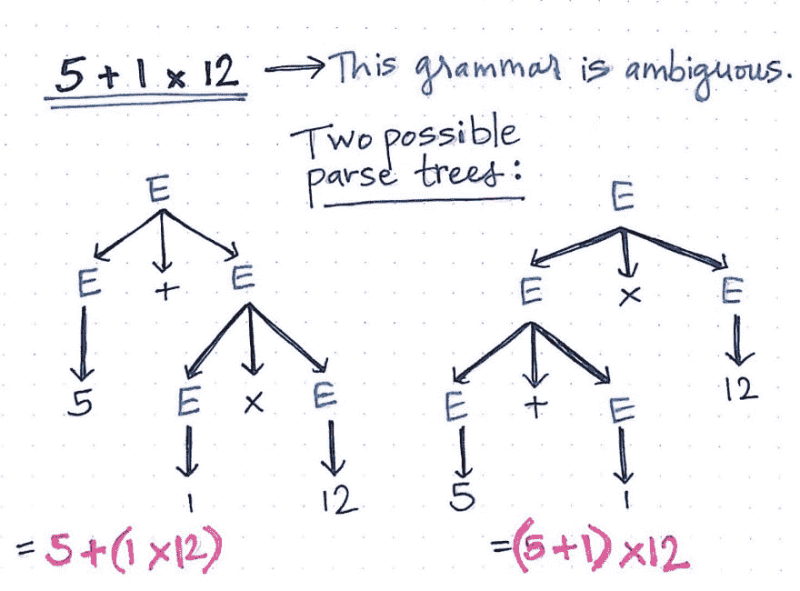](https://res.cloudinary.com/practicaldev/image/fetch/s--DZHMjcLP--/c_limit%2Cf_auto%2Cfl_progressive%2Cq_auto%2Cw_880/https://cdn-images-1.medium.com/max/1024/1%2AXxrDw6GoUNu31tBBDAiA5Q.jpeg) 

<figcaption>【歧义语法】在(解析)动作！</figcaption>

</figure>

更具体地说，被解析的一个表达式可能有多个结果。如果我们假设解析树首先从最低层开始读取，我们可以开始看到叶节点的层次结构如何导致相同的表达式以两种完全不同的方式解释，结果产生两个完全不同的值。

例如，在上图中，表达式 5 + 1 x 12 有两种可能的解析树。正如我们在左边的解析树中看到的，节点的层次结构是这样的，表达式 1 x 12 将首先被求值，然后加法将继续:5 + (1 x 12)。另一方面，正确的解析树是非常不同的；节点的层次结构迫使加法首先发生(5 + 1)，然后沿着树向上移动以继续乘法:(5 + 1) x 12。

语言中的模糊语法正是导致这种情况的原因:当不清楚语法树应该如何构建时，它可能(至少)以多种方式构建。

> 然而，困难就在这里:模糊的语法对于编译器来说是有问题的！

<figure>[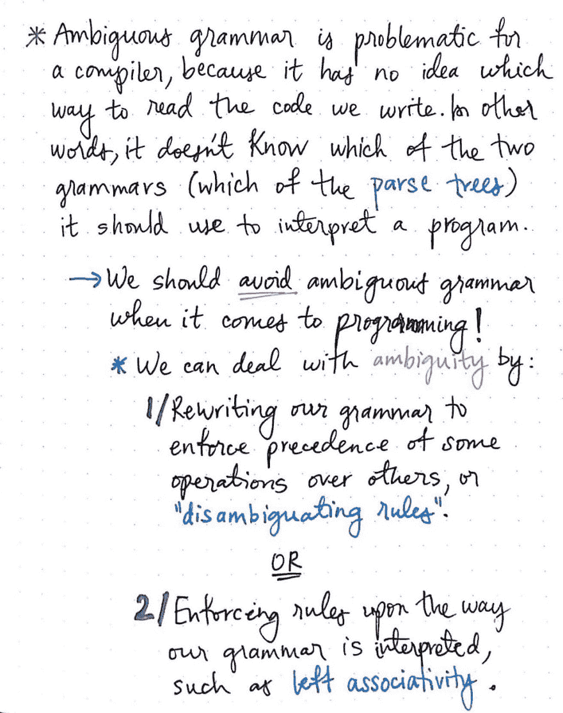](https://res.cloudinary.com/practicaldev/image/fetch/s--PQIOYN0K--/c_limit%2Cf_auto%2Cfl_progressive%2Cq_auto%2Cw_880/https://cdn-images-1.medium.com/max/1024/1%2ArJgijcOsPQ_0XQVnecxR6A.jpeg) 

<figcaption>作为编译器对抗歧义语法</figcaption>

</figure>

基于我们大多数人在学校学到的数学规则，我们天生就知道乘法应该在加法之前完成。换句话说，根据数学的语法，上面例子中只有左边的解析树是正确的。记住:语法定义了任何语言的句法和规则，不管是英语句子还是数学表达式。

但是编译器怎么可能天生就知道这些规则呢？嗯，这是不可能的！如果我们不给出语法规则，编译器就不知道用什么方式来阅读我们写的代码。例如，如果编译器看到我们写了一个数学表达式，可能会产生两个不同的解析树，它就不知道选择两个解析树中的哪一个，因此，它甚至不知道如何读取或解释我们的代码。

正是因为这个原因，在大多数编程语言中通常避免模糊语法。事实上，大多数解析器和编程语言从一开始就有意处理歧义问题。编程语言通常会有强制*优先*的语法，这将迫使一些操作或符号比其他的具有更高的权重/值。这方面的一个例子是确保无论何时构建解析树，乘法都比加法具有更高的优先级，这样就只能构建一个解析树。

另一个解决歧义问题的方法是加强语法解释的方式。例如，在数学中，如果我们有一个像 1 + 2 + 3 + 4 这样的表达式，我们天生就知道我们应该从左边开始加法，然后向右。如果我们希望我们的编译器理解如何用我们自己的代码做到这一点，我们需要强制执行*左结合性*，这将限制我们的编译器，这样当它解析我们的代码时，它将创建一个解析树，在解析树层次结构中，因子 4 比因子 1 低。

这两个例子在编译器设计中经常被称为*消歧规则，因为它们创建了特定的语法规则，确保我们永远不会以我们的编译器会非常困惑的模糊语法而告终。*

 *### 我的一点心意(给我的解析器)

如果歧义是所有解析树邪恶的根源，那么清晰显然是首选的操作模式。当然，我们可以添加消除歧义的规则，以避免含糊不清的情况，这将导致我们可怜的小计算机在读取我们的代码时被难住，但我们实际上做的远不止这些。或者更确切地说，是我们使用的编程语言在做真正的繁重工作！

让我解释一下。我们可以这样想:增加数学表达式清晰度的方法之一是通过括号。事实上，这就是我们大多数人可能会对我们之前处理的表达式做的事情:5 + 1 x 12。我们可能会读到这个表达式，并且回忆起我们在学校里学过的运算顺序，我们会把它改写成:5 + (1 x 12)。括号()帮助我们清楚地了解了表达式本身，以及其中固有的两个表达式*。这两个符号对我们来说是可识别的，如果我们把它们放在解析树中，它们不会有任何子节点，因为它们不能被进一步分解。*

这些就是我们所说的 ***终端*** ，也就是俗称的 ***令牌*** 。它们对所有编程语言都至关重要，因为它们帮助我们理解表达式的各个部分是如何相互关联的，以及各个元素之间的语法关系。编程中的一些常见标记包括操作符号(+、-、x、/)、括号(())和保留条件字(if、then、else、end)。一些标记用于帮助阐明表达式，因为它们可以指定不同的元素如何相互关联。

<figure>[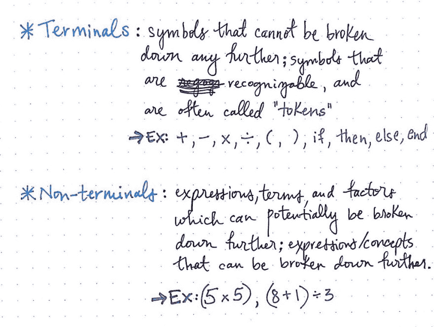](https://res.cloudinary.com/practicaldev/image/fetch/s--GWsP8HbN--/c_limit%2Cf_auto%2Cfl_progressive%2Cq_auto%2Cw_880/https://cdn-images-1.medium.com/max/1024/1%2Aou3ufTd15lrk1KCnfI_D3Q.jpeg) 

<figcaption>端子符号与非端子符号</figcaption>

</figure>

那么解析树中的其他东西是什么呢？显然，我们的代码中不仅仅只有 if 和+符号！嗯，我们通常还必须处理一组非终结符*，它们是可以进一步分解的表达式、术语和因素。这些是短语/想法，其中包含其他表达式，如表达式(8 + 1) / 3。*

 *终端和非终端都与它们在解析树中出现的位置有特定的关系。顾名思义，一个*终端*符号总是以解析树的叶子结束；这意味着，不仅运算符、括号和保留条件是“终端”，而且所有表示每个叶节点上的字符串、数字或概念的因子值也是“终端”。任何被分解成尽可能小的碎片的东西实际上都将是一个“终端”。

<figure>[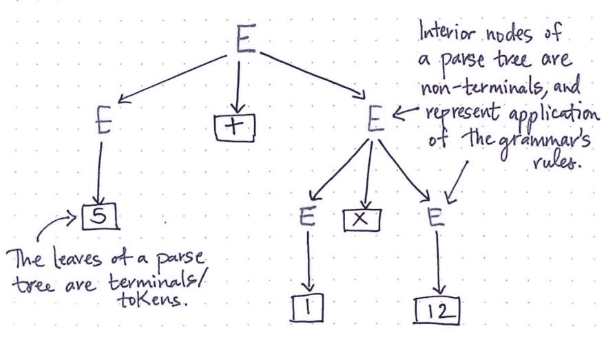](https://res.cloudinary.com/practicaldev/image/fetch/s--MyV5oNjq--/c_limit%2Cf_auto%2Cfl_progressive%2Cq_auto%2Cw_880/https://cdn-images-1.medium.com/max/1024/1%2AxDN2NTHNk9IwWIHLJP1aYw.jpeg) 

<figcaption>识别语法树的独特部分。</figcaption>

</figure>

另一方面，解析树的内部节点——作为父节点的非叶节点——是*非终结符*,它们代表编程语言语法规则的应用。

一旦我们认识到解析树只不过是我们的程序以及其中所有符号、概念和表达式的一种表示，解析树就变得更容易理解、可视化和识别。

> 但是解析树的价值到底是什么呢？我们作为程序员不去想它，但它的存在肯定是有原因的，对吧？

<figure>[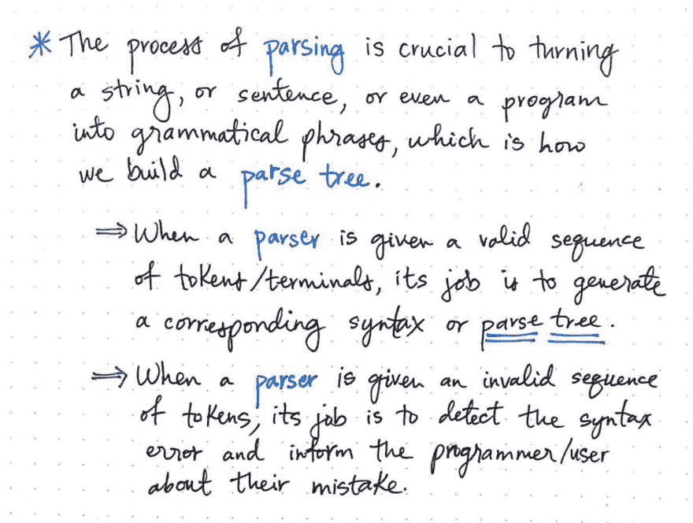](https://res.cloudinary.com/practicaldev/image/fetch/s--vN15i7yV--/c_limit%2Cf_auto%2Cfl_progressive%2Cq_auto%2Cw_880/https://cdn-images-1.medium.com/max/1024/1%2AbepFrz6fuLOJqIvRxVnnyQ.jpeg) 

<figcaption>理解解析器的作用</figcaption>

</figure>

事实证明，最关心解析树的是 ***解析器*** ，它是编译器的一部分，处理*解析*我们编写的所有代码的过程。

***解析*** 的过程实际上只是获取一些输入并从中构建一个解析树。输入可以是许多不同的东西，比如字符串、句子、表达式，甚至是整个程序。

不管我们给它什么输入，我们的解析器都会把输入解析成语法短语，并从中构建一个解析树。在我们的计算机和编译过程中，解析器实际上有两个主要角色:

1.  当给定一个有效的标记序列时，它必须能够按照语言的语法生成相应的解析树。
2.  当给定一个无效的令牌序列时，它应该能够检测到语法错误，并通知编写代码的程序员他们代码中的问题。

而且真的是这样！这听起来可能真的很简单，但是如果我们开始考虑一些程序可以有多么庞大和复杂，我们将很快开始意识到为了让解析器实际上完成这两个看似简单的角色，需要定义得多么好。

例如，为了处理像 1 + 2 + 3 x 4 这样的表达式的语法，即使一个简单的解析器也需要做很多工作。

<figure>[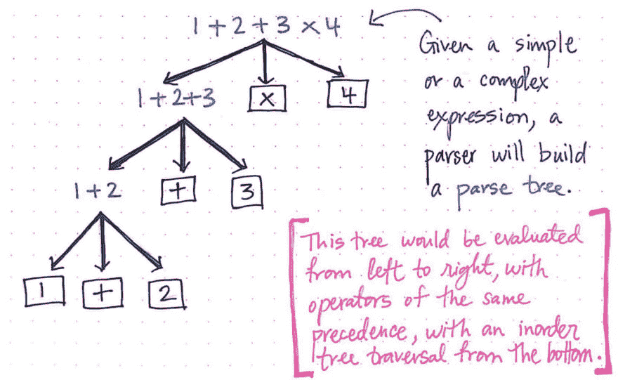](https://res.cloudinary.com/practicaldev/image/fetch/s--oXi7mGXA--/c_limit%2Cf_auto%2Cfl_progressive%2Cq_auto%2Cw_880/https://cdn-images-1.medium.com/max/1024/1%2ABGT3XX2Q3sIXed-CX4ruQg.jpeg) 

<figcaption>像解析器一样阅读。</figcaption>

</figure>

*   首先，它需要从这个表达式中构建一个解析树。解析器收到的输入字符串可能不会显示操作之间的任何关联，但是解析器需要创建一个显示关联的解析树。
*   然而，为了做到这一点，它需要知道语言的语法，以及要遵循的语法规则。
*   一旦它实际上可以创建一个解析树(没有歧义)，它需要能够取出标记和非终结符，并对它们进行排列，以便解析树的层次结构是正确的。
*   最后，解析器需要确保，当对这个树进行求值时，它将从左到右进行求值，运算符具有相同的优先级。
*   但是等等！它还需要确保，当使用 inorder 遍历方法从底部遍历该树时，不会出现任何语法错误！
*   当然，如果 it *确实*中断，解析器需要查看输入，找出它将在哪里中断，然后告诉程序员。

如果这看起来工作量很大，那是因为确实如此。但是不要太担心做所有的事情，因为那是解析器的工作，大部分都被抽象掉了。幸运的是，解析器从编译器的其他部分得到了一些帮助。下周会有更多！

### 资源

幸运的是，编译器设计几乎在每门计算机科学课程中都被教授得很好，而且有大量可靠的资源可以帮助我们理解编译器的不同部分，包括解析器和解析树。然而，就像大多数 CS 内容一样，许多内容可能很难理解——尤其是如果您不熟悉所使用的概念或行话。下面是一些对初学者更友好的资源，如果你发现自己想要学习更多，它们仍然很好地解释了解析树。

1.  [解析树](http://interactivepython.org/runestone/static/pythonds/Trees/ParseTree.html)，交互式 Python
2.  语法，解析，树遍历，大卫·格里斯教授，道格·詹姆士，T2
3.  让我们构建一个简单的解释器，第 7 部分
4.  解析指南:算法和术语
5.  第二讲:抽象和具体的语法
6.  [编纂者和解释者](http://flint.cs.yale.edu/cs421/lectureNotes/c04.pdf)，邵忠教授
7.  [编译器基础——解析器](http://www.cs.man.ac.uk/~pjj/farrell/comp4.html)，詹姆斯·艾伦·法雷尔

* * ***