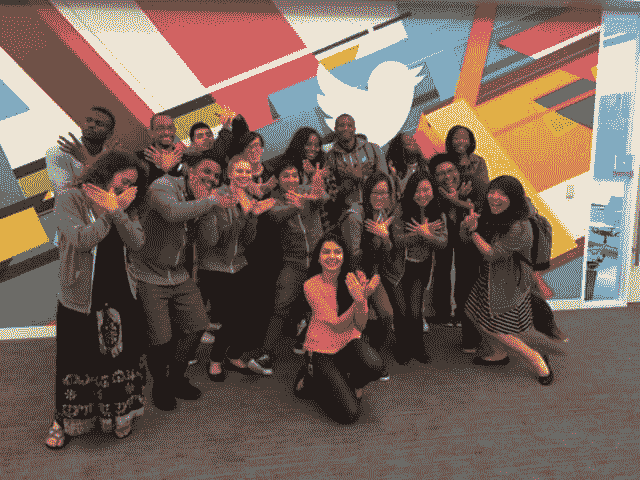
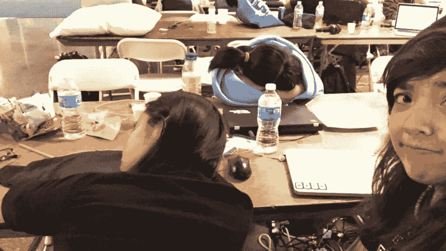

# 支持和反对大学计算机科学

> 原文:[https://dev . to/lizzie pika/支持和反对大学计算机科学-7kj](https://dev.to/lizziepika/for-and-against-college-computer-science-7kj)

这是亚瑟·史的一个故事的回应/延续，这个故事确实引起了我的共鸣，但仔细想想之后，我不同意他的部分作品。
当我开始学习计算机科学(CS)时，我想当一名中学数学老师，但我绝不是一个 STEM 的人。我更喜欢人文学科，但发现写故事和写代码有相似之处。如果你有一个想法，你可以建造人们会使用的东西，这也很好。即使你不知道如何做，你也可以学习。

我遇到了这么多勤奋、热情、有创造力、聪明、全面的了不起的人，经历了教育机会，如 [Twitter 早起鸟营](https://twitterearlybirdcamp.splashthat.com/)(如下图所示)、[广场代码营](http://squareup.com/codecamp)、各种黑客马拉松和会议、职业角色(两年半的实习和一次外部实习)和服务机会(组织活动、指导、演讲、教学等)，如果我不是计算机科学专业的学生，我就不会经历这些。
 
典型的大学计算机科学课程既提供大量编程课程，也提供理论课程，教导学生如何:

*   想
*   用逻辑和批判的眼光看待事物(我发现自己在上了几堂计算机课之后，像拼图游戏或数独游戏之类的东西，成为了一个更好的问题解决者)
*   考虑其他人可能忽略的边缘情况(这延续到现实世界中。)

您还将学习如何

*   学习
*   发现并考虑微小的细节
*   计划、概述、设计和构建大型项目和问题解决方案(应该包括哪些课程？他们的属性怎么样？这种情况下哪种语言最好？等等)
*   坚持不懈，坚持不懈(当代码一开始没有正常运行时，进行逻辑思考和保持冷静是很重要的。)
*   解释你自己(这很重要——解释设计决策、效率、算法、变量名等等。)

以及一些数学，一些技术写作和解释，等等。正因为如此，我也很高兴自己成为了一名计算机系的学生。

然而，是的，并不全是赞美、彩虹、阳光和雏菊。大学计算机科学迫使你天生:

*   靠少量睡眠度日。让我们来做一个比赛，看看在作业到期的前一天晚上你睡得有多少！
*   过度焦虑和紧张(是的，这对于大多数大学生来说是正常的，但在 CS 中更是如此。争夺“最佳”实习和工作的竞争可能会非常残酷，让那些从大学开始的学生和那些从 14 岁、12 岁甚至 7 岁开始的学生相互竞争。
*   平衡课程和面试准备。是的，你在课堂上学习算法和数据结构，但要通过技术面试，你必须花更多的时间练习问题、面试或阅读我们的圣经，破解编码面试。

*   牺牲社交生活、兴趣爱好等等来继续工作。是的，没有人有时间，你必须腾出时间，亚达亚达，但我希望看《网飞》或健身或做一些与科技无关的事情时不会感到内疚。我很乐意不拒绝和朋友一起去看表演或比赛，因为我有更多的阅读或项目要做。

*   让它成为你的生活。你吃饭，呼吸，睡觉。你花了太多时间和技术人员在一起，你忘记了谈论音乐、艺术、体育等等是很正常的。

然而…这是有原因的。

当我还是一名大一新生，打算选择计算机科学专业时，我听到我的系主任告诉另一名学生:“计算机科学专业很受欢迎，并能拿到 6 位数的薪水，这是有原因的。不容易。这是最，如果不是最，工作密集的专业之一。这不像数学，你学得越好，投入的时间就越少。在 CS 中，最好的程序员在项目上花的时间最多。”

这真的让我难以释怀，有点像我高中时的名言:“当然很难。应该很难。如果不是很难，大家都会去做。困难才是伟大的原因。”

大学 CS 是一种攀登是有原因的。在这么短的时间里有这么多东西要学。是的，课程不一定教直接转化为工业的技能，但它教你如何思考。语言和框架可能会改变，但是用代码和算法解决问题的能力不会改变。我们在这里学到的 CS 技能将会比我们单独参加黑客马拉松或在线课程的时间更长。

是的，这是困难的，你必须做出牺牲，但没有什么值得拥有的东西来之不易。