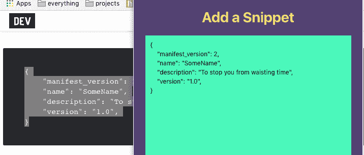

# Chrome 扩展开发基础第二部分

> 原文:[https://dev . to/aurelkurtula/basics-of-chrome-extensions-development-part-two-82p](https://dev.to/aurelkurtula/basics-of-chrome-extensions-development-part-two-82p)

欢迎回到关于 chrome 扩展基础的第二个教程。如果你没有读过第一个教程，你可以在这里阅读。在第一部分中，我们探索了如何使用扩展来修改我们访问的网站，现在我们将创建一个非常基本的 web 组件(不能称之为完整的网站),当点击扩展图标时它会“弹出”。这是最终产品的截图。

[T2】](https://res.cloudinary.com/practicaldev/image/fetch/s--W42DFiGb--/c_limit%2Cf_auto%2Cfl_progressive%2Cq_auto%2Cw_880/https://thepracticaldev.s3.amazonaws.com/i/v1sbep3vaygyg30c9wqh.png)

这将是像 evernote 的 web clipper 一样的扩展的基本版本。最后，我们将能够突出显示一些代码，并让它出现在上面的文本框中。

## 设置

正如第一个教程中所介绍的，我们打算做的每件事，都需要在`manifest.json`文件中指定:

```
{
  "manifest_version": 2,
  "name": "Snip Da",
  "version": "0.1",
  "browser_action": {
    "default_icon": "icon.png",
    "default_popup": "popup.html"
  }
} 
```

<svg width="20px" height="20px" viewBox="0 0 24 24" class="highlight-action crayons-icon highlight-action--fullscreen-on"><title>Enter fullscreen mode</title></svg> <svg width="20px" height="20px" viewBox="0 0 24 24" class="highlight-action crayons-icon highlight-action--fullscreen-off"><title>Exit fullscreen mode</title></svg>

`browser_action`是我们在第一个教程中不需要使用的新属性。来自[的文献](https://developer.chrome.com/extensions/browserAction) `browser_action`被描述为:

> 使用浏览器操作将图标放在地址栏右侧的 Google Chrome 主工具栏中。除了图标之外，浏览器操作还可以有工具提示、徽章和弹出窗口。

如你所见，我们添加了一个`popup`。这就是我们将要创建组件的 html 文件。

在扩展根目录中，我们需要有一个`icon.png`文件和一个`popup.html`。此外，我们需要一个样式表和一个与 HTML 文件同名的 JavaScript 文件:`popup.js`和`popup.css`。为额外的资源文件使用相同的名字使得它们可以在`popup.html`中使用。

现在让我们在`popup.html`中编写 HTML 代码:

```
!doctype html>
<html>
  <head>
    <title>Add a Snippet</title>
    <script src="popup.js"></script>
    <link rel="stylesheet" type="text/css" href="popup.css">
  </head>
  <body>
    <h1>Add a Snippet</h1>
   <form id="form">
     <textarea id="code"></textarea>
    <button type="submit" id="checkPage">Add Snippet</button>
   </form>
  </body>
</html> 
```

<svg width="20px" height="20px" viewBox="0 0 24 24" class="highlight-action crayons-icon highlight-action--fullscreen-on"><title>Enter fullscreen mode</title></svg> <svg width="20px" height="20px" viewBox="0 0 24 24" class="highlight-action crayons-icon highlight-action--fullscreen-off"><title>Exit fullscreen mode</title></svg>

同样，我们能够链接到`popup.js`和`popup.css`，因为它们与 HTML 文件同名。

整个 CSS 代码并不重要，您可以按照您想要的任何方式对其进行样式化，或者克隆 repo，但是以下代码片段值得注意:

```
body{
    width: 450px;
    height:450px;
} 
```

<svg width="20px" height="20px" viewBox="0 0 24 24" class="highlight-action crayons-icon highlight-action--fullscreen-on"><title>Enter fullscreen mode</title></svg> <svg width="20px" height="20px" viewBox="0 0 24 24" class="highlight-action crayons-icon highlight-action--fullscreen-off"><title>Exit fullscreen mode</title></svg>

宽度和高度影响实际的窗口。

至于 JavaScript 代码，在`popup.js`中可以是一般的 JavaScript。从逻辑上讲，我们希望在提交表单时发生一些事情

```
document.addEventListener('DOMContentLoaded', function() {
  let form = document.getElementById('form');
    form.addEventListener('submit', function(e){
        e.preventDefault();
        let value = e.target.children.code.value
        console.log(code)
    })
}, false); 
```

<svg width="20px" height="20px" viewBox="0 0 24 24" class="highlight-action crayons-icon highlight-action--fullscreen-on"><title>Enter fullscreen mode</title></svg> <svg width="20px" height="20px" viewBox="0 0 24 24" class="highlight-action crayons-icon highlight-action--fullscreen-off"><title>Exit fullscreen mode</title></svg>

代码必须用一个事件监听器`DOMContentLoaded`包装， [MDN web 文档](https://developer.mozilla.org/en-US/docs/Web/Events/DOMContentLoaded)将此事件描述为:

> DOMContentLoaded 事件在初始 HTML 文档完全加载和解析后触发，无需等待样式表、图像和子框架完成加载。

当然，如果这是一个真正的扩展，在`submit`我们会将代码片段推送到某个 API。

提示:右键点击然后选择`inspect`可以访问扩展的控制台

## 窗口间的访问

我们真正想做的是能够在浏览器中突出显示一些文本，并让它自动显示在我们的扩展表单中。就像这样:

[T2】](https://res.cloudinary.com/practicaldev/image/fetch/s--2p3mavXw--/c_limit%2Cf_auto%2Cfl_progressive%2Cq_auto%2Cw_880/https://thepracticaldev.s3.amazonaws.com/i/90ldlfmhkedi4hic6d93.png)

为此，我们需要从主浏览器窗口获取内容。这类似于我们在第一个教程中已经做过的事情。因此，我们需要在`manifest.json`中指定我们的意图:

```
{
 // ...
 "content_scripts": [
     {
         "matches": [
             "<all_urls>"
         ],
         "js": ["content.js"]
     }
 ]
} 
```

<svg width="20px" height="20px" viewBox="0 0 24 24" class="highlight-action crayons-icon highlight-action--fullscreen-on"><title>Enter fullscreen mode</title></svg> <svg width="20px" height="20px" viewBox="0 0 24 24" class="highlight-action crayons-icon highlight-action--fullscreen-off"><title>Exit fullscreen mode</title></svg>

有了这个配置，我们创建了一个`content.js`文件，在这里我们可以访问主浏览器窗口。如果我们访问 dev.to，用`content.js`我们能够在 HTML 加载后修改它。让我们使用下面的代码:

```
document.onmouseup = document.onkeyup = document.onselectionchange = function() {
    let content = window.getSelection().toString();    
}; 
```

<svg width="20px" height="20px" viewBox="0 0 24 24" class="highlight-action crayons-icon highlight-action--fullscreen-on"><title>Enter fullscreen mode</title></svg> <svg width="20px" height="20px" viewBox="0 0 24 24" class="highlight-action crayons-icon highlight-action--fullscreen-off"><title>Exit fullscreen mode</title></svg>

这样，我们又前进了一步，`content`已经有了我们选定的内容。现在我们需要访问扩展中的`content`。

将扩展窗口和当前选项卡视为两个不同的选项卡。他们彼此没有联系。因此，将内容从一个选项卡转移到另一个选项卡的最佳方式是通过本地存储。

因此，上面的代码需要一个新行:

```
document.onmouseup = document.onkeyup = document.onselectionchange = function() {
    let content = window.getSelection().toString();
    chrome.storage.sync.set({ content });
}; 
```

<svg width="20px" height="20px" viewBox="0 0 24 24" class="highlight-action crayons-icon highlight-action--fullscreen-on"><title>Enter fullscreen mode</title></svg> <svg width="20px" height="20px" viewBox="0 0 24 24" class="highlight-action crayons-icon highlight-action--fullscreen-off"><title>Exit fullscreen mode</title></svg>

chrome [文档](https://developer.chrome.com/extensions/storage)推荐使用`chrome.storage`:

> 使用 chrome.storage API 存储、检索和跟踪用户数据的更改。

最后，让我们从存储中获取内容，并将其转换为扩展的形式:

```
 let code = document.getElementById('code');
  chrome.storage.sync.get(stored => {
      code.value = stored.content
  }) 
```

<svg width="20px" height="20px" viewBox="0 0 24 24" class="highlight-action crayons-icon highlight-action--fullscreen-on"><title>Enter fullscreen mode</title></svg> <svg width="20px" height="20px" viewBox="0 0 24 24" class="highlight-action crayons-icon highlight-action--fullscreen-off"><title>Exit fullscreen mode</title></svg>

(`code`是`textarea`的 ID)

因此，当我们打开扩展时，`textarea`会有我们选择的内容。

## 申报权限

到目前为止，我们使用了`manifest.json`文件来使我们自己的文件可用，但是我们还需要声明我们想要使用的 chrome API 的部分。从[文档](https://developer.chrome.com/extensions/declare_permissions)中我们了解到:

> 使用大多数 chrome。* APIs，您的扩展或应用程序必须在清单的“权限”字段中声明其意图。

我们使用了两个 API，一个是明显的`storage`，另一个是不太明显的`activeTab`。

现在很清楚了，我们打算在任何选项卡上选择一些文本，并让它出现在我们的扩展表单中。现在它不会工作，因为我们没有权限使用 chrome 的本地存储。然而，如果没有获得对`activeTab`的许可，我们的扩展将不会监听所有的*活动标签*。`activeTab`的[官方](https://developer.chrome.com/extensions/activeTab)描述为:

> 当用户调用扩展时——例如通过点击它的浏览器动作 active tab 权限给予扩展对当前活动选项卡的临时访问。对选项卡的访问持续到选项卡被导航或关闭。

因此，最后，让我们指定使用这两个 API 的意图。在`manifest.json`文件中，添加:

```
...

"permissions": [

  "storage",

  "activeTab"

] 
```

<svg width="20px" height="20px" viewBox="0 0 24 24" class="highlight-action crayons-icon highlight-action--fullscreen-on"><title>Enter fullscreen mode</title></svg> <svg width="20px" height="20px" viewBox="0 0 24 24" class="highlight-action crayons-icon highlight-action--fullscreen-off"><title>Exit fullscreen mode</title></svg>

## 
 [T3】
结论](#conclusion) 

这就是了。在之前的教程和本教程之间，我们已经介绍了如何开发扩展的基础知识。本教程的代码可以在与上一个教程相同的[库](https://github.com/aurelkurtula/basic-chrome-extensions)中名为`extensionTwo_snipDa`的文件夹中找到。

chrome 扩展至少还能做一件事，那就是为用户提供选择。我可能很快会写一篇关于这个的教程，但是现在我对结果很满意。

感谢阅读