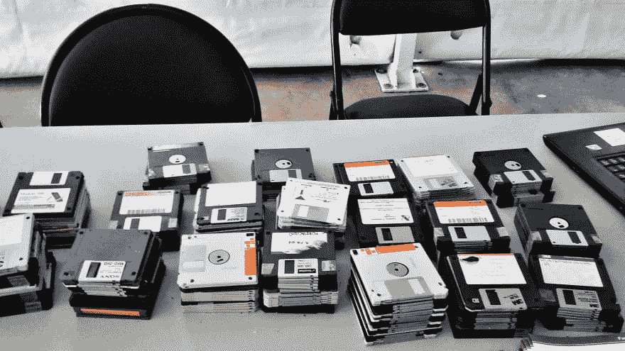

# 你希望你的第一门编程语言是什么样的(或者曾经是什么样的)？

> 原文:[https://dev . to/jj/what-you-like-you ' s-first-programming-language-to-be-or-have-been-df0](https://dev.to/jj/what-would-you-like-your-first-programming-language-to-be-or-have-been-df0)

[T2】](https://res.cloudinary.com/practicaldev/image/fetch/s--bjs6LJQw--/c_limit%2Cf_auto%2Cfl_progressive%2Cq_auto%2Cw_880/https://thepracticaldev.s3.amazonaws.com/i/o2xo9zerh04kbxnk1s0s.jpg)

你可能在很久以前就学会了编程，用的是个人电脑玩具，比如 Spectrum。选项不多:有 Basic，然后是另一台计算机上的 Basic。如果你走正规的道路，你可能从 Pascal 开始，或者后来，Java，甚至更晚，Python。也没有太多选择。要么走这条路，要么走高速公路。但是假设你可以选择你的第一门编程语言，比如说，你现在就开始。你希望你的语言是什么样的？现在有没有一种语言是你最想成为的第一语言？