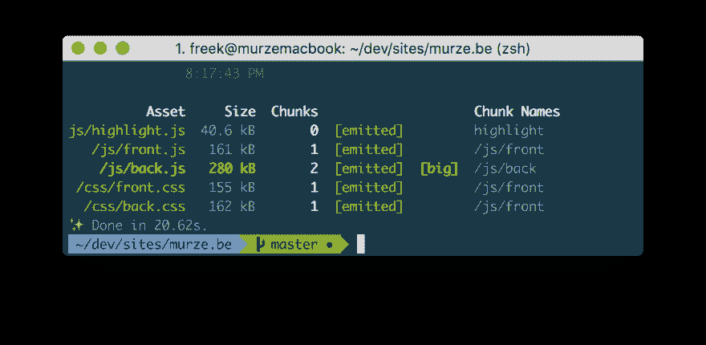

# ★减小 css 文件的大小

> 原文:[https://dev . to/freekmurze/reducing-the-size-of-a-CSS-file-3na 1](https://dev.to/freekmurze/reducing-the-size-of-a-css-file-3na1)

PurgeCSS 是一个可以减少 CSS 文件大小的工具。它通过移除任何不使用的 css 类来实现这一点。它可以通过扫描应用程序的源文件来检测使用了哪些 CSS 类。

在这篇推文中 [Jonathan Reinink](https://twitter.com/reinink) 分享了如何在 Laravel Mix 中进行配置:

> 我刚刚用 [@tailwindcss](https://twitter.com/tailwindcss?ref_src=twsrc%5Etfw) 让 Purgecss 在 project 上试了一下，印象超级深刻。它大大减少了最终 CSS 文件的大小，基本上不需要我做任何工作。
> 
> 这里是我的网页包配置:[https://t . co/moztoqot](https://t.co/MOhrzToqot)
> 
> 非常感谢 [@AndrewDelPrete](https://twitter.com/AndrewDelPrete?ref_src=twsrc%5Etfw) 解决了这个问题。
> 
> —乔纳森·雷因克(@雷因克)【2017 年 11 月 20 日

Jonathan 提到了 css 文件大小的大量减少。让我们来看看什么是大规模的。这是安装 PurgeCSS 之前 [murze.be](https://freek.dev) 的`yarn run production`输出。

[T2】](https://res.cloudinary.com/practicaldev/image/fetch/s--Y4FX7bP---/c_limit%2Cf_auto%2Cfl_progressive%2Cq_auto%2Cw_880/https://freek.dev/uploads/media/purgecss/before.png)

`front.css`155 kB，`back.css`162 kB。还不错。[让我们加上 PurgeCSS](https://github.com/spatie/murze.be/blob/81a9a96/webpack.mix.js#L34-L56) 。

[T2】](https://res.cloudinary.com/practicaldev/image/fetch/s--PaAGzFF---/c_limit%2Cf_auto%2Cfl_progressive%2Cq_auto%2Cw_880/https://freek.dev/uploads/media/purgecss/after.png)

生成的文件小了 90%。相当令人印象深刻！

如果你想了解更多关于 PurgeCSS 的信息，一定要看看由[安德鲁·德尔·普雷特](https://twitter.com/AndrewDelPrete)撰写的[这篇博文。](https://medium.com/@AndrewDelPrete/using-purifycss-to-remove-unused-tailwind-css-classes-173b3ee8ee01)