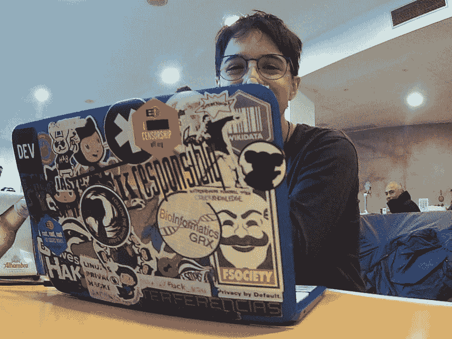
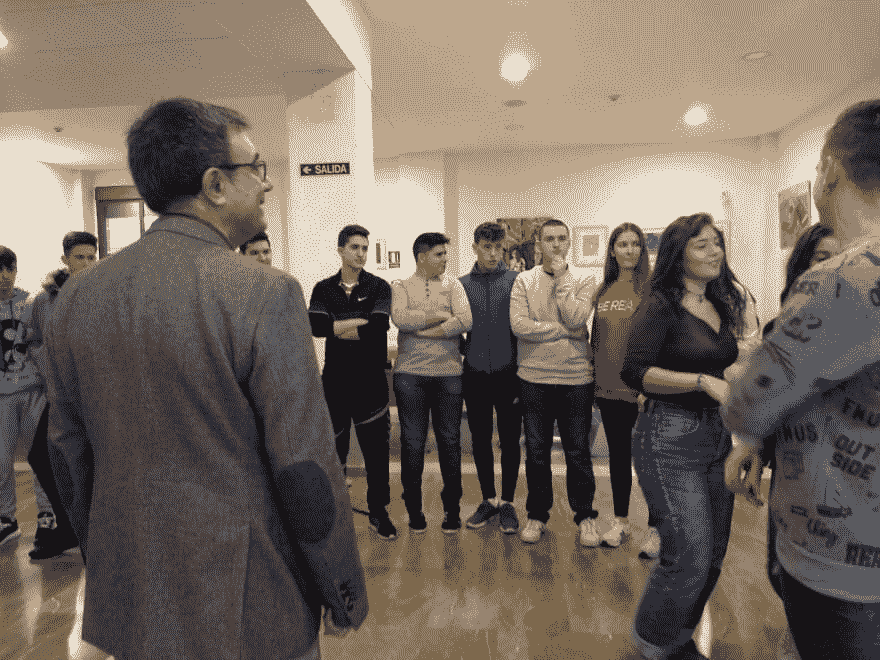
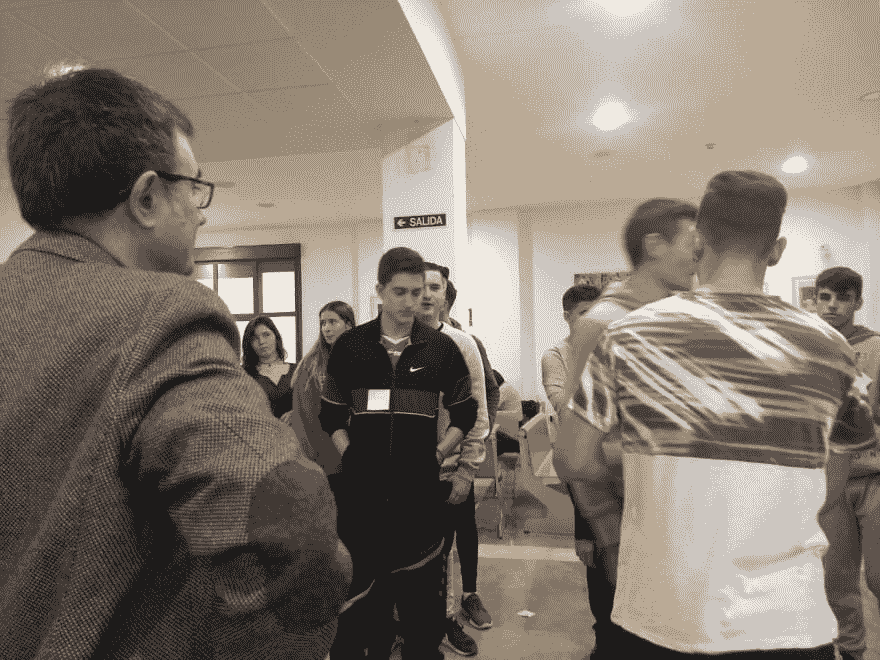

# 给人分类取乐，教计算机科学

> 原文:[https://dev . to/jj/sorting-people-for-fun-and-teaching-computer-science-amd](https://dev.to/jj/sorting-people-for-fun-and-teaching-computer-science-amd)

在 11 月初的科学周期间，学生们来到格拉纳达大学，听我们这些教授谈论我们在做什么。坦白地说，我自己发现我做的事情是世界上最无聊的事情。所以这次我出去少说多做，让人们想想他们能做些什么。这就是我们所做的。
 
这里是[波拉](https://dev.to/terceranexus6)你应该*所以*跟着她。当每个人都坐下来喝咖啡、吃点心时，她告诉他们，她是一名黑客，她喜欢分享信息，他们也可以这样做。这有助于他们看到自己能从几年前和他们一样的人身上学到什么，并打破一些刻板印象。同样的话出自一位教授之口是不会奏效的。

> 下面的图片都是她拍的。

然后，我们试图打破这种刻板印象，即算法是复杂的东西，计算是由计算机通过物理上做一些排序算法来完成的。首先，一个[零知识游戏](http://www.rigb.org/christmaslectures08/html/activities/zero-knowledge-games.pdf#page=1)我们计算了两组学生的平均体重，我们没有发现或透露任何一个人的体重。我们没有用纸，而是用他们自己的电话和里面的计算器来计算秘密的初始数量，如果你要用几组，你应该用简单的数字，然后算出平均值。这里的诀窍是让每个人把他们的体重加到传给他们的数字上；最后，最初的数字将被减去，我们将除以人数找到平均值。这是一个简单的算法，他们可以自己完成，而且成功了；他们保持注意力并且理解得很好。他们并不畏惧，但至少他们觉得有趣。

然后我们去了[分类，灵感也来自 CS 不插电网站](http://csunplugged.org/sorting-algorithms/)。计算机在西班牙语中被称为 *ordenadores* ，意思是*分拣员*，这很有帮助。所以在短短几句话之后，我们开始按身高排序。我选择了一个人来充当“电脑”，故意选择女生来再次打破刻板印象。这是一件微妙的事情，但可能奏效了。这种情况下排序器要做的只是按身高排序。他们站起来，走到房间中央，很快就被分类了。这有助于我们在一个自助餐厅的中间，而且形式是“咖啡馆”，但你可以在任何地方这样做。事情是这样的，这种排序算法适合人类:你可以从全局*看到*，你可以在要求他们移动到正确的位置之前对他们进行可视化排序。
 
这主要是用来衡量要花多少时间，并告诉他们计算机将以不同的方式来做这件事。然后，他们把自己的出生日期写在一张海报上，贴在一个显眼的地方。他们用铅笔来画，所以除非你靠近他们，否则是看不到的；然后你只能同时看到两个。就像电脑一样:它们只能两两比较。我们把他们分组，一个人给他们讲解[冒泡排序](https://en.wikipedia.org/wiki/Bubble_sort)，另一个[快速排序](https://en.wikipedia.org/wiki/Quicksort)。女孩们再次被选为分拣员，每组一名。然后他们开始对他们的小组进行分类。快速排序很快就完成了，他们在 10 点左右。冒泡排序仍然需要一段时间。接下来是对算法效率的简短解释，以及为什么它会这样工作。然后合并排序:在不移动的情况下，选择另一个人使用该算法排序:比较行中的第一个，每次都取较年轻的。

[T2】](https://res.cloudinary.com/practicaldev/image/fetch/s--s15cVoxP--/c_limit%2Cf_auto%2Cfl_progressive%2Cq_auto%2Cw_880/https://thepracticaldev.s3.amazonaws.com/i/4qmg8etmjnybtdlugl2j.jpg)

几乎没花多少时间。一分钟或更少的时间来解释为什么它这么快，为什么算法很酷，然后 Paula 必须回答他们的问题。

## 带回家的消息

他们很可能把我们想要传递的信息带回家:计算机科学可以与众不同，充满乐趣，任何人都可以做到。

我记下了做每一件事要花多少时间，却忘了把它们的分类动作拍成延时电影，下次我会完全记住的。当然，我还要感谢葆拉，没有我她会做得很好。是谁拍摄了这些照片，让我得以在这篇文章中展示。