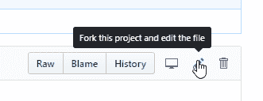
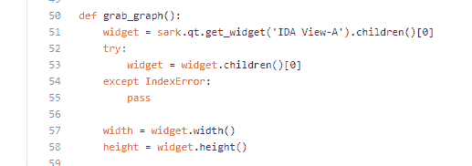
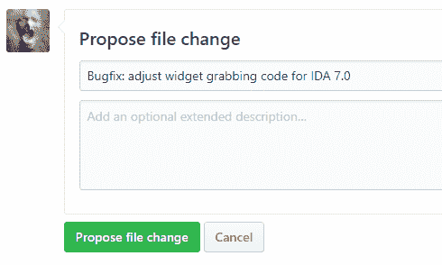

# 给他们写拉请求

> 原文:[https://dev.to/tmr232/writeem-pull-requests-1n5](https://dev.to/tmr232/writeem-pull-requests-1n5)

这个微帖子是作为一项服务提供给我的一些朋友的，他们觉得提交拉请求太难太费时间了。

在过去，为开源做贡献有时很困难。你必须联系维护人员，给他们发补丁邮件，还有各种讨厌的事情。大约在 2008 年，GitHub 出现了。使用 GitHub，您可以在本地克隆回购协议，进行更改，推送到您自己的分支，并创建一个 PR。很简单。
如果你不想使用 CLI，GitHub 可以让你更进一步。

假设你正在使用我的 [GraphGrabber](https://github.com/tmr232/GraphGrabber) 插件用于 IDA Pro，发现它在 IDA 7.0 中失败。现在 Qt 布局不一样了，[51 线](https://github.com/tmr232/GraphGrabber/blob/master/graphgrabber.py#L51)要改

```
diff --git a/graphgrabber.py b/graphgrabber.py                            
index 8c301b7..5d8191c 100644 --- a/graphgrabber.py +++ b/graphgrabber.py @@ -48,7 +48,12 @@ def graph_zoom_fit():                                  

 def grab_graph():                                                        
-    widget = sark.qt.get_widget('IDA View-A').children()[0].children()[0] +    widget = sark.qt.get_widget('IDA View-A').children()[0]              
+    try:                                                                 
+        widget = widget.children()[0]                                    
+    except IndexError:                                                   
+        pass                                                             
+                                                                         
     width = widget.width()                                               
     height = widget.height() 
```

<svg width="20px" height="20px" viewBox="0 0 24 24" class="highlight-action crayons-icon highlight-action--fullscreen-on"><title>Enter fullscreen mode</title></svg> <svg width="20px" height="20px" viewBox="0 0 24 24" class="highlight-action crayons-icon highlight-action--fullscreen-off"><title>Exit fullscreen mode</title></svg>

你现在所要做的，就是点击`Fork this project and edit the file`按钮
[](https://res.cloudinary.com/practicaldev/image/fetch/s--aJRnGDxY--/c_limit%2Cf_auto%2Cfl_progressive%2Cq_auto%2Cw_880/https://thepracticaldev.s3.amazonaws.com/i/qs899y1xlg4oja9tu9xx.png)

就地编辑文件

[T2】](https://res.cloudinary.com/practicaldev/image/fetch/s--UOZ_6_eO--/c_limit%2Cf_auto%2Cfl_progressive%2Cq_auto%2Cw_880/https://thepracticaldev.s3.amazonaws.com/i/4za6au5s504mi0m7q78n.png)

并提出改变

[T2】](https://res.cloudinary.com/practicaldev/image/fetch/s--mTAX_IDM--/c_limit%2Cf_auto%2Cfl_progressive%2Cq_auto%2Cw_880/https://thepracticaldev.s3.amazonaws.com/i/ntpafy7n2zha6gr9lbet.png)

就是这样。你完了！

当然，有更好的方法来做到这一点。关于错误再现的细节将是很好的。当它不是一个 bugfix 时，可能需要一些进一步的讨论和决策。但这是一个开始。一旦某件事开始了，那就更容易坚持到底，而不是开始。