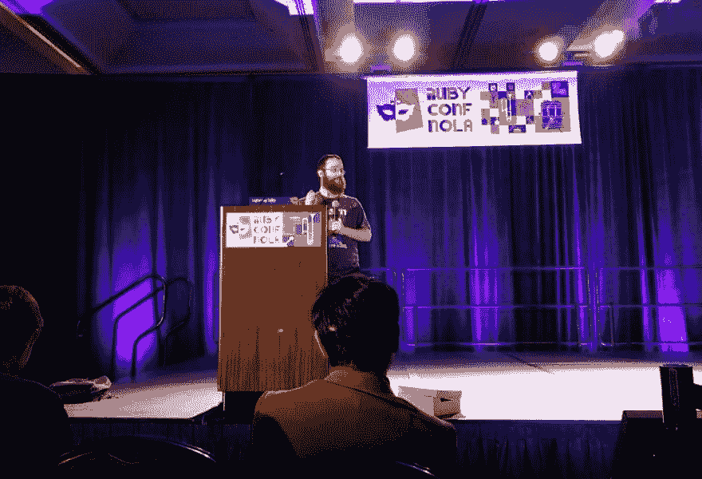

# 程序员的犹太法典真理—闪电版

> 原文:[https://dev.to/yechielk/talmudic-truths-for-programmers-闪电版-62](https://dev.to/yechielk/talmudic-truths-for-programmers--the-lightning-edition-62)

#### 我在 RubyConf 2017 闪电演讲的文字记录

*正如我上一篇* [*博文*](https://dev.to/yechielk/of-conferences-and-scholars-6mn) *中提到的，我作为一名学者在 2017 年 RubyConf 上度过了最后一周。其中最有趣的一个小时是闪电谈话会议，任何人都可以报名参加，就任何话题进行 5 分钟的谈话(我们甚至有一位前兽医站起来，给我们如何照顾我们的 4 条腿朋友的提示)。我自愿做了一个题为*程序员的塔木德真理的演讲。*对于错过的人，我在这里给你呈现:*

<figure>

<figcaption>[的背影【Matz】松本](https://en.wikipedia.org/wiki/Yukihiro_Matsumoto)的头像。哦，那也是我在舞台上。
*图片来源:我亲爱的朋友本·格林伯格*</figcaption>

</figure>

在我成为程序员之前，我是一名拉比和教师。我花了很多时间研究犹太法典，事实上现在仍然如此。犹太法典的有趣之处在于，人们可以在如此多的不同主题上找到如此多的相关内容。自从我开始编程，我也开始发现与我的新爱好相关的见解。

这些见解可以组成一个完整的演讲，但我只有 5 分钟的时间，所以让我分享一两个:

《塔木德经》讲述了伟大的塔木德圣人拉比阿基瓦和当时的罗马总督 T2 之间的一场辩论，以下是粗略的翻译:

> 邪恶的图努斯·鲁弗斯问拉比·阿基瓦:“如果你的上帝如此爱穷人，他为什么不自己给他们提供食物呢？”拉比阿基瓦回答说，“这样我们就可以通过帮助他们来提高自己。”鲁弗斯说:“相反，帮助穷人在上帝眼里是有罪的，让我给你举个例子:假设皇帝对他的一个仆人很生气，把他扔进了监狱，他命令所有其他的仆人不要给他东西吃。现在假设一个仆人违抗了国王的命令，喂了这个犯错的仆人，国王不会对他生气吗？”拉比阿基瓦回答说:“我给你一个更准确的例子:假设皇帝对他的儿子很生气，一气之下把他扔进了监狱，他命令所有的仆人不要喂他。现在假设一个仆人违抗了国王的命令，喂养了这个误入歧途的儿子，国王发现后难道不会送他礼物吗？同样的，我们都是神的儿女，如经上所记‘你是耶和华你神的儿女’(申命记 14:1)。”

这个论点听起来可能晦涩难懂，但却有着奇怪的相关性。Tineius Rufus 犯了一个众所周知的谬误，被称为[公正世界谬误](https://en.wikipedia.org/wiki/Just-world_hypothesis)；我们都有一种与生俱来的需要，觉得这个世界是公正和公平的，所以如果我们看到有人遭受痛苦，比如说他们很穷，我们会试图通过说这个人一定很懒，或者他们缺乏动力来证明这一点，所有这些都是证明他们为什么贫穷的一种方式，当走极端时，证明我们为什么不做更多的事情来帮助他们。

拉比阿基瓦回答说，这样的世界观是错误的。当我们看到世界上的不完美时，我们需要将其视为一种挑战，一个我们可以改进的地方。

所以现在你们都在说“太好了，这听起来像是一个伟大的布道，但是这和编程有什么关系呢？”

让我引用史蒂夫·克拉布尼克的一句话:

> 编程是从中断状态到工作状态的运动。这意味着你大部分时间都在处理坏掉的东西。如果成功了，你就不用编程了。

我最近在熨斗学校做教练，我帮助许多刚开始编码的学生解决他们的问题和错误。我注意到一件有趣的事情。对于每一个学生来说，都有那么一个瞬间，一个“开关”，他们从“平民”变成了程序员。当学生学会不害怕错误信息时，这种转变就发生了。

平民害怕错误信息。这是屏幕对他们咆哮的可怕的事情，这可能是也可能不是他们的错，通常没有它的帮助他们无法修复。作为程序员，我们会看到很多错误消息，但对我们来说，错误消息是指南，是机会，它们向我们展示代码哪里出了问题，需要修复什么。

我们在破碎的环境中茁壮成长。我们把不工作的系统视为修复和改进的机会。

让我们把这种世界观应用到办公室之外的世界，看到不完美，并把它作为改进自己和周围世界的跳板。

谢谢大家！

* * *

*这篇文章是从我的博客 [Rabbi On Rails](https://blog.yechiel.me/talmudic-truths-for-programmers-the-lightning-edition-eae71b3cfd6b) 交叉发布的。
你可以在那里了解更多关于我的编程之旅，或者在 Twitter 上关注我 [@yechielk](https://twitter.com/yechielk)*