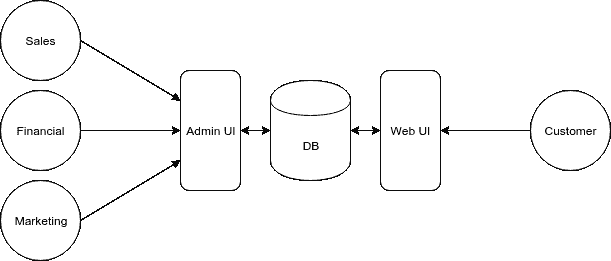
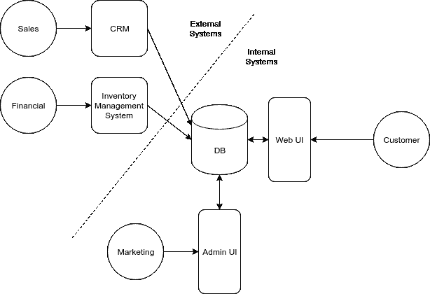

# 关于主键的思考

> 原文：<https://dev.to/hden/thoughts-about-primary-key-91b>

我们许多管理数据库的人需要为他们的表创建标识。随着业务的增长，表模式也随之发展，但是身份往往会保持更长时间。

作为一个每天与数据/数据库打交道的人，我花了很多时间思考如何让它们变得更好。

让我们通过为一个成长中的假设电子商务创业公司创建两个表来讨论其中一个陷阱:`products`和`customers`。使用内置机制对身份进行建模通常很有诱惑力，例如:

```
-- MySQL --
CREATE TABLE products (
  id INT AUTO_INCREMENT NOT NULL PRIMARY KEY, -- 🌶
  name VARCHAR(50),
  price INT
);

CREATE TABLE customers (
  id INT AUTO_INCREMENT NOT NULL PRIMARY KEY, -- 🌶
  name VARCHAR(50)
); 
```

我跳过了一些细节，但我希望你能理解要点。每个产品和客户都有一个数字 ID 和一个或多个关联的列。上面的代码中有两个问题，我已经用辣椒标出来了🌶。

让我们为我们假设的创业公司添加更多的细节。比方说，我们过去通过内部管理系统创建新产品和客户，可能是一个简单的 web 表单。

[T2】](https://res.cloudinary.com/practicaldev/image/fetch/s--Tuuap_dt--/c_limit%2Cf_auto%2Cfl_progressive%2Cq_auto%2Cw_880/https://gist.githubusercontent.com/hden/757ab9d5715857cbe1bdb4f46c4a9148/raw/32ec779ddd3e2ab53fe27f8d64bf4c248f25d543/architecture_01.svg)

数据库 id 很可能用于内部通信。毕竟，名字不够精确。我们甚至可以在 API 端点中公开它们，例如`GET /products/5487`🌶。

随着业务的蓬勃发展，我们的初创公司需要雇用更多的人，并开始购买高级软件来管理不断增长的业务。例如:

*   销售部门可能希望使用 Salesforce 作为其主要 CRM。
*   财务部门可能想要使用某种库存管理系统。

因此，我们的运营发生了重大变化，我们必须集成外部系统，每个系统都有自己的数据库和 IDs。

[T2】](https://res.cloudinary.com/practicaldev/image/fetch/s--NX34TyTI--/c_limit%2Cf_auto%2Cfl_progressive%2Cq_auto%2Cw_880/https://gist.githubusercontent.com/hden/757ab9d5715857cbe1bdb4f46c4a9148/raw/c352e6d5ab95d76b290f12562b3e5adfac3dfcea/architecture_02.svg)

保持不同数据库的同步是相当具有挑战性的，尤其是在没有公共身份键的情况下。

*   同时使用多个键对于人类来说是相当混乱的。
*   使用外部系统 id 作为主键不是一个选项，因为系统可能会偶尔被替换。

如果我们有机会真正思考对通用身份密钥的需求，也许是在舒适的吊床上，什么才是好的身份呢？

先说`CREATE TABLE`语句。不管具体的数据库实现如何，`AUTO_INCREMENT NOT NULL PRIMARY KEY`通常表示该列是:

*   独一无二的
*   不为空
*   编入索引的
*   连续的
*   取决于数据库的内部状态🌶

最后一部分不是很明显，但它已经导致了 Twitter 的缩放问题。在我们的例子中，我们可能希望使用一种替代算法来生成我们自己的主键。

已经提出了几个替代方案，包括 [GUID/UUID](https://blog.codinghorror.com/primary-keys-ids-versus-guids/) 和它们的半顺序对等物 [Squuids](http://docs.datomic.com/identity.html#sec-6) / [CUID](https://github.com/ericelliott/cuid) 。我们最初的表设计可以通过删除`AUTO_INCREMENT`语句来修改。使用上面的算法，我们可以很容易地在 API 服务器或外部系统中生成主键。

```
-- MySQL --
CREATE TABLE products (
  id INT NOT NULL PRIMARY KEY, -- or VARCHAR(36), depends on your implementation
  urn VARCHAR(50),
  name VARCHAR(50),
  price INT,
  UNIQUE (urn)
); 
```

公开主键是否会引起一些安全问题。我们可以添加第二个唯一的资源名，也许是以 [URN](https://en.wikipedia.org/wiki/Uniform_Resource_Name#URIs.2C_URNs.2C_and_URLs) 的格式，就像亚马逊为 [AWS](http://docs.aws.amazon.com/general/latest/gr/aws-arns-and-namespaces.html) 做的那样。

参考资料:

*   Mike Bostock 的[是什么让软件变得优秀？](https://medium.com/@mbostock/what-makes-software-good-943557f8a488)(用于使用🌶作为标记)
*   小汤姆·哈里森的 [UUID 还是 GUID 作为主键？小心点！](https://tomharrisonjr.com/uuid-or-guid-as-primary-keys-be-careful-7b2aa3dcb439)(为公共 API 提出二级密钥)