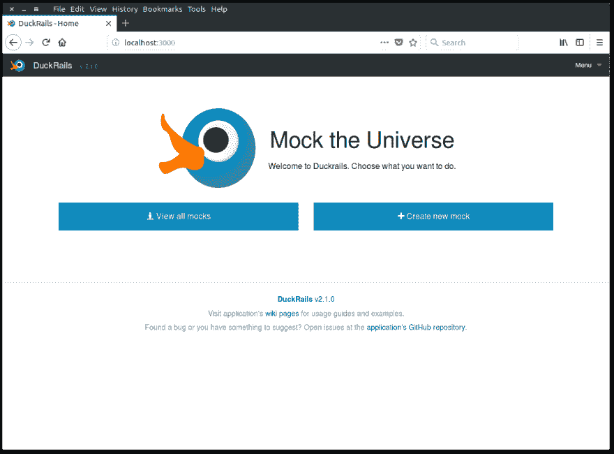

# duck rails——我为开发者创建了一个开源工具

> 原文:[开源-开发者工具-贝](https://dev.to/iridakos/duckrails---opensource-tool-for-developers-bei)

我创建了一个名为 [DuckRails](https://github.com/iridakos/duckrails) 的开源开发工具。

它的主要目的是允许开发人员快速模拟 API 端点，这些端点由于许多可能的原因而无法在特定时间到达。

[T2】](https://res.cloudinary.com/practicaldev/image/fetch/s--deOR-Wqz--/c_limit%2Cf_auto%2Cfl_progressive%2Cq_auto%2Cw_880/https://github.com/iridakos/duckrails/blob/master/documentation/readme/resources/duckrails-home-page.png%3Fraw%3Dtrue)

你可以在这里找到安装说明[(包括通过 docker 镜像的设置)。
你可以浏览该项目的](https://github.com/iridakos/duckrails/wiki/Setting-up-the-application) [GitHub 维基页面](https://github.com/iridakos/duckrails/wiki)获取使用指南。