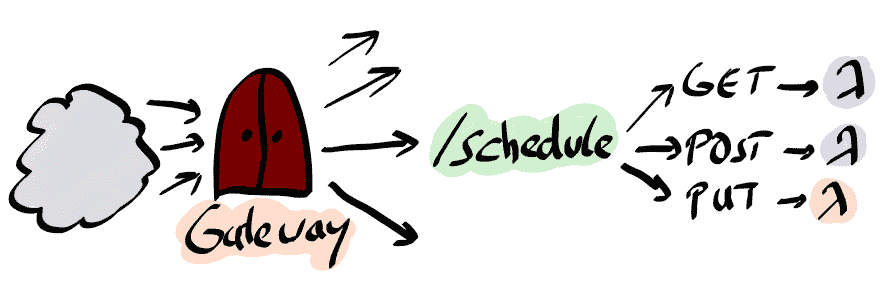

# 带 AWS Lambda 的无服务器宣传列车

> 原文：<https://dev.to/koenighotze/serverless-hype-train-with-aws-lambda-21p>

这篇文章介绍了无服务器计算——通常称为“功能即服务”。我将解释为什么这确实是热门话题，并向您介绍 AWS Lambda。我们将构建一个完全无服务器的应用程序，将“Hello World”作为 Lambda 和 REST 服务公开。

## 概括地说无服务器

定义无服务器实际上比人们想象的要难。这个名字很不幸，因为用事物本身来定义事物*而不是*，很少奏效。
我将通过寻找到目前为止还没有的东西来尝试定义无服务器方法。

让我们谈谈集装箱，是的-码头工人。这些非常灵活，基本上允许你做任何你想做的事情。至少只要它与 CGROUPS 一起工作。没有你必须遵循的固定规则或有约束力的原则，只有一些共同的或所谓的最佳实践。将容器投入生产意味着考虑伸缩、供应、安全、监控、部署等等。在一些项目中，团队选择引入 [Kubernetes](https://kubernetes.io/) ，这反过来会证明非常具有挑战性。

[12 因子应用](https://12factor.net/)被证明是云原生应用相当有用的指南。这组指南描述了应用程序应该遵循哪些规则才能轻松部署到云中。它涵盖了配置、日志和构建等主题。这直接取自他们的网站:

```
I. Codebase
One codebase tracked in revision control, many deploys
II. Dependencies
Explicitly declare and isolate dependencies
III. Config
Store config in the environment
IV. Backing services
Treat backing services as attached resources
V. Build, release, run
Strictly separate build and run stages
VI. Processes
Execute the app as one or more stateless processes
VII. Port binding
Export services via port binding
VIII. Concurrency
Scale out via the process model
IX. Disposability
Maximize robustness with fast startup and graceful shutdown
X. Dev/prod parity
Keep development, staging, and production as similar as possible
XI. Logs
Treat logs as event streams
XII. Admin processes
Run admin/management tasks as one-off processes 
```

这些是您需要回答的架构问题，然后您才能在云中成功使用您的应用程序。

在某种意义上，Serverless 体现了这 12 个因素的应用程序原则，并为您提供了一个绑定的胸衣，可以轻松地将您的业务代码插入到云中。这意味着你用灵活性换取了开发的便利。

你基本上需要问自己:你是愿意花 6 个月的时间来构建基础设施还是构建实际的应用程序(我必须承认，构建基础设施*当然可以*很有趣)。

对于本文的其余部分，让我们假设我们想要构建应用程序。

## AWS Lambda - 101

有许多平台可以用来构建无服务器应用程序。从云提供商如 Azure Functions(T1)和 Google Cloud Functions(T3)到基于 Kubernetes 的解决方案，如 T4 的 Kubeless(T5)和裂变(T7)

在这里，我们重点关注 AWS Lambda，亚马逊为无服务器计算提供的产品。为了给你一个什么是 AWS Lambda 以及它如何工作的印象，我们将简化函数。这使我们能够专注于 AWS Lambda 的基本要素。未来的一篇文章将对此进行详细阐述，并展示一个更复杂的场景。

在我们进入细节之前，我们需要看一下 AWS Lambda 函数的定义。

[T2】](https://res.cloudinary.com/practicaldev/image/fetch/s--Fx8RU5CE--/c_limit%2Cf_auto%2Cfl_progressive%2Cq_auto%2Cw_880/https://thepracticaldev.s3.amazonaws.com/i/nm8gcg4y4g194h2g5vr9.png)

Lambda 函数是由 AWS Lambda 运行时执行的任何一段代码。代码必须遵循一定的准则。

*   *单一目的*:每个功能应该专注于一个单一的任务。例如，使用 AWS Polly 将博客文章转换为语音。
*   *事件驱动*:一个功能由一个事件触发。这意味着，一般来说，你需要考虑一些外部事件，函数应该对这些事件做出反应。例如，如果文档被上传到 S3，则触发一个功能。
*   *无状态*:所有的功能都在短暂的容器中执行。您不能依赖任何状态，例如在节点中。JS `global`。容器可以被重用，但是通常你必须设计得好像你不能有任何持久状态。这种意义上的状态应该被移动到数据库或类似的存储中。
*   *异步*:函数支持在请求/应答模式下调用，但也支持异步模式。该函数接收一个事件并处理该事件，而不会阻塞事件源。

### 执行模式和编程模式

执行模型是无服务器方法的最大优势。它不仅在概念层面上简单，而且在实际应用中功能强大。函数由事件触发。

[T2】](https://res.cloudinary.com/practicaldev/image/fetch/s--v3f53SSB--/c_limit%2Cf_auto%2Cfl_progressive%2Cq_auto%2Cw_880/https://thepracticaldev.s3.amazonaws.com/i/m3jzbu8eh0g3u7rynqnn.png)

如果一个函数被触发，一个新的运行时容器被实例化。事件作为参数传递给函数。该功能既可以以*请求-回复*模式执行，也可以完全以*方式异步执行*。
在请求-回复的情况下，执行函数的结果可以使用回调函数返回给事件源。异步意味着没有结果返回到事件源。在函数完成执行后，运行时容器被销毁。

其实最后的过去也不完全是真的。如果可能的话，AWS Lambda 重用运行时容器。但是作为开发人员，您千万不要依赖这个事实。编写代码，就好像每次都在一个新的环境中执行函数一样。

在任何情况下，您将只为该功能的执行时间付费，目前四舍五入到 100 毫秒。如果你的功能只是躺着，你不会被收取任何费用。

[T2】](https://res.cloudinary.com/practicaldev/image/fetch/s--smncXYla--/c_limit%2Cf_auto%2Cfl_progressive%2Cq_auto%2Cw_880/https://thepracticaldev.s3.amazonaws.com/i/t3nzl53pgfqaw31zh7if.png)

事件可以是任何东西，从单个页面应用程序的直接调用到上传到 S3 的对象。

### 你好拉姆达

没有“Hello World”的演示是不完整的，所以这里是 AWS Lambda 版本。AWS Lambda 支持 Python、Node、C#和 JVM 作为其首选运行时，您可以通过一些技巧添加其他堆栈，例如使用 [APEX](https://github.com/apex/apex) 。

为了方便起见，我们将使用 Node 作为示例代码的运行时。

创建一个名为`index.js`的文件，并向其中添加以下 Javascript 代码:

```
const Util = require('util')

exports.helloworld = (event, context, callback) => {
  console.log('Called with', Util.inspect(event))  // (1)

  const greeting = event.name || 'world'           // (2)
  callback(null, 'Hello ' + greeting)              // (3)
} 
```

这是一个 AWS Lambda 函数，它只接收一个`event`并将该事件记录到控制台`(1)`。如果事件包含一个字段`name`，那么我们将欢迎这个名字，否则默认为`world`。最后，我们通过调用`callback`函数`(3)`返回结果。因为我们将`null`作为第一个参数，所以我们指出没有发生错误。

将这个功能部署到 AWS Lambda 很容易。我们压缩源代码并使用命令行创建一个函数...但是在我们真正开始之前，我们需要讨论一下安全性。

### 用 IAM 保护 Lambdas

你试图在 AWS 上做的一切都涉及到 [AWS 身份和访问管理(IAM)](https://aws.amazon.com/documentation/iam/) 。这是 Amazon 限制对资源的访问和处理对资源执行操作的特权的方式。这不是为了介绍 IAM，所以我们保持简单。安全涉及*角色*和*政策*。角色只是某种带有权限策略的身份。政策反过来决定了什么是允许的，什么是禁止的。

我们的函数需要一个角色，其策略允许函数至少将日志文件写入 [Cloudwatch](https://aws.amazon.com/cloudwatch/) 。Cloudwatch 是亚马逊对他们平台上运行的一切进行监控的服务。如果我们忽略这一点，我们的函数将无法写入日志，我们将看不到任何输出。

因此，创建一个角色。首先是政策:

```
$ cat trust-policy.json
{
  "Version": "2012-10-17",
  "Statement": [
    {
      "Effect": "Allow",
      "Principal": {
        "Service": "lambda.amazonaws.com"   // (1)
      },
      "Action": "sts:AssumeRole"            // (2)
    }
  ]
} 
```

这个简单的策略允许所有的 lambda`(1)`承担角色`(2)`。我们现在可以创建实际的角色了。

```
$ aws iam create-role --role-name basic-lambda-logging --assume-role-policy-document file://trust-policy.json
{
    "Role": {
        "Path": "/",
        "RoleName": "basic-lambda-logging",
        "RoleId": "AROAJ6G5L24C7UHHS6UHK",
        "Arn": "arn:aws:iam::604370441254:role/basic-lambda-logging", // (1)
        "CreateDate": "2017-11-16T10:19:30.905Z",
        "AssumeRolePolicyDocument": {                                 // (2)
            "Version": "2012-10-17",
            "Statement": [
                {
                    "Effect": "Allow",
                    "Principal": {
                        "Service": "lambda.amazonaws.com"
                    },
                    "Action": "sts:AssumeRole"
                }
            ]
        }
    }
} 
```

有两件事值得注意。首先，角色的名字是`basic-lambda-logging` `(1)`。其次，附加的信任策略被存储为角色`(2)`的一部分。

我们将使用预先创建的(*管理的*)策略，而不是自己创建策略，这非常适合:`AWSLambdaBasicExecutionRole`。这个需要依附于角色，然后我们就准备角色了(抱歉)。

```
$ aws iam attach-role-policy --role-name basic-lambda-logging --policy-arn arn:aws:iam::aws:policy/service-role/AWSLambdaBasicExecutionRole

$ aws iam get-role --role-name basic-lambda-logging
{
    "Role": {
        "Path": "/",
        "RoleName": "basic-lambda-logging",
        "RoleId": "AROAJ6G5L24C7UHHS6UHK",
        "Arn": "arn:aws:iam::604370441254:role/basic-lambda-logging",
        "CreateDate": "2017-11-16T10:19:30Z",
        "AssumeRolePolicyDocument": {
            "Version": "2012-10-17",
            "Statement": [
                {
                    "Effect": "Allow",
                    "Principal": {
                        "Service": "lambda.amazonaws.com"
                    },
                    "Action": "sts:AssumeRole"
                }
            ]
        }
    }
} 
```

当开发 Lambda 函数时，从执行函数所需的最少权限开始总是一件好事。只有在绝对必要的情况下才添加进一步的策略！

### 创建λ

现在通过压缩源代码并创建实际的函数来创建 Lambda。

```
$ zip index.zip index.js

$ aws lambda create-function
       --function-name HelloWorld \
       --runtime nodejs6.10
       --role arn:aws:iam::604370441254:role/basic-lambda-logging
       --handler index.helloworld
       --zip-file fileb://index.zip
{
    "FunctionName": "HelloWorld",
    "FunctionArn": "arn:aws:lambda:eu-central-1:604370441254:function:HelloWorld",
    "Runtime": "nodejs6.10",
    "Role": "arn:aws:iam::604370441254:role/basic-lambda-logging",
    "Handler": "index.helloworld",
    "CodeSize": 320,
    "Description": "",
    "Timeout": 3,
    "MemorySize": 128,
    "LastModified": "2017-11-16T10:30:07.395+0000",
    "CodeSha256": "nnU1bMJZOHRD1HSn8rYzaR0qNBGwoPJfA+f5No1o+N0=",
    "Version": "$LATEST",
    "TracingConfig": {
        "Mode": "PassThrough"
    }
} 
```

我将逐个解释这个命令选项。

*   `--function-name HelloWorld`:显然，这设置了函数名。
*   `--runtime nodejs6.10`:将运行时间设置为节点。6.10 版本的 JS。你可以在线查看可用的运行时间。
*   `--role arn:aws:iam::604370441254:role/basic-lambda-logging-permissions`:这个 lambda 函数应该使用的角色的 AWS id。
*   `--handler index.helloworld`:告诉 AWS Lambda 函数入口点是文件`index.js`中导出的方法`helloworld`。因此，您可以导出多个函数，并用不同的处理程序配置多个 Lambdas。
*   `--zip-file fileb://index.zip`:定义上传代码的位置。可以是 S3 资源，或者类似于这种情况下的本地文件。注意`fileb`不是错别字，而是告诉 AWS 这是二进制数据。

调用这个函数相当容易。

```
$ aws lambda invoke --function-name HelloWorld out.txt
{
    "StatusCode": 200
}

$ cat out.txt
"Hello world" 
```

注意,`invoke`命令只是返回一个状态代码，表明调用成功。实际输出存储在文件`out.txt`中，我们在调用函数时传递了该文件的名称。

您也可以将事件传递给函数。在我们的例子中，事件只是一个 JSON 结构:

```
$ cat helloevent.json
{
  "name": "David"
} 
```

根据事件源的不同，事件的性质可能相当复杂。

现在调用该函数并将事件作为`payload`传递:

```
$ aws lambda invoke --function-name HelloWorld --payload file://helloevent.json out.txt
{
    "StatusCode": 200
}
$ cat out.txt
"Hello David" 
```

如果我们检查函数的日志输出，事情会变得更清楚。我将使用 [AWSLogs](https://github.com/jorgebastida/awslogs) 获取日志输出，并对输出进行一些微调，这样我们就可以专注于重要的部分。

```
$ awslogs get /aws/lambda/HelloWorld
HelloWorld ... START RequestId: 347078b1-... Version: $LATEST
HelloWorld ... Called with { name: 'David' }
HelloWorld ... END RequestId: 347078b1-...
HelloWorld ... REPORT RequestId: 347078b1-... Duration: 47.58 ms Billed Duration: 100 ms Memory Size: 128 MB Max Memory Used: 19 MB 
```

您可以看到 id 为`RequestId: 347078b1-...`的传入请求。AWS Lambda 为我们的函数创建了一个新的容器，启动它，然后调用函数，正如您可以从记录的输出`Called with { name: 'David' }`中看到的。函数结束(`END RequestId: 347078b1-...`)，容器被销毁，AWS Lambda 记录函数调用的统计数据

```
REPORT RequestId: 347078b1-... Duration: 47.58 ms Billed Duration: 100 ms Memory Size: 128 MB   Max Memory Used: 19 MB 
```

这是必要的输出。您可以看到调用持续时间(`47.58 ms`)和 Amazon 对执行`100 ms`收取的费用。正如我提到的，您只需支付您使用的费用。最后，亚马逊报告了内存消耗(`Memory Size: 128 MB Max Memory Used: 19 MB`)，我们将在下面讨论规模时解释。

### 更新功能

比方说，我们想将问候语从`Hello`改为`Bonjour`。更新函数只涉及修改 Javascript，然后上传更新的 Zip 文件:

```
$ aws lambda update-function-code --function-name HelloWorld --zip-file fileb://index.zip
{
    "FunctionName": "HelloWorld",
    "FunctionArn": "arn:aws:lambda:eu-central-1:604370441254:function:HelloWorld",
    "Runtime": "nodejs6.10",
    "Role": "arn:aws:iam::604370441254:role/basic-lambda-logging",
    "Handler": "index.helloworld",
    "CodeSize": 321,
    "Description": "",
    "Timeout": 3,
    "MemorySize": 128,
    "LastModified": "2017-11-16T10:54:56.244+0000",
    "CodeSha256": "qRDc0Z/bLZ9fhcqZEePdRe7LQiTKmk88u7fppDWhDuU=",
    "Version": "$LATEST",
    "TracingConfig": {
        "Mode": "PassThrough"
    }
} 
```

我们可以在上传后直接调用新版本。

```
$ aws lambda invoke --function-name HelloWorld --payload file://helloevent.json out.txt
{
    "StatusCode": 200
}
$ cat out.txt
"Bonjour David" 
```

可以看到，输出已经变成了`Bonjour`。

### 关于规模

AWS Lambda 负责扩展您的函数。这意味着，你不用担心 1 个用户或者 100 个用户访问你的函数。AWS Lambda 将根据需要创建足够多的函数实例。它将销毁所有不再需要的实例。

也就是说，作为开发人员，您必须适当地调整运行时的大小。这意味着，您必须为 Lambda 函数的每个实例配置可用的 RAM 和 CPU。让我们看一个例子。您还记得上面的日志输出:

```
REPORT RequestId: 347078b1-... Duration: 47.58 ms Billed Duration: 100 ms Memory Size: 128 MB Max Memory Used: 19 MB 
```

必不可少的部分是`Memory Size: 128 MB Max Memory Used: 19 MB`。当创建 Lambda 函数时，您可以为底层运行时配置最大可用内存，在本例中是默认的`128 MB`。运行时允许的内存越多，执行时分配给函数的 CPU 就越多。

想象一下可能性。我们可以部署相同的功能代码两次，创建两个不同的 lambda:`standard`和`premium`。鉴于`standard`使用默认的 128 MB RAM 和相应的 CPU，我们分配 512 MB 给`premium`和额外的 CPU。这提供了一种配置特定服务质量的简单方法。

## 【休息】用兰姆达斯

尽管您可以使用上面的命令行并通过 AWS SDK(我在这里没有涉及)调用 AWS Lambda 函数，但有时通过“REST”公开函数是有意义的。为什么我写的是‘休息’，而不是休息？好吧，REST 是一种建筑风格，比我在这里要做的要复杂得多。在这个例子中，我将使用 HTTP/JSON 公开这个函数，它可以用来使用 Lambdas 构建 REST 系统。(吹毛求疵，我知道)。

回到正题。

Amazon API 网关用于通过 HTTP 轻松公开函数。考虑下图。

[T2】](https://res.cloudinary.com/practicaldev/image/fetch/s--Q_vsWq0S--/c_limit%2Cf_auto%2Cfl_progressive%2Cq_auto%2Cw_880/https://thepracticaldev.s3.amazonaws.com/i/z1lpbtr83n13oeklk6hs.png)

API 网关基于请求方法(再次在图`GET`、`PUT`、`POST`中)将请求映射到资源(在图`/schedule`中)以调用 Lambda 函数。您可以显式地映射交互，或者使用一种叫做*代理集成*的简写符号。我们将使用后一种方法。

创建一个 API 网关是相当麻烦的，并且涉及到相当多的命令行技巧。我们需要采取以下步骤:

*   创建允许 API 网关调用我们的函数的策略和角色
*   创建 API
*   在根资源下创建一个代理资源，它将被分派给我们的 Lambda 函数
*   将集成了方法调用的方法映射到 Lambda 函数
*   部署 API

创建策略和角色与上面类似，我希望`ACCOUNT_ID`保存您的 AWS 帐户 id。引用的[政策](https://github.com/koenighotze/devcon-serverless-demo/blob/master/demo3_hellodevcon_api/gw_invokelambda_policy.json)和[信任](https://github.com/koenighotze/devcon-serverless-demo/blob/master/demo3_hellodevcon_api/gw_trustpolicy.json)文件可以在 [Github](https://github.com/koenighotze/devcon-serverless-demo/tree/master/demo3_hellodevcon_api) 上找到。

```
$ aws iam create-role \
               --role-name hello-world-api-gateway-role \
               --assume-role-policy-document file://gw_trustpolicy.json
$ aws iam create-policy 
               --policy-name hello-world-invoke-lambda-policy \
               --policy-document file://gw_invokelambda_policy.json
$ aws iam attach-role-policy 
               --role-name hello-world-api-gateway-role \
               --policy-arn arn:aws:iam::${ACCOUNT_ID}:policy/hello-world-invoke-lambda-policy 
```

我将只转储执行上述步骤的脚本。`API_GW_ROLE_ARN`应该包含您在上面创建的角色的 AWS id。如果您忘记了 ARN，只需使用以下命令再次查询:

```
$ aws iam get-role --role-name hello-world-api-gateway-role | jq -r '.Role.Arn'
arn:aws:iam::604370441254:role/hello-world-api-gateway-role 
```

创建 rest api 网关并存储 id:

```
REST_API_ID=$(aws apigateway create-rest-api --name 'Hello World Api' | jq -r '.id' ) 
```

获取根资源的 id('/'):

```
ROOT_RESOURCE_ID=$(aws apigateway get-resources --rest-api-id $REST_API_ID | jq -r '.items[0].id') 
```

在根资源下创建代理资源:

```
RESOURCE_ID=$(aws apigateway create-resource --rest-api-id $REST_API_ID --parent-id $ROOT_RESOURCE_ID --path-part '{hello+}' | jq -r '.id') 
```

创建一个 HTTP-method 映射——在本例中为所有 HTTP-method(ANY):

```
aws apigateway put-method --rest-api-id $REST_API_ID \
                          --resource-id $RESOURCE_ID \
                          --http-method ANY \
                          --authorization-type NONE 
```

记住调用 hello world lambda 函数的调用 uri:

```
LAMBDA_URI=arn:aws:apigateway:${AWS_DEFAULT_REGION}:lambda:path/2015-03-31/functions/arn:aws:lambda:${AWS_DEFAULT_REGION}:${ACCOUNT_ID}:function:HelloWorld/invocations 
```

使用代理方法设置资源和 lambda 之间的集成:

```
aws apigateway put-integration --rest-api-id $REST_API_ID \
                               --resource-id $RESOURCE_ID \
                               --http-method ANY \
                               --type AWS_PROXY \
                               --integration-http-method POST \
                               --uri $LAMBDA_URI \
                               --credentials arn:aws:iam::${ACCOUNT_ID}:role/hello-world-api-gateway-role 
```

将 api 部署到测试阶段:

```
aws apigateway create-deployment --rest-api-id $REST_API_ID --stage-name test 
```

该 API 现在可供`https://${REST_API_ID}.execute-api.${AWS_DEFAULT_REGION}.amazonaws.com/test/hello`访问。如果你现在尝试调用这个 URL，你将得到一个内部服务器错误。

```
$ http https://${REST_API_ID}.execute-api.${AWS_DEFAULT_REGION}.amazonaws.com/test/hello
HTTP/1.1 502 Bad Gateway
Connection: keep-alive
Content-Length: 36
Content-Type: application/json
Date: Thu, 16 Nov 2017 16:23:58 GMT
Via: 1.1 7a9704009fed6d69f12d66623336dfc3.cloudfront.net (CloudFront)
X-Amz-Cf-Id: ayOk1c7HpUQdCY3638spelps8l4GqQgreyBYbfVz0hSeAsagD3hgXg==
X-Cache: Error from cloudfront
x-amzn-RequestId: 8c01416b-caea-11e7-a641-ad0271e6c3cd

{
    "message": "Internal server error"
} 
```

AWS API 网关代理集成要求我们更改实际的功能代码。返回的有效负载必须遵循特定的格式:

```
{
    headers: {},
    body: ""
} 
```

在我们的例子中，这意味着我们需要将函数回调代码改为:

```
callback(null, { body: 'Hello ' + greeting }) 
```

当然，我们需要上传新的功能代码。最后，我们能够使用普通的 HTTP 调用 Lambda 函数。

```
$ http https://${REST_API_ID}.execute-api.${AWS_DEFAULT_REGION}.amazonaws.com/test/hello
HTTP/1.1 200 OK
Connection: keep-alive
Content-Length: 13
Content-Type: application/json
Date: Thu, 16 Nov 2017 16:27:51 GMT
Via: 1.1 5f27ca52729763588bba68f65c5cb11d.cloudfront.net (CloudFront)
X-Amz-Cf-Id: zykuAcpvxZZ2vIxXAe2vbYk6birjixcTvnJAQ8LMyLPRMWa0K6ENEQ==
X-Amzn-Trace-Id: sampled=0;root=1-5a0dbc87-4198d3de68dd058a32367dee
X-Cache: Miss from cloudfront
x-amzn-RequestId: 171b4e2a-caeb-11e7-b863-3d72645e1f57

Bonjour world 
```

显然，API 网关是一头野兽。在这篇文章的后续部分，我将介绍克劳迪娅。JS ，这让事情变得简单多了。

## 12 因子λs

回到 12 因素应用程序原则，让我们看看无服务器计算如何符合这些原则。

### 代码库

这与 AWS Lambda 没有直接关系，当然你可以使用亚马逊的产品。您可以多次部署相同的功能，并轻松地对部署进行版本控制。

### 依赖关系

Lambda 函数是独立的。如果您的节点应用程序有模块需求，那么您需要将它们添加到代码归档中，即压缩所有内容。您的功能不能依赖外部工具，这些工具不属于您的部署。

### 配置

配置是通过环境变量来处理的，类似于您在其他 PaaS 上所做的。

### 后台服务

Lambda 函数只能通过典型的 AWS 机制附加到资源上。例如，如果函数从 S3 存储桶中读取，那么连接只是通过存储桶的名称，因此位置不是问题。

### 构建、发布、运行

Lambda 部署是版本化的，API 网关支持开箱即用。使用自己的交付渠道或亚马逊的产品既简单又直接。

### 流程

Lambdas 不共享任何东西——至少从开发人员的角度来看是这样。数据需要存储在像 Dynamo 这样的外部数据存储中。

### 端口绑定

Lambda 函数不依赖任何需要显式配置的外部服务器。你只需要依赖 Lambda 容器，其他的都被抽象掉了。

### 并发

Lambda 函数根据请求进行缩放。它们在本质上是并行的。

### 一次性

Lambda 容器是短暂的。它们只在函数执行期间存在。您不能(轻易地)将 ssh 整合到已部署的 Lambda 中。容器被启动、执行、销毁。

### 开发/生产平价

您将 Zip 部署到 AWS Lambda 环境中。环境之间的差距是不存在的，除非你真的付出努力。

### 日志

AWS Lambda 日志通过 CloudWatch 进行流式传输。函数本身使用`console.log`,其他一切由 AWS Lambda 运行时负责。

### 管理流程

所有与 Lambda 相关的任务都可以使用命令行。恰当地使用工具集取决于用户。

最后，有人可能会说 Lambda 方法非常适合 12 因素应用程序清单。

## 总结和下一步

虽然“商业逻辑”可能超级琐碎，但我们实际上已经取得了很大成就。想想我们已经建立了什么:一个超级可扩展和安全的 REST 服务，而且非常便宜。我们不需要配置任何服务器，安装任何基础架构或类似的任务。

当然，这不是免费的午餐。

例如，创建一个简单的 API 网关所涉及的仪式看起来相当巴洛克。
最后，你至少需要意识到供应商锁定的风险。在我看来，供应商锁定通常被用作自己构建复杂服务的借口。但是很明显，这不能回答所有的项目。你需要自己权衡选择和风险。

在后续的文章中，我将向你展示如何使用 Claudia 来简化事情。JS 以及如何使用 SAM local 测试你的函数，我们将深入一个复杂的例子并讨论一些架构模式。