# 在 MacOS 上安装 Nodejs 的两种方法:初学者指南

> 原文：<https://dev.to/kris/2-ways-to-install-nodejs-on-macos--the-beginners-guide-ccp>

[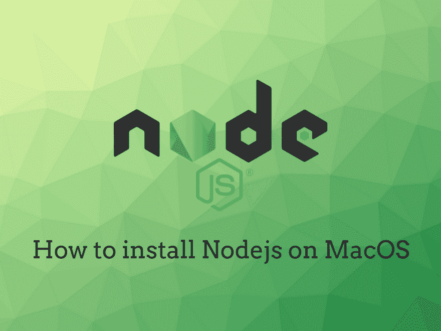T2】](https://res.cloudinary.com/practicaldev/image/fetch/s---mu8cY9C--/c_limit%2Cf_auto%2Cfl_progressive%2Cq_auto%2Cw_880/https://cdn-images-1.medium.com/max/1024/1%2AB9EvsPlsQkCmnGzZKPD42w.png)

今天我讲了如何在 MacOS 上安装 Nodejs 有两种方法:使用 NVM 或者从 nodejs.org T2 下载安装程序

### 从 nodejs.org 安装

我从它开始，因为它很简单，只需进入[nodejs.org](https://nodejs.org/en/download/)并选择 mac os

<figure>[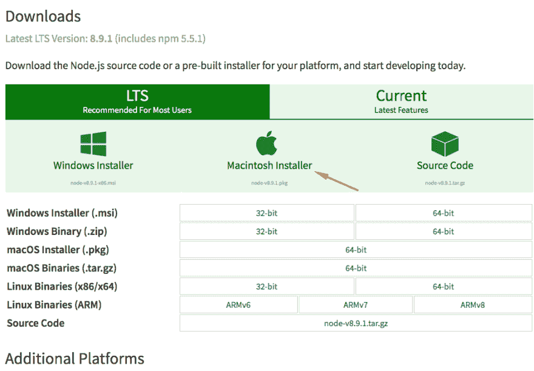](https://res.cloudinary.com/practicaldev/image/fetch/s--qdlM09ON--/c_limit%2Cf_auto%2Cfl_progressive%2Cq_auto%2Cw_880/https://cdn-images-1.medium.com/max/990/1%2A27GNx3vxjbrge1Mow4UohQ.png) 

<figcaption>用安装程序</figcaption>

</figure>

在 MacOS 上安装节点

你将得到安装文件，然后下载成功打开它

<figure>[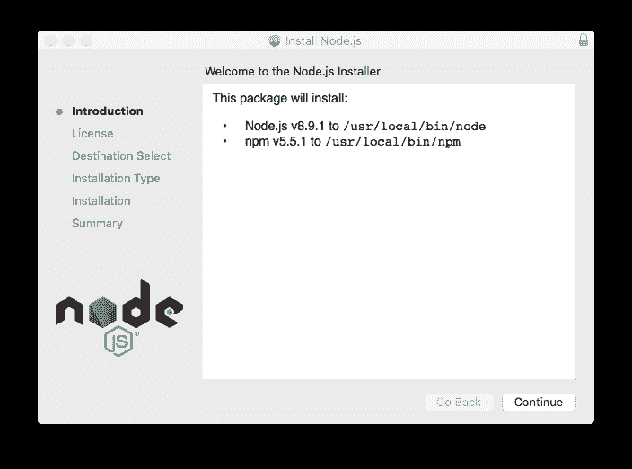](https://res.cloudinary.com/practicaldev/image/fetch/s--4R6kd5kk--/c_limit%2Cf_auto%2Cfl_progressive%2Cq_auto%2Cw_880/https://cdn-images-1.medium.com/max/704/1%2AEAD1VyC2mYAu8LuszFjfFA.png) 

<figcaption>在 MacOS 上安装 Nodejs 第一步</figcaption>

</figure>

单击继续

<figure>[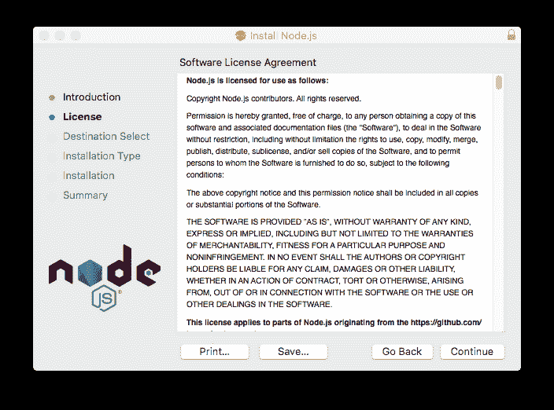](https://res.cloudinary.com/practicaldev/image/fetch/s--YzxIUTBL--/c_limit%2Cf_auto%2Cfl_progressive%2Cq_auto%2Cw_880/https://cdn-images-1.medium.com/max/704/1%2ASip9UrdDFypVbzPemr6pFQ.png) 

<figcaption>在 MacOS 上安装 Nodejs 用户年龄</figcaption>

</figure>

继续并同意

<figure>[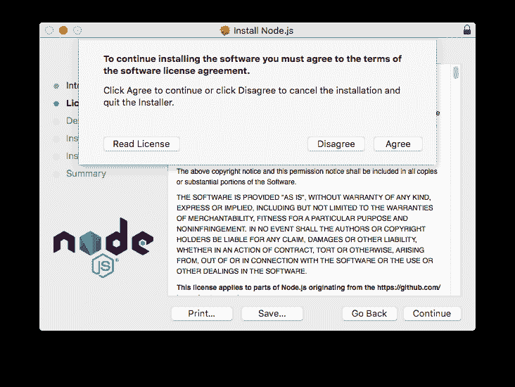](https://res.cloudinary.com/practicaldev/image/fetch/s--wsIfwMW---/c_limit%2Cf_auto%2Cfl_progressive%2Cq_auto%2Cw_880/https://cdn-images-1.medium.com/max/732/1%2Ailq0xy2jbLWIHA4G9pyTQQ.png)

<figcaption>MAC OS 上安装 Nodejs 用户协议继续</figcaption>

</figure>

最后一次点击安装

<figure>[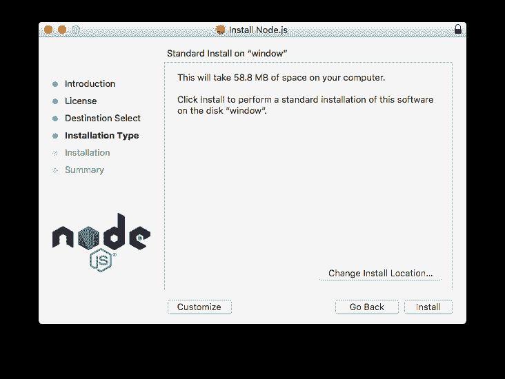](https://res.cloudinary.com/practicaldev/image/fetch/s--4IQqrsgz--/c_limit%2Cf_auto%2Cfl_progressive%2Cq_auto%2Cw_880/https://cdn-images-1.medium.com/max/732/1%2A7nLEjwAVLLfOsPLsRAo-zA.png) 

<figcaption>在 MacOS 上安装 Nodejs 结论</figcaption>

</figure>

等待

<figure>[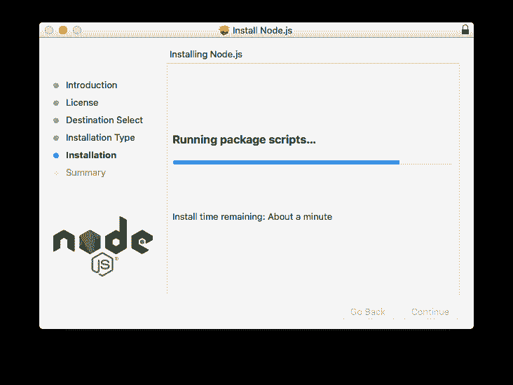](https://res.cloudinary.com/practicaldev/image/fetch/s--I6yb_GgL--/c_limit%2Cf_auto%2Cfl_progressive%2Cq_auto%2Cw_880/https://cdn-images-1.medium.com/max/732/1%2Aj4WmFo9EHJAG59ZHJxiY3g.png) 

<figcaption>在 MacOS 上安装 Nodejs:等待加载</figcaption>

</figure>

安装成功

<figure>[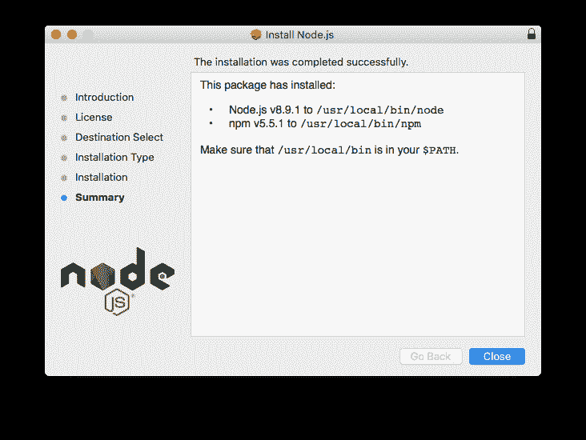](https://res.cloudinary.com/practicaldev/image/fetch/s--OTwZE4Rh--/c_limit%2Cf_auto%2Cfl_progressive%2Cq_auto%2Cw_880/https://cdn-images-1.medium.com/max/732/1%2AnVYzO6Q0A_j0VCiGI92xlQ.png) 

<figcaption>在 MacOS 上安装 Nodejs:成功并显示节点路径</figcaption>

</figure>

要调用您的节点，请打开终端并键入 node

<figure>[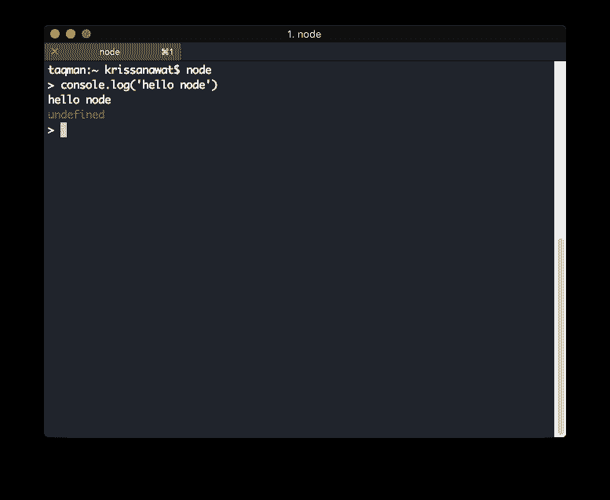](https://res.cloudinary.com/practicaldev/image/fetch/s--V7jkbU6Z--/c_limit%2Cf_auto%2Cfl_progressive%2Cq_auto%2Cw_880/https://cdn-images-1.medium.com/max/777/1%2APz5HuEOT6MO_2fj28tjYkQ.png) 

<figcaption>在 mac os 中从终端调用 nodejs</figcaption>

</figure>

### 使用 nvm

nvm 是节点包管理器的首字母缩写，它是一个终端应用程序，帮助我们管理不同版本的节点

首先转到 nvm.sh，它直接指向 github 库，然后向下滚动到安装部分，复制第一行

<figure>[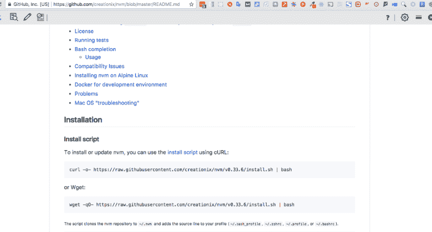](https://res.cloudinary.com/practicaldev/image/fetch/s--X-y0gbg6--/c_limit%2Cf_auto%2Cfl_progressive%2Cq_auto%2Cw_880/https://cdn-images-1.medium.com/max/1024/1%2ACo2pUZuYJU8DY0gQ5Sxh7A.png) 

<figcaption>在装有 nvm 的 MacOS 上安装 Nodejs:nvm 库</figcaption>

</figure>

因为我的 mac 已经安装了 Curl

<figure>[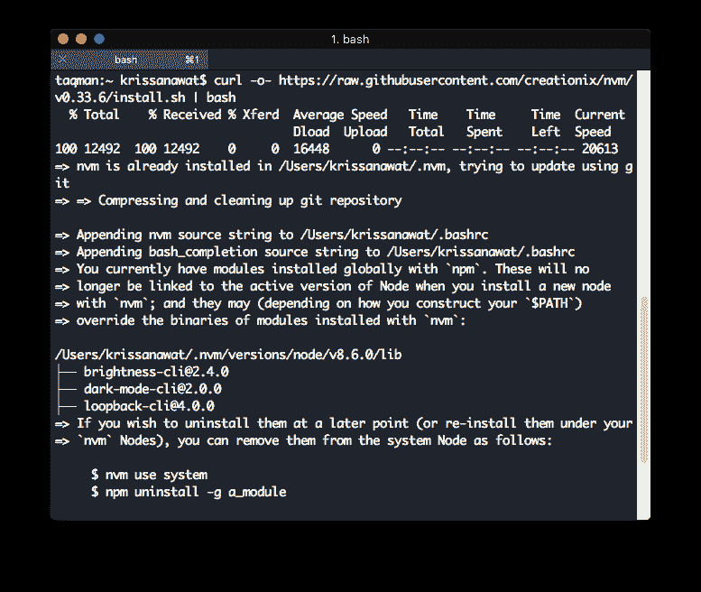](https://res.cloudinary.com/practicaldev/image/fetch/s--4d-gF64s--/c_limit%2Cf_auto%2Cfl_progressive%2Cq_auto%2Cw_880/https://cdn-images-1.medium.com/max/777/1%2AOmSBr0KCsd37JYpqrj5ufA.png) 

<figcaption>用 Curl 在 MacOS 上安装 Nodejs</figcaption>

</figure>

当安装成功时。使用 nvm ls-remote 从服务器列出节点版本

[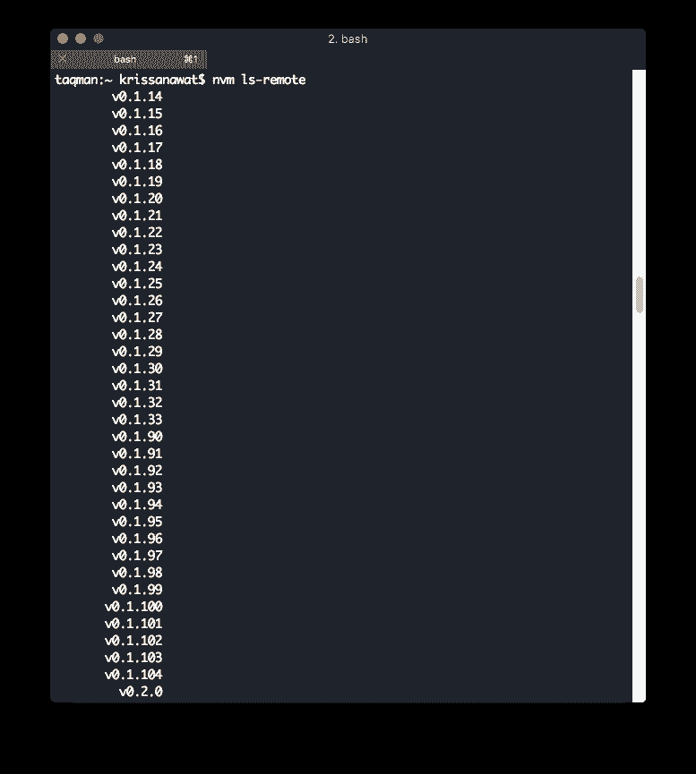T2】](https://res.cloudinary.com/practicaldev/image/fetch/s--nDMBcokh--/c_limit%2Cf_auto%2Cfl_progressive%2Cq_auto%2Cw_880/https://cdn-images-1.medium.com/max/777/1%2AgKXRg--OLsQCs2gGDmLQIA.png)

尝试列表中的一个

[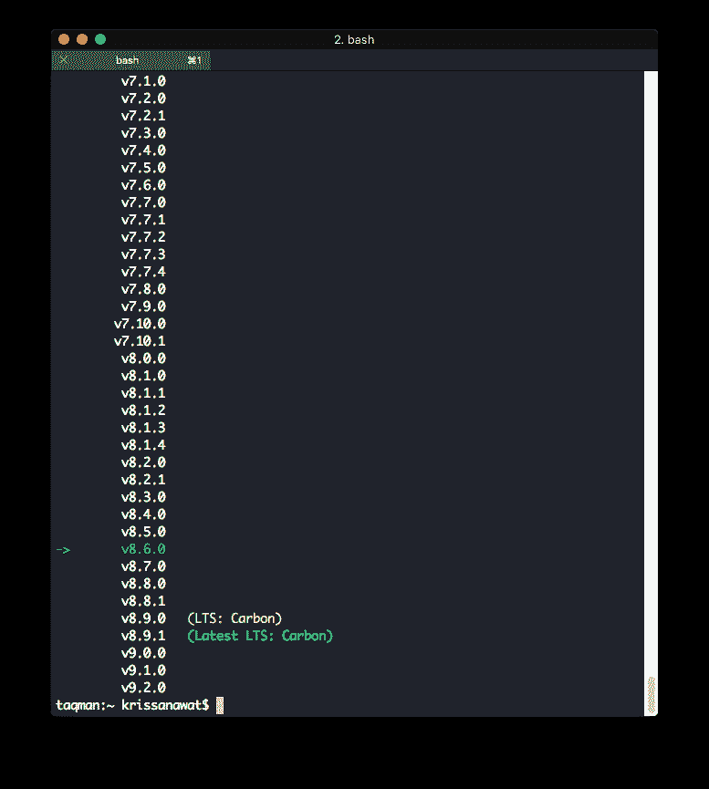T2】](https://res.cloudinary.com/practicaldev/image/fetch/s--GhCdmtrW--/c_limit%2Cf_auto%2Cfl_progressive%2Cq_auto%2Cw_880/https://cdn-images-1.medium.com/max/777/1%2ASiLkRiBqTKe-NOT87EdZ3A.png)

我选择了 9.2.0

[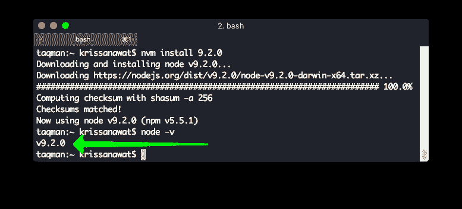T2】](https://res.cloudinary.com/practicaldev/image/fetch/s--RyJOXMfG--/c_limit%2Cf_auto%2Cfl_progressive%2Cq_auto%2Cw_880/https://cdn-images-1.medium.com/max/777/1%2AJ-UgHDeCieWTvmMRRZCAEw.png)

然后用 node -v 检查节点版本

我们成功地在 mac os 上安装了节点，我推荐使用 nvm，因为它比使用更灵活。包装

* * *