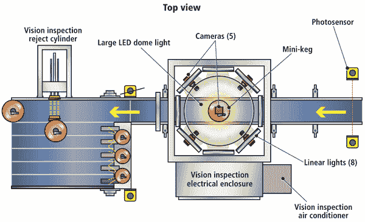

# 惩罚驱动发展？

> 原文:[https://dev.to/mattwarren/punishment-driven-development-33e](https://dev.to/mattwarren/punishment-driven-development-33e)

在之前的一份工作中，我开发了“工业监控系统”，也就是所谓的 **PC** 、一台**相机**和**图像处理软件**，用来分析生产线上的产品。

如果一切正常，这桶苹果酒、比萨饼盒或胡萝卜将被送到商店，否则将被转移到废品堆！这些系统看起来像这样:

[T2】](https://res.cloudinary.com/practicaldev/image/fetch/s--scQe8ANE--/c_limit%2Cf_auto%2Cfl_progressive%2Cq_66%2Cw_880/https://thepracticaldev.s3.amazonaws.com/i/7co3xjbss6l0wrhy5iy9.gif)

* * *

但是为什么**惩罚驱动开发**，因为当我的软件停止工作时，整个生产线将会停止运转，一些可怜的“*志愿者*将不得不站在那里手动检查零件，点击每个零件的*红色*或*绿色*按钮。

(**趣闻**:曾经有人告诉我，**据称**一些工厂工人会摆弄电脑直到它坏掉，连续敲同一个键 100 次，无休止地重启它，等等。他们这样做是因为当生产线停工时，他们可以延长茶歇时间😊)

不用说，如果出了问题，“生产主管”很快就会打电话来，因为他们有支持合同，所以我的工作就是接听电话并解决问题。

**在我从事这份工作的 5 年中，我发现了以下情况**:

1.  大多数工业系统都远离有电话和互联网接入的办公室
2.  人们不喜欢被反复问'*你能试试这个*吗？'如果每次都要走 10 分钟
3.  在嘈杂肮脏的工厂里，安装在生产线旁的个人电脑上运行的软件可能会出各种问题
4.  **如果问题不能通过电话解决，有人(我)必须开车去工厂，呆在那里直到问题解决**

不足为奇的是，最后一课给我带来了最多的问题！！事实证明，大多数工厂都在偏僻的地方。此外，你很难接触到你正在修理的机器，而且你也不可能得到一张舒适的桌子和一把椅子。

然而，这也迫使我在我的软件中实现了**可靠的**和**有用的**诊断，并使得从 PC 中提取它们变得容易。此外，我还使软件能够从 u 盘的内容中更新自己，这样我就再也不用晚上呆在工厂里了！！

**总之我学会了:**

1.  拥有有用的诊断**不是偶然发生的**，你必须将它设计到你的产品中
2.  花时间考虑记录哪些信息会有回报(我总是假设有一天我会依赖这些信息)
3.  对使用你的软件的人好一点，这样当你参观他们的工厂时，他们会愿意帮助你
4.  有一个让你的软件变得更好的动机真的很有帮助，因此有了 T2 惩罚驱动开发

否则你最终会被[送到考文垂](https://en.wikipedia.org/wiki/Send_to_Coventry)(对我来说就是字面意思！！)

* * *

**你呢，你有类似的故事吗？**

你是否因为外部动机而学到了关于软件开发的有价值的一课？