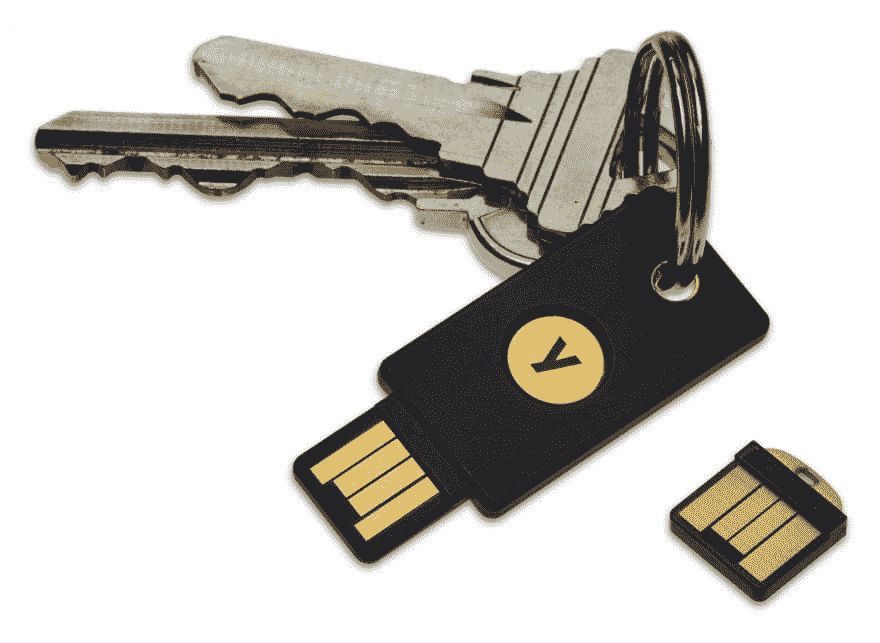

# 你使用安全钥匙吗？

> 原文:[https://dev.to/tmd45/do-you-use-security-key-c2l](https://dev.to/tmd45/do-you-use-security-key-c2l)

你知道费多吗？而且认识 U2F？你用那些？

世界上大约有多少人使用安全硬件密钥？我看不到有人在我熟悉的地方使用那些设备。🤔
是因为日本吗？

你认为 FIDO 设备受欢迎吗？我想知道世界上有多少人使用 FIDO 设备。

[T2】](https://res.cloudinary.com/practicaldev/image/fetch/s--bvhXNTSe--/c_limit%2Cf_auto%2Cfl_progressive%2Cq_auto%2Cw_880/https://thepracticaldev.s3.amazonaws.com/i/j9rq1qz0fhsmalv46vl4.png)

谢了。