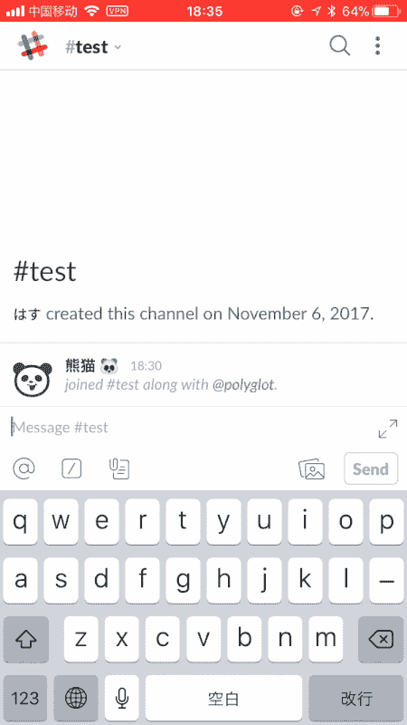

# 使用反应表情符号来触发谷歌翻译

> 原文:[https://dev . to/gimo/use-reaction-e moji-to-trigger-Google-translation-1le](https://dev.to/gimo/use-reaction-emoji-to-trigger-google-translation-1le)

TL；博士；医生

[T2】](https://res.cloudinary.com/practicaldev/image/fetch/s--UeeYAN7W--/c_limit%2Cf_auto%2Cfl_progressive%2Cq_66%2Cw_880/https://thepracticaldev.s3.amazonaws.com/i/1sd4x4wtc74cu5q849ij.gif)

* * *

API:
[https://api.slack.com/events/reaction_added](https://api.slack.com/events/reaction_added)
[https://cloud.google.com/translate/docs/](https://cloud.google.com/translate/docs/)

示例代码:
[https://github . com/masakichi/douban ista _ slack/blob/master/app/RTM . py](https://github.com/masakichi/doubanista_slack/blob/master/app/rtm.py)