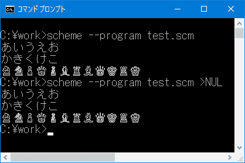

# 使用 Chez 方案和 Windows 控制台 API 打印到控制台。

> 原文:[https://dev . to/saitoatsushi/print-to-console-with-chez-scheme-and-windows-console-API-32g](https://dev.to/saitoatsushi/print-to-console-with-chez-scheme-and-windows-console-api-32g)

在 Windows 上，当通过标准输出将字符打印到控制台时，该字符在当前代码页中被解释。如果内部字符串的编码与当前代码页不同，将发生 [mojibake](https://en.wikipedia.org/wiki/Mojibake) 。编码转换是必要的。

而且，不可能通过标准输出来打印不包含在当前代码页中字符。

对于打印所有 unicode 字符，我们可以使用控制台 API 而不是标准输出。

我用 [Chez Scheme 的对外接口](https://cisco.github.io/ChezScheme/csug9.4/foreign.html)和 Windows 上的控制台 API 做了控制台输出库。

```
(library (console-port)
  (export open-console-output-port)
  (import (chezscheme))

  (define dummy (begin (load-shared-object "kernel32.dll") 1))

  (define-ftype handle void*)

  (define open-existing 3)

  (define create-file
    (foreign-procedure __stdcall "CreateFileW"
      (wstring unsigned-32 unsigned-32 void* unsigned-32 unsigned-32 void*)
      void*))

  (define file-share-write 2)

  (define generic-write #x40000000)

  (define (get-active-console-buffer)
    (create-file "CONOUT$" generic-write file-share-write 0 open-existing 0 0))

  (define write-console
    (foreign-procedure __stdcall "WriteConsoleW"
      (void* wstring unsigned-32 u32* void*)
      boolean))

  (define (open-console-output-port)
    (let ((output-handle (get-active-console-buffer))
          (vsize (make-bytevector 4)))
      (define (write-to-console string start count)
        (let ((str (substring string start (+ start count))))
          (write-console output-handle str count vsize 0)
          count))
      (make-custom-textual-output-port "console" write-to-console #f #f #f)))
  ) 
```

<svg width="20px" height="20px" viewBox="0 0 24 24" class="highlight-action crayons-icon highlight-action--fullscreen-on"><title>Enter fullscreen mode</title></svg> <svg width="20px" height="20px" viewBox="0 0 24 24" class="highlight-action crayons-icon highlight-action--fullscreen-off"><title>Exit fullscreen mode</title></svg>

```
(import (rnrs)
        (console-port))

(let ((port (open-console-output-port)))
  (display "あいうえお\nかきくけこ\n" port)
  (display "♘♞♙♕♟♝♜♗♛♚♖♔" port)
  (flush-output-port port)) ;; Do not forget the flash!! 
```

<svg width="20px" height="20px" viewBox="0 0 24 24" class="highlight-action crayons-icon highlight-action--fullscreen-on"><title>Enter fullscreen mode</title></svg> <svg width="20px" height="20px" viewBox="0 0 24 24" class="highlight-action crayons-icon highlight-action--fullscreen-off"><title>Exit fullscreen mode</title></svg>

我的 windows 电脑设置为 CP932。CP932 不包含国际象棋字符。但是，它可以通过控制台 API 打印。

[T2】](https://res.cloudinary.com/practicaldev/image/fetch/s--RaSFzyL1--/c_limit%2Cf_auto%2Cfl_progressive%2Cq_auto%2Cw_880/https://thepracticaldev.s3.amazonaws.com/i/9w1k6qeestjqepvzs7il.png)