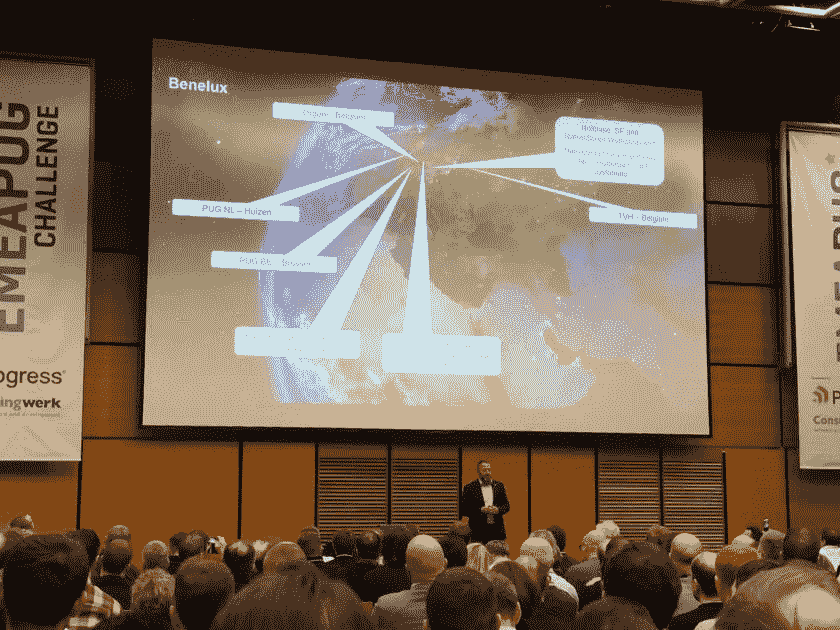

# 在帕格挑战赛上提及

> 原文：<https://dev.to/patricktingen/mention-at-pug-challenge-1ohg>

今天，在布拉格 PUG 挑战赛的开幕式上，DataDigger 被认为是 OpenEdge 中一个很好的开源项目的例子。当然，我有什么理由不同意呢？所以谢谢马克！

[T2】](https://datadigger.files.wordpress.com/2017/11/pug_mention2.jpg)

也感谢阿诺·范德恩德的照片