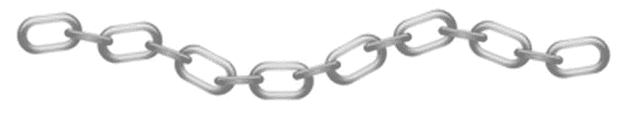
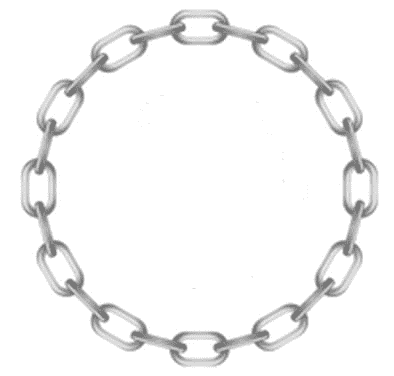

# 链即服务(CaaS)

> 原文:[https://dev.to/rafalpienkowski/chain-as-a-service-caas-4m8](https://dev.to/rafalpienkowski/chain-as-a-service-caas-4m8)

设计模式在软件开发人员的日常工作中非常重要。至少我是这么认为的。我假设你们很多人都知道责任链设计模式。

* * *

如果您不知道这种设计模式，我建议您在进一步阅读本文之前先阅读其中的一篇文章:

*   [dotfactory.com](http://www.dofactory.com/net/chain-of-responsibility-design-pattern)
*   [oodesign.com](http://www.oodesign.com/chain-of-responsibility-pattern.html)
*   [sourcemaking.com](https://sourcemaking.com/design_patterns/chain_of_responsibility)
*   [springframework.guru](https://springframework.guru/gang-of-four-design-patterns/chain-of-responsibility-pattern/)
*   [blackwasp.co.uk](http://www.blackwasp.co.uk/ChainOfResponsibility.aspx)

或者您可以自己找到关于这种设计模式文章或书籍。

* * *

现在每个人都知道责任链(CoR)设计模式，所以我们可以回到这篇文章的主要目的。正如我们所知，CoR 包含一系列处理程序，这些处理程序负责处理传入的请求。处理程序的工作完成后，请求被传递给它的继任者。这种情况可以用一个链条的图像来说明:

[T2】](https://res.cloudinary.com/practicaldev/image/fetch/s--RA8cm2_u--/c_limit%2Cf_auto%2Cfl_progressive%2Cq_auto%2Cw_880/https://raw.githubusercontent.com/rafalpienkowski/resources/master/chain-as-a-service/chain1.png)

所以让我们回到文章的标题。链即服务(CaaS)。我很确定每个开发人员在职业生涯中至少需要一次创建服务的机会。我有一个问题要问你:忽略服务目的，你会考虑用 CoR 设计模式来创造服务吗？如果没有，我给你看样东西。让我们从前面的图像中取出我们的链，将第一个链节与最后一个链节连接起来。我们会收到这样的东西:

[T2】](https://res.cloudinary.com/practicaldev/image/fetch/s--gfrLfuVT--/c_limit%2Cf_auto%2Cfl_progressive%2Cq_auto%2Cw_880/https://raw.githubusercontent.com/rafalpienkowski/resources/master/chain-as-a-service/chain2.png)

这不是很简单吗？有了这个画面，我在 github 上创建了一些示例[项目。这是写在。网芯 2.0。你当然可以下载下来自己玩。](https://github.com/rafalpienkowski/chain-as-a-service/blob/master/ChainAsAService.Components/ServiceFactory.cs)

我实现了 3 个处理程序:

*   [地狱之鹰交易商](https://github.com/rafalpienkowski/chain-as-a-service/blob/master/ChainAsAService.Components/HelloWorldHandler.cs)
    *   返回“你好，世界！到控制台
*   [日期时间处理程序](https://github.com/rafalpienkowski/chain-as-a-service/blob/master/ChainAsAService.Components/DateTimeHandler.cs)
    *   它向控制台返回当前日期和时间
*   [WaiterHandler](https://github.com/rafalpienkowski/chain-as-a-service/blob/master/ChainAsAService.Components/WaiterHandler.cs)
    *   冻结应用程序一秒钟

我创建了一个 [ServiceFactory](https://github.com/rafalpienkowski/chain-as-a-service/blob/master/ChainAsAService.Components/ServiceFactory.cs) 类，它实现了 [IHandlerFactory](https://github.com/rafalpienkowski/chain-as-a-service/blob/master/ChainAsAService.Core/IHandlerFactory.cs) 接口并生成了我的简单服务。我的服务包括:

[T2】](https://res.cloudinary.com/practicaldev/image/fetch/s--zaid22ji--/c_limit%2Cf_auto%2Cfl_progressive%2Cq_auto%2Cw_880/https://raw.githubusercontent.com/rafalpienkowski/resources/master/chain-as-a-service/service.png)

应用程序的输出如下所示:

```
Hello world!
Current date and time: 16.11.2017 17:18:12
Hello world!
Current date and time: 16.11.2017 17:18:14
Hello world!
Current date and time: 16.11.2017 17:18:16 
```

<svg width="20px" height="20px" viewBox="0 0 24 24" class="highlight-action crayons-icon highlight-action--fullscreen-on"><title>Enter fullscreen mode</title></svg> <svg width="20px" height="20px" viewBox="0 0 24 24" class="highlight-action crayons-icon highlight-action--fullscreen-off"><title>Exit fullscreen mode</title></svg>

我希望这个例子会鼓励你更频繁地使用责任链设计模式。如果你能以我介绍的方式建立服务，我将不胜荣幸。

我希望你喜欢这篇文章。你的反馈对我来说非常有价值。

### 链接:

* * *

*   [链条图标](http://clipart-library.com/clipart/pi7rL4AMT.htm)