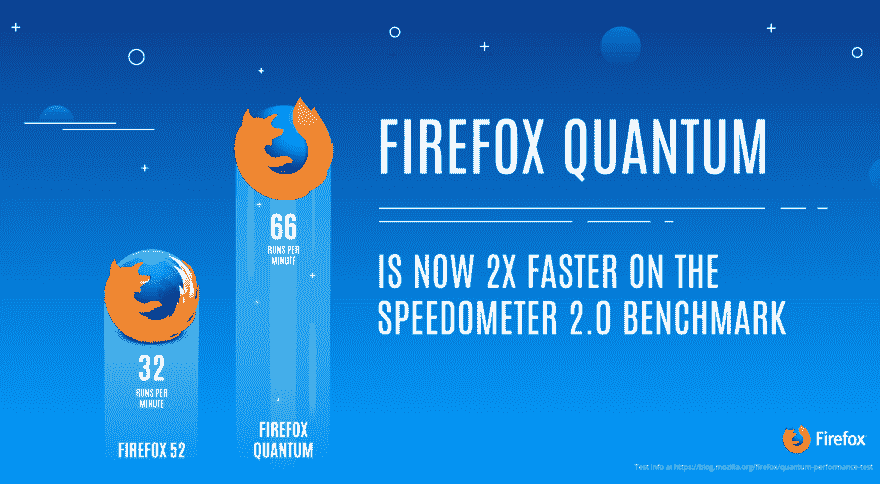
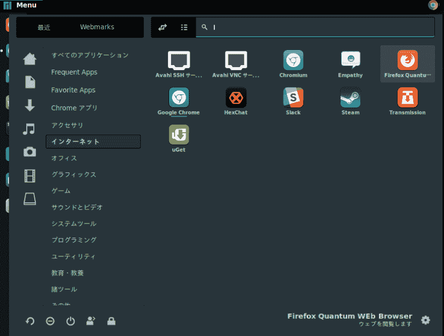

# 如何在 Arch Linux/Manjaro Linux 上安装 Firefox Quantum

> 原文：<https://dev.to/tokifujp/firefox-quantumarch-linuxmanjaro-linux-366>

[T2】](https://res.cloudinary.com/practicaldev/image/fetch/s--qYwJ91D5--/c_limit%2Cf_auto%2Cfl_progressive%2Cq_auto%2Cw_880/https://blog.mozilla.org/wp-content/uploads/2017/09/2017.25.09.FFQuantumBeta_Quantum-1400x770.png)

# 火狐 Quantumについて

~~ggrks~~ 这是一款脱胎换骨的高速网络浏览器。

# premise

*   不想使用 Windows、Mac、Ubuntu 之类的人(煽动要素大)
*   安装了 Firefox，有`/usr/share/applications/firefox.desktop`
    *   如果没有的话请做`sudo pacman -S firefox`

# 下载和展开

在`/opt`上安装的例子。 ( 64 位版二进制)

```
$ cd /opt
$ sudo wget https://download-installer.cdn.mozilla.net/pub/firefox/releases/57.0/linux-x86_64/en-US/firefox-57.0.tar.bz2
$ sudo tar xfj firefox-57.0.tar.bz2 
```

# [做](#-raw-usrshareapplicationsfirefoxquantumdesktop-endraw-%E3%82%92%E4%BD%9C%E3%82%8B)`/usr/share/applications/firefox-quantum.desktop`

复印一下`/usr/share/applications/firefox.desktop`吧。

```
sudo cp /usr/share/applications/firefox.desktop /usr/share/applications/firefox-quantum.desktop 
```

编辑`/usr/share/applications/firefox-quantum.desktop`

按照下述地方修改吧。

```
Name=Firefox Quantum Web Browser
Exec=/opt/firefox/firefox %u
Exec=/opt/firefox/firefox -new-window
Exec=/opt/firefox/firefox -private-window 
```

# 以上

不是有`メニュー→インターネット→Firefox Quantum Web Browser`吗？
[](https://res.cloudinary.com/practicaldev/image/fetch/s--jdZJerTS--/c_limit%2Cf_auto%2Cfl_progressive%2Cq_auto%2Cw_880/https://thepracticaldev.s3.amazonaws.com/i/zy0dt95lmbe0oqqsy75u.png)