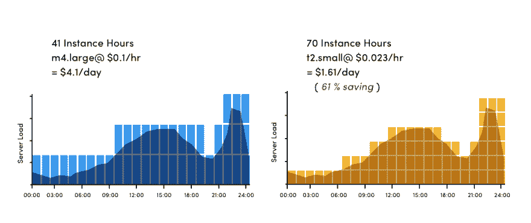
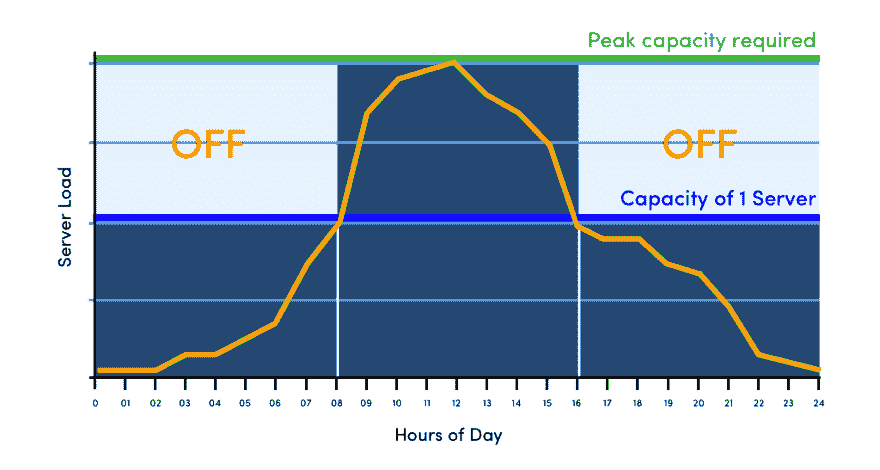
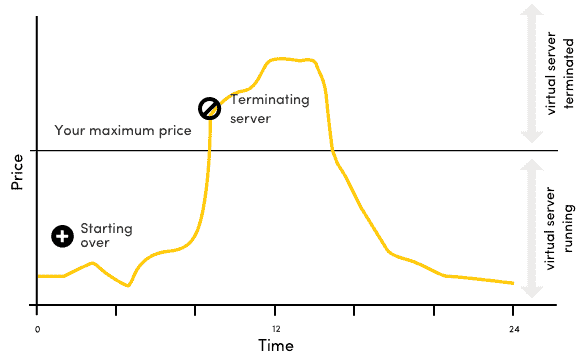

# 计算实例的云成本优化策略

> 原文：<https://dev.to/jignesh_simform/cloud-cost-optimization-strategies-for-compute-instances-3dj>

您每月的云计算账单是否主要由实例或虚拟机构成？大多数组织将 50-80%的总云支出用于计算服务。如果您发现未使用的实例或虚拟机并利用折扣选项，这一云账单最多可减少 40%。

在这篇博客中，您将了解云提供商的折扣选项，以及如何根据工作负载利用实例。在选择经济高效的实例时，了解特定需求下各种实例的容量非常重要。在开始优化策略之前，您应该知道如何[比较主要云提供商的计算服务价格](https://www.simform.com/compute-pricing-comparison-aws-azure-googlecloud/)。

## 降低计算支出的成本优化策略

大多数用户的大部分支出都花在计算上，这使得计算成为降低成本的重点领域。

### 缩小未充分利用的实例

实例的缩减可以降低高达 50%的成本。检查下面 m4.large 和 t2.small 的示例。

[T2】](https://res.cloudinary.com/practicaldev/image/fetch/s--NMuDVZMx--/c_limit%2Cf_auto%2Cfl_progressive%2Cq_auto%2Cw_880/http://www.simform.com/wp-content/uploads/2017/09/Scale.png)

如您所见，m4.large 在午夜和上午 9 点之间的利用率不到 50%。服务器使用率从上午 9 点增加到下午 2 点，需要两个 m4 .大型实例来处理请求。然后，使用量开始减少，直到下午 6 点，并在夜间增加。从图中可以清楚地看出，在某些特定的时间跨度内，单个 m4.large 实例甚至没有利用其 50%的容量。费用 4.1 美元/天。

现在我们知道，在特定的时间跨度内，m4.large 使用了不到 50%的资源，因此我们可以使用 t2.small 实例，它的计算能力是 m4.large 的一半。在这里，需要 70 个 t2.small 实例来管理工作负载，但它仍然节省了 60%以上的实例成本。

### 关闭未使用的实例

通常，组织根据峰值负载选择实例。问题是这个要求不是恒定的，是随时间变化的。要全面优化云支出，请关闭不再使用的实例。下图显示了服务器负载在某一天如何变化，以及何时关闭实例。

[T2】](https://res.cloudinary.com/practicaldev/image/fetch/s--FJPRu5wF--/c_limit%2Cf_auto%2Cfl_progressive%2Cq_auto%2Cw_880/http://www.simform.com/wp-content/uploads/2017/09/Scale-2.png)

如您所见，从午夜到早上 8 点，服务器负载可以由一个实例处理，因此您可以关闭第二个实例以节省额外的成本。在接下来的 8 小时内，服务器负载增加，需要两个实例。同样，服务器负载在一天的最后八个小时会减少，因此您可以再次关闭第二个实例。

## 使用折扣实例

大多数云提供商都有折扣选项。在准确比较计算价格之前，了解折扣方法至关重要。

在这里，我列出了三个主要的云提供商的折扣选择。

### AWS 保留实例

AWS 提供折扣以换取一年或三年的承诺。您可以获得 24-75%的折扣，依国际扶轮期限、事例类型和地区而定。

### Azure 12 个月预付实例

在 Azure 上获得折扣的主要途径是你的微软企业协议(EA)。EAs 提供 15-45%的折扣，这取决于你承诺的使用水平。

### 谷歌持续使用折扣

谷歌的持续使用折扣(SUDs)自动发生，不需要预先承诺。它按照一个月的使用百分比收费。一旦实例在一个月中运行了 25 %,价格就会下降到按需的 80 %( 20%的折扣),当您在一个月中运行了 50%和 75%时，折扣又会上升 20%。因此，一个月中 100%时间都在运行的实例将获得最多 30%的折扣——这要根据具体情况而定，因为并非所有工作负载都匹配。

## 使用 AWS Spot 实例、Azure 低优先级虚拟机或 Google 可抢占实例

这些类型的折扣实例可以为用户节省大量资金，但应该谨慎使用，因为不是所有的工作负载都是很好的匹配。

### AWS Spot 实例

使用 AWS Spot 实例，您可以在按需 EC2 实例价格上获得高达 90%的折扣，而无需预先支付任何费用！

它是如何工作的？

你设置一个最高投标价格和一个可选的长达 6 小时的时间。你支付的价格是每小时的现货价格。当这个价格高于你指定的最高出价时，实例被终止。但是要小心！spot 实例的新控制台创建了一个舰队，即使您自己终止了实例，舰队仍然保持开放。您需要取消“现场请求”(车队)，并在完成后终止实例。保证实例在指定的时间内保持活动状态，最长可达 6 小时。为了更好的理解，请看下图。

[T2】](https://res.cloudinary.com/practicaldev/image/fetch/s--zbAf7gzY--/c_limit%2Cf_auto%2Cfl_progressive%2Cq_auto%2Cw_880/http://www.simform.com/wp-content/uploads/2017/09/Scale-2-1.png)

### Azure 低优先级虚拟机

对于低优先级虚拟机，您可以利用未使用的容量，并获得很高的价格。低优先级的 Linux 虚拟机有 80%的折扣，而 Windows 虚拟机有 60%的折扣。折扣是通过与他们的按需每小时价格进行比较来计算的。绝大多数虚拟机大小和类型都支持作为低优先级虚拟机运行。低优先级虚拟机的价格是固定的，除了现有的全价之外，每个虚拟机大小现在都有一个固定的低优先级价格。有关更多详细信息，请参见 Azure 批量定价页面。

### 谷歌抢先实例

谷歌抢先实例提供高达正常成本 80%的固定折扣。您最多可以运行实例 24 小时，如果需求增加，抢占式实例可以随时关闭。您可以每 24 小时重启一次，但是该实例仍然会关闭，您将从零开始使用一个新的抢占式实例，因此这里不可能有长时间运行的进程。

由于计算服务会直接影响组织的绩效，因此应在分析工作负载和性能后使用这些成本优化策略。这些方法是您可以在常规云优化任务中使用的一些典型的计算成本优化技术。了解您的现有成本并有效地对变更进行建模的能力对于估算和实现真正的成本节约至关重要。

* * *

*我在这里发布了这篇文章的更新版本[计算和存储的云成本优化策略](https://www.simform.com/cloud-cost-optimization-strategies-compute-storage/)。它包括云存储服务的成本优化技术，如清理多部分负载、压缩存储、降低 API 访问成本等。*