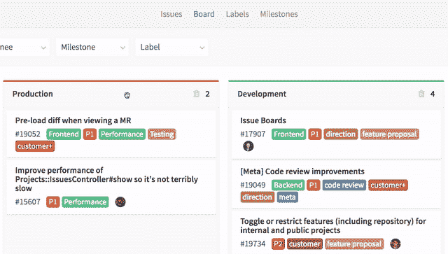
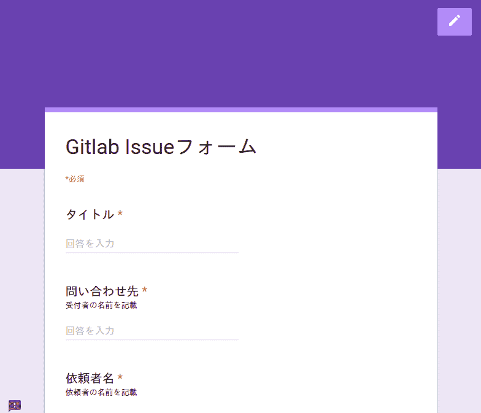
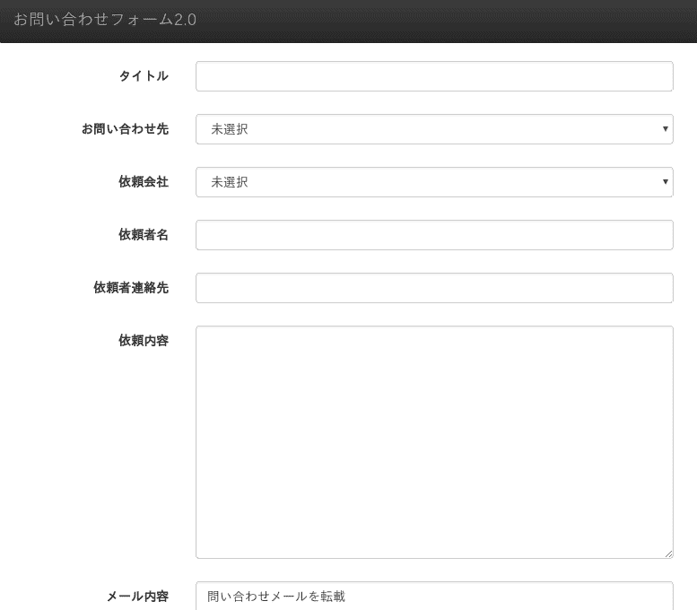

# 因为想在 Gitlab Issues Board 上横穿项目进行 Issue 管理，所以试着做了

> 原文:[https://dev.to/tokifujp/gitlab-issues-boardprojectissue-6ej](https://dev.to/tokifujp/gitlab-issues-boardprojectissue-6ej)

[T2】](https://res.cloudinary.com/practicaldev/image/fetch/s--9PoJSWr7--/c_limit%2Cf_auto%2Cfl_progressive%2Cq_66%2Cw_880/https://about.gitlab.cimg/blogimages/announcing-the-gitlab-issue-board/gif-drag-and-drop-list.gif)

# premise

1.  有经理说 Gitlab Issues Board 很方便
2.  对每个案件客户分别进行 Projects/Sub Groups 的管理
3.  1 以 1 Sprint 为 1 周，站在该周的 Issue 将在下周三之前在测试环境中进行深度测试
4.  这是一种可以在某种程度上进行分散的 Team

## 最开始做的事情

[T2】](https://res.cloudinary.com/practicaldev/image/fetch/s--Ay8P7W0P--/c_limit%2Cf_auto%2Cfl_progressive%2Cq_auto%2Cw_880/https://thepracticaldev.s3.amazonaws.com/i/9ch6rwcfubqsjzqjr14u.png)

*   Googleフォーム→Gitlab 服务台→问题(项目)

### Application content

1.  从谷歌表格投稿
2.  从谷歌 apps script 发送邮件
3.  gitlab 服务次受け用のGitlab ProjectにIssueが立つ
4.  Dispatcher 进行分配
5.  Status 是 Label，虽然有 todo、wip、done 左右，但是初期没有被分配
6.  发行结束条件
    1.  客户验收确认后
    2.  将 Issue 移动到案件客户端的项目
    3.  用↑关闭移动的 Issue (移动后，原来的 Issue 会自动关闭)

### 优点

1.  开发工时低
    1.  谷歌表格
    2.  根据模板构建邮件正文
    3.  服务 DeskにGmailApp.sendmail()する
2.  因为运行成本包含在 G Suite 中，所以实质上是免费的

### subject

1.  案件客户很难理解
    1.  在 Issue 的描述中很麻烦
2.  如果是通过 Service Desk 进行的话，就无法设定 Issue 的细致表现
    1.  机密 Issueになる
    2.  无法授予标签
    3.  无法设置 Assignee

## 接下来做的事情

[T2】](https://res.cloudinary.com/practicaldev/image/fetch/s--dsVHLa2r--/c_limit%2Cf_auto%2Cfl_progressive%2Cq_auto%2Cw_880/https://thepracticaldev.s3.amazonaws.com/i/a8gmwk53xhfwtbyoydlj.png)

*   Google Apps 脚本→Gitlab APIからPOST→Issue(Project)

### Application content

1.  从谷歌 apps script 表格投稿
2.  ScriptからGitlab APIにPOST 谷歌应用套件
3.  projectにissueがgit lab 立つ
4.  发行结束条件
    1.  客户验收确认后
    2.  包括项目# issue no 并将其与 Commit/Merge Request 关联

### 优点

1.  因为运行成本包含在 G Suite 中，所以实质上是免费的
2.  额外自动化了一些
    1.  代理人設定
    2.  交易客户端标签
    3.  项目横断面与 Commit/MR message 关联，包括项目# issue no

### subject

1.  与最初的方案相比，开发工时高
2.  如何划分 Slack 通知的信道？ (现在每个案件客户端都有通道)
3.  虽然从 Google Spreadsheet 中参考案件客户信息以及 Gitlab Group User 信息等，将其提交到表单的选择框中，但是似乎也可以从 Gitlab API 中获取。

# 总结

因为才刚刚开始，所以要一边运用一边 KPT 哦。