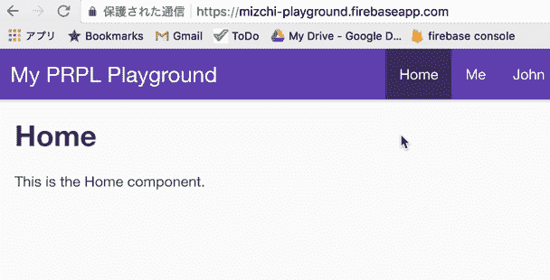
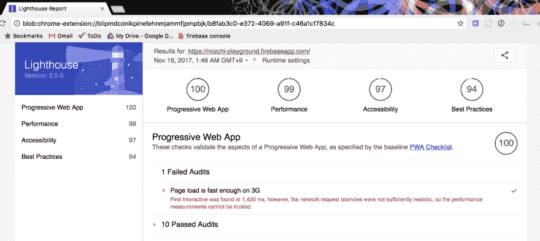

# 为什么 dev.to 这么快，这么对自己来说很感动呢

> 原文：<https://dev.to/mizchi/-devto--b5>

先说一下。 这是不认输的表现。

## SPA 和 PWA 的现状

也许是因为自己在日本做着像 React 的自由福音主义者一样的事情，经常制作 SPA 的沉重内容，“你们不是把前端的事情弄得很复杂，批量生产沉重的页面让网络恶化了吗！ ”这样的批评，经常会在指名道姓的时候受到。 虽然不知道为什么会对我说，但是为什么会以 React = SPA 这样的形象被当成替罪羊呢？ 那还可以。

在自己的工作中使用 SPA 技术，既有必要也可以说明理由。 不过，因为还是对近年来的复杂化/重量化有所考虑，所以反而想保留 AMP/PWA 这个选项，说实话，这也是被委托的 R&D 工作，但是我记住了一点。 但是，目前还没有在工作上使用的时机。

PWA 技术无法在工作中使用的原因，很大程度上是因为它是新的技术，所以还没有枯萎，而且很难与现有的东西同时运用。 AMP 作为技术限制的极地，为了充分利用 PWA，必须在导入 HTTP/2 和 ServiceWorker 等的同时，重新制作用户跟踪，重新进行会话管理，舍弃传统技术，才能受惠。 说实话，现有的东西更新很困难，只有划痕。 结果成为话题的日经新闻的[https://r.nikkei.com](https://r.nikkei.com) 也是划痕。

还有一点，人们担心的是，PWA 技术终究只是将线路纤细、内存弱的 Android Chrome 体验最大化的方法，并不适合日本的市场。 不管谷歌怎么说，我一直以为是这样的。 但是，这被 dev.to 的体验破坏了沉思。

## 为什么 dev.to 很厉害

dev.to 很快。 虽然引入 PRPL 模式是新的，但除此之外，只要用包括预读鼠标在内的已知技术做了一些事情，就可以判断不加入任何延迟内容的要素。 正因为把速度放在第一位，才会有那个。 大概是必须舍弃其他一切，将表演作为最重要的重要指标才能实现的世界。

例如完全没有社交小部件。 没有向 Facebook 或 Twitter 投稿的按钮。 我想导入过的人都知道，但是那些家伙都很不稳定，读取速度很慢，对于浪费我们优化的努力来说是天才。 另外，其需求之多也困扰着我们。

作为前端工程师，平时在自己身边体验 dev.to 左右的速度。 开发时速度很快的网站，在社交小部件和营业带来的神秘广告和为了用户支持的神秘 SDK 上，感到惊讶的重量！ 这是日常的风景，一想到总是放弃但没有放弃的先有这个，就会多少产生想要努力说服的心情。

没错，dev.to 的什么最好，占据画面领域的大小及其转移很华丽。 因为华丽，所以能成为说服材料。 速度是最好的 UX 基础，前端要求的就是它。 所以应该以这个为目标。 只有这一点达到了理所当然的水平，前端工程师才能发挥到目前为止积累的技术本领。

至今为止的网络都是假的。 可以这么说的时代马上就要到了。

…dev.to 快得让用户混乱，所以应该夹着过渡动画来确保功能可见性。

## 自己制作 dev.to

制作了表示 dev.to 本来就不是特殊技术的演示。

[https://mizchi-playground.firebaseapp.com/](https://mizchi-playground.firebaseapp.com/)

SSR+ServiceWorker onfetch 中断通过 html 缓存发送进行画面迁移。

[T2】](https://res.cloudinary.com/practicaldev/image/fetch/s--XP3vfmcc--/c_limit%2Cf_auto%2Cfl_progressive%2Cq_66%2Cw_880/https://i.gyazo.com/109ea40ef2bfe934e9b18e103a3d1d83.gif)

在 lighthouse 的分数，100 分。

[T2】](https://res.cloudinary.com/practicaldev/image/fetch/s--qiY8cDep--/c_limit%2Cf_auto%2Cfl_progressive%2Cq_auto%2Cw_880/https://i.gyazo.com/f9e5a9cce152198e50b1616b54b7728f.png)

嘛，因为什么都没有，所以也可以说无是 100 分，但任何网站诞生的时候都很快。 剩下的就是维持这个了。 而且那是多么难啊！

所做的事情，只是因为作为轻量级 react 的 preact 工具 preact-cli 宣传支持 PRPL，所以把它扔给了 firebase hosting。 作为前端的基础，与 SSR+PRPL+Fastly 的 dev.to 几乎没有区别。 虽然没有明确说明，但是 firebase hosting 的资产发布的头部是 fastly 是很有名的故事。 明明是谷歌。

```
$ npm install -g preact-cli
$ npm install -g firebase-tools
$ preact create default myprpl
$ cd myprpl
$ preact build -p
$ firebase init # firebase hosting で build ディレクトリを指定
$ firebase deploy 
```

Enter fullscreen mode Exit fullscreen mode

作为发行的指令也几乎只有这个。 react 还是这个用途比较重，所以我觉得用 preact 比较好。 生成的代码很有趣，读一下就可以了。

## 应该投资 PWA 吗

不可否认，PWA 技术既消除了现有的复杂性，又携带了另一种复杂性。 而且现在过于谷歌主导，Apple(Safari )的做法尚不清楚，另外在应该作为基础的 WebComponents 方面，围绕谷歌和 Mozilla 的规格存在对立。 会被那里的政治讨价还价所左右吧。

话虽如此，根据自己的定点观测，因为已经在 webkit 上安装了 ServiceWorker 的 fetch，所以预计明年 11 月的 Safari 的主要发行版将会上市。

[https://github . com/WebKit/WebKit/commit/c 7c 21 c 947 e 6071 CD 6746 fa 15 CBF 8 CB 228 eeb 2897 # diff-86 bd2c 027490094 de 3 f 06 C3 f 27 F9 a 923](https://github.com/WebKit/webkit/commit/c7c21c947e6071cd6746fa15cbf8cb228eeb2897#diff-86bd2c027490094de3f06c3f27f9a923)

且不说 toB，在 toC，桌面网页正在死亡，移动一切的世界相对接近。 作为程序员是件悲伤的事情，但一想到能忘记 IE，不仅感到悲观。

## Node.js 一炮打响的时代

最后，讲一个在这篇文章中特意回避的故事。 像是“网站的支配性调整不是查询调整吗”之类的话。 那就是了。 毕竟，这篇文章在利用 SPA 技术避免浏览器标签刷新的同时，如果假设通信速度总是低于 1s，那么这个体验就可以实现。

老实说，不足 1s 不是查询的世界，考虑到最后一英里的话，如何处理 Redis 等内存缓存就变成了世界。 要在服务器上生成具有逻辑高速缓存控制和复杂逻辑的 HTML/JSON，需要在服务器上模拟客户端的 isomorphism，目前只有 Node.js 能做到这一点。 之前做了制作 SSR 的缓存中间件的工作，结果组装了 Redux 的 store 并缓存在 redis 上。 那样的话。

尽管如此，即使将 Node 作为 BFF 放置，接触 SQL 毕竟还是觉得用别的语言比较好(毕竟 Node 不是能很好地描述数据建模和商业逻辑的语言)，最好用 graphql 等协议分解成微服务

我想对 Node.js 工程师说的是，至少在这个领域不取得市场占有率的话，今后一辈子都赢不了 Rails！

## 总结

*   dev.to 是一种快速但可再现的技术
*   关键不在于如何加快，而在于如何排除慢的东西
*   投资 PWA 是值得的。 没错。 dev.to 可以用作其说服材料。
*   node.js 势将在这里努力实现一次工具链！

## Reference

*   [https://github.com/developit/preact-cli](https://github.com/developit/preact-cli)
*   [https://developers . Google . com/web/fundamentals/performance/prpl-pattern/？hl=ja](https://developers.google.com/web/fundamentals/performance/prpl-pattern/?hl=ja)