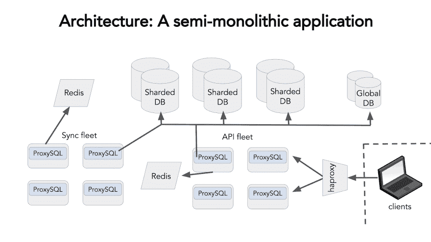

# 与 Python 同步的数十亿封电子邮件

> 原文：<https://dev.to/nylas/billions-of-emails-synced-with-python-61a>

开发电子邮件同步引擎很难。Python 让它变得简单(嗯，更简单)。

在 Nylas，我们对 Python 的热爱不是秘密。我们的电子邮件同步引擎——负责为客户同步和服务超过 100 亿封电子邮件——完全由 Python 构建。

为什么？答案很简单:Python 是标准的、可靠的，而且(对我们这样的初创公司来说是最好的)令人厌烦。这是一个简单的解决方案，使我们能够为全球开发者提供一个灵活而稳定的 API。

在 PyBay 2017 上，我做了一个演讲，解释了为什么 Python 的“乏味”是天生的优势。对于构建复杂产品的公司来说，Python 驱动的解决方案为创新提供了最稳定的基础。

## 邮件是硬的

电子邮件协议是出了名的易变，需要大量的文档才能用一种协议实现与 SaaS 应用程序的简单同步。如果开发人员希望他们的电子邮件实现能够与各种电子邮件标准一起工作，除了解析、编码、认证等等之外，他们还需要考虑很多问题(例如，如何让 Exchange、Exchange ActiveSync 和 Gmail IMAP 协议能够很好地配合工作)。潜在的问题很多，几乎没有简单的解决方案。

[T2】](https://res.cloudinary.com/practicaldev/image/fetch/s--Bt0BNTyj--/c_limit%2Cf_auto%2Cfl_progressive%2Cq_auto%2Cw_880/https://lh3.googleusercontent.com/NKenfF6GyAt1tTPCP2izehzrOG4SWj5nTK7cl0xFKzmj12sNhXJjn16Be6q4jgrpZJfAaJuB0-v0kxvw4x1q8qDtriGRpiJEZmPAZFs0tIcj6Fdw_vqAnhDlQH3HOTnyJgbsVvMS)

这些复杂性只是伴随电子邮件等 50 年历史的技术不可避免的包袱。标准不断变化，新的复杂技术不断推出，但必须始终考虑传统协议。

## 挑战

当 Nylas 刚起步时，我们不得不考虑如何构建一个[同步引擎 API](https://github.com/nylas/sync-engine) 。本质上，有两种选择:1)存储最少的数据，并作为两个平台之间的转换层；2)镜像邮箱的内容，并直接为尽可能多的请求提供服务。

第一种选择会更便宜，但它会使我们向依赖正常运行时间的组织提供可靠性的能力变得复杂。所以，我们选择了方案二，尽管它更贵。我们通过分割数据库和使用半单片架构做到了这一点。这种架构将我们的服务定位在不同的机器上，但是它们都共享相同的底层代码和模型，以便于集成。

[T2】](https://res.cloudinary.com/practicaldev/image/fetch/s--ZrtbkpSD--/c_limit%2Cf_auto%2Cfl_progressive%2Cq_auto%2Cw_880/https://lh6.googleusercontent.com/HwJJPMOwx1lt3FX6WpW1PQwDQf7YDvT1e0kjjlteWaMj8E3SjxjIZYKs2T5rGs7T69FMEoWubNHHf44poKNvCpldoHMegi8p27ZNiupoqwTFzC1QA-bpg-MdP5pR8Q0eVZhklli0)

这种架构使我们能够更好地应对更大的挑战，如处理电子邮件、同步标签和文件夹等。最终结果:Nylas 同步引擎。Nylas Sync 引擎是开源的，它提供了一个 RESTful API，使开发人员能够将消息传递集成到他们的应用程序中。它有 90，000 多行 Python 代码，包括测试和迁移，并有助于解决协议、协议分支、解析、编码等生态系统的问题。

## 在理工学院，无聊是好事

为了构建我们的架构，我们必须使用一种可扩展的编程语言，比如 Python 及其许多库。例如，我们广泛使用解析库 [flanker](https://pypi.python.org/pypi/flanker) 来帮助提高电子邮件的可送达性。我们还使用 Flask、Gevent、SQLAlchemy 和 pytest 以及其他工具，如 HAproxy、nginx、gunicorn、MySQL、ProxySQL、Ansible、Redis 等等。就堆栈而言，似乎我们做了一些相当平淡的选择。我们做到了，这是故意的。

我们选择使用无聊的工具运行，原因很简单:我们是一家小公司，我们只能将有限的资源用于推动创新开发。事实上，我们的设计哲学部分源自丹·麦金利的文章[“选择无聊的技术”](http://mcfunley.com/choose-boring-technology)(如果你还没有读过，你应该读一读——这本书很棒)，他在文章中指出，每个公司在耗尽自己的业务之前，创新的能力都是有限的。这个概念驱动了我们在 Nylas 的早期决策，并通知了我们的核心 API 哲学，即让我们的客户能够构建一个集成而不是多个。这推动我们采用久经沙场的技术，我们知道，我们不必担心，这使我们能够在其他地方做得更多。

例如，我们使用 MySQL 来管理我们的数据库。我们很早就决定 MySQL 是正确的选择，因为我们对它了如指掌，很多潜在的 DBA 也对它了如指掌，我们需要把创新的精力留给其他问题。可以肯定的是，依赖 MySQL 意味着我们有很多成长的烦恼(参见我们关于与 MySQL 一起成长的博客文章[),但是我们可以通过智能应用 ProxySQL、水平分片和其他技术来克服这些问题。](https://www.nylas.com/blog/growing-up-with-mysql/)

了解我们在 MySQL 方面的优势，以及我们如何在以后用 ProxySQL 和其他工具修改它，有助于将我们的数据库简化为更小、更易管理的部分，同时几乎没有停机时间，也不必完全重新设计我们的数据库。事实上，通过 ProxySQL 和 SQLAlchemy 提供的一点小魔法，我们使用 MySQL 在事务表上轻松地记录和重放邮箱同步的所有更改。这为我们如何同步、我们的 webhooks、我们的流 API 等等提供了动力。

有了这么多的依赖项，我们使用一个包装在 Debian 包管理器中的 Python virtualenv 来部署我们的应用程序。具体来说，我们使用的工具被称为 [dh-virtualenv](https://github.com/spotify/dh-virtualenv) ，它使我们能够使用 Debian 的包管理器 dpkg 来部署依赖项，并在将它们推送到[亚马逊 S3](https://aws.amazon.com/s3/) 之前检查工件。正如 McQueen 指出的，一个简单的部署脚本看起来像这样:

```
scp my-package.deb remote-host.example.org:
ssh remote-host.example.org

# Run the next commands on remote-host.example.org dpkg -i my-package.deb

/usr/share/python/myproject/bin/python
>>> import myproject # it works! 
```

有了这些工具，我们就拥有了一个可靠的技术堆栈，而不是重新发明轮子。它只是帮助同步和发送电子邮件，同时满足每个人对正常运行时间、规模和稳定性的期望。

## 同步和检查

我们在整个车队的多核机器上使用 Python。这意味着我们必须运行多个进程，以便充分利用这些多核。为此，我们使用一个协程库 [gevent](http://www.gevent.org/) ，在一个进程中同步大约 100 个帐户。这为我们节省了大量内存和操作系统调度。流程看起来是这样的:

每个绿色方框是一个 gevent greenlet。Greenlet 是一个强大的小 Python 工具，允许我们进行微小的控制流，例如让 greenlet 管理 Gmail 同步流，直到 green let 管理垃圾邮件、日历、联系人同步等等。为了监控所有这些，我们使用一个跨所有流运行的特殊 greenlet，如果它在确定的时间内没有运行，就会发送一个事件日志。当这种情况发生时，我们[运行一个采样分析器](https://www.nylas.com/blog/performance/)对应用程序调用堆栈进行采样和记录，以识别应用程序在哪里被挂起进行分析。在 Python 中，采样器看起来有点像这样:

```
import collections
import signal

class Sampler(object):
   def __init__(self, interval=0.001):
     self.stack_counts = collections.defaultdict(int)
     self.interval = 0.001

    def _sample(self, signum, frame):
     stack = []
     while frame is not None:
         formatted_frame = '{}({})'.format(frame.f_code.co_name,
                                             frame.f_globals.get('__name__'))
         stack.append(formatted_frame)
         frame = frame.f_back

     formatted_stack = ';'.join(reversed(stack))
     self.stack_counts[formatted_stack] += 1
     signal.setitimer(signal.ITIMER_VIRTUAL, self.interval, 0)

    def start(self):
     signal.signal(signal.VTALRM, self._sample)
     signal.setitimer(signal.ITIMER_VIRTUAL, self.interval, 0) 
```

这些样本可以输入到 flamegraph 中，向我们显示一个进程正在做什么，CPU 是如何使用的，以及是什么 greenlet 阻塞了它。

## 我们接下来要做的事情

但正如任何组织都知道的那样，乐趣不止于克服挑战。在接下来的几年里，我们计划在 Python 生态系统上投入更多。例如，当我们的代码变得越来越复杂时，我们期待用 mypy 来帮助减轻管理。特别是，[我们使用 mypy](https://github.com/nylas/mypy-tools) 作为 linter 进行类型检查。这是一个渐进的项目，但我们很高兴 mypy 的复杂性降低能力。

我们还将开始向 Python 3 迁移。最后，我们正在考虑将我们的事务日志转移到一个 [Kafka](https://kafka.apache.org/) 事件中枢。这应该使我们能够转向基于微服务的架构，通过不要求每个服务都直接与数据库对话来给我们更多的灵活性。

对我们来说，Python 几乎出现在我们做的每一件事情中，因为它的简单性、库的多样性以及与服务器良好协作的能力。对于好奇的开发人员来说，关于 Python 如何简化代码，或者如何构成新应用程序的基础，还有很多东西需要学习。此外，由于其强大而高效的社区，学习如何执行这些可能性可以相当简单。这个社区是我们如此广泛地使用 Python 的主要原因之一，也是我们期待看到这个社区还能做些什么以及我们如何为之做出贡献的原因之一。对我们来说，Python 是标准的、可扩展的、久经考验的，而且对任何初创公司来说都是最无聊的。我们迫不及待地想知道它将何去何从。

点击此处观看我的完整演示:

这篇文章最初发表在 [Nylas 工程博客](https://www.nylas.com/blog/billions-of-emails-synced-with-python)上。