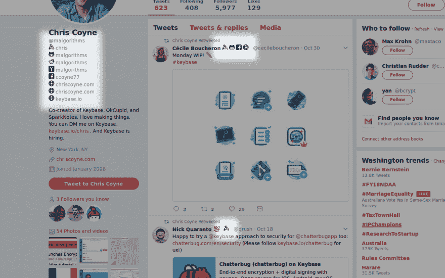
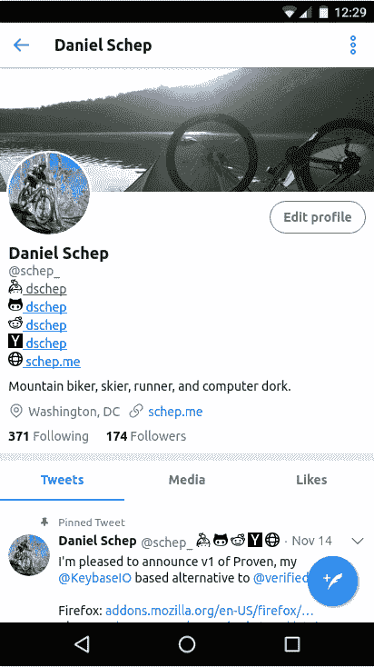
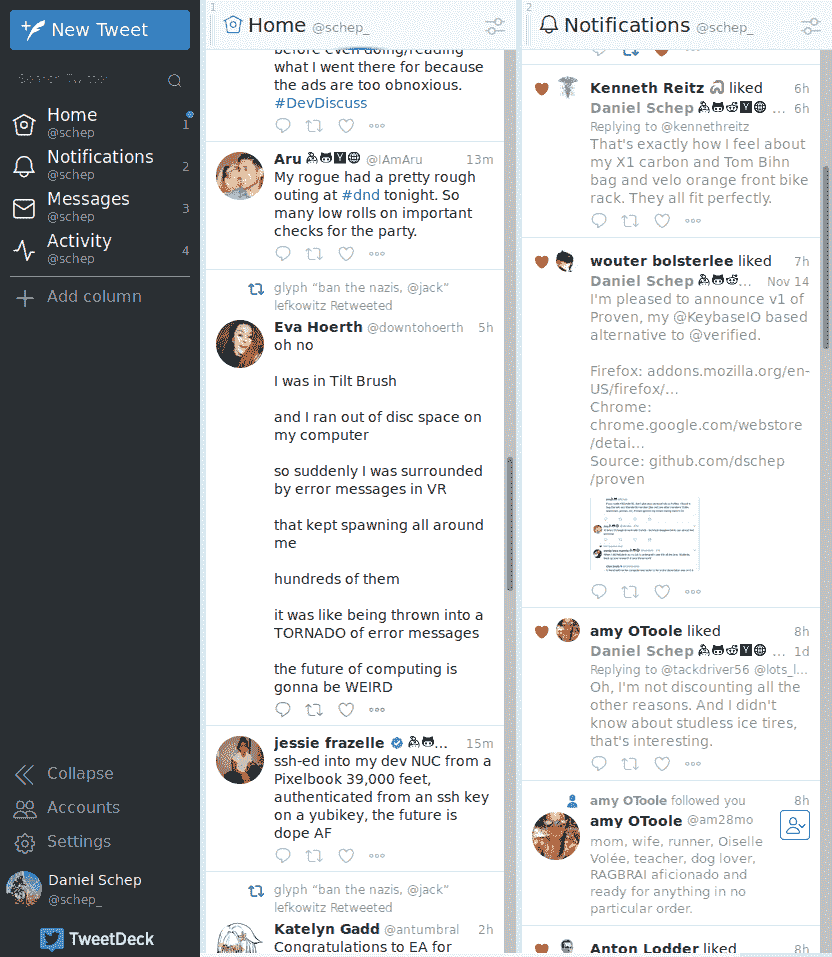

# 介绍经过验证的

> 原文:[https://dev.to/dschep/introducing-proven-9c4](https://dev.to/dschep/introducing-proven-9c4)

我很高兴将 [Proven](https://github.com/dschep/proven) 介绍给[dev to](https://dev.to/)社区。这是火狐& Chrome 的一个浏览器扩展，可以在 Twitter 上给用户的名字添加徽章，作为他们验证程序的替代方案。

Proven 使用 [Keybase](https://keybase.io) 的 API 通过用户的 twitter 句柄查找用户，如果他们有帐户，它会为他们的 Keybase 个人资料以及其他通过发布证明链接的个人资料添加徽章。

这是它实际运行的样子！(所有徽章均可点击链接至相关简介)

将其安装在 [Firefox](https://addons.mozilla.org/en-US/firefox/addon/proven/) 或 [Chrome](https://chrome.google.com/webstore/detail/proven/algligpkkhlodbalbiilbfiihcooekjn?hl=en-US&gl=US) 上。并在 [Github](https://github.com/dschep/proven) 上查看源代码

**更新:**现在有了夜间模式和移动([使用了🦊](https://play.google.com/store/apps/details?id=org.mozilla.firefox))支持！

**更新 2:** 现在支持 tweetdeck！
T3T5】