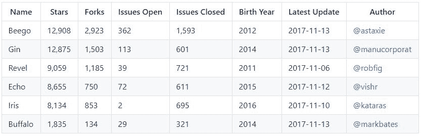
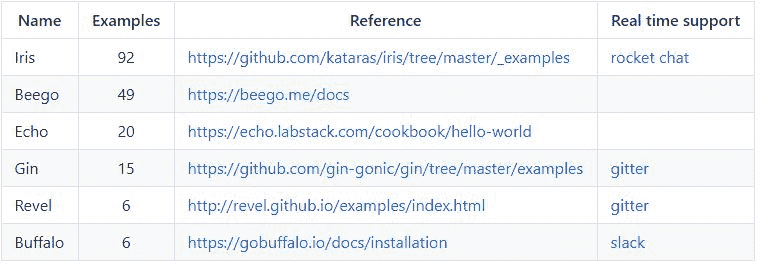
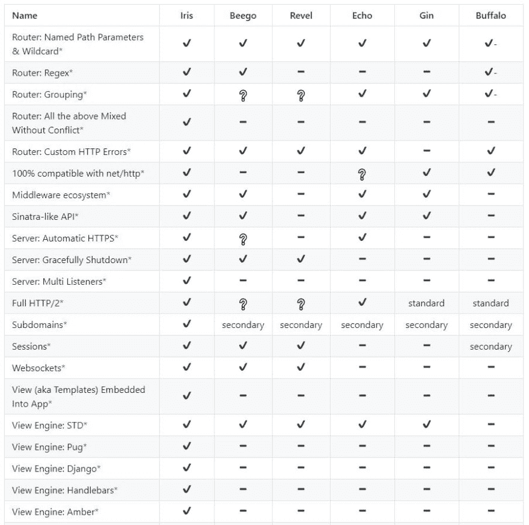
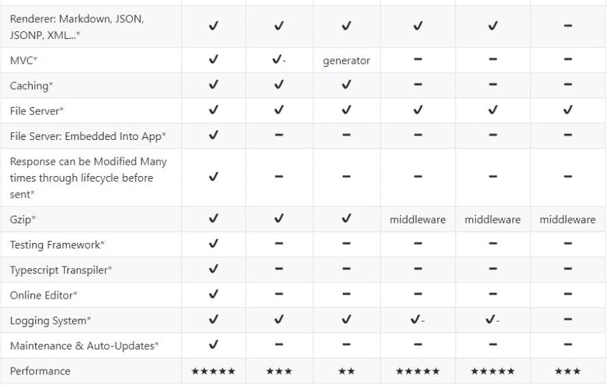

# 截至 2017 年的 6 大 Go web 框架

> 原文:[https://dev . to/speed wheel/top-6-we b-frameworks-for-go-as-of-2017-34i](https://dev.to/speedwheel/top-6-web-frameworks-for-go-as-of-2017-34i)

# 用于地鼠的令人敬畏的网络框架

如果你为自己设计一个小的应用程序，你可能不需要一个 web 框架，但是如果你要投入生产，你肯定需要一个，一个好的框架。

当你认为你有必要的知识和经验时，你会冒险自己编写所有这些特性吗？你有时间去找一个生产级的外包公司来完成这项工作吗？你确定这将与你的应用程序的其余部分保持一致吗？

这些是驱使我们最好的人使用框架的重要原因，如果其他人已经做了艰苦的工作，我们不想自己编码所有那些必要的特性。

## 简介

Go 是一种快速发展的开源编程语言，旨在构建简单、快速、可靠的软件。看一看[这里](https://github.com/golang/go/wiki/GoUsers)看看哪些伟大的公司使用 Go 来增强他们的服务。

本文提供了所有必要的信息，可以帮助开发人员了解使用 Go 开发 web 应用程序的最佳选择。

本文包含了最详细的框架比较，从尽可能多的角度比较了最著名的 web 框架:流行度、支持和内置特性:

**Beego** : *一个用于 go 编程语言的开源、高性能的 web 框架。*

*   [https://github.com/astaxie/beego](https://github.com/astaxie/beego)
*   [https://beego.me](https://beego.me)

**水牛** : *快速 Web 开发 w/ Go。*

*   [https://github.com/gobuffalo/buffalo](https://github.com/gobuffalo/buffalo)
*   [https://gobuffalo.io](https://gobuffalo.io)

**Echo** : *一个高性能、极简的 Go web 框架。*

*   [https://github.com/labstack/echo](https://github.com/labstack/echo)
*   [https://echo.labstack.com](https://echo.labstack.com)

**Gin** : *用 Go (Golang)写的 HTTP web 框架。它有一个类似 Martini 的 API，性能更好。*

*   [https://github.com/gin-gonic/gin](https://github.com/gin-gonic/gin)
*   [https://gin-gonic.github.io/gin](https://gin-gonic.github.io/gin)

**Iris** : *宇宙中最快的围棋网络框架。MVC 功能齐全。今天就拥抱未来。*

*   [https://github.com/kataras/iris](https://github.com/kataras/iris)
*   [https://iris-go.com](https://iris-go.com)

**Revel** : *一个用于 Go 语言的高生产率、全栈 web 框架。*

*   [https://github.com/revel/revel](https://github.com/revel/revel)
*   [https://revel.github.io](https://revel.github.io)

## 人气

> 按受欢迎程度排序(星级)

[](https://res.cloudinary.com/practicaldev/image/fetch/s--Byfs16_R--/c_limit%2Cf_auto%2Cfl_progressive%2Cq_auto%2Cw_880/https://thepracticaldev.s3.amazonaws.com/i/jofn8buzhvkot1xkpvq5.JPG)
[https://github . com/speed wheel/awesome-go-web-frameworks/blob/master/readme . MD #人气](https://github.com/speedwheel/awesome-go-web-frameworks/blob/master/README.md#popularity)

## 学习曲线

[](https://res.cloudinary.com/practicaldev/image/fetch/s--kFMwgWhT--/c_limit%2Cf_auto%2Cfl_progressive%2Cq_auto%2Cw_880/https://thepracticaldev.s3.amazonaws.com/i/d5mwhbuiruymgip00quf.JPG)
[https://github . com/speed wheel/awesome-go-web-frameworks/blob/master/readme . MD # learning-curve](https://github.com/speedwheel/awesome-go-web-frameworks/blob/master/README.md#learning-curve)

astaxie 和 kataras 在这里做得很好，希望其他框架会赶上更多的例子，至少对我来说，如果我切换到一个新的框架，那是最足智多谋的地方来快速掌握尽可能多的信息。举个例子，大概有 1000 个单词。

## 核心特性

> 按最重要到最不重要排序

[](https://res.cloudinary.com/practicaldev/image/fetch/s--xkdFnwCV--/c_limit%2Cf_auto%2Cfl_progressive%2Cq_auto%2Cw_880/https://thepracticaldev.s3.amazonaws.com/i/rhyou3q14z1cjhjimq59.JPG)
[](https://res.cloudinary.com/practicaldev/image/fetch/s--09mT2BhX--/c_limit%2Cf_auto%2Cfl_progressive%2Cq_auto%2Cw_880/https://thepracticaldev.s3.amazonaws.com/i/kt35hh9t6cy98dbyf6k1.JPG)
[https://github . com/speed wheel/awesome-go-web-frameworks/blob/master/readme . MD # core-features](https://github.com/speedwheel/awesome-go-web-frameworks/blob/master/README.md#core-features)

```
The most known "Web frameworks" in Go are not really frameworks, meaning that:
Echo, Gin and Buffalo are not really (fully featured) web frameworks
but the majority of Go community thinks that they are.
Therefore they think that they are comparable with Iris, Beego or Revel,
because of that we have the obligation to include them into this list as well.

All of the above frameworks, except Beego and Revel, can adapt any middleware
that was created for net/http, some of those can do this with ease and others
with some hacking [even the pain is a choice here]. 
```

<svg width="20px" height="20px" viewBox="0 0 24 24" class="highlight-action crayons-icon highlight-action--fullscreen-on"><title>Enter fullscreen mode</title></svg> <svg width="20px" height="20px" viewBox="0 0 24 24" class="highlight-action crayons-icon highlight-action--fullscreen-off"><title>Exit fullscreen mode</title></svg>

## 词汇

### 路由器:命名路径参数&通配符

当您可以将处理程序注册到具有动态路径的路由时。

命名路径参数示例:

```
"/user/{username}" matches to "/user/me", "/user/speedwheel" etc 
```

<svg width="20px" height="20px" viewBox="0 0 24 24" class="highlight-action crayons-icon highlight-action--fullscreen-on"><title>Enter fullscreen mode</title></svg> <svg width="20px" height="20px" viewBox="0 0 24 24" class="highlight-action crayons-icon highlight-action--fullscreen-off"><title>Exit fullscreen mode</title></svg>

`username`路径参数的值分别是`"/me"`和`"speedwheel"`。

通配符示例:

```
"/user/{path *wildcard}" matches to
"/user/some/path/here",
"/user/this/is/a/dynamic/multi/level/path" etc 
```

<svg width="20px" height="20px" viewBox="0 0 24 24" class="highlight-action crayons-icon highlight-action--fullscreen-on"><title>Enter fullscreen mode</title></svg> <svg width="20px" height="20px" viewBox="0 0 24 24" class="highlight-action crayons-icon highlight-action--fullscreen-off"><title>Exit fullscreen mode</title></svg>

`path`路径参数的值分别是`"some/path/here"`和`"this/is/a/dynamic/multi/level/path"`。

> Iris 还支持一个名为`macros`的特性，可以描述为`/user/{username:string}`或`/user/{username:int min(1)}`。

### 路由器:Regex

当您可以使用过滤器将处理程序注册到具有动态路径
的路由时，应该传递一些过滤器以便执行处理程序。

示例:

```
"/user/{id ^[0-9]$}" matches to "/user/42" but not to "/user/somestring" 
```

<svg width="20px" height="20px" viewBox="0 0 24 24" class="highlight-action crayons-icon highlight-action--fullscreen-on"><title>Enter fullscreen mode</title></svg> <svg width="20px" height="20px" viewBox="0 0 24 24" class="highlight-action crayons-icon highlight-action--fullscreen-off"><title>Exit fullscreen mode</title></svg>

`id`路径参数 t 的值为`42`。

### 路由器:分组

当您可以将公共逻辑或中间件/处理程序注册到共享相同路径前缀的特定路由组时。

示例:

```
myGroup := Group("/user", userAuthenticationMiddleware)
myGroup.Handle("GET", "/", userHandler)
myGroup.Handle("GET", "/profile", userProfileHandler)
myGroup.Handle("GET", "/signup", getUserSignupForm) 
```

<svg width="20px" height="20px" viewBox="0 0 24 24" class="highlight-action crayons-icon highlight-action--fullscreen-on"><title>Enter fullscreen mode</title></svg> <svg width="20px" height="20px" viewBox="0 0 24 24" class="highlight-action crayons-icon highlight-action--fullscreen-off"><title>Exit fullscreen mode</title></svg>

*   /用户
*   /用户/配置文件
*   /用户/注册

您甚至可以从组中创建子组:

```
myGroup.Group("/messages", optionalUserMessagesMiddleware)
myGroup.Handle("GET', "/{id}", getMessageByID) 
```

<svg width="20px" height="20px" viewBox="0 0 24 24" class="highlight-action crayons-icon highlight-action--fullscreen-on"><title>Enter fullscreen mode</title></svg> <svg width="20px" height="20px" viewBox="0 0 24 24" class="highlight-action crayons-icon highlight-action--fullscreen-off"><title>Exit fullscreen mode</title></svg>

*   /user/messages/{id}

### 路由器:以上所有混合无冲突

这是一个高级但有用的功能，我们许多人都希望它能得到路由器或 web 框架的支持，目前只有 Iris 在 Go 世界中支持这一功能。

这意味着像`/{path *wildcard}`和`/user/{username}`以及`/user/static`和`/user/{path *wildcard}`这样的东西可以通过静态路径(`/user/static`或通配符(`/{path *wildcard}`)注册到同一个路由器中，该路由器可以正确匹配而不会发生冲突。

### 路由器:自定义 HTTP 错误

当您可以重置“错误”状态代码的处理程序时。错误 http 状态代码是一个`>=400`状态代码，即`NotFound 404`。

示例:

```
OnErrorCode(404, myNotFoundHandler) 
```

<svg width="20px" height="20px" viewBox="0 0 24 24" class="highlight-action crayons-icon highlight-action--fullscreen-on"><title>Enter fullscreen mode</title></svg> <svg width="20px" height="20px" viewBox="0 0 24 24" class="highlight-action crayons-icon highlight-action--fullscreen-off"><title>Exit fullscreen mode</title></svg>

以上大部分 web 框架只支持`404`、`405`和`500`注册，但是像`Iris, Beego and Revel`这样功能齐全的支持任何状态码甚至`any error`码(`any error`只有 Iris 支持)。

### 100%兼容网络/http

意味着您拥有:

*   框架给你一个直接访问`*http.Request`和`http.ResponseWriter`的上下文。
*   一种将`net/http`处理程序转换成特定框架类型的处理程序的方法。

### 中间件生态系统

当你不需要用你自己的中间件包装每个处理器，但是框架给你一个完整的引擎来定义流程，全局地或者每条路由或者每组路由，即`Use(middleware)`、`Done(middleware`等等。

### 类 Sinatra API

在运行时处理程序中注册特定 HTTP 方法(和路径参数)的路由。

示例:

```
.Get or GET("/path", gethandler)
.Post or POST("/path", postHandler)
.Put or PUT("/path", putHandler) and etc. 
```

<svg width="20px" height="20px" viewBox="0 0 24 24" class="highlight-action crayons-icon highlight-action--fullscreen-on"><title>Enter fullscreen mode</title></svg> <svg width="20px" height="20px" viewBox="0 0 24 24" class="highlight-action crayons-icon highlight-action--fullscreen-off"><title>Exit fullscreen mode</title></svg>

### 服务器:自动 HTTPS

当框架的服务器支持注册和自动更新 SSL 证书以管理 SSL/TLS 传入连接(https)时。最著名的自动 https 提供者是 [letsencrypt](https://letsencrypt.org/) 。

### 服务器:正常关机

当按`CTRL + C`关闭您的终端应用程序时；服务器会自动关闭，等待一些连接完成它们的工作(有一个指定的超时时间)或者触发一个自定义事件来清理(例如数据库关闭)。

### 服务器:多监听器

当 tje 框架的服务器支持注册自定义`net.Listener`或使用多个 http 服务器和地址服务一个 web 应用程序时。

### 完整 HTTP/2

当框架轻松支持带有 https 和服务器`Push`特性的 HTTP/2 时。

### 子域

当您可以直接从 web 应用程序注册每个 x，y 子域的路由时。

这意味着框架不支持这一特性，但你仍然可以通过启动多个 http 服务器来实现，这样做的缺点是主应用程序和子域没有连接，默认情况下不可能在它们之间共享逻辑。

### 会话

当 http 会话得到支持并且可以在您的特定处理程序中使用时。

*   一些 web 框架支持后端数据库来存储会话，因此您可以在服务器重启之间获得持久性。
*   Buffalo 使用 gorilla 会话，它比其他实现稍慢一些。

示例:

```
func setValue(context http_context){
    s := Sessions.New(http_context)
    s.Set("key", "my value")
}

func getValue(context http_context){
    s := Sessions.New(http_context)
    myValue := s.Get("key")
}

func logoutHandler(context http_context){
    Sessions.Destroy(http_context)
} 
```

<svg width="20px" height="20px" viewBox="0 0 24 24" class="highlight-action crayons-icon highlight-action--fullscreen-on"><title>Enter fullscreen mode</title></svg> <svg width="20px" height="20px" viewBox="0 0 24 24" class="highlight-action crayons-icon highlight-action--fullscreen-off"><title>Exit fullscreen mode</title></svg>

维基:[https://en . Wikipedia . org/wiki/Hypertext _ Transfer _ Protocol # HTTP _ session](https://en.wikipedia.org/wiki/Hypertext_Transfer_Protocol#HTTP_session)

### web socket

当框架支持 websocket 通信协议时。实现是不同的。

你应该搜索他们的例子，看看什么适合你。尝试过所有这些方法的同事告诉我，Iris 实现了最具特色的 webosocket 连接，与其他 API 相比，它更简单。

维基:[https://en.wikipedia.org/wiki/WebSocket](https://en.wikipedia.org/wiki/WebSocket)

### 嵌入应用程序的视图(又名模板)

通常情况下，您必须将所有模板文件与 web 应用程序的可执行文件并排传输。嵌入 App 意味着框架支持与 [go-bindata](https://github.com/jteeuwen/go-bindata) 的集成，因此最终的可执行文件包含其中的模板，表示为`[]byte`。

#### 什么是视图引擎

当框架支持模板加载时，自定义和内置的模板功能可以在关键部分挽救我们的生命。

### 查看发动机:标准

当框架支持通过标准的`html/template`解析器加载模板时。

### 查看引擎:Pug

当框架支持通过`Pug`解析器加载模板时。

### 查看引擎:Django

当框架支持通过`Django`解析器加载模板时。

### 查看发动机:车把

当框架支持通过`Handlebars`解析器加载模板时。

### 查看引擎:琥珀色

当框架支持通过`Amber`解析器加载模板时。

### 渲染器:Markdown、JSON、JSONP、XML...

当框架的上下文为您提供了一种简单的方式来轻松发送/和定制各种内容类型的响应时。

### MVC

模型-视图-控制器(MVC)是一种在计算机上实现用户界面的软件架构模式。它将给定的应用程序分成三个相互连接的部分。这样做是为了将信息的内部表示与向用户呈现信息以及用户接受信息的方式分开。MVC 设计模式将这些主要组件解耦，允许高效的代码重用和并行开发。

*   Iris 支持完整的 MVC 特性，可以在运行时注册。
*   Beego 只支持方法和模型匹配，可以在运行时注册。
*   Revel 支持方法、路径和模型匹配，只能通过生成器(构建 web 应用程序时必须运行的不同软件)注册。

wiki:[https://en . Wikipedia . org/wiki/Model % E2 % 80% 93 view % E2 % 80% 93 controller](https://en.wikipedia.org/wiki/Model%E2%80%93view%E2%80%93controller)

### 缓存

web 缓存(或 HTTP 缓存)是一种信息技术，用于临时存储(缓存)web 文档，如 HTML 页面和图像，以减少服务器延迟。一个 web 缓存系统文档通过它；如果满足某些条件，可以满足随后的请求。[1]web cache 系统既可以指设备，也可以指计算机程序。

维基:[https://en.wikipedia.org/wiki/Web_cache](https://en.wikipedia.org/wiki/Web_cache)

### 文件服务器

当您可以将一个(物理)目录注册到一个路由时，该路由将自动向客户端提供该目录的文件。

### 文件服务器:嵌入 App

通常你必须转移所有静态文件(如资产；css、javascript 文件...)以及应用程序的可执行文件。支持该特性的框架让您有机会将所有这些数据嵌入到您的应用程序中，表示为`[]byte`，它们的响应时间也更快，因为服务器可以直接为它们提供服务，而无需在物理位置查找文件。

### 响应在发送前可以通过生命周期多次修改

目前只有 Iris 通过其 http_context 中的内置响应编写器支持这一点。

当框架支持时，您可以在发送到客户端之前检索或重置或修改编写的状态代码、主体和头(在基于 net/http 的 web 框架中，这在默认情况下是不可能的，因为主体和状态代码在编写时无法检索或更改)。

### Gzip

当您在路由的处理程序中，并且您可以更改响应编写器以便使用 gzip 压缩发送响应时，框架应该处理发送的头，如果发生任何错误，它应该将响应编写重置为正常，并且它应该能够检查客户端是否支持 gzip。

> gzip 是一种文件格式和用于文件压缩和解压缩的软件应用程序

维基:[https://en.wikipedia.org/wiki/Gzip](https://en.wikipedia.org/wiki/Gzip)

### 测试框架

当你可以使用一个特定的框架库来测试你的 HTTP 时，它的工作就是帮助你轻松地编写更好的测试。

示例(目前只有 Iris 支持)

```
func TestAPI(t *testing.T) {
    app := myIrisApp() 
    tt := httptest.New(t, app)
    tt.GET("/admin").WithBasicAuth("name", "pass").Expect().
    Status(httptest.StatusOK).Body().Equal("welcome")
} 
```

<svg width="20px" height="20px" viewBox="0 0 24 24" class="highlight-action crayons-icon highlight-action--fullscreen-on"><title>Enter fullscreen mode</title></svg> <svg width="20px" height="20px" viewBox="0 0 24 24" class="highlight-action crayons-icon highlight-action--fullscreen-off"><title>Exit fullscreen mode</title></svg>

`myIrisApp`返回您想象的 web 应用程序，
，它有一个受基本认证保护的`/admin`的 GET 处理程序。

上面的简单测试检查了`/admin`是否用`Status OK`响应，以及是否通过了特定用户名和密码的认证，其主体是否为`"welcome"`。

### 打字稿传输器

Typescript 的目标是成为 ES6 的超集，除了该标准定义的所有新东西之外，还将添加一个静态类型系统。Typescript 还有一个 transpiler，它将我们的 Typescript 代码(即 ES6 +类型)转换为 ES5 或 ES3 javascript 代码，这样我们就可以在今天的浏览器中使用它。

### 在线编辑

借助在线编辑器，您可以快速轻松地在线编译和运行 go 代码。

### 登录系统

自定义日志记录系统，通过提供有用的功能(如颜色编码、格式、日志级别分离、不同的日志后端等)来扩展本地日志包行为。

### 维护&自动更新

以一种非侵入性的方式通知用户你的框架的“动态”更新。

本文最初发布于:[https://medium . com/@ marinescuedwar 1/top-6-we b-frameworks-for-go-as-of-2017-23270 e 059 c4b](https://medium.com/@MarinescuEdwar1/top-6-web-frameworks-for-go-as-of-2017-23270e059c4b)

# 不见不散！

感谢您的阅读，如果您喜欢这篇文章，请用表情符号回复！"