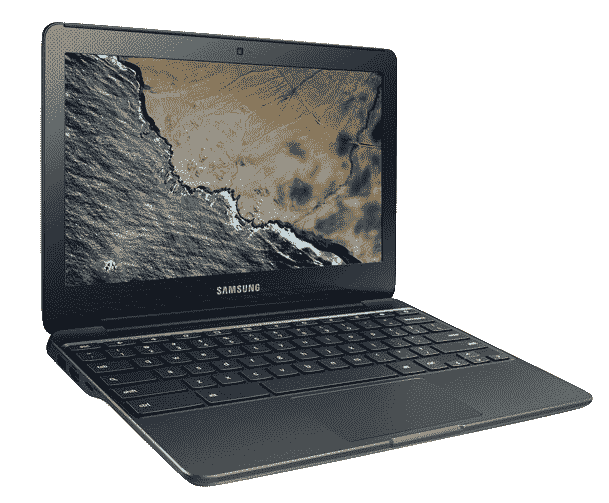
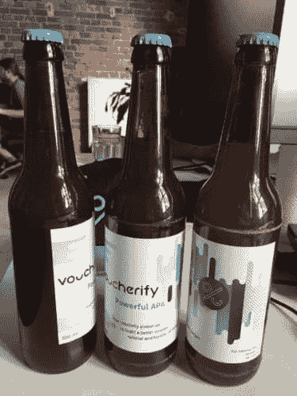

# 奖励开发者挑战

> 原文:[https://dev . to/msedzielewski/voucherify-developer-challenge-57m](https://dev.to/msedzielewski/voucherify-developer-challenge-57m)

**呼唤所有开发者！我们很高兴地宣布 [Voucherify](https://voucherify.io/?utm_campaign=challenge&utm_medium=Post&utm_source=devto) API 开发者挑战赛系列的开始。每个月我们都会宣布一个开发者挑战赛，最具原创性的应用将会获得一个 Chromebook，一些很酷的礼品，以及来自我们合作伙伴的代金券。**

我们的第一次[黑客马拉松](https://dev.to/msedzielewski/takeaways-from-our-first-hackathon-361)变成了一次令人惊叹的活动。这既有趣又是一个学习的机会。我们遇到了一些伟大的开发者，发现了我们平台中隐藏的错误，并发现了改进我们 API 的新方法。这让我们思考如何在更大范围内开展这种活动。由于我们只有少数几个开发者，我们决定把它放到网上。我们到了。所以，如果你:

*   想学习大量新的开发技能吗
*   可以在我们开发团队设计的疯狂条件下快速交付
*   迫不及待地想配置你全新的 Chromebook 的每一个小选项，你现在就应该参加比赛！

## 如何进入

每个月的第一天，我们都会在专门的[回购](https://github.com/voucherifyio/developer-challenge)中发布新的挑战。在截止日期前提交你的申请。在你的博客或 Github 上的 *readme.md* 中解释你的解决方案可以加分。

如果您有任何问题，请随时在 GH 上创建一个问题。

## 如何学习 Voucherify API

访问我们的开发者[文档](https://docs.voucherify.io/)和[支持](http://support.voucherify.io/)页面将有助于增加您对我们的 API 和仪表板的详细了解。一旦你浏览了快速入门指南，你可以看看文档中的[示例](https://docs.voucherify.io/docs/examples)和 [SDK](http://docs.voucherify.io/docs/sdks) 部分。

## 奖品

[T2】](https://res.cloudinary.com/practicaldev/image/fetch/s--YITMZsHR--/c_limit%2Cf_auto%2Cfl_progressive%2Cq_auto%2Cw_880/https://daks2k3a4ib2z.cloudfront.net/58fe5d0657dd045f17ae234e/5a0c2e92bb08cf0001089676_xe500c13k04us-gallery3-0502-2.png)

一个可破解的(阅读 Kenneth 的[配置](https://blog.lessonslearned.org/building-a-more-secure-development-chromebook/) ) [三星 Chromebook 3 11.6"](https://www.samsung.com/us/computing/chromebooks/under-12/chromebook-3-11-6---32gb-hdd--4gb-ram--xe500c13-k03us/)

规格:

*   英特尔赛扬 1.6 GHz
*   4 GB 内存
*   32 GB 存储空间
*   长达 11 小时的电池续航时间
*   2.54 磅(1.15 千克)重

另外:

*   进入荣誉名人堂
*   奖励赃物

## 第一次挑战在即

请在 [@voucherifyio](https://twitter.com/voucherifyio) 关注我们，或开始 [github repo](https://github.com/voucherifyio/developer-challenge) 以获得第一场比赛的通知。我们已经可以透露它将更加面向前端:)
干杯，
团队见证

[T2】](https://res.cloudinary.com/practicaldev/image/fetch/s--oeZEpOsU--/c_limit%2Cf_auto%2Cfl_progressive%2Cq_auto%2Cw_880/https://lh4.googleusercontent.com/toRCEaNLO_J1FHlNSnyQRQEaQzqXh0x2X9YSbU00WMUXy5jWP08zK9H2y8_1saTICHoQjayfWyswRnfWKoVGRXhvidw6xXR_QEHkB2OcLemsb3RHrkBLGStss7THxwhgIy3zeJJ6)