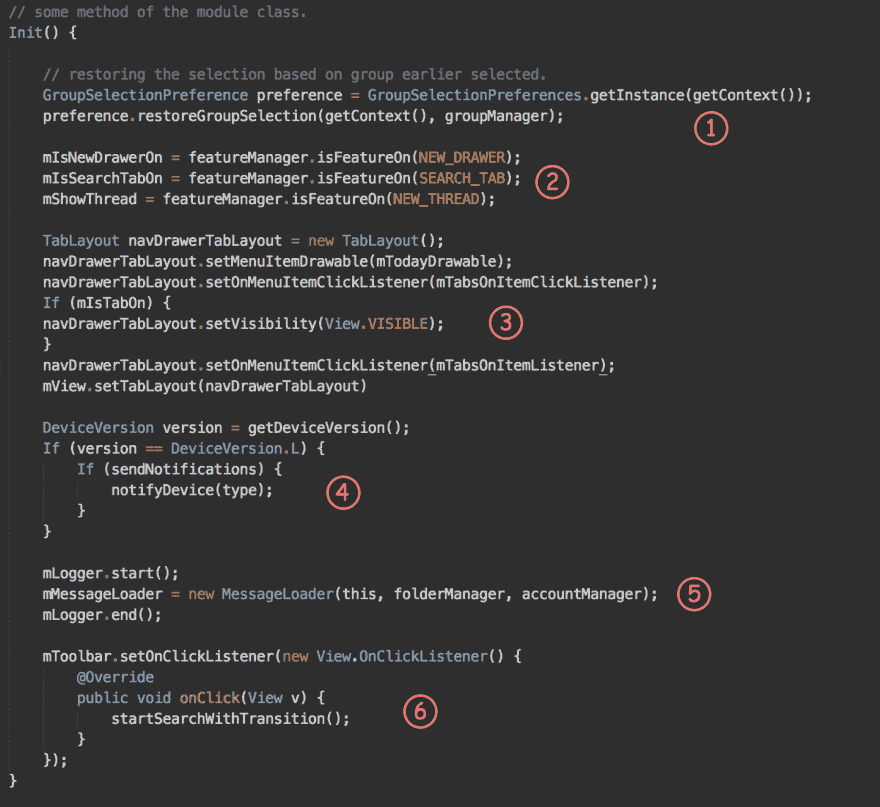
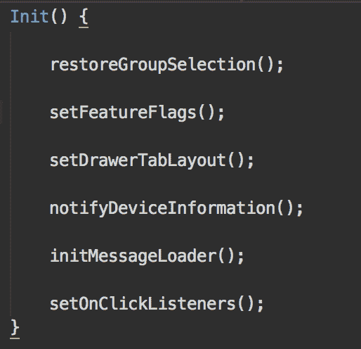

# 编写可读代码的最有效和最简单的方法。

> 原文:[https://dev . to/girish 3/most-effective-and-simple-way-to-write-readable-code-dph](https://dev.to/girish3/most-effective-and-simplest-way-to-write-readable-code-dph)

我们已经知道这条路，但可能出于懒惰，我们没有遵循它。这是最被低估的编写干净代码的方式，而且围绕它还有一种误解，这是完全不正确的，我稍后会谈到这一点。因此，它的*将代码分解成功能！*

我同意，我们的确将代码分解成功能，但并不像需要的那样频繁。让我们以下面的代码片段为例，它实际上是我以前公司的代码状态。让我们来看一下下面的每一点。

[T2】](https://res.cloudinary.com/practicaldev/image/fetch/s--JICJvPkD--/c_limit%2Cf_auto%2Cfl_progressive%2Cq_auto%2Cw_880/https://thepracticaldev.s3.amazonaws.com/i/92ikdxyb3siaguo5bpiw.jpg)

1.  看起来像是在恢复某种群体。尽管只有两行，但从中提取一个方法是有意义的。
2.  最初，这必须从一面旗帜开始。开发人员可能会想，为什么要为一行代码设置一个单独的方法呢！后来又增加了一面旗帜，然后又是一面。
3.  似乎我们正在为视图创建一个抽屉。为什么高级代码应该关心它是如何被初始化的？
4.  只有在阅读了 4 行代码之后，我才能够理解我们正在通知设备信息。我知道 4 行并不多，但这些东西可以跨越 10 行甚至 100 行。最好提取出一个方法。
5.  登录一个阅读流是非常低效的。去开房吧！
6.  所有侦听器都应该在一个方法中单独设置。

做了一些重构之后。

[T2】](https://res.cloudinary.com/practicaldev/image/fetch/s--S0LYnwgR--/c_limit%2Cf_auto%2Cfl_progressive%2Cq_auto%2Cw_880/https://thepracticaldev.s3.amazonaws.com/i/p7ej1npciqjbgcf74xfz.png)

看看高级代码现在看起来有多美。它很容易滚动浏览，而不会陷入不必要的细节。定义良好的方法名也不需要任何注释！！

### 遵循提示

*   不要用烦人的初始化或复杂的条件污染阅读流程。
*   定义短方法。它们更容易推理，流程更明显，范围更短，副作用更明显。
*   使代码的大部分读取部分都是声明性的。

在现有方法中添加两行总是很容易的。但是一定要注意添加的修改上面和下面的代码是否需要自己的空间，如果是，那么就从中提取一个方法。每一组逻辑必须被恰当地捆绑在一个方法中，这样未来的贡献者将乐于在各自的方法中添加变化。

### 结论

像许多人声称的那样，方法数量的增加会损害性能吗？这是一种误解，几乎在所有情况下，这种影响都可以忽略不计，甚至不值得担心。如果你在基于 JVM 的语言上工作，那么让我告诉你 JVM 是一个很棒的软件(它可能比 Java 更持久！)内置了许多真正令人惊叹的运行时优化。所以，分解一下...

> 代码就像幽默。当你不得不解释它的时候，它是糟糕的。—科里屋