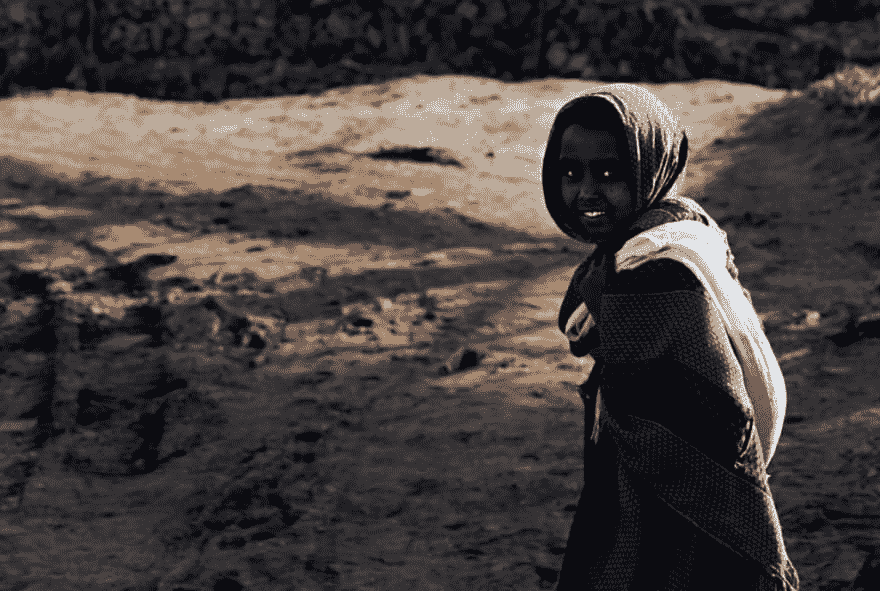
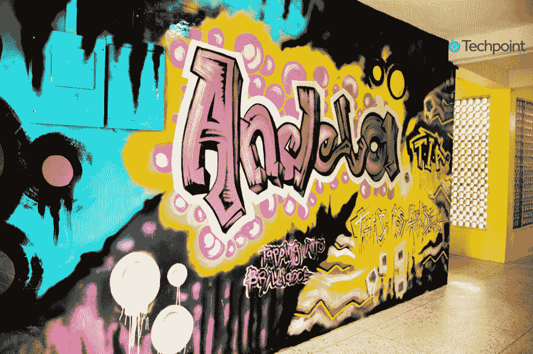
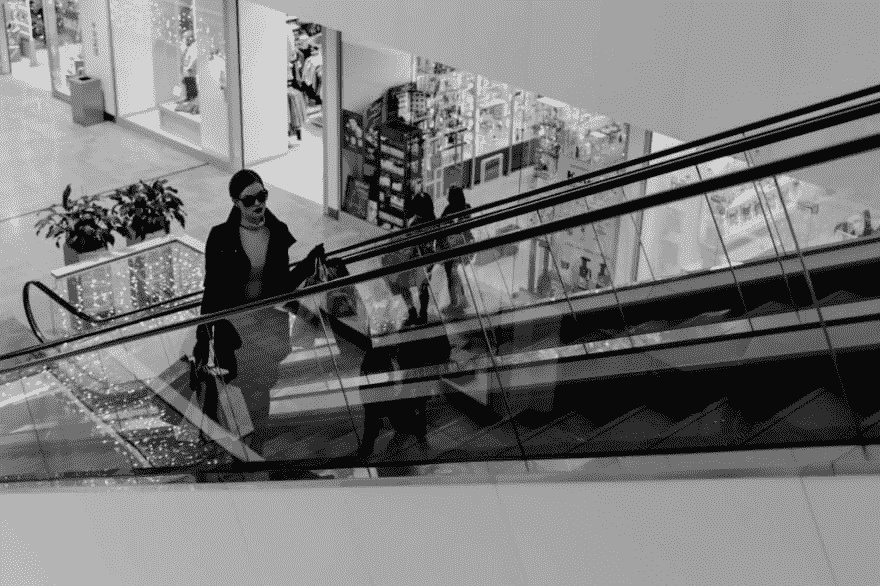

# 和安德拉一起从纳达到普拉达

> 原文:[https://dev.to/hanmaslah/from-nada-to-prada-with-andela-960](https://dev.to/hanmaslah/from-nada-to-prada-with-andela-960)

有这么多关于安德拉的闲聊。有些人是基于谣言或无法参加团契的痛苦而谈论，而其他人则是基于事实。我要写安德拉对我意味着什么。

[T2】](https://res.cloudinary.com/practicaldev/image/fetch/s--I4SLrVtv--/c_limit%2Cf_auto%2Cfl_progressive%2Cq_auto%2Cw_880/https://cdn-images-1.medium.com/max/1024/0%2AhgAZFqFOtipZrRAI.)

来源:pixabay.com

我是一个在家里出生的农村女孩，由当地的助产士接生。我是吃红薯和南瓜长大的，在毕业去乌加利之前，我吃的是当地的蔬菜，比如萨拉库什(T1)和 T2 姆纳武(T3)。我在一棵树下上幼儿园，在我的第一堂课上，我们经常在地上写字。为了计数，我们使用了木棍和由泥土制成的小球，当地人称之为 *sokota* 。上学对我来说是例行公事。这是一个孩子在被嫁出去之前被带走 8 年的地方。哦，是的，在 Kwale，女孩早在 12 岁就出嫁了。

在我的村子里，发生了许多事情。其中一些是可怕的事情，如种族冲突，迫使我和我的家人在蒙巴萨寻求庇护。我 11 岁时被带到寄宿学校，老师们不能接受我，因为我太小，我的父母在县城之外。长话短说，我回到了蒙巴萨，回到了 7 班的寄宿学校。尽管胜算不大，但我在国考中表现得非常好。我被肯尼亚顶级国立学校利穆鲁的洛雷托高中录取。我一直想成为一名工程师，因为我认为我有这个基因，我父亲也支持我。(不知何故，我认为我的曾祖父之一是一名修理工，也就是工程师)。不幸的是，我没有达到我想要的工程学分数。

时间过得很快，选择学位课程的最后期限就要到了。我没有想到任何我喜欢的其他课程。碰巧有一个我喜欢的家伙，他有一台电脑，并允许我用它来选择课程。他选择了计算机科学和数学，我心中的爱告诉我在另一所大学选择计算机科学。这样，我们就有希望在某个校际论坛上见面。老实说，我不知道我在想什么。当我想起我生命中的那段时光时，我仍然会咯咯地笑。不幸的是，他在第一年的第一个学期又有了另一个女朋友，我看着我们的爱情渐渐淡去。

当我离开校园的时候，我去了蒙巴萨和父亲住在一起。每天上班前，他都会问我:“以你的学历，能在什么样的公司工作？”每一次，我都给他同样的答案；“任何有电脑的公司。”他很关心我，并告诉我他有一些做印刷和复印生意的朋友。我让他在我尝试自由职业的时候耐心点。我害怕我会变得像村里的其他女孩一样，她们拥有大学学位，却被留在家里生孩子，照顾丈夫。

[T2】](https://res.cloudinary.com/practicaldev/image/fetch/s--g17hJMLv--/c_limit%2Cf_auto%2Cfl_progressive%2Cq_auto%2Cw_880/https://cdn-images-1.medium.com/max/1024/0%2A0yD9hB6cC1tK4il7.)

这太令人沮丧了，因为我向不同的公司发出了 50 多份申请，没有一份回复我。有一天，我看到安德拉的邮件通知我，我被邀请参加面试。我觉得自己就像一个小号手在他的阁楼里释放忧郁，表达庆祝他一天的快乐的焦虑。(哇，我不知道这是什么意思，但在英语作文中听起来不错)。我一边载歌载舞庆祝，一边收拾我的笔记本电脑。我和父亲道别后，乘夜车去了内罗毕。我接受了采访，然后乘夜班汽车回到了蒙巴萨。是的，你说得对，这是一次漫长而又令人厌倦的旅行。几天后，我收到了参加两周训练营的邀请。我的第一反应是，我会住在哪里？我最多只去了内罗毕一天，我怎么熬过两周呢？幸运的是，我的一个校园朋友住在基贝拉，离安德拉的办公室很近。我请求和她呆两个星期，她同意了。一位非常好的女士，上帝保佑她的灵魂。训练营结束后，我被邀请加入团契。感觉就像一场梦。我怎么可能是被选中的人呢？我的机器有这么多问题？但我只是一个乡村女孩，我心想。这不可能发生——相信我，冒名顶替综合症是真的。

快进到一年后，我已经和两家很棒的公司合作过，其中一家是 Github。是的，世界领先的软件开发平台。该公司托管超过 7100 万个存储库，包括开源和商业存储库。好了，Github 已经说得够多了。我坐过飞机，不是一次两次。我去过这个国家和大陆以外的地方。我被邀请参加一个 Ruby 会议，作为专题讨论小组成员，还作为教练参加了一个 RailsGirls 在蒙巴萨的活动。

[T2】](https://res.cloudinary.com/practicaldev/image/fetch/s--TQOn2PCY--/c_limit%2Cf_auto%2Cfl_progressive%2Cq_auto%2Cw_880/https://cdn-images-1.medium.com/max/1024/1%2AFir2YRsmHM2FTV5RaebGZA.png)

现在，我想让你们想想村里的那个小女孩，她拿着一个红色的塑料容器，拿着煮好的木薯去学校。她没有书和笔，因为她不需要它们。她会在地上写字，唱童谣，直到该回家了。现在想想你在迪拜或阿姆斯特丹高端商场购物时遇到的另一位女士。她穿着一件路易威登双排扣皮革风衣，喷着 Shalimar 香水。(Daaaaaamn，我写这篇文章的时候都起鸡皮疙瘩了)。她是同一个乡村女孩，但这一次，她带着 MacBook 和谷歌 Pixel 2 手机。哦，不要忘了普拉达手袋(嗯，我的手机在外观上有点接近，我会得到其中一个手袋)。

这是安德拉。安德拉投资了我的潜力。安德拉教会了我很多，比我想象的还要多。不是在课堂上，而是让我有机会接触不同的文化，与聪明人分享想法。安德拉给了我一个与技术和企业家领域的知名人士共进晚餐的机会。安德拉不仅给了我希望，也给了整个村子希望。我现在可以去那个村庄，告诉那个男孩或女孩在学习上更加努力，因为他可以成为他想成为的任何人。安德拉给村里的年轻女孩带来了希望，她认为自己的生活会像她周围的其他妇女一样，为自己生下的孩子数量而竞争。安德拉拓展了我的思维。这就是安德拉对我的意义。