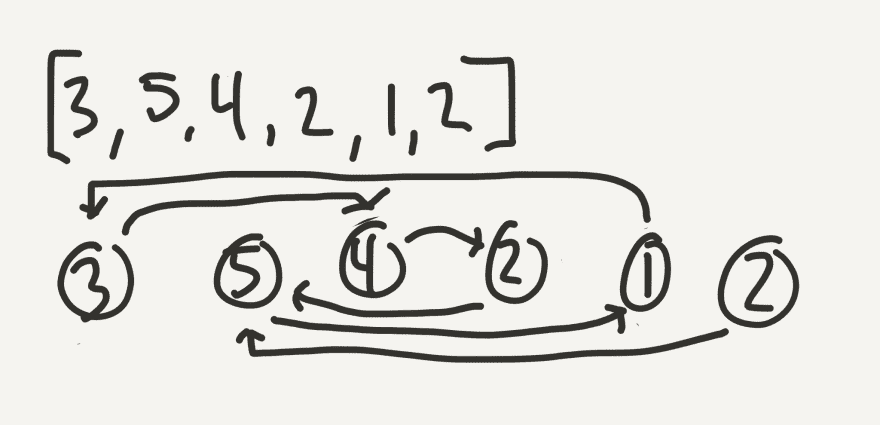
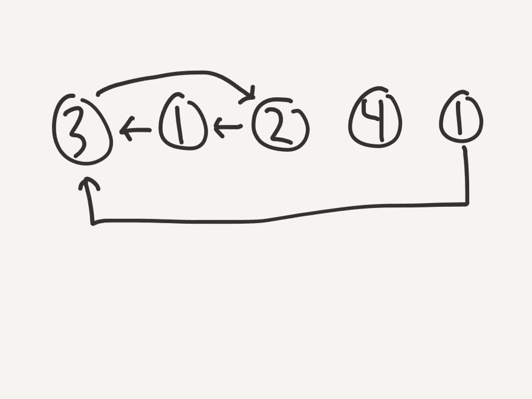
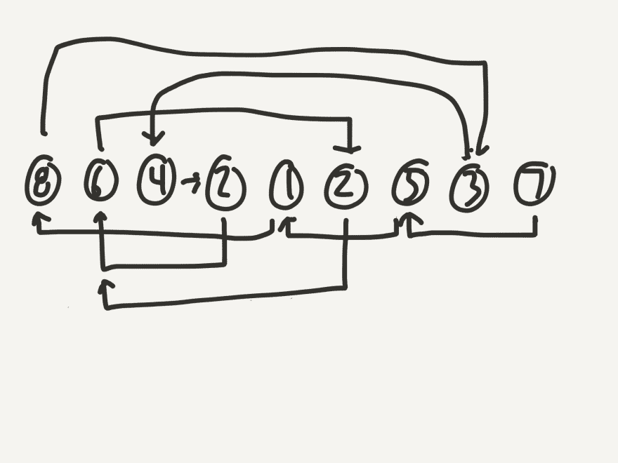
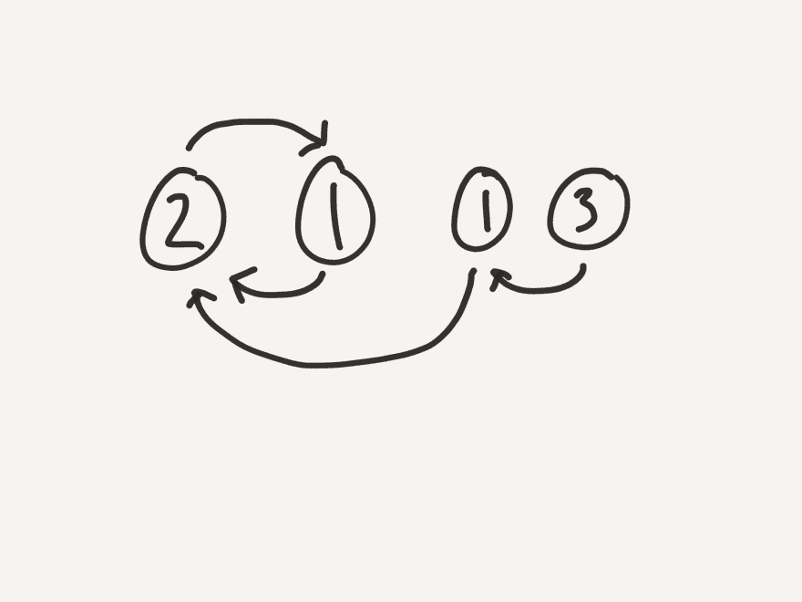
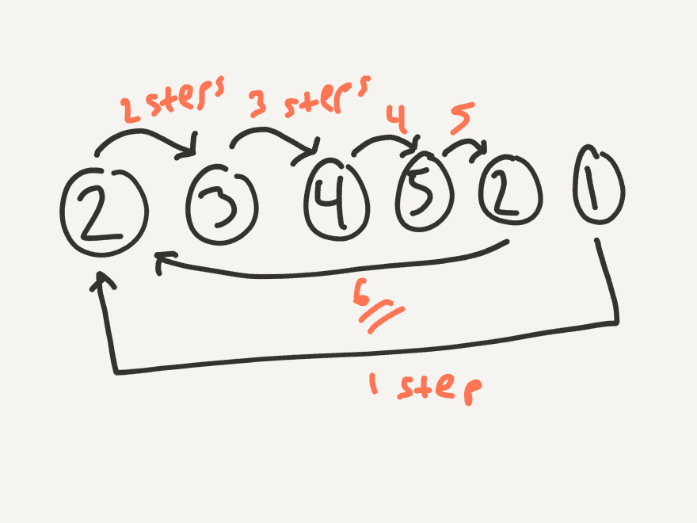
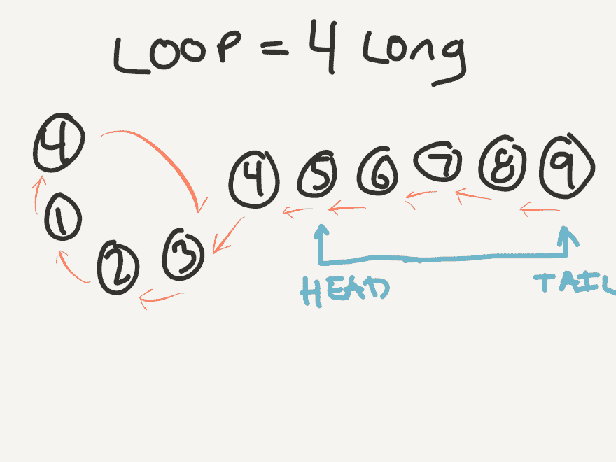
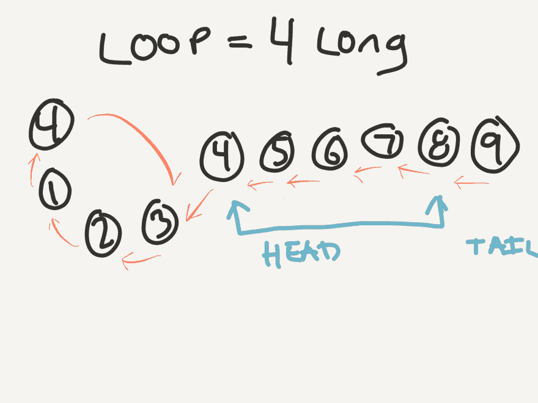
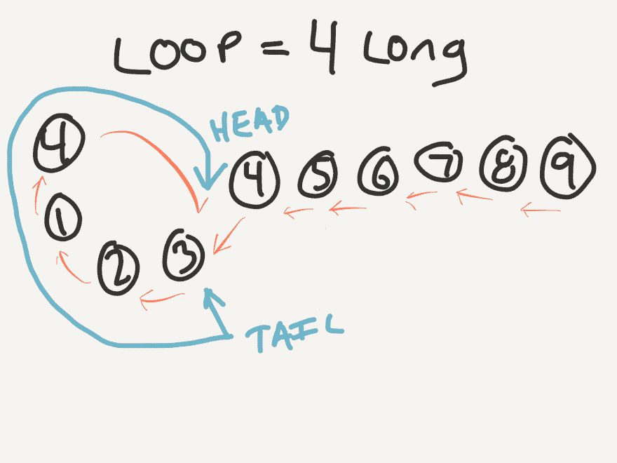

# 蛋糕和复制品

> 原文：<https://dev.to/rpalo/cake-and-duplicates-8gm>

*封面图片致谢:[简介](http://profroster.com)。有趣的事实:我们的团队帮助设计和制造了这些！*

让我和你谈谈蛋糕。饿了吗？很好。渴望**知识？！**更好。因为我说的不是你吃的蛋糕——我说的是[面试蛋糕](https://www.interviewcake.com/)。

[T2】](https://res.cloudinary.com/practicaldev/image/fetch/s--w_X0W_Uu--/c_limit%2Cf_auto%2Cfl_progressive%2Cq_auto%2Cw_880/https://assertnotmagic.com/img/interview-cake.jpg)

面试蛋糕是我最近发现的一个网站，它提供了大量技术面试水平的问题和评论，以帮助你更好地掌握算法、时间和空间效率、解释自己以及从头到尾思考问题，甚至超越粘性边缘案例。这是他们的广告吗？不，不是的。我还要继续用反问来烦你吗？可能吧。少管闲事。无论如何，这篇文章的目的是写一个我上周经历过的解决方案，它最初看起来很简单，结果却很难。他们的最终解决方案，至少在我看来，令人震惊。你没看错。我说

[T2】](https://res.cloudinary.com/practicaldev/image/fetch/s--1hYBWQ-k--/c_limit%2Cf_auto%2Cfl_progressive%2Cq_66%2Cw_880/https://assertnotmagic.com/img/mind-blasting.gif)

让我来给你解释一下这个问题。

## 问题

问题在于:

> 给你一个范围为 *(0，n】*(不包括 0，包括 n)的整数列表，填充一个数组，使得数组中有 *n + 1* 个数字。换句话说，除了一个重复的未知值之外，这个数组中的每个整数都有一个。数组中的数字没有任何特定的顺序。
> 
> 例:[4，3，7，1，5，3，2，6] : 8 个数字，1..7.唯一重复的是 3。
> 
> 你的目标是:找到复制品。

如果你觉得有勇气，那就去试试吧。这只是问题的第一部分，但它会帮助你进入游戏。

[T2】](https://res.cloudinary.com/practicaldev/image/fetch/s--kQXPmZP8--/c_limit%2Cf_auto%2Cfl_progressive%2Cq_66%2Cw_880/https://assertnotmagic.com/img/waiting.gif)

准备好您的解决方案了吗？以下是我的，供参考。

```
def find_duplicate(nums)
  nums.select { |num| nums.count(num) > 1 }.first
end 
```

好吧，就这样。这就是整件事，文章结束。开玩笑的。我忘了说:

## 剩下的问题

有趣的地方就在这里:问题的最后两个要求。

> 1.  Your solution must be more timely than that of O (n 2).
> 2.  Your solution must remain in space O(1).

为了确保每个人都同意我的意思，让我用 30 秒的时间解释一下*“Big-O Notation”*，这就是 O(n)和 O(1)的名称。如果你已经习惯了 Big-O，那就直接跳过来吧。

### 大 O 符号

*“Big-O Notation”*与算法或程序的效率有关，是用作输入的项目数量的函数。让我这么说吧:假设你的输入列表中有 n 个数字。如果你的解决方案要求你遍历整个列表一次(在最坏的情况下，比如你要找的数字在列表的末尾)，那么你的解决方案被认为是 O(n)。O(n)又称*线性效率*。这是因为，如果我们将`2*n`的输入大小增加一倍，您的算法将不得不处理两倍的步骤，并且很可能会慢两倍。如果我们将尺寸增加到`100*n`，你的算法将同样执行`100*n`步骤。

现在，如果你有一个 O(n^2 函数会怎么样？这意味着你的函数循环通过每个`n`输入`n`次(例如，在一个双 for 循环中)。因此，如果你有`2*n`输入，而不是`n`输入，你的程序实际上将不得不执行`(2*n)^2`或`4*n`步骤！如果你的程序有`100*n`个输入，它将不得不做`(100*n)^2`步— `10000*n`！希望你能看到 O(n)比 O(n^2).更有效率

那么 O(1)是什么意思呢？1 有点误导，因为它只是代表*常数时间*，这意味着无论你有多少输入，你的程序将总是采取相同的步骤，因此，大致相同的时间。这是算法的圣杯。这就是为什么从 Hash(或 dict，或 object，或任何你选择的语言称之为 Hash)中查找条目比从 List 或 Array 中查找要快得多的原因。

最后一件事:空间复杂性。空间复杂度和时间复杂度是一样的，除了它和你使用了多少计算机内存有关。一些例子可能会让事情变得更好。

O(1):当你有 10 个输入时，你的程序跟踪 3 个变量。当你有 20，000 个输入时，你的程序跟踪 3 个变量。

O(n):当你有 10 个输入时，你的程序跟踪两个独立的额外列表，总共 20 个插槽。当您有 20，000 个输入时，您需要 40，000 个额外的插槽来跟踪一切。

O(n^2)::当你有 10 个输入时，你需要 100 个额外的插槽。(别问我为什么，程序是你写的。似乎有些过头了)。当你有 20，000 个输入时，你最终需要 400，000，000 个额外的插槽(还需要一台新电脑，因为，恭喜你，你干掉了这台)。

希望这个超级简短的解释有所帮助。如果你仍然感到困惑，Vaidehi Joshi [用图片解释起来比我做得更好！](https://dev.to/vaidehijoshi/whats-a-linked-list-anyway-part-2)参见[整个 BaseCS 系列](https://medium.com/basecs)。另请参见 [BaseCS 播客](https://www.codenewbie.org/basecs)。

前进！

### 拒绝一些可能的解决方案

#### 可能性 1:天真的解决方案(又名我的解决方案)

那么这些需求对我们来说到底意味着什么呢？好吧，让我们回头看看我最初的解决方案。对于列表中的每一项，我再次返回列表*并计算出现的次数。我的功能实际上是 O(n^2)在时间(一个双循环！).*

[T2】](https://res.cloudinary.com/practicaldev/image/fetch/s--05yNllxP--/c_limit%2Cf_auto%2Cfl_progressive%2Cq_66%2Cw_880/https://assertnotmagic.com/img/boo.gif)

虽然您可能会认为我的解决方案对于大多数情况来说已经“足够好了”(我也同意)，但这并不是需求所说的我们必须要做的。

#### 可能性 2:另一个天真的解决方案(也叫跟踪)

你可以只循环一次，跟踪你在一个集合中已经看到的数字。一旦你看到一个数字已经在你的集合中，你知道这是重复的！

```
require 'set'

def find_dupes(nums)
  history = Set.new
  nums.each do |num|
    return num if history.include?(num)

    history << num
  end

  return -1  # We should never reach this stage
end 
```

我们表现如何？我们最多只遍历一次整个列表，时间复杂度为 O(n)。好极了。但是我们创建的`history`集合可以包含(在最坏的情况下)几乎所有的输入值`n`。这看起来也像空间中的 O(n ),这意味着我们不满足第二个要求。💩！

#### 可能性 3:排序解决方案(又称为稍微棘手的解决方案)

做一个**排序**怎么样？由于排序[可以在 O(nlogn)时间](https://en.wikipedia.org/wiki/Merge_sort)内完成，这比 O(n^2 好)，我们可能有机会。我们可以对数字进行排序，然后循环一次，同时只跟踪我们看到的最后一个数字。如果我们看到同一个数字两次，那就是重复的。

```
def find_dupes(nums)
  nums.sort!
  previous = 0
  nums.each do |num|
    return num if num == previous

    previous = num
  end

  return -1
end 
```

这使我们在空间上得到 O(1)，在时间上得到 O(nlogn) (ish)。这有一个问题。如果我们不创建一个新的数组来存放排序后的数字，我们就破坏/修改了传递给我们的列表的顺序，这是不好的。如果我们创建一个新的数组来存放排序后的数字，我们会跳到空间中的 O(n ),这是失败的。嗯……有更好的方法——相信我。

## 更好的方法

好的。这是他们提供的解决方案。里面有一些 CS 的概念，不过不用担心。我会带你走过去。我想我一百万年都不会想到这个，但我想这就是我们练习的原因，对吗？

### 链表(排序)

好的。帮我一个忙，把输入列表想象成一系列连接的节点:一个链表，如果你愿意的话。数组中的每个槽都有自己的索引和指向列表中另一个节点的索引的编号。面试蛋糕的原始问题是基于 1 基数组的，所以我也将这样解释。因此，我们最终会得到这样的结果:

[T2】](https://res.cloudinary.com/practicaldev/image/fetch/s--Dh_5U_6h--/c_limit%2Cf_auto%2Cfl_progressive%2Cq_auto%2Cw_880/https://assertnotmagic.com/img/cake-node-list.jpg)

花一分钟研究一下这个列表。拿一张纸和一支铅笔，试着多做一些。[3, 1, 2, 4, 1].[8, 6, 4, 2, 1, 2, 5, 3, 7].[2, 1, 1, 3].那些看起来像什么？你开始看到模式了吗？我是说，除了我不擅长手绘的模式之外？

[T2】](https://res.cloudinary.com/practicaldev/image/fetch/s--jStkEeIG--/c_limit%2Cf_auto%2Cfl_progressive%2Cq_auto%2Cw_880/https://assertnotmagic.com/img/cake-nodes-2.PNG)

[T2】](https://res.cloudinary.com/practicaldev/image/fetch/s--ehKmg3O1--/c_limit%2Cf_auto%2Cfl_progressive%2Cq_auto%2Cw_880/https://assertnotmagic.com/img/cake-nodes-3.PNG)

[T2】](https://res.cloudinary.com/practicaldev/image/fetch/s--QD44lacu--/c_limit%2Cf_auto%2Cfl_progressive%2Cq_auto%2Cw_880/https://assertnotmagic.com/img/cake-nodes-4.PNG)

以下是一些需要注意的事项:

1.  最后一个节点永远不会有指向它的箭头。那是因为它在位置`n+1`，列表中最大值是`n`。如果我们把我们的数组想象成一种链表，那么最后一个节点将是**头**的一个很好的候选。
2.  因为总是有一个副本，所以在列表的某个地方**总是有一个循环。在某一点上，每个图都变成了循环的。**
3.  因为总有一个循环，总有一个节点有**两个箭头指向它**。
4.  这个有两个箭头指向的节点总是循环中的第一个节点**。**
5.  这个双箭头节点的索引(从 1 开始)是**总是重复值**。

[T2】](https://res.cloudinary.com/practicaldev/image/fetch/s--chTv51De--/c_limit%2Cf_auto%2Cfl_progressive%2Cq_66%2Cw_880/https://assertnotmagic.com/img/cake-oh-my.gif)

那这对我们有什么帮助呢？好吧，如果我们能找到一种方法来计算出循环的起点在哪里，我们可以返回那个节点的索引作为我们的结果。

### 寻找周期的长度

为了找到循环的起点，我们需要它的长度。相信我，过一会儿就有意义了。这实际上没有你想象的那么难。为了获得周期的长度，我们需要一个万无一失的方法来进入周期。我们只有一定数量的节点，对吗？所以，如果我们只是开始步进，我们可能会在某个时候结束循环，但在`n+1`步之后，我们**保证**会在循环中的某个地方。因为，即使这个循环是这样的整个列表的大小:

[T2】](https://res.cloudinary.com/practicaldev/image/fetch/s--90COEEcq--/c_limit%2Cf_auto%2Cfl_progressive%2Cq_auto%2Cw_880/https://assertnotmagic.com/img/cake-cycle-length.png)

在创建循环之前，您仍然只能到每个节点一次。我会尽量展示我们正在构建的解决方案。如果你必须看到用代码写出来的东西，希望这能帮到你。

```
class DuplicateFinder
  def initialize(nums)
    @nums = nums
  end

  def step(current)
    # Convenience method to move to next node
    @nums[current - 1]  # -1 because of 1-based counting
  end

  def find_a_number_in_the_cycle
    next_step = @nums.last
    @nums.length.times do
      next_step = step(next_step)
    end
    next_step  # Returns the number at the index we're on
  end
end 
```

好的。现在我们进入了循环，我们该怎么办？嗯，在周期内，数字都是唯一的！所以我们要做的就是记住我们最初所在的节点，并开始步进和计数。一旦我们再次看到相同的数字，我们就会知道我们正好走了一圈，我们就会知道这个圈有多长！

```
class DuplicateFinder
  # ...

  def length_of_cycle
    stop_num = find_a_number_in_the_cycle
    next_num = step(stop_num)
    steps = 1
    until next_num == stop_num
      next_num = step(next_num)
      steps += 1
    end
    steps
  end 
```

### 准绳法

现在我们到了真正精彩的部分。它与某种可以被称为标尺法的东西有关(或者，我想，如果你一定要的话，也可以称为米棒法😉).让我们回到列表的开头，重新开始。比如说。假设我们有一个列表`[4, 1, 2, 3, 4, 5, 6, 7, 8, 9]`。如果你把它画出来，周期是 4 个节点长。所以，我们需要做的是，想象我们有一个 4 节点长的棍子，就像周期一样。我们可以通过使用两个*指针*将它翻译成代码:一个在棍子的头部，一个在尾部。

[T2】](https://res.cloudinary.com/practicaldev/image/fetch/s--Q5grplsq--/c_limit%2Cf_auto%2Cfl_progressive%2Cq_auto%2Cw_880/https://assertnotmagic.com/img/yardstick3.png)

现在我们将整个棍子向前移动一个节点，移动头部和尾部，所以棍子保持相同的长度。

[T2】](https://res.cloudinary.com/practicaldev/image/fetch/s--doYF-1QW--/c_limit%2Cf_auto%2Cfl_progressive%2Cq_auto%2Cw_880/https://assertnotmagic.com/img/yardstick4.png)

如果我们继续这个过程会发生什么？

[T2】](https://res.cloudinary.com/practicaldev/image/fetch/s--W0U0walt--/c_limit%2Cf_auto%2Cfl_progressive%2Cq_auto%2Cw_880/https://assertnotmagic.com/img/yardstick5.png)

棍子的头和尾都指向同一个数字！而且是循环开头带两个箭头的数字！它们在什么索引处相遇(从 1 开始，就像我们的链表)？指数 4！那么我们列表中重复的数字是多少呢？4!

[T2】](https://res.cloudinary.com/practicaldev/image/fetch/s--PJUIFIRe--/c_limit%2Cf_auto%2Cfl_progressive%2Cq_66%2Cw_880/https://assertnotmagic.com/img/mission-accomplished.gif)

为了完整起见，这在代码中看起来如何？

```
class DuplicateFinder
  def initialize(nums)
    @nums = nums
  end

  def step(current)
    @nums[current - 1]
  end

  def find_a_number_in_the_cycle
    next_step = @nums.last
    @nums.length.times do
      next_step = step(next_step)
    end
    next_step
  end

  def length_of_cycle
    stop_num = find_a_number_in_the_cycle
    next_num = step(stop_num)
    steps = 1
    until next_num == stop_num
      next_num = step(next_num)
      steps += 1
    end
    steps
  end

  def duplicate
    stick = length_of_cycle
    head = @nums.last
    tail = @nums.last
    stick.times { head = step(head) }
    until head == tail
      head = step(head)
      tail = step(tail)
    end
    # When head and tail point to the same number
    # then on the next step, they'll be on the same node
    # This current same number means head and tail both = the duplicate!
    head
  end
end 
```

## 评价

我们表现如何？

**Space** :我们通常会跟踪下一个要跳转到的节点，以及其他一些变量，但是我想我们可以有把握地说我们的空间使用量是~O(1)。我们从不在任何地方保存数组的副本。

**Time** :我们循环一次，找出循环的长度，然后再循环一次，找出重复的。这使我们达到~O(n ),因为不管输入长度如何，我们总是在数组中循环相同的次数，这只是数组有多长的问题。

胜利。这是一个非常棘手的问题。如果没有意义，那不是你的错。我不得不通读几遍，做题几遍，甚至写了这篇博文，才完全理解它是如何工作的。如果我能帮你澄清什么，请随时提问。再一次，去看看[面试蛋糕](https://interviewcake.com)做更多像这样的谜题练习(尽管它们并不都像这个一样棘手)。

* * *

*原帖 [`assert_not magic?`](https://assertnotmagic.com/2017/11/14/cake-and-duplicates/)*