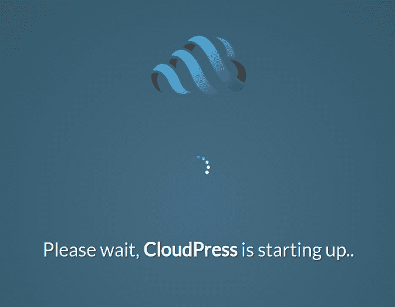

# 第二部分:CMX，JSX 的用户友好版本！

> 原文:[https://dev . to/voodoo attack/cloud press part-2-cmx-the-user-friendly-variant-of-jsx-boo](https://dev.to/voodooattack/cloudpresspart-2-cmx-the-user-friendly-variant-of-jsx-boo)

[先前的](https://dev.to/voodooattack/cloudpresspart-1-how-to-reinvent-a-better-wheel-bo2)

* * *

[T2】](https://res.cloudinary.com/practicaldev/image/fetch/s--qpqeQcch--/c_limit%2Cf_auto%2Cfl_progressive%2Cq_auto%2Cw_880/https://thepracticaldev.s3.amazonaws.com/i/0jt3smvo1rrr5tsccazh.png)

在我的上一篇文章中，我谈到了 CloudPress，这是一个新的内容管理系统，我在过去的一年中一直在开发它。我谈到了插件架构和系统如何工作。今天，我将向您介绍几项新技术，这些技术是我在过去一周内实现的。

# CMX:用户友好的标准化标记，为了更好的未来

CMX 是 JSX 的副产品。它们的语法本质上是相同的，只有一个关键的区别:在 CMX，值被评估为 JSON 数据；而不是 JavaScript 表达式。

一个 CMX 页面的例子应该是这样的:

```
<Document>
  <div className="container">
    <style dangerouslySetInnerHTML={{ __html: `
      /* multi-line styles, CMX supports template strings! */
      body { background-color: #eee; }
    ` }} />
    
    {/* this is a comment*/}
    <CustomComponent cssBreakpoints={[320, 768, 1224]} trueProp customConfig={{
        testProp: 10,
        object: { string: "test" }
      }}></CustomComponent>
  </div>
</Document> 
```

<svg width="20px" height="20px" viewBox="0 0 24 24" class="highlight-action crayons-icon highlight-action--fullscreen-on"><title>Enter fullscreen mode</title></svg> <svg width="20px" height="20px" viewBox="0 0 24 24" class="highlight-action crayons-icon highlight-action--fullscreen-off"><title>Exit fullscreen mode</title></svg>

这将输出下面的 HTML:

```
<span><div class="container"><style>
  /* multi-line styles, CMX supports template strings! */
  body { background-color: #eee; }
</style></div></span> 
```

<svg width="20px" height="20px" viewBox="0 0 24 24" class="highlight-action crayons-icon highlight-action--fullscreen-on"><title>Enter fullscreen mode</title></svg> <svg width="20px" height="20px" viewBox="0 0 24 24" class="highlight-action crayons-icon highlight-action--fullscreen-off"><title>Exit fullscreen mode</title></svg>

如果你不熟悉 JSX，你可能会想，`Document`和`CustomComponent`不是标准的 HTML 元素。那么它们是什么呢？

我的回答是它们是定制的组件。它们是通过插件向系统注册的 React 组件。他们的行为就像 WordPress 中的*简码*。尽管在我看来它们更适合 HTML。

组件通过 GraphQL 访问系统，它们可以通过调用突变来查询数据或执行操作。这给了插件开发者一个与系统交互的非常强大的工具。它们也是同构的，应该在服务器上呈现，就像在浏览器中呈现一样。

CMX 的另一个值得注意的(尽管可能过于技术化)特性是它允许正则表达式文字在 props 中传递。

* * *

# GraphQLDatabaseLoader

我昨天完成的另一项技术是`GraphQLDatabaseLoader`，它是一个构建在 [TypeORM](http://typeorm.io) 之上的缓存加载器，可以将一组不同的数据库查询合并成一个单一的查询。

如果你看看脸书的数据加载器库，你会发现一个明显的问题:它太普通了。正如你在下面的例子中看到的:

```
const userLoader = new DataLoader(keys => myBatchGetUsers(keys));
userLoader.load(1)
  .then(user => userLoader.load(user.invitedByID))
  .then(invitedBy => console.log(`User 1 was invited by ${invitedBy}`)); 
```

<svg width="20px" height="20px" viewBox="0 0 24 24" class="highlight-action crayons-icon highlight-action--fullscreen-on"><title>Enter fullscreen mode</title></svg> <svg width="20px" height="20px" viewBox="0 0 24 24" class="highlight-action crayons-icon highlight-action--fullscreen-off"><title>Exit fullscreen mode</title></svg>

它只能通过 id 加载项目，这很好，但是在我们的用例中它严重地限制了我们。

例如:如果您将它与 GraphQL 和 SQL 数据库一起使用(这是许多人都会遇到的情况)，它不允许您像平常一样优化查询。(使用类似于[加入怪物](https://github.com/stems/join-monster)的例子)

使用提供给 GraphQL 解析器的`GraphQLResolveInfo`参数，可以使用它精确地查询所需的数据。不多也不少。SELECT 语句可以精确地选择查询的内容并将其返回。然而，使用脸书的数据加载器，你根本无法利用这些信息，因为缓存(想想看，如果一个传入的请求需要一个字段，而它不在缓存中，会发生什么)和一千个其他原因。

另一个限制是:如果查询想通过一个字段而不是 ID 来查找一些东西，该怎么办？或许是子弹？

这对我来说是不可接受的，在我实施自己的解决方案之前，我必须停下来好好思考这个问题。

`GraphQLDatabaseLoader`支持数据库和 GraphQL。它将在一个事件循环周期内把从所有来源(比如 GraphQL 解析器、koa 中间件等等)收到的所有数据库请求合并成一个数据库请求，并在此基础上缓存结果。

例如，对于这样的查询:

```
query  {  user1:  node(id:  "VXNlcjox")  {  __typename  id  ...UserFragment  }  hello_world:  node(id:  "UGFnZTox")  {  __typename  id  ...PageFragment  }  test2:  lookupPageBySlug(slug:  "test2")  {  __typename  id  content  ...PageFragment  }  }  fragment  PageFragment  on  Page  {  title  excerpt  slug  author  {  name  }  }  fragment  UserFragment  on  User  {  name  username  email  } 
```

<svg width="20px" height="20px" viewBox="0 0 24 24" class="highlight-action crayons-icon highlight-action--fullscreen-on"><title>Enter fullscreen mode</title></svg> <svg width="20px" height="20px" viewBox="0 0 24 24" class="highlight-action crayons-icon highlight-action--fullscreen-off"><title>Exit fullscreen mode</title></svg>

这 **3** 个不同的 GraphQL 查询将产生正好 1 个数据库查询，其中一个将**选择**正好所需的字段:

```
SELECT
        "Page0"."id" AS "Page0_id",
        "Page0"."title" AS "Page0_title",
        "Page0"."slug" AS "Page0_slug",
        "Page0"."content" AS "Page0_content",
        "Page0"."excerpt" AS "Page0_excerpt",
        "Page0_author"."name" AS "Page0_author_name",
        "User1"."id" AS "User1_id",
        "User1"."name" AS "User1_name",
        "User1"."username" AS "User1_username",
        "User1"."email" AS "User1_email",
        "Page2"."id" AS "Page2_id",
        "Page2"."title" AS "Page2_title",
        "Page2"."slug" AS "Page2_slug",
        "Page2"."excerpt" AS "Page2_excerpt",
        "Page2_author"."name" AS "Page2_author_name",
        "74d5c2aed587be81c9d67117dc60afd8" AS "Page0_KEY",
        "bdeac7ffad7e49ac60b1ab6c123e4f85" AS "User1_KEY",
        "d81c9566475e497a46b39e00d0826e3c" AS "Page2_KEY" 
    FROM
        "page" "Page",
        "user" "User",
        "page" "Page" 
    LEFT JOIN
        "page" "Page0" 
            ON (
                "Page0"."slug"=$1
            )  
    LEFT JOIN
        "user" "Page0_author" 
            ON "Page0_author"."id"="Page0"."authorId"  
    LEFT JOIN
        "user" "User1" 
            ON (
                "User1"."id"=$2
            )  
    LEFT JOIN
        "page" "Page2" 
            ON (
                "Page2"."id"=$3
            )  
    LEFT JOIN
        "user" "Page2_author" 
            ON "Page2_author"."id"="Page2"."authorId" 
```

<svg width="20px" height="20px" viewBox="0 0 24 24" class="highlight-action crayons-icon highlight-action--fullscreen-on"><title>Enter fullscreen mode</title></svg> <svg width="20px" height="20px" viewBox="0 0 24 24" class="highlight-action crayons-icon highlight-action--fullscreen-off"><title>Exit fullscreen mode</title></svg>

并返回结果:

```
{  "data":  {  "user1":  {  "__typename":  "User",  "id":  "VXNlcjox",  "name":  "Abdullah",  "username":  "voodooattack",  "email":  "voodooattack@hotmail.com"  },  "hello_world":  {  "__typename":  "Page",  "id":  "UGFnZTox",  "title":  "Welcome to CloudPress!",  "excerpt":  "test",  "slug":  "hello-world",  "author":  {  "name":  "Abdullah"  }  },  "test2":  {  "__typename":  "Page",  "id":  "UGFnZToy",  "content":  "<Document>\n <div className=\"container\">\n <style dangerouslySetInnerHTML={{ __html: `\n /* multi-line styles, CMX supports template strings! */\n body { background-color: #eee; }\n ` }} />\n \n {/* this is a comment*/}\n <CustomComponent cssBreakpoints={[320, 768, 1224]} trueProp customConfig={{\n testProp: 10,\n object: { string: \"test\" }\n }}></CustomComponent>\n </div>\n</Document>",  "title":  "test 2",  "excerpt":  "",  "slug":  "test2",  "author":  {  "name":  "Abdullah"  }  }  }  } 
```

<svg width="20px" height="20px" viewBox="0 0 24 24" class="highlight-action crayons-icon highlight-action--fullscreen-on"><title>Enter fullscreen mode</title></svg> <svg width="20px" height="20px" viewBox="0 0 24 24" class="highlight-action crayons-icon highlight-action--fullscreen-off"><title>Exit fullscreen mode</title></svg>

我希望您注意的部分是查询的这一部分:

```
"74d5c2aed587be81c9d67117dc60afd8" AS "Page0_KEY",
"bdeac7ffad7e49ac60b1ab6c123e4f85" AS "User1_KEY",
"d81c9566475e497a46b39e00d0826e3c" AS "Page2_KEY" 
```

<svg width="20px" height="20px" viewBox="0 0 24 24" class="highlight-action crayons-icon highlight-action--fullscreen-on"><title>Enter fullscreen mode</title></svg> <svg width="20px" height="20px" viewBox="0 0 24 24" class="highlight-action crayons-icon highlight-action--fullscreen-off"><title>Exit fullscreen mode</title></svg>

这些是用于破坏缓存的哈希。每个查询都被散列，并在加载器的缓存中分配一个键，就像这样:

```
/**
 * Load a model from the database.
 * @param where Query conditions.
 * @param {GraphQLResolveInfo} info GraphQL resolver information argument.
 * @param {IModelInfo} modelInfo The model type to load.
 * @returns {Promise<T>}
 */
async load<T>(where: any, info: GraphQLResolveInfo, modelInfo: IModelInfo): Promise<T|undefined> {
  const fields = graphqlFields(info);
  const hash = crypto.createHash('md5');
  const key = hash.update(JSON.stringify({ where, fields })).digest().toString('hex');
  if (key in this._cache)
    return this._cache[key];
  ... 
```

<svg width="20px" height="20px" viewBox="0 0 24 24" class="highlight-action crayons-icon highlight-action--fullscreen-on"><title>Enter fullscreen mode</title></svg> <svg width="20px" height="20px" viewBox="0 0 24 24" class="highlight-action crayons-icon highlight-action--fullscreen-off"><title>Exit fullscreen mode</title></svg>

如果在缓存表中找到查询哈希，则返回缓存的值。

我差点忘了说，每个 HTTP 请求都有自己的`GraphQLDatabaseLoader`，所以用户会话之间不会发生冲突或泄漏。
目前就这些！

编辑:这是 npm 上的一个独立包:[类型表单加载器](https://www.npmjs.com/package/typeorm-loader)

* * *

在这一系列文章中，我希望能更多地讨论该项目的技术方面以及我所面临的挑战。我还会试着定期发布更新，未来的计划，并不断无耻地恳求人们为这个项目做出贡献。如果你有兴趣投稿(我真的需要帮助)，请不要犹豫，通过这里或者在 [Twitter](https://twitter.com/voodooattack) 上联系我。

下次见！