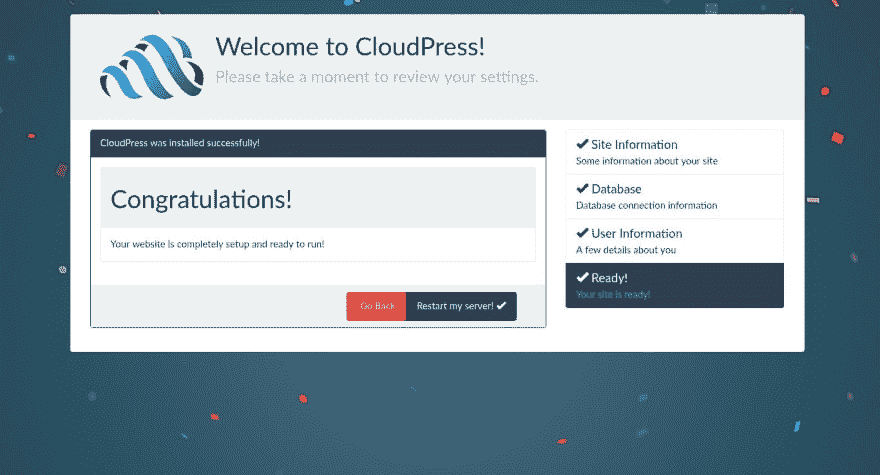

# 第 1 部分:如何再造一个更好的轮子！

> 原文:[https://dev . to/voodoo attack/cloud press part-1-how-to-reinvent-a-better-wheel-bo2](https://dev.to/voodooattack/cloudpresspart-1-how-to-reinvent-a-better-wheel-bo2)

前言:

我已经决定把我的文章从 Medium 转移到 dev.to，我刚刚发现这个平台，就立刻爱上了它。我相信这是一个更好的媒体(双关语)来发表科技行业的文章。(它在我的国家也没有被屏蔽，所以我的负担减轻了。)

老文章[可以在这里](https://medium.com/@voodooattack/cloudpress-part-1-how-to-reinvent-a-better-wheel-45d3d2fcc469)找到。

* * *

[T2】](https://res.cloudinary.com/practicaldev/image/fetch/s--8Xw3saih--/c_limit%2Cf_auto%2Cfl_progressive%2Cq_auto%2Cw_880/https://thepracticaldev.s3.amazonaws.com/i/6q6kz8rt10mxnhdcgmex.jpeg)

CloudPress 是一个新的内容管理系统，我在过去一年左右的时间里一直在断断续续地工作。到目前为止，它经历了多次演变，其中最大的一次是从普通 JavaScript 到 TypeScript 的迁移，考虑到该项目大约有 56，000 行 TypeScript 代码，这花费了大约一个月的时间。(不算评论和杂档。)

你可能会说“嘿，看，又一个愚蠢的 CMS 尝试，让我们看看这个能持续多久。”或者你可能会问，“为什么我们还需要另一个 CMS？”但是请听我说完。好吗？

在过去的十年里，我们在技术方面取得了惊人的巨大进步。我们现在有 React.js 和另外一百个虚拟 DOM 库，使得在客户机和服务器上运行同构/通用 JavaScript 成为可能。我们有 GraphQL，这是一个非常严格的数据加载和处理 API。我们有 CSS 模块。我们有各种各样的新玩具，但是网络在哪里？

根据这个来源，我们有 PHP 运行了整个网站的 82.9%。

我们让 WordPress 以 58.9%的市场份额领先 CMS。

甚至脸书本身(React 和 GraphQL 的发明者)也还在使用 PHP。

那么，谁在使用我们在过去几年中看到的惊人技术呢？

很少，零散的项目。例如:Vulcan.js 试图将 GraphQL 和同构服务器渲染引入 Meteor 旗舰版，并提供类似 CMS 的开发便利性，如果不是开箱即用的 CMS 功能的话。使用 Node.js 和那些很酷的技术构建的新兴内容管理系统相当多。虽然在我看来都处于发展初期，缺乏成熟度；有些人比我更固执己见。

但我看到的问题是。仍然困扰我的问题是，所有这些对普通人来说毫无意义。在您的最终用户和我们开发人员可以轻松部署的酷技术之间存在真正的障碍。

我们有一堆火箭零件，但没有火箭科学家在制造火箭。与此同时，最终用户被迫使用过时的技术，而且选择有限。

当然，除非他们拿出足够的钱从头开始开发定制解决方案。实际上，考虑到当今节点开发人员的平均工资，这是一项艰巨的任务。

所以我坐下来想:我有多个项目想法，它们有一个共同点:它们都需要一个可扩展的 CMS，一个非常动态和通用的 CMS。

可以无限扩展的东西。

就这样，一个计划浮现在脑海里；在看了我的选择之后，我决定从头开始建造一个来满足我的需求。我曾经做过一段时间的 WordPress 开发人员，我非常喜欢 WordPress 的一些设计理念。即过滤器和动作系统如何使它变得非常可扩展和简单。所以我决定从用 node 模拟 JavaScript 开始。

现在让我们进入技术层面。

当前的系统融合了 WordPress 的做事方式和我自己对这个主题的看法。CloudPress 不是一个全局的过滤器/动作系统，而是基于组件的。这意味着所有插件都继承了一个基类:Channel。

通道是基于事件的对象，支持过滤器和操作。如果你不熟悉 WordPress 中的过滤系统:这是一个单一值(或者在 CloudPress 中称为有效载荷)通过一系列中间件转发的系统。每个中间件(处理程序)都可以修改这个值或者完全覆盖它，然后调用下一个处理程序。

事实上，由于 CloudPress 中的中间件本质上是一个异步函数，它可以首先调用链的其余部分，然后修改值。这个系统是多功能的。

下面是一个插件(这里是渲染器插件，负责渲染页面)如何应用过滤器的例子:

```
/**
   * Renders and returns the HTML for a page.
   * @param renderInfo Information for the renderer.
   * @param renderContext Context data.
   * @returns {string}
   */
  async render(renderInfo: RenderInfo, renderContext: RenderContext) {
    const filterContext = { renderInfo, renderContext };
    const meta = await this.applyFilter('meta', { ...renderInfo.metaTags }, filterContext);
    const { graphql, bundle } = this.imports as any;
    const scripts: string[] = [], stylesheets: string[] = [];
    const bundles = new Set(renderInfo.bundles);
    if (bundles) {
      for (let name of bundles) {
        const item: IBundle = await bundle.regenerate(name);
        if (item.script)
          scripts.push(item.script);
        if (item.stylesheet)
          stylesheets.push(item.stylesheet);
      }
    }
    /**
     * The `browser-state` filter can be used to alter the state object on the client.
     */
    const state: any = await this.applyFilter('browser-state', {
      graphql: { endpoint: await graphql.endpoint() },
      initialState: {}
    }, filterContext);
    const component = React.createElement(
      ApolloProvider, renderContext, React.createElement(HtmlContainer, {
        title: renderInfo.title || await this.engine.configManager.readKey('site.title',
          'Welcome to cloudpress!'),
        meta,
        state,
        scripts: await this.applyFilter('page-scripts', scripts, filterContext),
        stylesheets: await this.applyFilter('page-stylesheets', stylesheets, filterContext)
      } as any, React.createElement(renderInfo.component, renderInfo.props))
    );
    try {
      await getDataFromTree(component);
    } catch(e) {
      if (e.queryErrors) {
        for(let error of e.queryErrors) {
          await this.log([error.message, error.stack], Severity.Error);
        }
      } else
        await this.log([e.message, e.stack], Severity.Error);
    }
    state.initialState = renderContext.store.getState();
    cleanupApolloState(state.initialState.apollo);
    /**
     * Plugins can use the `stream` filter to alter the final HTML stream.
     */
    return this.applyFilter('stream', ReactDOM.renderToNodeStream(component), filterContext);
  } 
```

下面是`browser`插件如何添加`viewport`元标签:

```
 await rendererPlugin.useFilter('meta', async (payload: Payload<any>, next: Function) => {
    // TODO: Make this configurable!
    payload.value.viewport = "width=device-width, initial-scale=1, maximum-scale=1";
    return await next();
  }); 
```

除了有效载荷的值，中间件还可以访问`payload.arguments`来访问原始函数的命名参数。这使得 CloudPress 插件可以很容易地修改彼此的行为。

这里要注意的另一件事是如何处理插件的相互依赖。每个插件都提供了一个工厂作为其主模块的输出。

```
import { IEngine, IPlugin, IPluginImports, IPluginFactory } from '@cloudpress/interfaces-core';
import { BrowserPlugin } from './browser';

const pkg = require('../package.json');

export default class BrowserFactory implements IPluginFactory {

  get name(): string { return 'Browser'; }
  get version(): string { return pkg.version; }
  get provides(): string { return 'browser'; }
  get consumes(): string[] { return ['bundle', 'router', 'redux', 'renderer', 'subscriptions']; }

  async createInstance(engine: IEngine, imports: IPluginImports): Promise<IPlugin> {
    return new BrowserPlugin(engine, imports);
  }

} 
```

工厂让系统知道该插件的需求和它提供的服务，系统将实例化该插件，并准备好和激活其导入的依赖项。例如，在`renderer`插件的情况下，它依赖于`bundle`、`graphql`和`redux`服务。它提供了`renderer`服务，该服务又被`router`服务用来服务请求。简而言之，一个插件可以提供单一的服务，也可以使用任意数量的服务。

此外(这里没有显示), Channel 基类继承了另一个。它继承了一个特殊的完全异步的基于承诺的`EventEmitter`。这意味着它将并行执行所有事件处理程序，并在返回之前执行从它们返回的任何承诺。这提供了类似 WordPress 动作的功能。

就像过滤器一样，您可以广播和订阅任何继承 Channel 的对象上的事件。

```
 async installLoadingScreen() {
    this.imports.server.on('install-middleware', async (app: Koa) => {
      await this.log('installing bundle routes');
      const outputDir = path.join(__dirname, '../assets');
      const endpoint = '/plugin-bootstrap/assets/';
      app.use(async (ctx: Koa.Context, next: Function) => {
        if (ctx.path.startsWith(endpoint)) {
          const filePath = ctx.path.substring(endpoint.length);
          return await send(ctx, filePath, { root: outputDir });
        } else
          return await next();
      });
      app.use(async (ctx: Koa.Context, next: Function) => {
        if (!this._ready && ctx.path == '/' && ctx.method == 'GET')
          await send(ctx, 'loader.html', { root: outputDir });
        else
          return await next();
      });
    });
  } 
```

这是所有系统组件相互通信和扩展的方式。目前，我已经实现或者正在实现的插件有 18 个。安装程序正常工作。数据库连接工作正常(您可以使用 TypeORM 支持的任何数据库)，我正在实现前端、仪表板和身份验证模块。

该项目目前是在 GPL v3 下许可的(我是 GPL 的粉丝)，但我也可能在 MIT 下切换或双许可它。

* * *

在这一系列文章中，我希望能更多地讨论该项目的技术方面以及我所面临的挑战。我还会试着定期发布更新，未来的计划，并不断无耻地恳求人们为这个项目做出贡献。如果你有兴趣投稿(我真的需要帮助)，请不要犹豫，通过这里或 Twitter 联系我。

下次见！

* * *

[第二部分](https://dev.to/voodooattack/cloudpresspart-2-cmx-the-user-friendly-variant-of-jsx-boo)