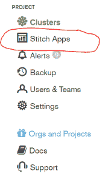
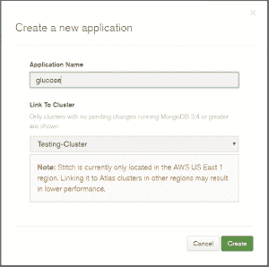
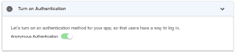
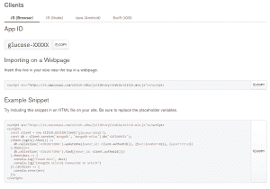
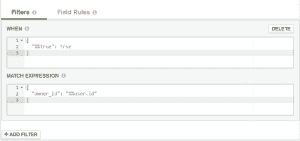
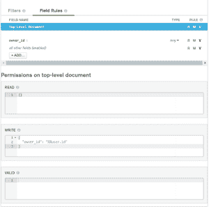

# MongoDB 缝合教程

> 原文：<https://dev.to/kenwalger/mongodb-stitch-tutorial-a83>

我之前已经谈过 [MongoDB](https://www.mongodb.com) 的后端即服务(BaaS)Stitch。在这篇文章中，让我们来看看一个基本的缝合应用程序，以及它是多么容易上手。对于这个特定的教程，我们将看看基本的缝合功能。然而，我将指出一些扩展应用程序的方法。

### 针脚应用概述

对于本教程，让我们想象一个应用程序，[为](https://www.kenwalger.com/blog/nosql/mongodb/flask-blood-glucose-tracker/)[糖尿病患者](https://www.amazon.com/gp/product/0470178116/ref=as_li_tl?ie=UTF8&camp=1789&creative=9325&creativeASIN=0470178116&linkCode=as2&tag=kenwalgersite-20&linkId=6d2f297c507bd99bca135dd52fc33e60) [](https://res.cloudinary.com/practicaldev/image/fetch/s--DKQRl7vG--/c_limit%2Cf_auto%2Cfl_progressive%2Cq_auto%2Cw_880/https://www.kenwalger.com/blog/ir-na.amazon-adsystem.com/e/ir%3Ft%3Dkenwalgersite-20%26l%3Dam2%26o%3D1%26a%3D0470178116) 跟踪血糖。血糖监测器，如[One Drop Chrome](https://www.amazon.com/gp/product/B06WWBFRVL/ref=as_li_tl?ie=UTF8&camp=1789&creative=9325&creativeASIN=B06WWBFRVL&linkCode=as2&tag=kenwalgersite-20&linkId=1a3970fd7847b18e062083d1f5c6f0e2)[](https://res.cloudinary.com/practicaldev/image/fetch/s--Xz7dzlz9--/c_limit%2Cf_auto%2Cfl_progressive%2Cq_auto%2Cw_880/https://www.kenwalger.com/blog/ir-na.amazon-adsystem.com/e/ir%3Ft%3Dkenwalgersite-20%26l%3Dam2%26o%3D1%26a%3DB06WWBFRVL)，会将结果发送到我们的应用程序。[医生](https://en.wikipedia.org/wiki/Endocrinology)可以看到结果，并在读数上留下评论。虽然超出了本教程的范围，但 Stitch 可以与诸如 [Twilio](https://www.twilio.com) 之类的服务集成，通过 SMS 消息向患者发送评论，以获得糖尿病管理建议。从开发的角度来看，这也可以与 MongoDB 3.6 [变更流](https://dev.to/kenwalger/change-streams-coming-soon-in-mongodb-36-967)集成。

一个示例应用程序页面可在此处查看，带有附加到 [MongoDB Atlas](https://www.kenwalger.com/blog/nosql/mongodb/mongodb-atlas/) 集群并使用 Stitch 的工作注释。我们来看看它是怎么产生的。

### 云服务

Stitch 运行在 Atlas 之上，因此我们需要设置这些服务。

###### 图册

首先，我们需要[登录](https://cloud.mongodb.com/user?nds=true#/login?nds=true) MongoDB Atlas 或创建一个帐户。然后我们需要建立一个 Atlas 集群。有一个免费的 M0 级别的选项，不需要信用卡就可以开始。这是一个伟大的功能，能够尝试这个令人难以置信的服务。

Stitch 目前仅位于 AWS US East 1 区域，因此最好在该区域设置集群以获得最佳性能。配置、部署和初始化集群后，我们将继续设置 Stitch。

###### 缝合

要开始设置 Stitch 应用程序，在 MongoDB Atlas 控制台中，选择 *Stitch App* 选项。

[T2】](https://res.cloudinary.com/practicaldev/image/fetch/s--Iyr4Wxpv--/c_limit%2Cf_auto%2Cfl_progressive%2Cq_auto%2Cw_880/https://i1.wp.com/www.kenwalger.com/blog/wp-content/uploads/2017/11/stitch_app_selection.png%3Fresize%3D179%252C300%26ssl%3D1)

然后点击右上角的*创建新应用*按钮。给应用程序起个名字，我把这个应用程序叫做**葡萄糖**，并选择您想要连接的 MongoDB Atlas 集群。

[T2】](https://res.cloudinary.com/practicaldev/image/fetch/s--YGAFZxV2--/c_limit%2Cf_auto%2Cfl_progressive%2Cq_auto%2Cw_880/https://i1.wp.com/www.kenwalger.com/blog/wp-content/uploads/2017/11/new_stitch_application-1.png%3Fresize%3D300%252C298%26ssl%3D1)

启动新的应用程序需要一分钟时间。一旦它启动并运行，我们需要将身份验证设置为*匿名身份验证*。

[T2】](https://res.cloudinary.com/practicaldev/image/fetch/s--dn3vQN0Q--/c_limit%2Cf_auto%2Cfl_progressive%2Cq_auto%2Cw_880/https://i2.wp.com/www.kenwalger.com/blog/wp-content/uploads/2017/11/anon_auth.png%3Fresize%3D300%252C67%26ssl%3D1)

对于我们的应用程序，我们需要从这个屏幕中获得一些信息。对于本教程，我们将使用来自 *JS(浏览器)*的信息，但是很高兴看到对 Node.js、iOS 和 Android 配置的支持。

[T2】](https://res.cloudinary.com/practicaldev/image/fetch/s--aX0r-ceX--/c_limit%2Cf_auto%2Cfl_progressive%2Cq_auto%2Cw_880/https://i0.wp.com/www.kenwalger.com/blog/wp-content/uploads/2017/11/stitch_client_settings.png%3Fresize%3D300%252C210%26ssl%3D1)

我们希望从网页上的*导入*位中获取`<script>`信息，并将其添加到我们将要生成的 HTML 中。但首先，让我们建立我们的数据库和收集。我们想从左侧导航面板点击 *mongodb-atlas* ，然后点击*规则*标签。

###### 连接数据库

点击*新建*添加一个新的 MongoDB [集合](https://docs.mongodb.com/master/core/databases-and-collections/)。对于数据库，我将我的**称为葡萄糖**，将收集的**称为结果**。出于本教程的目的，现在我们需要配置一些权限来允许任何人阅读评论。显然，对于敏感和隐私的医疗数据，我们希望设置更严格的权限。

在*规则*选项卡下，点击您刚刚创建的集合，并进入*过滤器*选项卡。

[T2】](https://res.cloudinary.com/practicaldev/image/fetch/s--nZSW2cVj--/c_limit%2Cf_auto%2Cfl_progressive%2Cq_auto%2Cw_880/https://i2.wp.com/www.kenwalger.com/blog/wp-content/uploads/2017/11/stitch_app_filters.png%3Fresize%3D300%252C141%26ssl%3D1)

删除这个已有的过滤器，点击*保存*。现在前往*场地规则*选项卡。在顶层文档部分的*权限中，我们想要将*读取*规则更改为`{}`并单击*保存*。*

[T2】](https://res.cloudinary.com/practicaldev/image/fetch/s--4JQ7U7NG--/c_limit%2Cf_auto%2Cfl_progressive%2Cq_auto%2Cw_880/https://i2.wp.com/www.kenwalger.com/blog/wp-content/uploads/2017/11/stitch_app_field_rules.png%3Fresize%3D300%252C297%26ssl%3D1)

通过这些设置，我们允许任何人阅读`glucose.results`中的任何记录，但是只有所有者可以编辑或删除他们自己的评论。Stitch 通过 OAuth 与脸书和谷歌等服务整合。此外，使用 JSON Web 令牌，定制的[认证](https://docs.mongodb.com/stitch/authentication/)是可能的。

### 将应用程序缝合到 HTML 中

既然我们已经在后端设置了 Stitch 应用程序，我们需要将它集成到我们的 HTML 页面中。对于本教程，我们将生成一个包含虚假数据的静态页面。然而，在实际应用中，我们会使用一些动态内容。无论如何，让我们看看如何进行。

###### HTML

我们将用我们在`<head>`部分的`<script>`信息生成一个基本的 HTML 页面。我们将在最后附上一份表格，以便从我们的医疗专业人员那里获得信息。

```
<!doctype html>
<html lang="en">
    <head>
        <meta charset="utf-8">
        <meta http-equiv="x-ua-compatible" content="ie-edge">
        <meta name="viewport" content="width=device-width, initial-scale=1.0">
        Blood Glucose
        <script src="https://s3.amazonaws.com/stitch-sdks/js/library/stable/stitch.min.js"></script>
    </head>
    <body>
        <h2>Sample Blood Glucose Report</h2>
        <div>
            <p>Patient Id: 12345</p>
            <p>Date: 5 November 2017</p>
            <p>Time: 07:23am</p>
            <p>Reading was taken: Before Breakfast</p>
            <p>Result: 110</p>
            <hr>
            <div id="comments">
            </div>
            <hr>
            <form>
                <label for="new_comment">Add Comments:</label>
                <input id="new_comment">
                <input class="button" type="submit">
            </form>
        </div>
    </body>
</html> 
```

Enter fullscreen mode Exit fullscreen mode

在处理 JavaScript 之前，让我们也考虑一下我们试图用 JavaScript 做什么，并在 HTML 中添加适当的钩子。

因为我们希望我们的评论在页面加载时加载，所以让我们给`<body>`标签添加一个`onload`:

```
<body onload="displayCommentsOnLoad()"> 
```

Enter fullscreen mode Exit fullscreen mode

我们还需要在表单中添加一个点击监听器:

```
<input class="button" type="submit" onClick="addComment()"> 
```

Enter fullscreen mode Exit fullscreen mode

很好。看起来，我们需要编写三个 JavaScript 函数来实现我们的功能。提到的两个和第三个`displayComments`似乎是必要的。让我们接下来在`glucose.js`中处理这些功能。

###### JavaScript

`glucose.js`

```
const client = new stitch.StitchClient('glucose-XXXXX');
const db = client.service('mongodb', 'mongodb-atlas').db('glucose');

function displayCommentsOnLoad() {
    client.login().then(displayComments();
}

function displayComments() {
    db.collection('results').find({}).then(docs => {
        const html = docs.map(c => "<div>" + c.comment + "</div>").join("");
        document.getElementByID("comments").innerHTML = html;
    });
}

function addComment() {
    const foo = document.getElementById("new_comment");
    db.collection("results").insert({owner_id : client.authedId(), comment : foo.value}).then(displayComments);
    foo.value = "";
} 
```

Enter fullscreen mode Exit fullscreen mode

您将需要修改`glucose-XXXXX`以利用您自己的应用程序的应用程序 Id，如果您使用不同的数据库和/或集合名称，也要进行这些修改。

我们还需要将脚本添加到 HTML 的`<head>`部分:

```
<script src="glucose.js"></script> 
```

Enter fullscreen mode Exit fullscreen mode

我有完整的[项目代码](https://github.com/kenwalger/intro_to_stitch)，GitHub 上也有一些最小的[基础](https://foundation.zurb.com/)样式。

### 总结起来

就是这样！干净利落。我们现在有一个基本的网页，它将接受用户(医疗专业人员)的评论，并通过 Stitch 的功能，将评论保存在 MongoDB Atlas 托管的数据库中。Stitch 提供了后端功能，我们只需编写一些最小的 [JavaScript](https://www.javascript.com/) 函数来处理按钮点击和文档插入到我们的集合中。

* * *

在 Twitter [@kenwalger](https://www.twitter.com/kenwalger) 上关注我，获取我发布的最新消息。或者更好的是，注册电子邮件列表，以便在您的邮箱中获得更新！

这篇文章中有几个 MongoDB 特定的术语。我为[亚马逊 Echo](https://www.amazon.com/gp/product/B01DFKC2SO/ref=as_li_tl?ie=UTF8&camp=1789&creative=9325&creativeASIN=B01DFKC2SO&linkCode=as2&tag=kenwalgersite-20&linkId=f9e513223de2525a72b95cf9561db55b) 系列产品创建了一个 [MongoDB 字典](https://www.echoskillstore.com/MongoDB-Dictionary/45103)技能。检查一下你可以说“Alexa，问 MongoDB 要文档的定义？”并得到有益的回应。

[](http://www.facebook.com/sharer.php?u=https%3A%2F%2Fwww.kenwalger.com%2Fblog%2Fnosql%2Fmongodb%2Fmongodb-stitch-tutorial%2F&t=MongoDB%20Stitch%20Tutorial&s=100&p%5Burl%5D=https%3A%2F%2Fwww.kenwalger.com%2Fblog%2Fnosql%2Fmongodb%2Fmongodb-stitch-tutorial%2F&p%5Bimages%5D%5B0%5D=https%3A%2F%2Fi0.wp.com%2Fwww.kenwalger.com%2Fblog%2Fwp-content%2Fuploads%2F2017%2F06%2Fmongodbstitch-e1498689024596.png%3Ffit%3D125%252C125%26ssl%3D1&p%5Btitle%5D=MongoDB%20Stitch%20Tutorial)[](https://twitter.com/intent/tweet?url=https%3A%2F%2Fwww.kenwalger.com%2Fblog%2Fnosql%2Fmongodb%2Fmongodb-stitch-tutorial%2F&text=Hey%20check%20this%20out)[](https://plus.google.com/share?url=https%3A%2F%2Fwww.kenwalger.com%2Fblog%2Fnosql%2Fmongodb%2Fmongodb-stitch-tutorial%2F)[](http://www.reddit.com/submit?url=https%3A%2F%2Fwww.kenwalger.com%2Fblog%2Fnosql%2Fmongodb%2Fmongodb-stitch-tutorial%2F&title=MongoDB%20Stitch%20Tutorial)[](http://www.linkedin.com/shareArticle?mini=true&url=https%3A%2F%2Fwww.kenwalger.com%2Fblog%2Fnosql%2Fmongodb%2Fmongodb-stitch-tutorial%2F&title=MongoDB%20Stitch%20Tutorial)[](//mailto:?subject=MongoDB%20Stitch%20Tutorial&body=Hey%20check%20this%20out:%20https%3A%2F%2Fwww.kenwalger.com%2Fblog%2Fnosql%2Fmongodb%2Fmongodb-stitch-tutorial%2F)

帖子 [MongoDB Stitch 教程](https://www.kenwalger.com/blog/nosql/mongodb/mongodb-stitch-tutorial/)最先出现在肯·w·阿尔杰的[博客上。](https://www.kenwalger.com/blog)