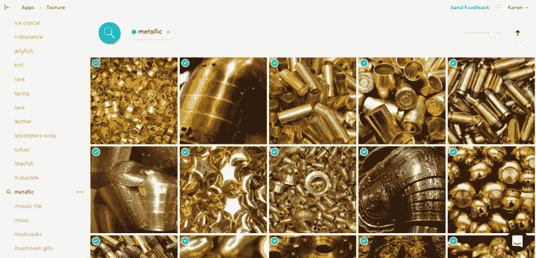

# 介绍风景质量、肖像质量以及纹理和图案视觉识别模型

> 原文：<https://dev.to/clarifai/introducing-landscape-quality-portrait-quality-and-textures--patterns-visual-recognition-models-6cp>

在计算机视觉领域，我们处理了很多照片——好的和坏的。但是是什么让一张照片变得“好”和“坏”——构图？灯光？它给你的感觉？我们决定尝试将这些元素提取到一个算法中，以帮助摄影师和媒体经理整理大量内容，找到最高质量的图像和视频。

[给我看看模特们](https://clarifai.com/models/)

在计算机视觉领域，我们经常处理照片。这些照片可以是使用手机相机的自拍，也可以是设计师用电脑生成的图像，还可以是使用高端 DSLR 相机拍摄的专业照片。我们广泛的[模型](https://clarifai.com/models/)帮助计算机理解“图像中的内容”和“图像中物体的位置”。我们第一次发布了帮助计算机理解图像质量的模型，或者“这个图像是好是坏？”我们很高兴将**风景质量模型**和**肖像** **质量模型**发布到了解图像质量的 Beta 版中，并以图像是“高质量”还是“低质量”的置信度进行响应。

**优质照片属性:**

*   良好的照明
*   清晰且焦点对准
*   如果修图存在，这是不明显的(没有完全喷枪皮肤)
*   没有太多的颗粒/噪声(* *除非这是艺术家的意图)

**质量差的照片属性:**

*   严重色差
*   红眼睛
*   极度背光
*   不自然的晕影，通常是数字添加的

> ### "With our computer vision ability, we want photographers to focus on what they do best: capturing wonderful moments." Week

专业摄影师甚至摄影爱好者每天可以拍摄成千上万张照片。然后，他们会仔细检查每张照片，并决定该照片是否值得进行后期处理。假设一名摄影师一天拍摄 5000 张照片，并花 10 秒钟来确定照片是否应该进行后期处理，那么对于一天的照片来说，这一过滤过程可能需要超过 13 个小时。凭借我们的计算机视觉能力，我们希望摄影师专注于他们最擅长的事情:捕捉精彩瞬间。

从个人经历来说，几年前我去内罗毕进行野生动物摄影旅行后，我被相机里的照片数量淹没了。到目前为止，我还没有机会仔细检查每一张照片来筛选高质量和低质量的照片。与一些专业时尚摄影师交谈时，他们会花数小时手动浏览他们在时装秀或摄影中拍摄的每张照片。多伦多男女时装周的摄影师 Kimal Lloyd-Phillip 说:“让电脑进行初步筛选，每周可以节省我几十个小时。”。

> ### "Having the computer do preliminary filtering can save me dozens of hours a week." –-Kimal Lloyd-Phillip, photographer of Toronto Fashion Week for Men and Women

我们的开发人员福音团队[need link]破解了这些模型，并创建了一个工具，可以将一个文件夹中的照片分成两个独立的文件夹:好的和坏的。

除了风景和肖像质量模型，我们还引入了**纹理&图案** **模型**，帮助摄影师和设计师识别常见纹理(羽毛、木纹)、独特/新鲜纹理概念(石化木、冰川冰)和总体描述性纹理概念(纹理、金属)。

[T2】](https://res.cloudinary.com/practicaldev/image/fetch/s--lmQfY8cI--/c_limit%2Cf_auto%2Cfl_progressive%2Cq_auto%2Cw_880/https://blog.clarifai.com/wp-content/uploads/2017/11/texturesandpatternsai.jpg)

我们与一家全球消费服装制造商合作，将纹理和图案模型整合到他们的设计工作流程中。他们使用纹理和图案模型来激发设计师的创造力，并进一步发展他们的设计理念。他们使用我们的模型索引他们的设计数据库(内部和外部图像);然后，他们将任何新的、原始的设计想法输入我们的平台，运行我们的[视觉搜索](https://clarifai.com/visual-search)工具来探索和发现设计可能演变的各种方式。

我们很高兴将人工智能应用于艺术，并提供工具，让创作者能够更有效地工作。我们希望我们更广泛的客户像我们最初的测试人员一样喜欢使用新的模型。如果有任何反馈和/或其他要求，请随时通过[feedback@clarifai.com](mailto:feedback@clarifai.com)给我们发消息。

给我看看模特们！

介绍风景质量、肖像质量和纹理&图案视觉识别模型的帖子[首先出现在](https://blog.clarifai.com/introducing-landscape-quality-portrait-quality-textures-patterns-visual-recognition-models/) [Clarifai 博客|人工智能在行动](https://blog.clarifai.com)上。