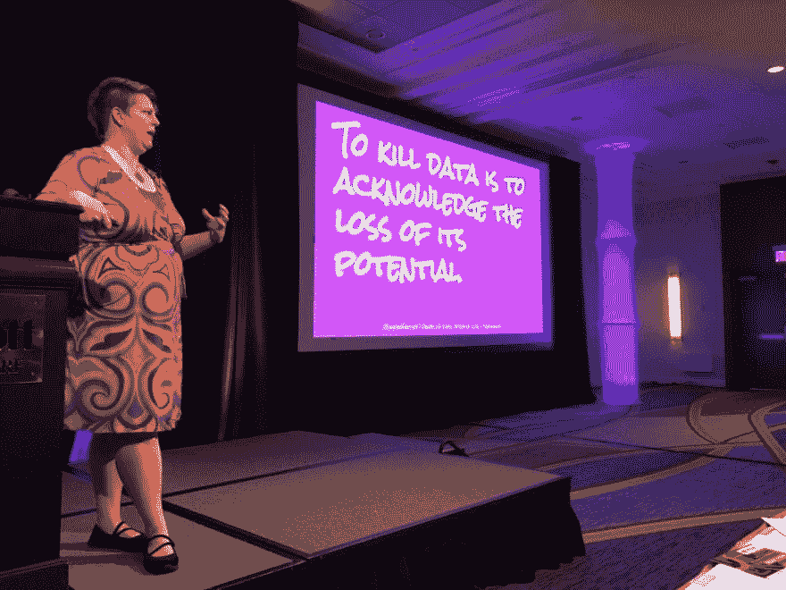
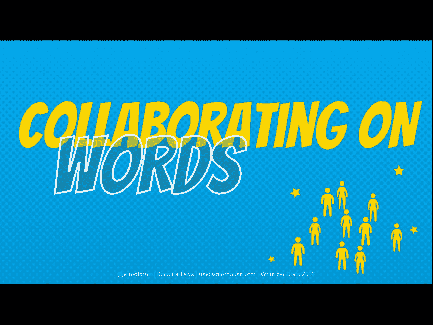

# 演讲幻灯片不是演示文稿

> 原文：<https://dev.to/wiredferret/talks-slides-are-not-a-presentation-deck-ob>

今年看了一个叫“我在评判你的幻灯片”之类的谈话。我看了很多会议演讲。不，不止如此。好像这是我的全职工作，事实也的确如此。25 次会议 x 2 天(粗略平均数)x 每天 6 次会谈。加上录音谈话。

因此:

*   抱歉，我不会去找那个演示的链接。
*   我对谈话幻灯片有很多看法。

在这份新工作中，我有一个*设计师*。有人付钱让他有专业的审美观点。这是惊人的，超级令人兴奋。我很确定她每次看到我现在的幻灯片风格的惊人的粉红色都会心痛。她给了我们一个谷歌幻灯片模板，它是有品牌的，很可爱，可以在我们的网站上使用，并且内置了正确的十六进制代码，这样你就可以随时找到它们，而不是在颜色选择器周围徘徊。我非常兴奋能把我的幻灯片移植到新的风格上。

 

然后我试着去做，这很难。有很多我在演讲中永远不会用到的幻灯片样式，我错过了一些我真正需要的，比如章节标题。这种脱节是怎么回事？

# 演讲幻灯片不是演示幻灯片

我意识到我想要演讲用的幻灯片，她给我的模板是演讲用的幻灯片。这似乎是一个非常微妙的区别，但它是一个非常不同的受众和意图，所以关键部分是不同的。

如果你因为错过了一次会议而向某人索要演示文稿，你会得到一些能给你很多信息的东西——事实、数字、决定和图表。如果你从一个精心设计的技术演讲中得到幻灯片，它将是一个无用的猫图片和命令提示的 amalagam。

## 演讲幻灯片

当我为一个演讲设计幻灯片时，我想象一个能容纳 100 人的房间。我在它的前面，我有一个带 HDMI 接口的投影仪和一个幻灯片点击器。我站在屏幕的一边。现在是中午，这些人正坐在酒店的宴会椅上听我说些什么，并击退午餐供应带来的睡意。我需要充满活力，我的幻灯片需要有力，我的观点需要与他们的需求相联系。我是来告知、娱乐、教育、引发思考的。

## 演示幻灯片

演示是完全不同的事情。它们正在办公室会议室的大电视上播放。观众是那些认为自己“在开会”的人。幻灯片的存在是为了围绕需要发生的行动项目和需要在兴趣非常相似的一组人中平均分配的信息来引导思考和讨论。演示幻灯片有议程和要点，它们本身就是一种有说服力的媒介，而不是依靠演讲者来增加说服力。

* * *

鉴于这两个截然不同的目标，我可以理解为什么设计幻灯片很难。大多数建议和模板都是针对常见情况的，即演示文稿。我有一个朋友说她“每天都在演示台上工作”。难怪我们学习设计默认带有关节点的幻灯片。

我从来不需要做那种幻灯片结构，所以我没有养成那个习惯，当我开始做技术演讲时，我发现那种多余的，几乎无言的风格对听众来说更有效。我从相反的方向推理。

# 讲解幻灯片最佳实践

鉴于我可能是演讲台的灾难，我不会谈论它们应该如何工作，但下面是我对演讲幻灯片的强烈感受:

*   在每张幻灯片上写上你的推特账号或署名。这样，如果你在演讲中途说了一些令人难忘的东西，人们可以正确地将其归类，并且每张幻灯片都有可能作为独立的照片。

[T2】](https://res.cloudinary.com/practicaldev/image/fetch/s--xqQ9Rpyd--/c_limit%2Cf_auto%2Cfl_progressive%2Cq_auto%2Cw_880/http://www.heidiwaterhouse.com/wp-content/uploads/2017/11/IMG_0888-1024x768.png)

幻灯片示例 1

*   除了你的手柄和属性，36 点字体是最少的，我真的想要接近 48-60 点的字体。巨大的字体意味着更少的单词，这对于演讲幻灯片来说是*好的*。
*   每张幻灯片一个想法。你可以用你想要的任何长度来解释它，但是你放在幻灯片上的任何东西只需要是人们在消化一个想法时眼睛休息的地方。这种想法与你在他们记忆中的滑动紧密相连。当你切换到下一个想法，改变幻灯片。
*   如果你有足够的时间，去你将拥有的房间里看看演示。不同的投影仪和环境光源可能意味着深色背景或浅色背景会更好。
*   请记住，你的幻灯片不是说服力，*你才是。我试图在我的演讲者笔记中为其他人提供信息，但这是一个非常次要的用例。*