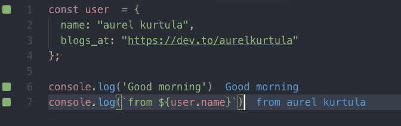
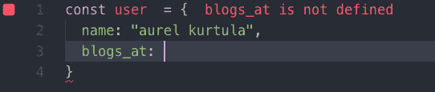
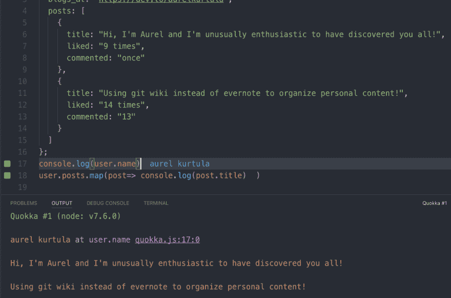

# 使用您的编辑器作为 Quokka.js 的 JavaScript 平台

> 原文:[https://dev . to/aurelkurtula/using-your-editor-as-a-JavaScript-playground-with-quokkajs-8ol](https://dev.to/aurelkurtula/using-your-editor-as-a-javascript-playground-with-quokkajs-8ol)

我正在看 youtube 上精彩节目[Fun Fun Fun Fun Fun Fun Fun Fun Fun Fun Fun Fun Fun Fun Fun Fun Fun Fun Fun Fun Fun Fun Fun Fun Fun Fun Fun Fun Fun Fun Fun Fun Fun Fun Fun Fun Fun Fun Fun Fun Fun Fun Fun Fun Fun Fun Fun Fun Fun Fun Fun Fun Fun Fun Fun Fun Fun Fun Fun Fun Fun Fun Fun Fun Fun Fun Fun Fun Fun Fun Fun Fun Fun Fun Fun Fun Fun Fun Fun Fun Fun Fun Fun Fun 我仍然发现自己在浏览器中打开一个`index.html`文件，或者更多的时候，我导航到](https://www.youtube.com/channel/UCO1cgjhGzsSYb1rsB4bFe4Q)[jsbin.com](https://jsbin.com)只是为了测试一些 JavaScript——不再是了！

在它的[文档上](https://quokkajs.com/docs/) Quokka 这样描述自己:

> Quokka.js 是编辑器中的快速原型游乐场，可以访问项目文件、内联报告、代码覆盖和丰富的输出格式。

它是这样做的:

[T2】](https://res.cloudinary.com/practicaldev/image/fetch/s--cEtj6Bw---/c_limit%2Cf_auto%2Cfl_progressive%2Cq_auto%2Cw_880/https://thepracticaldev.s3.amazonaws.com/i/afpgg7ourogaww8e1hqz.png)

蓝色输出看起来像我写的评论，但它是 Quokka。当你犯错时，它会告诉你

[T2】](https://res.cloudinary.com/practicaldev/image/fetch/s--iFFDs0iN--/c_limit%2Cf_auto%2Cfl_progressive%2Cq_auto%2Cw_880/https://thepracticaldev.s3.amazonaws.com/i/rokxd29chifpg57nivl2.png)

最后，如果输出没有如上所示内联显示，您可以在编辑器的控制台中看到它。

[T2】](https://res.cloudinary.com/practicaldev/image/fetch/s--3kbQjB40--/c_limit%2Cf_auto%2Cfl_progressive%2Cq_auto%2Cw_880/https://thepracticaldev.s3.amazonaws.com/i/3wduns4ybhk5ta1kbkfj.png)

这个插件可以安装在 VS 代码、JetBrains IDE 和 Atom 中。以上截图来自我的 VS 代码编辑器。

首先(至少在 VS 代码中)你打开命令面板(shift+cmd+P)和`Quokka.js: Start on Current File`或`Quokka.js: New File`。还有其他可以探索的命令。其中一个选择是停止 Quokka 看你的文件，如果它变得令人讨厌。