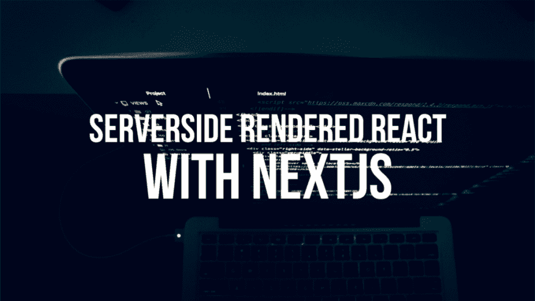

# 使用 NextJS 和 NuxtJS 介绍 SSR

> 原文：<https://dev.to/mrfrontend/introduction-to-ssr-with-nextjs-and-nuxtjs-24l>

[T2】](https://res.cloudinary.com/practicaldev/image/fetch/s--wopLqfMA--/c_limit%2Cf_auto%2Cfl_progressive%2Cq_auto%2Cw_880/https://cdn-images-1.medium.com/max/1024/0%2ASnPUQuLTgr3zIC89.png)

目前有很多关于 SSR(服务器端渲染)应用的讨论。SSR 通常与 React 或 Vue 等框架结合使用。对于 React 有 NextJS，VueJS 有 NuxtJS。

用 NextJS 和 WordPress API 检查我的新 Mr Frontend 博客实验！

[https://www.youtube.com/embed/7N6PaO7UnvA](https://www.youtube.com/embed/7N6PaO7UnvA)

所以今天不教 JavaScript，而是介绍 [NextJS](https://zeit.co/blog/next2) ！

#### 连锁超市

NextJS 是 NodeJS 的 JavaScript 框架，构建在 React 之上。NextJS 超级好用！

大多数人知道并使用 React 作为客户端应用程序。但是使用 NextJS，所有的 React 组件都由 NodeJS 在服务器上呈现，然后提供给浏览器。使用客户端呈现，浏览器下载 JavaScript 和其他资源，然后在完成时呈现视图。

#### SSR & CSR

SSR 和 CSR 各有利弊，在“ [**中解释了服务器端渲染相对于客户端渲染的好处**](https://medium.com/walmartlabs/the-benefits-of-server-side-rendering-over-client-side-rendering-5d07ff2cefe8) ”。

目前，我正在用 NextJS 和 Heroku 上的 [WordPress API 进行试验，为 Mr Frontend 博客](http://nextblog.herokuapp.com)进行新的设计试验。如果你想在 Heroku 上免费试用，请在 [Github 上查看这个在 Heroku](https://github.com/mars/heroku-nextjs) 上运行 NextJS 的入门项目。

#### NuxtJS

如果你喜欢 VueJS 胜过 React，请查看 [NuxtJS](https://nuxtjs.org) 。NuxtJS 类似于 NextJS，两者都使用 NodeJS 在服务器端呈现组件。我没有尝试过 NuxtJS，但它看起来几乎和 NextJS 一样棒。也许我过会儿会尝试它😎。

#### 你怎么看？

我想知道你对 SSR 或 CSR 以及正反两方面的看法。或者你看到对 NextJS 或 NuxtJS 有用的东西吗？

请在评论中让我知道😉

*原载于* [*奥前端博客*](https://blog.mrfrontend.org/2017/11/introduction-ssr-nextjs-nodejs-reactjs-nuxtjs-vuejs/) *。*

* * *