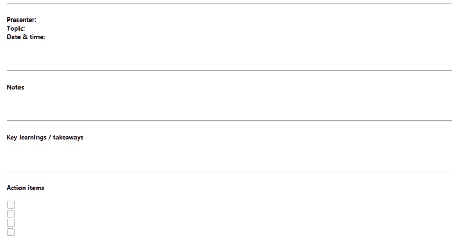

# Evernote -第二大脑

> 原文:[https://dev.to/darksmile92/evernote-第二大脑-21j](https://dev.to/darksmile92/evernote---second-brain-21j)

# Evernote 可以成为你的第二大脑！

*快速了解这篇文章的原因:
我学会了欣赏 Evernote 在工作时间更有效率，在私人事务中更有条理，并更好地保持知识！如果你还没有使用 Evernote，我想和你分享我的经验，并给你一个尝试 Evernote 的开始。*

我将首先概括介绍一些主题，然后让您了解我是如何使用它们的。

**以下章节涵盖了 Evernote 一些功能/用途的一般信息:**

### 模板

**重用！**
当谈到经常重复的常见任务时，一个开发人员的脑海中就会浮现出“吻”*(保持简单，愚蠢)**(不要重复自己)*。为什么不把它应用到 Evernote 上，为会议议程、你经常创建的协议和其他类似的东西创建模板呢？

只需编辑一个笔记作为通用模板，制作一个新笔记本，将其命名为*模板*并添加该笔记。下一次只要抄下便条，就能更快地完成！

### 协议

记录重要信息
经常有会议需要我做笔记或者记忆一些东西。简单地创建一个新的便笺，开始写下所有的事情。格式化可以通过快捷方式完成——这很好。

如前所述，模板在维护结构时很方便。

### 会议议程

提前计划
每个人都喜欢会议议程和明确的目标(至少如果他们希望会议富有成效和效率的话)。
提前在 evernote 中完成，并将其附加到您的邀请函中。
日程安排需要时间，所以每当你有新想法的时候就把它延长，以后不用用日历就可以随时查阅。

### 邮件整合

**保存、附加、获利**
Evernote 为 Outlook 和其他常见的电子邮件客户端提供插件。它们允许你从邮件中创建一个便笺(包括附件！)以便您可以保存它供以后访问。此外，每个 Evernote 账户都链接到一个 Evernote 电子邮件地址，你可以向其发送或转发信息，这些信息将自动保存在你的笔记本中。

### 网页裁剪器

Evernote 还提供了各种方法来保存网站、文章或部分网页内容到你的笔记中。书签、扩展和安装的软件本身都是可以使用的。

### 提醒

**正确的时间，正确的信息**
你可以在便笺上设置提醒和闹钟，这样你就不会再忘记某件事，并且在正确的时间获得正确的信息。

### 分享笔记

**不要独享**
知识共享是很重要的一部分。Evernote 让你可以通过电子邮件或链接(公开或私人)来分享笔记。这使得在几秒钟内共享笔记变得很容易。
笔记可以导出为 PDF 等文件。

### 工作聊天

**轻松分享**
分享笔记的另一种方式是名为*工作聊天*的功能。它可以让你和其他 evernote 用户聊天，你知道他们的邮箱账号，并且在聊天中分享笔记。

### PDF，图片，附件

**再也不浏览文档**
你可以给笔记添加任何种类的附件。Evernote 有一个非常好的 OCR 功能，可以让你搜索 pdf 和图片！
省时省力！

### 安装，应用，云，高级

如果你把客户端安装在你的电脑或者手机上，Evernote 有很多不错的功能。但是你也可以从任何地方通过网络界面访问你的笔记。
还有一个高级 abo(付费)功能，为您提供更多功能！

## 现在我的用法:

模板
我经常在代码审查协议中使用模板，以避免忘记要检查的要点，并维护这些协议的结构。

也适用于 agends 协议。这里有一个例子:

[T2】](https://res.cloudinary.com/practicaldev/image/fetch/s--Dlkhl0Ov--/c_limit%2Cf_auto%2Cfl_progressive%2Cq_auto%2Cw_880/https://thepracticaldev.s3.amazonaws.com/i/uu664jj6sv9hktjwilwl.png)

[下载 evernote 模板议程](http://www.evernote.com/l/AeQnqjx9E8JP-qmKeMLqyHDKjTGXDwp7Mvo/)

**知识**
有些问题是通过四处寻找别人已经遇到过的问题并找到解决办法而解决的，有些问题是通过试错解决的。不管是哪种方式，记录诸如错误报告和解决方案之类的东西都是很好的，以防它们再次出现。尽你最大的努力把文件做好，这样下次就容易解决了。
我的笔记中还有一些有趣的文章、博客文章或部分 API 文档。

**反思**
我每天花 10 分钟反思我的工作日。

*   我现在感觉如何？
*   今天有什么好吃的？
*   明天我能做得更好吗？
*   我在哪里无谓地浪费了时间？
*   明天需要做什么？

随着时间的推移，你书架上的文件夹开始变得越来越大，里面装着因纳税报告、担保和其他原因而保留的发票。我扫描所有的论文，在 Evernote 中分类，如果可能的话，把原件扔掉。这样，在 evernote 搜索的帮助下，我能够非常快速地找到信息，而不必翻阅我的文件夹。

**旅游规划**
旅游也是如此。用手机上的 Evernote 应用程序在 Evernote 和离线状态下保存重要文档，可以更容易地从任何地方查找信息，并确保你不会因为把旅游门票忘在家里而被搞砸。

希望这能让你对我日常使用 Evernote 有所了解，也许能给你一些好的激励。

非常感谢您的反馈！