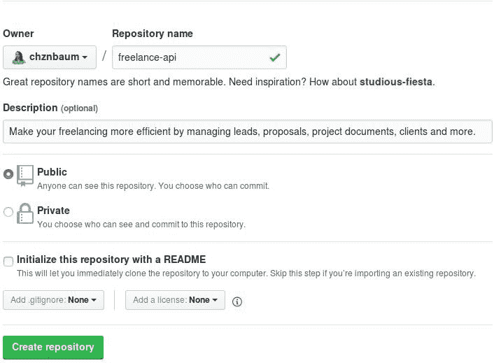
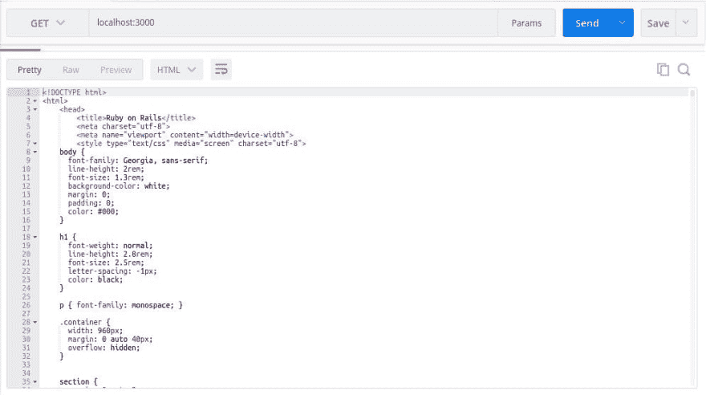

# 带有 Rails 5.1 API 和 React 前端的自由 Web 应用程序，第 1 部分:设置

> 原文：<https://dev.to/chazonacodes/freelance-web-app-with-rails-51-api-and-react-frontend-part-1-getting-set-up-5ep>

是时候开始使用 Rails API 和 React 前端了。在[第 0 部分](https://chazonabaum.com/blogs/freelance-app-rails-5-1-api-with-react-frontend-part-0-why)中，我给出了一些关于该项目的背景，将会使用哪些技术以及为什么。如果您还没有，请随时查看。

## 先决条件

要开始这个项目，您需要在您的系统上安装以下软件。我们开始下载吧！

*   我将为这个项目使用 2.4.2 版本。 [rbenv](https://github.com/rbenv/rbenv) 是管理 Ruby 版本的一种流行方式，但是 [RVM](https://rvm.io/) 仍然是一种选择。我建议回顾一下两个选项，自己决定。
*   PostgreSQL 是一个健壮的、功能丰富的数据库系统，也是我将要使用的。
*   Postman - Postman 将使构建 API 和测试 API 调用变得更加容易。

## 获得正确版本的 Rails

对于这个项目，我将使用 Rails 5.1(目前最新的是 5.1.4)，所以如果你没有它，一定要安装正确的版本:

```
gem install rails -v '~> 5.1' 
```

Enter fullscreen mode Exit fullscreen mode

## 设置 API app

让我们继续生成我们的新 API 应用:

```
rails new freelance-api --database=postgresql --api 
```

Enter fullscreen mode Exit fullscreen mode

这里没有太多的改动，只是将数据库设置为 Postgres 并使用 API 模式。对于测试，这个项目将坚持默认的 MiniTest。

继续在您的文本编辑器或终端中用`tree`查看目录结构。如果你曾经使用 Rails 开发过常规的 web 应用程序，你会发现这个应用程序瘦了很多。

首先要做的更改是关于 Gemfile 和 CORS 初始化器的:

取消 gem 文件中的`gem rack-cors`行的注释，并在终端中运行`bundle install`。

在 API 目录中，打开`config > initializers > cors.rb`，取消注释，修改为:

```
Rails.application.config.middleware.insert_before 0, Rack::Cors do
  allow do
    origins '*'

    resource '*',
      headers: :any,
      methods: [:get, :post, :put, :patch, :delete, :options, :head]
  end
end 
```

Enter fullscreen mode Exit fullscreen mode

这将允许 API 与前端应用程序很好地配合。一旦知道前端应用程序将使用哪个域，并准备好进行部署，就可以调整原点。

## 版本控制和文档编制

虽然这个 API 在完成之前需要做大量的工作，但是养成更新文档的习惯并跟踪我们进行的更改是一个好主意。

您可以从在 GitHub 或其他使用 git 的存储库托管服务中创建一个存储库开始。这应该相当简单:

[T2】](https://res.cloudinary.com/practicaldev/image/fetch/s--Rafn6-pN--/c_limit%2Cf_auto%2Cfl_progressive%2Cq_auto%2Cw_880/https://s3.amazonaws.com/chazona-portfolio-bucket/uploads/blog/github_repo_freelance_api.jpg)

在将文件添加到 repo 之前，最好从项目结束时您可能不喜欢的一些基本文件开始:自述文件、许可证和贡献文件。

您的自述文件应该已经存在，但是请继续修改它，使它与您目前所拥有的内容有意义。例如，现在我的看起来像:

```
# Freelance API

Make your freelancing more efficient by managing leads, proposals, project documents, clients and more.

*This is a work in progress.*

## Getting Started

### Prerequisites

#### Ruby ~> 2.4

Download and manage via [rbenv](https://github.com/rbenv/rbenv) or [RVM](https://rvm.io/)

#### Rails ~> 5.1 gem install rails -v '~> 5.1' #### PostgreSQL ~> 9.6

Follow the [instructions for downloading PostgreSQL](https://www.postgresql.org/download/) based on your operating system, and be sure to [create a database user with privileges](https://wiki.postgresql.org/wiki/First_steps).

### Installing

Clone the repository: git clone https://github.com/chznbaum/freelance-api.git
    cd ./freelance-api Install the gems: bundle install And set up the database: rails db:create
    rails db:migrate Start the development server: rails s You can test this by making a GET request to `localhost:3000` using Postman or an alternative.

## Tests

### End to End Tests

TBA

### Coding Style Tests

TBA

## Deployment

TBA

## Built With
 * [Rails](http://rubyonrails.org/) - Web Framework
* [rbenv](https://github.com/rbenv/rbenv) - Environment Managemet
* [Bundler](http://bundler.io/) - Dependency Management
* [Heroku](https://www.heroku.com/) - Deployment Platform
* [Travis CI](https://travis-ci.org/) - Continuous Integration

## Contributing

Please read [CONTRIBUTING.md](CONTRIBUTING.md) for details on the code of conduct, and the process for submitting pull requests.

## Versioning

TBA

## Authors
 * **Chazona Baum** - Initial work

## License

This project is licensed under the MIT License - see the [LICENSE.md](LICENSE.md) file for more details.

## Acknowledgements 
```

Enter fullscreen mode Exit fullscreen mode

虽然还有很长的路要走，但已经可以包括令人惊讶的数量了！

继续在项目根目录下创建一个`CONTRIBUTING.md`文件和一个`LICENSE.md`文件。我的投稿文件只列出了 TBA，我在我的项目中使用了麻省理工学院的许可证。

现在这些文档已经设置好了，所有文件都可以添加到您创建的存储库中了。

```
git add .
git commit -m "initial commit"
git remote add origin https://github.com/<YOUR GITHUB USERNAME>/freelance-api.git
git push -u origin master 
```

Enter fullscreen mode Exit fullscreen mode

## 包装完毕

您几乎完成了基本设置！要创建和更新数据库，继续运行:

```
rails db:create
rails db:migrate 
```

Enter fullscreen mode Exit fullscreen mode

看起来我们做了很多却没有什么成果，但是我们已经建立了开始提供 API 功能所需的环境。

此时，您可以通过在终端中打开 Postman 并启动您的 Rails 服务器来测试 API:

```
rails s 
```

Enter fullscreen mode Exit fullscreen mode

一旦终端指示服务器正在运行，在 Postman 请求栏中，向`localhost:3000`发送 GET 请求。您应该看到以下内容:

[T2】](https://res.cloudinary.com/practicaldev/image/fetch/s--MK7F6xQ4--/c_limit%2Cf_auto%2Cfl_progressive%2Cq_auto%2Cw_880/https://s3.amazonaws.com/chazona-portfolio-bucket/uploads/blog/postman_screenshot_ruby_on_rails.jpg)

深入查看您收到的 HTML，您会看到它是 Rails 的“耶，您在 Rails 上！”成功页面。

完成这些之后，下一步就是更详细地计划 API 应该做什么，并开始创建数据模型。