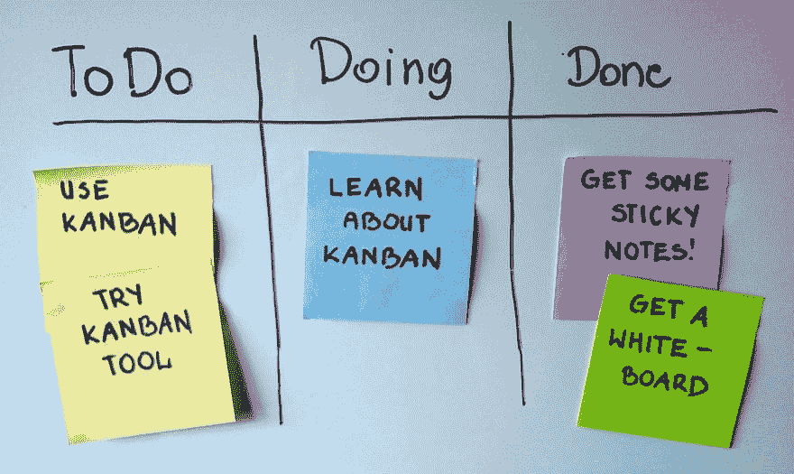

# Android 看板

> 原文:[https://dev.to/smontiel/kanban-board-for-android-4j7](https://dev.to/smontiel/kanban-board-for-android-4j7)

我目前正在开发一个 Android 应用程序作为辅助项目，基本上这是一个简单的看板。它将是开源的，伙计们！

[T2】](https://res.cloudinary.com/practicaldev/image/fetch/s--HZ1Cicxi--/c_limit%2Cf_auto%2Cfl_progressive%2Cq_auto%2Cw_880/https://upload.wikimedia.org/wikipedia/commons/d/d3/Simple-kanban-board-.jpg)

如果有人有兴趣帮我一把，你的帮助将不胜感激。一些设计标志的设计师。

我将等待拉取请求。

链接[安卓](https://github.com/SMontiel/Kanban-Board)看板，哥们！

祝您愉快！