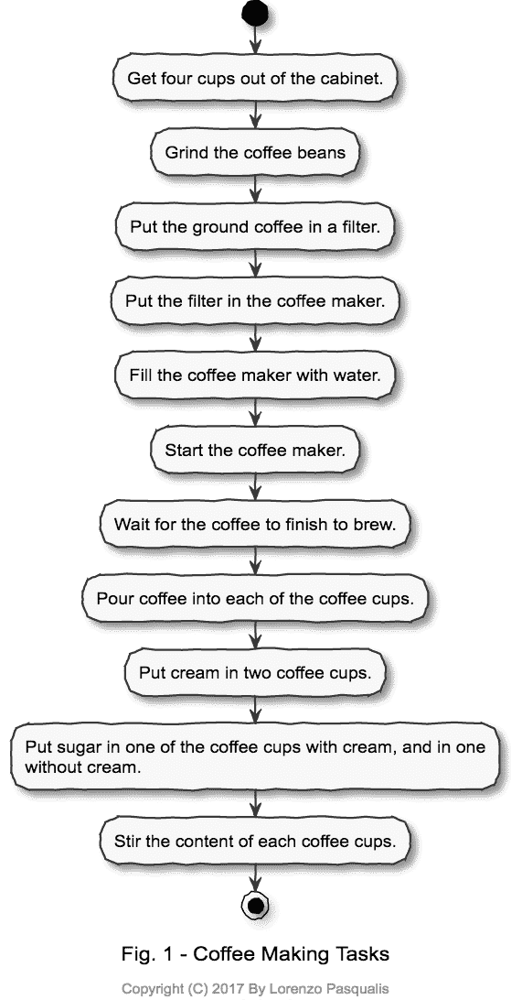
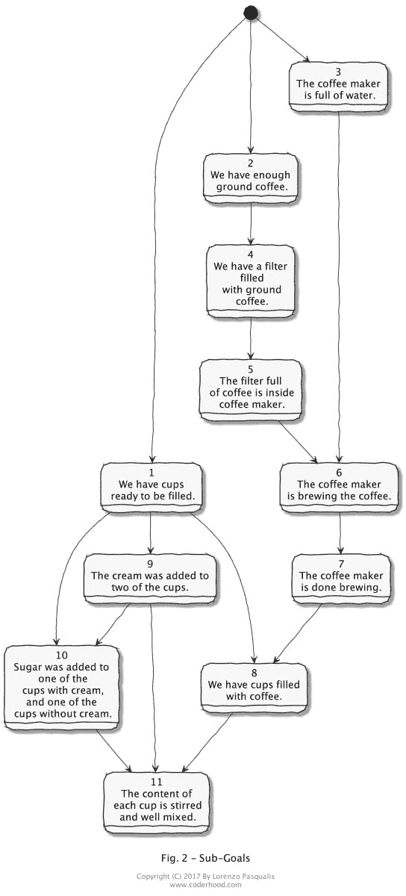
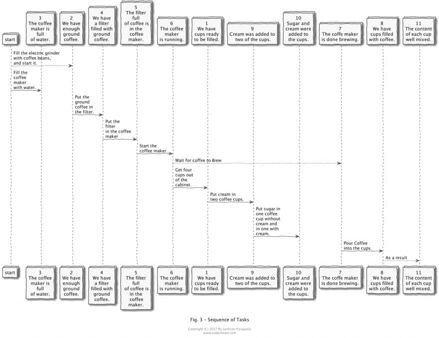

# 优秀软件开发人员的 5 个解决问题的技巧

> 原文：<https://dev.to/lpasqualis/the-5-problem-solving-skills-of-great-software-developers-4e6>

这篇文章最初发表在 [CoderHood](https://coderhood.com) 上，名为[伟大软件开发人员的 5 种解决问题的技巧](https://www.coderhood.com/5-problem-solving-skills-great-software-developers/)。CoderHood 是一个致力于软件工程人类层面的博客。

* * *

[T2】](https://www.coderhood.com/5-problem-solving-skills-great-software-developers/)

为了提高效率，软件工程师必须磨练他们解决问题的技能，掌握一门需要多年学习和实践的复杂手艺。不管新来者会怎么想，理解编程语言、框架甚至算法并不是构建软件的难点。

例如，语言很容易，尤其是受 C 启发的命令式语言。C 语言中只有 32 个关键字，它们的意思很容易掌握:

|  |  |  |
| --- | --- | --- |
| 汽车 | 两倍 | （同 Internationalorganizations）国际组织 |
| 破裂 | 其他 | 长的 |
| 情况 | 列举型别 | 注册 |
| 茶 | 走读生 | 返回 |
| 常数 | 漂浮物 | 短的 |
| 继续 | 为 | 签名 |
| 系统默认值 | 转到 | 尺寸 |
| 做 | 如果 | 静电 |

c 还有 14 个预处理指令，也不难理解:

|  |  |  |
| --- | --- | --- |
| #定义 | #错误 | #导入 |
| 艾列弗 | #如果 | #包括 |
| #否则 | #ifdef | #线 |
| #ifndef | #杂注 |  |

将许多指令串在一起完成一些有用的事情要复杂得多。这个概念类似于用英语等人类语言写作。英语中的每个单词都很容易理解，但是将许多单词放在一起组成结构良好且清晰的句子和段落却远非易事。这需要研究别人的工作和大量的实践。

构建软件更多的是解决问题，而不是编写代码或理解技术。变得善于解决问题需要大量的练习和经验。软件工程师首先是问题解决者，其次才是编码者。计算机语言、框架、算法都是可以通过学习来学习的工具。然而，解决问题是复杂而难学的，除非通过长期的实践和应用指导。

## 如何像软件工程师一样思考

[T2】](https://res.cloudinary.com/practicaldev/image/fetch/s--dAiPI6lu--/c_limit%2Cf_auto%2Cfl_progressive%2Cq_auto%2Cw_880/https://thepracticaldev.s3.amazonaws.com/i/b4k25137c6ywdip7wrag.jpg)

通过实践，软件工程师学会以允许他们找到问题的有效解决方案的方式来思考。学习随着训练自然发生，但这需要时间。您可以通过识别和磨练解决问题的技能来加速您的学习进度，您需要像一个已经有经验的软件工程师那样思考。

我准备用一个非技术性的问题来解释你必须学会的五项技能。问题是:如何为四个咖啡喜好不同的人做咖啡？

## 制作咖啡

四个人——A、B、C、D——想要咖啡，他们有具体的要求。

*   A.黑色。
*   B.只加奶油。
*   C.糖和奶油。
*   D.只加糖。

你想找出一种方法或算法，让咖啡按照指定的时间快速煮好。目标是找到一种方法，这样你就可以同时为四个人提供咖啡，而且要尽可能的热。

# 五种解题技巧

# 1 -学会把大的复杂目标拆分成小的、简单的目标。

* * *

[T2】](https://res.cloudinary.com/practicaldev/image/fetch/s--t4lK4Vao--/c_limit%2Cf_auto%2Cfl_progressive%2Cq_auto%2Cw_880/https://thepracticaldev.s3.amazonaws.com/i/119417wqi4pe5fwbpw41.jpg)

这个例子的总体目标是为四个人制作指定的咖啡。然而，你不能只是“煮咖啡”，好像这是一个单一的行动。任何知道如何制作咖啡的人都会告诉你，你需要把工作分成单独的小任务。它们中的每一个都需要足够简单，以便于一次解决。

下面是按照主要目标制作咖啡所需完成的任务列表:

[T2】](https://res.cloudinary.com/practicaldev/image/fetch/s--HBNbh5CU--/c_limit%2Cf_auto%2Cfl_progressive%2Cq_auto%2Cw_880/https://thepracticaldev.s3.amazonaws.com/i/e0ddochd7ygjj8lgmuns.png)

将工作分解成任务的能力是人类与生俱来的，也是完成大多数事情所必需的技能。除了知道如何制作咖啡，列出上面的清单并不需要任何特别的学习或实践。换句话说，或多或少任何人都能做这件事。

然而，像煮咖啡这样的实际日常问题和像软件构建这样的更复杂的挑战之间的区别在于，构建软件的步骤很少被大量演练。为了能够列出构建一个特定软件所必需的任务，需要以前做过很多次。这在软件开发中并不常见。这就是为什么有经验的软件工程师不会马上开始写任务清单。相反，他们把整个问题分解成更简单的问题。

工程师把要解决的问题称为“什么”，把要完成的任务称为“如何”在制作咖啡的例子中，子目标列表(什么)可以按如下方式制作。

#### 子目标:

1.  我们有准备好的杯子。
2.  我们有足够的咖啡粉。
3.  咖啡机装满了水。
4.  我们有一个装满研磨咖啡的过滤器。该子目标要求完成子目标#2。
5.  装满咖啡的过滤器在咖啡机里面。该子目标要求完成#4。
6.  咖啡机正在煮咖啡；要求完成第 3 项和第 5 项。
7.  咖啡机冲泡好了；要求完成第 6 条，并且有足够的时间过去。
8.  我们有装满咖啡的杯子；要求完成#7 和#1。
9.  奶油被加到两个杯子里；要求#1 被完成。
10.  糖被加到一个有奶油的杯子里，一个没有奶油的杯子里；需要完成#1 和#9。
11.  将每个杯子中的内容物搅拌并混合均匀；要求完成#8、#9 和#10。

请注意，这些并不是任务或动作的描述。它们是对需要获得的结果及其相关性的描述。

可以制作一个图形表示来可视化上面的列表。方框表示子目标，进入每个方框的箭头表示要实现子目标需要满足的要求:

[T2】](https://res.cloudinary.com/practicaldev/image/fetch/s--spjpJHTN--/c_limit%2Cf_auto%2Cfl_progressive%2Cq_auto%2Cw_880/https://thepracticaldev.s3.amazonaws.com/i/ymzyx0x2idg0725qpp9z.png)

在制作咖啡的情况下，写一份任务清单是很有诱惑力的。这只适用于简单的问题，你知道如何不用太多计划就能解决。然而，在软件构建中，这种情况很少发生。

规划子目标允许我们从行动中抽象出结果，这是一个关键的区别。例如，子目标#4，“我们有一个装满咖啡粉的过滤器”，可能需要去商店买过滤器。子目标中重要的是需要达到的结果。“是什么”是重要的抽象概念，而“如何”是一个战术选择，取决于具体情况(例如，您是否有过滤器，或者您是否需要购买它们？)

# 2 -学会并行思考。

* * *

[T2】](https://res.cloudinary.com/practicaldev/image/fetch/s--ztEdhyXj--/c_limit%2Cf_auto%2Cfl_progressive%2Cq_auto%2Cw_880/https://thepracticaldev.s3.amazonaws.com/i/pk35we0q057284qkszp5.jpg)

上面提到的子目标可以按照列出的顺序一次完成一个。然而，这并不是最佳选择。依赖关系为我们提供了一个线索，告诉我们什么需要以特定的顺序完成，什么不需要。

例如，你可以先开始研磨咖啡豆，当电动研磨机工作时，你可以将咖啡机装满水。那是因为往咖啡机里加水并不需要准备好研磨好的咖啡。此外，研磨咖啡豆只需要启动研磨机，其余时间我们将等待研磨机完成。如果研磨机是手动的，让你忙个不停，那就完全不同了。

而且，你在等咖啡机冲泡的时候，可以把杯子从柜子里拿出来。事实上，在我们需要开始往杯子里倒配料之前，什么都不依赖于杯子准备好。

你也可以把奶油和糖倒在空杯子里，甚至在咖啡煮好之前。这样做的效果是不需要搅拌；如果你在已经含有少量奶油和糖的杯子里倒入大量热咖啡，咖啡成分会自然混合，无需搅拌。另一方面，如果你在装满咖啡的杯子里倒入少许糖或奶油，你需要搅拌以获得均匀的混合物。

#### 重新排序任务

以最大化并行执行为目的对任务进行重新排序，可以节省时间并消除其中一个步骤。最终的任务列表按最佳顺序排列如下:

1.  用咖啡豆装满电动研磨机，然后启动它。
2.  在研磨机工作的时候，往咖啡机里加满水。
3.  研磨完成后，将研磨好的咖啡放入过滤器中。
4.  将过滤器放入咖啡机中。
5.  启动咖啡机。
6.  煮咖啡的时候，从橱柜里拿出四个杯子。
7.  将奶油放入两个咖啡杯中。
8.  将糖放入一个不加奶油的咖啡杯和一个加奶油的咖啡杯中。
9.  等待咖啡冲泡完成。
10.  将咖啡倒入每个咖啡杯中。

或者，用序列图表示(单击展开):

【 

请注意任务的排序如何不影响子目标列表。它依赖于它，也受它的引导，但它不改变它。不相关的任务可以以任何方式重新排序；这允许最大化执行的并行性。

此外，可以先考虑子目标，而不必决定如何实现它们。这进一步将整个问题分解成可以独立解决的小问题。

# 3 -学会抽象，但不要过度抽象。

* * *

[T2】](https://res.cloudinary.com/practicaldev/image/fetch/s--KRv9qogZ--/c_limit%2Cf_auto%2Cfl_progressive%2Cq_auto%2Cw_880/https://thepracticaldev.s3.amazonaws.com/i/syecja1vk8vl8nviwb2k.jpg)

按规定制作咖啡的目标是狭隘的和规定性的。如果问题发生了变化，你现在有五个人，而不是四个人，有人想要香草糖浆，一个人想要无咖啡因的，那么子目标和任务的列表必须重新设计。

程序员学习设计解决方案，这样他们就不必每次参数改变时都要重新设计。他们学习抽象问题的方式，允许一个解决方案来解决任何一类与原始问题相似的问题。

#### 抽象咖啡制作

在咖啡的例子中，您可能希望将子目标抽象为任意数量的 N 个人，而不是固定的 4 个人。你可能还想为奶油和糖这样的东西引入一个抽象。你可以称之为“临时演员”随着时间的推移，这个清单可能会发生变化，包括糖浆、肉豆蔻、泡沫、蛋酒、伏特加或任何人们喜欢放在咖啡里的东西。这种抽象可以允许在每个杯子中添加任意数量的 X 个额外的东西。

另一个抽象概念可能是咖啡的类型。含咖啡因的和无咖啡因的是两个明显的选择，但是还可以有更多的选择，比如浓咖啡、中咖啡、轻咖啡、哥伦比亚咖啡、混合早餐等等。

由于咖啡机只能煮一种类型的咖啡，你可以看到这是如何使事情变得复杂。如果原始问题中的四个人中的一些人要求含咖啡因的，而其他人要求无咖啡因的，那么同时向所有人提供尽可能热的咖啡的要求将变得很复杂。在这一点上，你需要抽象出你有多少台咖啡机的概念——如果你有 Y 种咖啡，最多 Y 台。此外，如果你有 Y 台咖啡机独立运行，操作的并行性会变得棘手。在这种情况下，开发人员可能会考虑抽象咖啡师的数量。如果你让 K 个咖啡师一起工作，整个事情会有什么变化？

#### 再抽象一些

那时，你可能会意识到咖啡只是饮料的另一种成分，那么为什么要让它与众不同呢？你可以决定咖啡是额外的东西之一，并消除整个咖啡的特殊概念。然而，咖啡需要特殊的处理和准备，所以也许所有的额外服务都应该考虑到一般的特殊处理和准备。例如，如果蛋奶酒是额外服务之一，那么就有一个完整的流程来描述蛋奶酒的制作。但是，在这一点上，你可以抽象任何东西的准备，蛋奶酒仅仅是你可以创造的另一个产品。

#### 工程过度

你的头还疼吗？欢迎来到过度工程的扭曲世界。如果你把抽象推得太远，你能看到它有多快地使画面复杂化吗？我们从一种咖啡开始，要服务四个人，固定配置的临时演员和一个咖啡师。这很简单也很自然。如果你试图抽象出制作咖啡的每一个方面，如果你在考虑有 N 个人服务，X 种额外服务，Y 种咖啡，K 个咖啡师的可能性...现在事情变得复杂了，尤其是如果你想优化成本和操作速度的话。你很快就从制作咖啡变成了使用任何可能的工艺制作任何产品。哎哟。

一个理想主义的软件工程师会试图将一切抽象化，最终会得到一个复杂的机器，这个机器很可能计划只用于为一个四口之家制作咖啡。然而，一个有经验的软件工程师将抽象事物，以便能够解决基本的用例，并可能考虑其他可能的抽象，但只是为了确保当前的决策不会阻碍未来的需求。

#### 平衡

你什么时候停止抽象？这是一门经验提炼的艺术。经验法则是，您应该只抽象您认为不久将需要的用例，并且不要试图用狭隘的决策来阻碍未来的抽象。

# 4 -学会考虑重用现有解决方案

* * *

[T2】](https://res.cloudinary.com/practicaldev/image/fetch/s--3RGRFbFQ--/c_limit%2Cf_auto%2Cfl_progressive%2Cq_auto%2Cw_880/https://thepracticaldev.s3.amazonaws.com/i/4rynt4btyb8pmqnyszi9.jpg)

不需要重新发明轮子。

不是所有的东西都要从头开始重新发明。有经验的开发人员在从头开始设计解决方案之前，总是会考虑使用已经可用的工具。

比如，你能不能不做咖啡，而是出去从星巴克买，带给你的四个朋友？如果你没有杯子、咖啡和咖啡机，去星巴克是一个更便宜、更快捷的解决方案，尤其是如果你不打算长期每天煮咖啡的话。

寻找和重用现成的解决方案是开发人员需要掌握的解决问题技能的一部分。

# 5 -学会从数据流的角度思考问题。

* * *

[T2】](https://res.cloudinary.com/practicaldev/image/fetch/s--_GDReyfX--/c_limit%2Cf_auto%2Cfl_progressive%2Cq_auto%2Cw_880/https://thepracticaldev.s3.amazonaws.com/i/hbruj12xcjgeadwgnezc.jpg)

经过多年的实践，有经验的开发人员开始考虑软件，并根据系统中的数据流来解决问题。在咖啡制作问题中，可以把它想象成水、咖啡、杯子和其他物品从源头一直流到目的地。

水从水龙头开始；咖啡来自你餐具室里的一个袋子——之前是杂货店——你橱柜里的杯子和额外的东西来自不同的来源，取决于它们是什么。

这些材料(数据)流经一系列的操作、转换和混合步骤。初始状态是原始资源存储的位置，最终状态是一系列装满咖啡和额外物品的杯子。目的地是某人的嘴。

从数据流的角度考虑，可以将主要目标及其子目标想象成一系列的方框和箭头。方框代表影响系统中材料流动的每个动作，箭头就像材料流过的管道。

* * *

### 如果你喜欢这篇文章，请保持联系！

*   在 CoderHood 上找到我所有的帖子。不要忘记订阅(免费的)邮件来接收新帖子的通知。
*   在 LinkedIn 上加入我的职业网络。
*   在推特上关注我。
*   加入我的脸书主页。
*   最后，请在 dev.to 上关注我！