# 用动态规划加速旅行推销员

> 原文:[https://dev . to/vaidehijoshi/使用动态编程加速旅行推销员-9k](https://dev.to/vaidehijoshi/speeding-up-the-traveling-salesman-using-dynamic-programming-9k)

<figure> 

<figcaption>利用动态编程加速旅行售货员——问题！</figcaption>

</figure>

让计算机科学变得困难的很大一部分原因是，当要解决一个困难的、似乎无法解决的问题时，很难知道从哪里开始。

一些事情看起来如此棘手的原因之一是它们是多步骤的问题，它们涉及我们首先理解问题，然后考虑最简单的解决方案，然后迭代该解决方案以使其更好、更有效、更优雅。我经常想起肯特·贝克说过的一句话，*“让它工作，让它正确，让它快速。”*

计算机科学中一些最复杂的问题之所以复杂，就是因为这个原因:它们涉及到这三个不同的部分，如果我们不把这三个步骤视为我们解决问题策略中的独特点，就会感觉超级难以应对。复杂的问题是我们被迫后退一步，试图将我们解决问题的过程分解成一个个分段的过程，而不是试图一口气神奇地找到完美的解决方案。老实说，一次找到完美的解决方案*很少*真的发生过。

在本系列的整个过程中，我们已经讨论了一些棘手的话题，但是最近当[我们遇到](https://dev.to/vaidehijoshi/the-trials-and-tribulations-of-the-traveling-salesman-30c)**旅行推销员问题** ( *TSP* )时，一个更复杂的话题出现了。既然我们已经迈出了第一步，试图找到 TSP 的解决方案，现在我们可以关注下一步:使它正确(或更优雅)，并希望稍微快一点。

### 没有趣味的阶乘

当我们第一次[偶然发现](https://dev.to/vaidehijoshi/the-trials-and-tribulations-of-the-traveling-salesman-30c)旅行推销员问题时，我们正在处理一个推销员，他有一个相当简单的任务:以一定的顺序访问四个城市，只要他访问每个城市一次，并在他开始的那个城市结束。

现在，可以说这是一个“容易”的任务，原因很简单，因为参观四个城市并没有太多事情要做。在算法方面，我们能够解决这个问题，并使用蛮力技术结合递归为我们的销售人员找到最短路径。我们[能够确定](https://dev.to/vaidehijoshi/the-trials-and-tribulations-of-the-traveling-salesman-30c)根据定义，强力方法是一种阶乘算法。在我们的示例中，我们确定，对于一个需要访问四个城市的销售人员来说，这意味着要访问三个城市！或者“三阶乘”函数调用，等于 6。

我们也开始意识到，随着时间的推移，求解 TSP 的强力技术的阶乘运行时将变得不可伸缩。事实上，我们意识到它几乎是不可扩展的。例如，当我们的旅行推销员不仅需要访问*四个*城市，还需要访问*五个*城市时，会发生什么？当我们处理四个城市时，我们进行了六次递归调用。所以，多加一个城市应该不会太难吧？毕竟只是*一个*城市。

不完全是。以下是我们的算法如何从四个城市扩展到五个城市:

<figure>[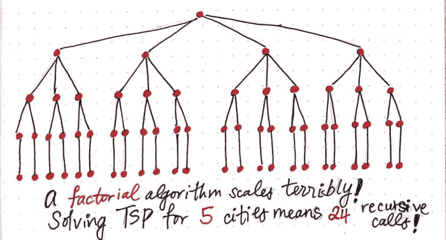](https://res.cloudinary.com/practicaldev/image/fetch/s--e_VWpdvm--/c_limit%2Cf_auto%2Cfl_progressive%2Cq_auto%2Cw_880/https://cdn-images-1.medium.com/max/1024/1%2Ay9dqvqHKYDo6C4u5pLUmtw.jpeg) 

<figcaption>阶乘算法如何从 4 个元素的输入扩展到 5 个元素。</figcaption>

</figure>

当我们的销售人员只需要访问四个城市时，我们进行了六次递归呼叫。但是现在，我们的“潜在路径”已经翻了两番，这看起来真的很糟糕，T2 真的很糟糕。求解五个城市的 TSP 意味着我们需要做 4 个！或者使用强力技术的四个阶乘递归调用。事实证明，4！等于 24，这意味着我们现在必须进行 24 次递归调用，以便在我们的旅行推销员的地图上多容纳一个城市。

如果我们将我们之前的 TSP 示例中的[递归函数调用“树”的图示版本与上面绘制的版本进行比较，我们就可以很好地理解*阶乘算法实际上是如何不可持续的。*](https://dev.to/vaidehijoshi/the-trials-and-tribulations-of-the-traveling-salesman-30c)

<figure>[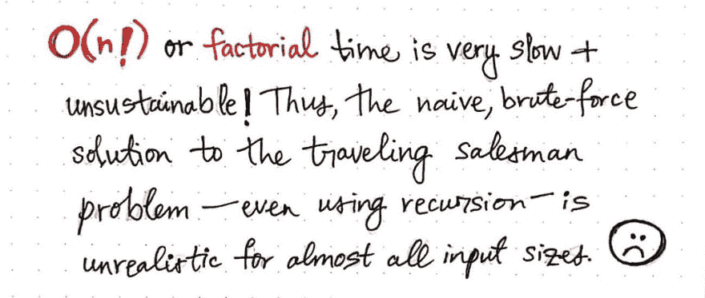](https://res.cloudinary.com/practicaldev/image/fetch/s--ApO44hqe--/c_limit%2Cf_auto%2Cfl_progressive%2Cq_auto%2Cw_880/https://cdn-images-1.medium.com/max/1024/1%2AiEo2Qd3BhZVVkUZQaoHuRA.jpeg)

<figcaption>(n！)运行时不可持续。</figcaption>

</figure>

在这个系列中，我们已经看到了相当多不同形式的大 O 符号，包括好的和坏的。那么，阶乘算法在这个故事中扮演什么角色呢？

> 如果常数、对数和线性时间是好的，二次和指数时间是坏的，那么就只剩下一件事需要探索:丑陋的。阶乘算法正是:丑陋的。

对于运行在 ***阶乘*** 或 **O(n！)** time，任何需要运行的操作最后都要花 n！更多的时间与正在操作的数据或输入数据集有关。

好吧，但是这个*实际上*是什么意思呢？好吧，让我们看看阶乘算法如何与我们已经熟悉的所有其他形式的大 O 符号相比较。

<figure>[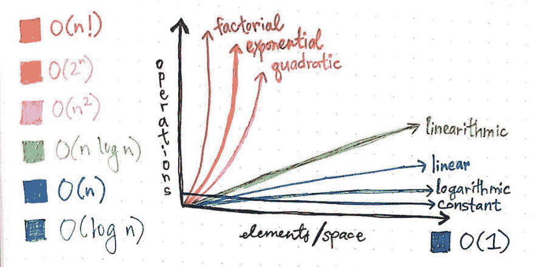](https://res.cloudinary.com/practicaldev/image/fetch/s--N9ehFI_W--/c_limit%2Cf_auto%2Cfl_progressive%2Cq_auto%2Cw_880/https://cdn-images-1.medium.com/max/1024/1%2AtXDAZzUr_Iijsc1kSTtzxA.jpeg) 

<figcaption>随着输入大小的增长</figcaption>

</figure>

阶乘时间非常慢且效率低下

我们几乎会立即注意到，随着输入大小的增加，以阶乘时间增长的算法会变得非常缓慢和低效。例如，我们将看到，即使阶乘算法要操作的元素数量略有增加，也会导致运行所需的操作数量激增。如果我们将其与线性算法、线性算法，甚至仅仅是*二次*时间算法进行比较，这些算法本身仍然非常糟糕，我们会发现阶乘算法相比之下非常糟糕！

所有这些都是在说:我们使用蛮力递归解决 TSP 的第一种方法可能不是最好的解决方案。是的，它可以工作，但是它可能不像它应该的那样“正确”；它还可以改进，当然也可以做得更优雅。当然，它一点也不快！

<figure>[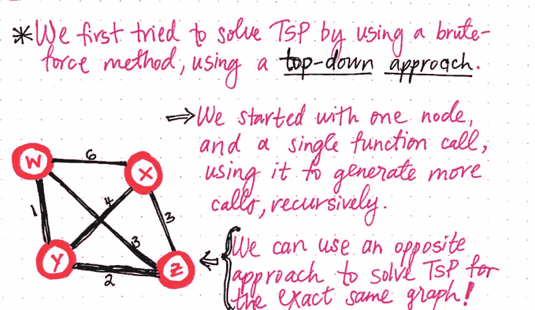](https://res.cloudinary.com/practicaldev/image/fetch/s--fNfEryeg--/c_limit%2Cf_auto%2Cfl_progressive%2Cq_auto%2Cw_880/https://cdn-images-1.medium.com/max/1024/1%2Af77LCDnUvy8apcEvp_K1sA.jpeg) 

<figcaption>使用蛮力采取自顶向下的方法求解 TSP。</figcaption>

</figure>

那么，我们如何改进我们的第一次尝试呢？

好吧，如果我们[回想一下我们对 ***动态编程*** ( *DP* )的尝试，我们会记得解决 DP 问题有不止一种方法。在我们最初尝试解决这个问题时，我们试图使用一种 ***自上而下的方法*** 来解决 TSP:我们从一个大的、复杂的问题开始，然后把它分解成更小的部分。然后，当我们深入到我们的基本情况，并将问题扩展到它的最小可能部分时，我们使用递归来构建我们的旅行推销员可以采取的所有可能路径，这允许我们选择我们已经找到的所有路径的最佳(最短)排列。](https://medium.com/p/43d29830a630)

在这个过程中，我们想出了一个解决旅行推销员问题的方法。但是如果我们用不同的方式来处理呢？如果我们采用自上而下的方法，把它颠倒过来，会发生什么？

只有一个办法可以知道——我们必须试一试！

### 调头 TSP

如果我们从上周开始查看自上而下的方法[，我们会发现我们已经列举了所有的路径排列——也就是说，我们已经强行确定了旅行推销员可以选择的每一条路线。](https://dev.to/vaidehijoshi/the-trials-and-tribulations-of-the-traveling-salesman-30c)

<figure>[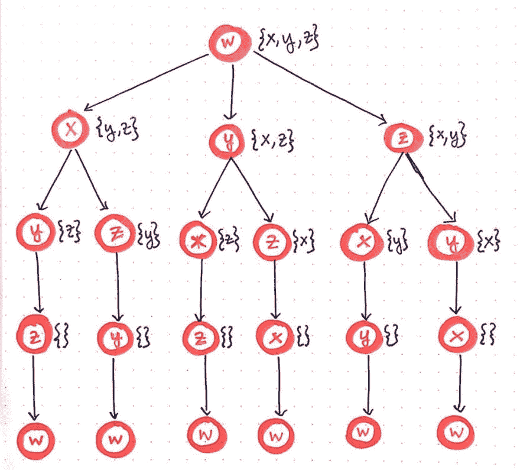](https://res.cloudinary.com/practicaldev/image/fetch/s--352wBjQ4--/c_limit%2Cf_auto%2Cfl_progressive%2Cq_auto%2Cw_880/https://cdn-images-1.medium.com/max/1024/1%2Ac5cw35mBFfgzn_T9LOh3zA.jpeg) 

<figcaption>用蛮力方法求解 TSP。</figcaption>

</figure>

这种方法不是特别优雅，有点混乱，而且，正如我们已经确定的那样，永远不会随着输入规模的增长而扩展。但是暂时忽略所有这些问题，让我们再一次看看递归函数调用的“树”。

<figure>[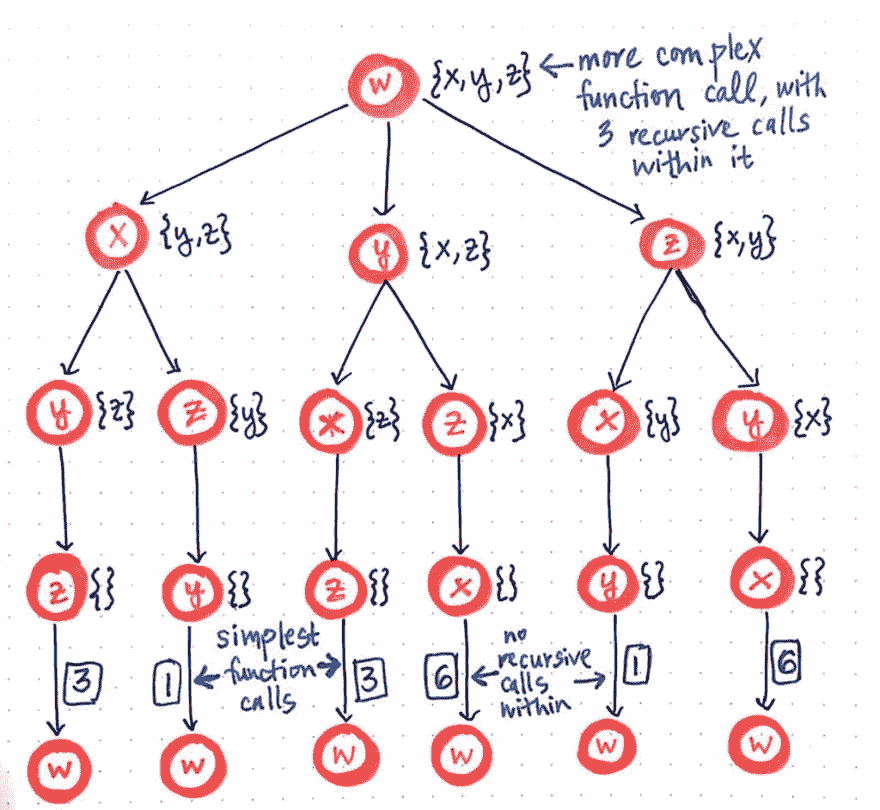](https://res.cloudinary.com/practicaldev/image/fetch/s--amJO7gvw--/c_limit%2Cf_auto%2Cfl_progressive%2Cq_auto%2Cw_880/https://cdn-images-1.medium.com/max/1024/1%2AAfNmG7Pwmgoz5LpZWBehHA.jpeg) 

<figcaption>通过识别最简单的问题或函数调用，重新思考强力方法。</figcaption>

</figure>

第二次浏览时，我们会注意到这里发生了一些有趣的事情:我们最初从更复杂的函数调用开始，然后，从内部，我们从 it 的中的*调用三个递归函数调用。这三个递归函数调用中的每一个都派生出两个自己的递归调用，这就创建了这个函数调用“树”的第三层。当然，这与我们对*自上而下*方法的工作定义是一致的:首先从最大的问题开始，然后把它分解成最小的部分。但是，现在我们可以更清楚地看到最小的部分，我们可以将我们的方法从自上而下的方法改为自下而上的方法。*

我们会回忆起一种 ***自下而上*** [的动态规划方法](https://dev.to/vaidehijoshi/less-repetition-more-dynamic-programming-fl)从最小的可能子问题开始，找出它们的解决方案，然后慢慢地建立自己来解决更大、更复杂的子问题。在我们的“函数调用树”的上下文中，最小可能的子问题是最小可能的函数调用。我们将看到最小的函数调用是最简单的——那些没有递归调用的函数调用。在我们的例子中，这些是位于“函数调用树”最底层的函数调用，这些函数调用可以追溯到我们的开始节点 w，这是我们的旅行推销员“开始”的城市，并且不可避免地将不得不“结束”在这个城市。

既然我们已经确定了最小的可能子问题，我们可以开始研究 TSP 了。对于这个问题，我们将颠倒自上而下的方法，而是使用自下而上的方法。让我们从三个最简单的函数调用开始。

<figure>[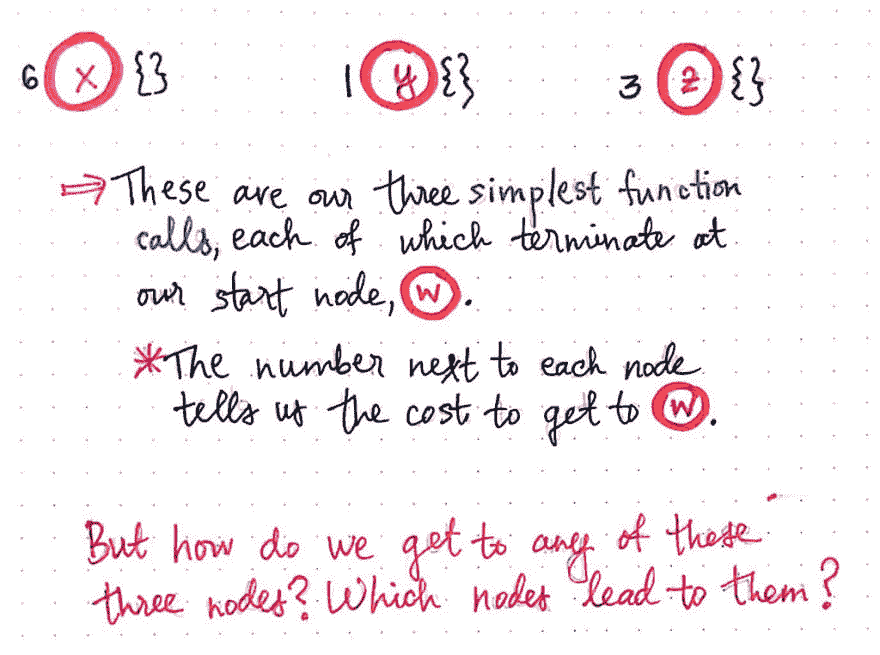](https://res.cloudinary.com/practicaldev/image/fetch/s--ftbXuFLe--/c_limit%2Cf_auto%2Cfl_progressive%2Cq_auto%2Cw_880/https://cdn-images-1.medium.com/max/1024/1%2AdntlyP4aeSTG_esnkc2d3A.jpeg) 

<figcaption>把 TSP 烙在头上，partβ1。</figcaption>

</figure>

正如我们所料，我们将看到每个调用都连接回 w。回想一下，我们使用列表符号来跟踪我们可以导航到的节点。因为我们处理的是最小的可能子问题，我们无法从这些节点导航到任何地方；相反，我们所能做的就是回到我们的起始节点 w，这就是为什么这三个子问题的每个列表都是空的({})。

然而，我们确实需要跟踪成本和距离，因为不可避免地，我们仍然必须为我们的旅行推销员找到最短的路径，不管我们是使用*自上而下*还是*自下而上*的方法。因此，在构建“自底向上”的树时，我们必须跟踪节点之间的距离。在上图中，我们将看到节点 x、y 和 z 旁边分别有值 6、1 和 3。这些数字代表从每个节点回到源节点的距离。

当我们第一次尝试解决 TSP 时，[我们使用邻接矩阵](https://dev.to/vaidehijoshi/the-trials-and-tribulations-of-the-traveling-salesman-30c)来帮助我们跟踪图中节点之间的距离。在这种方法中，我们将再次依靠我们的邻接矩阵。

然而，在我们自底向上的方法中，我们将使用它来枚举所有相互关联的函数调用。这与我们自上而下的方法截然不同，当时我们使用邻接矩阵来帮助我们列举所有可能的路径。在我们自下而上的方法中，我们试图让我们做事的方式更加优雅，所以我们的目标是不要列举我们不需要的东西！随着我们的继续，这将变得更有意义，但重要的是要注意枚举*路径与枚举 ***函数调用*** 之间的区别。*

 *那么，我们函数调用的第二层“树”会是什么样子呢？我们试图为每个最小的可能子问题回答的问题是:

> 如果我们在这个函数调用的最简单版本中，并且不能从这个函数中递归调用任何东西，那么还有什么其他函数可以调用这个函数呢？

<figure>[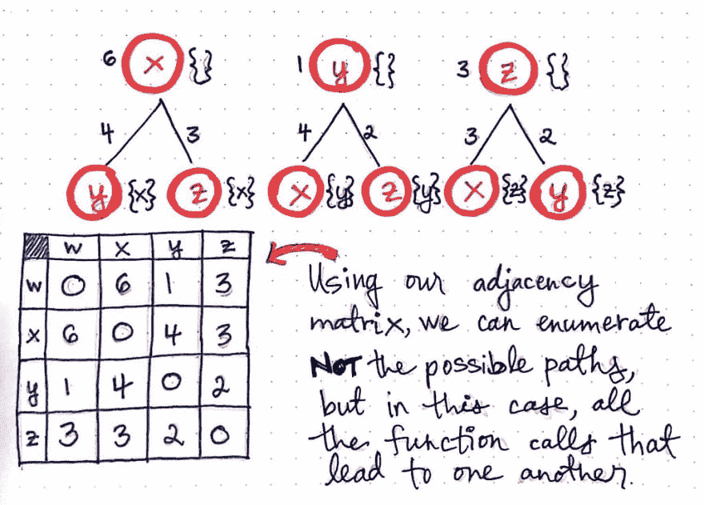](https://res.cloudinary.com/practicaldev/image/fetch/s--SQ7rmOnZ--/c_limit%2Cf_auto%2Cfl_progressive%2Cq_auto%2Cw_880/https://cdn-images-1.medium.com/max/1024/1%2AlSe5hl_WEQSri3qMrj4XEQ.jpeg) 

<figcaption>把 TSP 烙在头上，partβ2。</figcaption>

</figure>

另一种思考方式是根据节点。最终，我们试图确定哪些可能的节点将允许我们到达我们正在查看的节点。因此，在节点 x 的情况下，到达节点 x 的唯一方法可能是节点 y 或节点 z。请记住，我们在这里使用的是自下而上的方法，因此我们几乎是在往回追溯我们的步骤，从末端开始，然后通过循环返回。

请再次注意，我们记录了每个节点到下一个节点的成本/距离。我们很快就需要它们了！

同样，我们可以进一步扩展这个函数调用“tree ”,以添加另一个级别。记住，我们正在尝试回答这个问题:*还有什么函数可以调用这个我们无法进一步展开的函数？*

<figure>[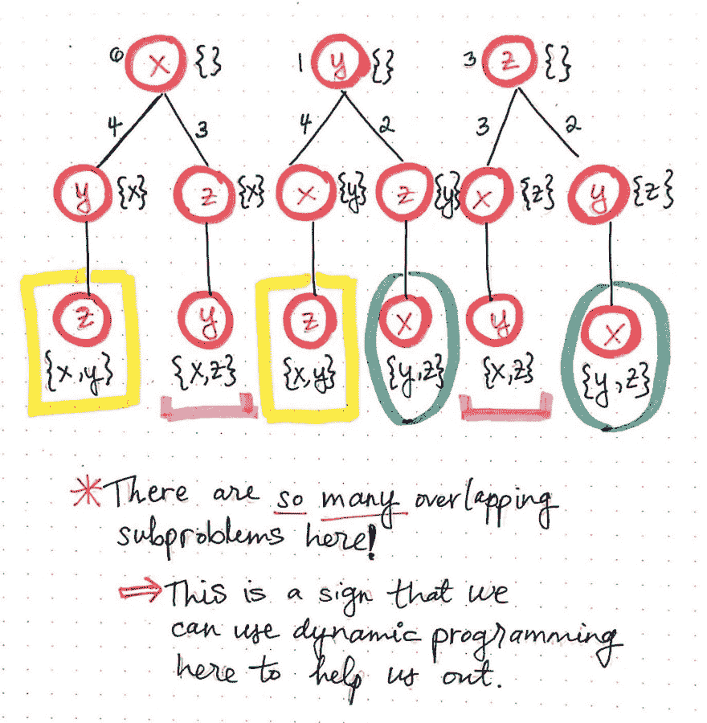](https://res.cloudinary.com/practicaldev/image/fetch/s--AOYYVCYP--/c_limit%2Cf_auto%2Cfl_progressive%2Cq_auto%2Cw_880/https://cdn-images-1.medium.com/max/1024/1%2ANaFUeDIty0V0uP2kCXXiAA.jpeg) 

<figcaption>在它头上烙 TSP，partβ3。</figcaption>

</figure>

在这里描绘的图中，我们将看到这实际上是什么样子。例如，查看这个函数调用“tree”的最左边的分支，我们会注意到，允许我们到达空节点 x 的唯一可能的函数调用来自节点 y 或节点 z，其中集合只包含 x 的一个可能的“下一个”节点，如下所示:{x}。对于最左边的子树中的节点 y 和 z，我们将看到，当集合包含 x 和 y(或{x，y})时，到达 y 的唯一可能的方法是从节点 z。类似地，当集合包含 x 和 z(或{x，z})时，到达 z 的唯一可能的方法是从节点 y 开始。

这是一个形象化的例子，说明了我们所说的枚举*函数调用*而不是枚举*潜在路径*的意思。当我们继续确定允许我们从其中调用其他函数的所有可能的函数调用时，一些事情开始变得非常明显:我们在这里有一些重叠的子问题！

我们会注意到，当 z 的集合包含 x 和 y(或{x，y})时，有两个函数调用是 z 的实例，用黄色突出显示。类似地，当 y 的集合包含 x 和 z(或{x，z})时，有两个函数调用是 y 的实例，用粉红色突出显示。最后，我们将看到两个函数调用，当 x 的集合包含 y 和 z(或{y，z})时，它们是 x 的实例，以绿色突出显示。

动态编程就是识别重复的工作，用我们的方法变得更聪明、更高效，这样我们就不必重复自己了！因此，让我们去掉这种重复，并使用一些动态编程来为我们的旅行推销员做一些更好的事情。

### 动态编程拯救推销员

既然我们已经确定了重叠和重复出现的子问题，那么只剩下一件事要做:当然是消除重复！

<figure>[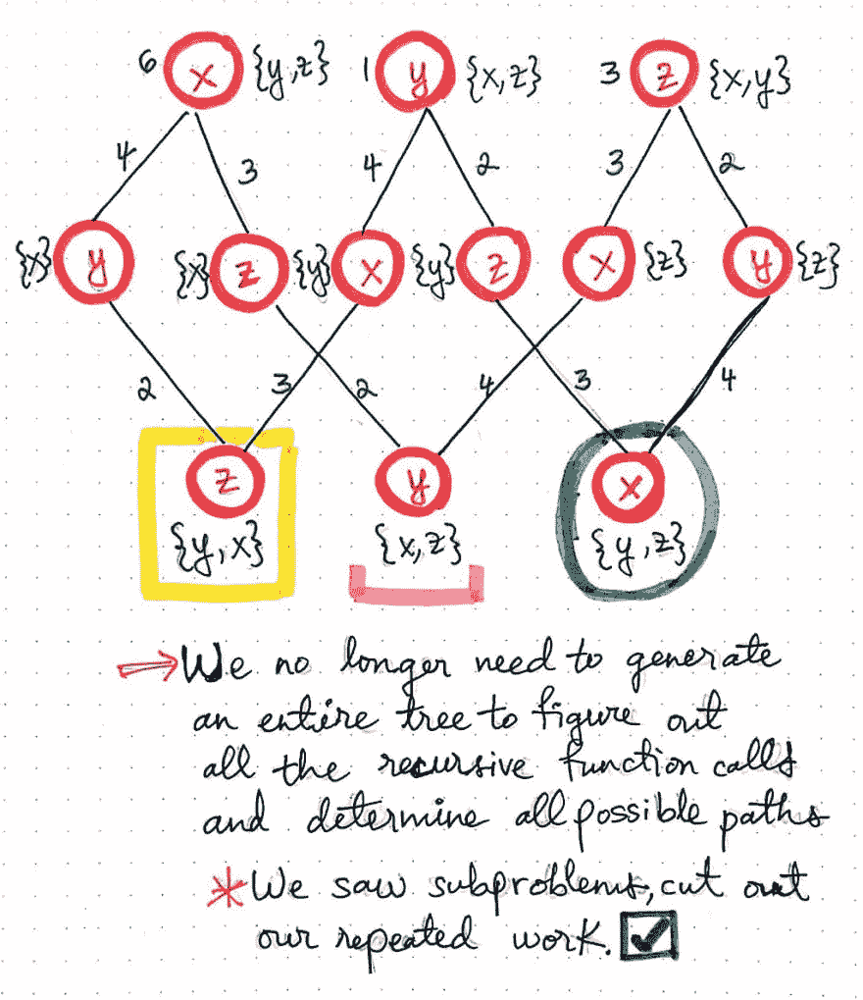](https://res.cloudinary.com/practicaldev/image/fetch/s--tGBkeFc7--/c_limit%2Cf_auto%2Cfl_progressive%2Cq_auto%2Cw_880/https://cdn-images-1.medium.com/max/1024/1%2A3JkCyvTr_kB_k6rNDahtOg.jpeg) 

<figcaption>在脑袋上烙 TSP，partβ4。</figcaption>

</figure>

使用我们的函数调用“tree ”,我们可以重新安排一些函数调用，这样我们就不会在这个树的第三层重复自己了。

我们可以通过减少重复的子问题来做到这一点，让它们只出现一次。然后，我们将重新配置我们树的底层，这样它仍然是*精确的*，而且我们每个函数调用出现*一次*，而不是两次。

现在，自下而上的方法与我们之前的自上而下的方法的不同变得越来越明显。

我们将会看到，我们不再需要生成整个底层的函数调用“树”来计算所有的递归函数调用。我们也不需要通过使用蛮力来确定我们的旅行推销员可能采取的所有可能的路径。相反，我们通过函数调用进行枚举，找到重复的函数调用，并在继续构建的过程中浓缩我们的函数调用“树”。

一旦我们消除了重复的子问题，我们就可以实际寻找最短路径了。请记住，我们将需要使用我们的邻接矩阵来计算出一个节点到另一个节点的距离。但是，我们还会注意到，我们不需要重复那么多，因为当我们合计时，我们不会看到相同的数字出现太多次。

在下图中，允许我们的销售人员从一个节点遍历到另一个节点的每个函数调用都有一个与之关联的数字(成本或距离)。当我们继续沿着这棵树往下看时，我们将合计每组函数调用的成本。例如，如果我们选择从 w

<figure> 

<figcaption>在脑袋上烙 TSP，partβ5。</figcaption>

</figure>

当我们深入到函数调用“tree”的第三层时，我们会看到有两个数字可供选择。回想一下，在上周的[自上而下方法](https://dev.to/vaidehijoshi/the-trials-and-tribulations-of-the-traveling-salesman-30c)中，我们遇到了类似的情况:我们有两条不同的路径，有两种不同的成本/距离可供选择。我们最终选择了两个成本中较小的一个，因为我们试图为我们的销售人员找到最短的路径。在这种情况下，我们有两个不同的函数调用，有两个不同的成本/距离可供选择。同样，我们将选择两个成本中较小的一个，因为我们也在尝试寻找最短路径！

最终，当我们继续计算距离/成本时，我们会看到我们得到了与上周的[强力方法](https://dev.to/vaidehijoshi/the-trials-and-tribulations-of-the-traveling-salesman-30c)完全相同的结果。我们的旅行推销员的最短成本是 11，有两种可能的途径可以让他们达到最低成本。然而，使用自底向上的方法，我们已经优化了我们的 TSP 算法，因为在这个方法中我们不再有六个递归调用。此外，我们也没有生成大的树结构！如果我们回想一下第一次[引入动态编程](https://dev.to/vaidehijoshi/less-repetition-more-dynamic-programming-fl)的时候，我们会回忆起我们也可以使用 ***记忆*** 并在计算时保存函数调用的结果，进一步优化我们的解决方案。

<figure>[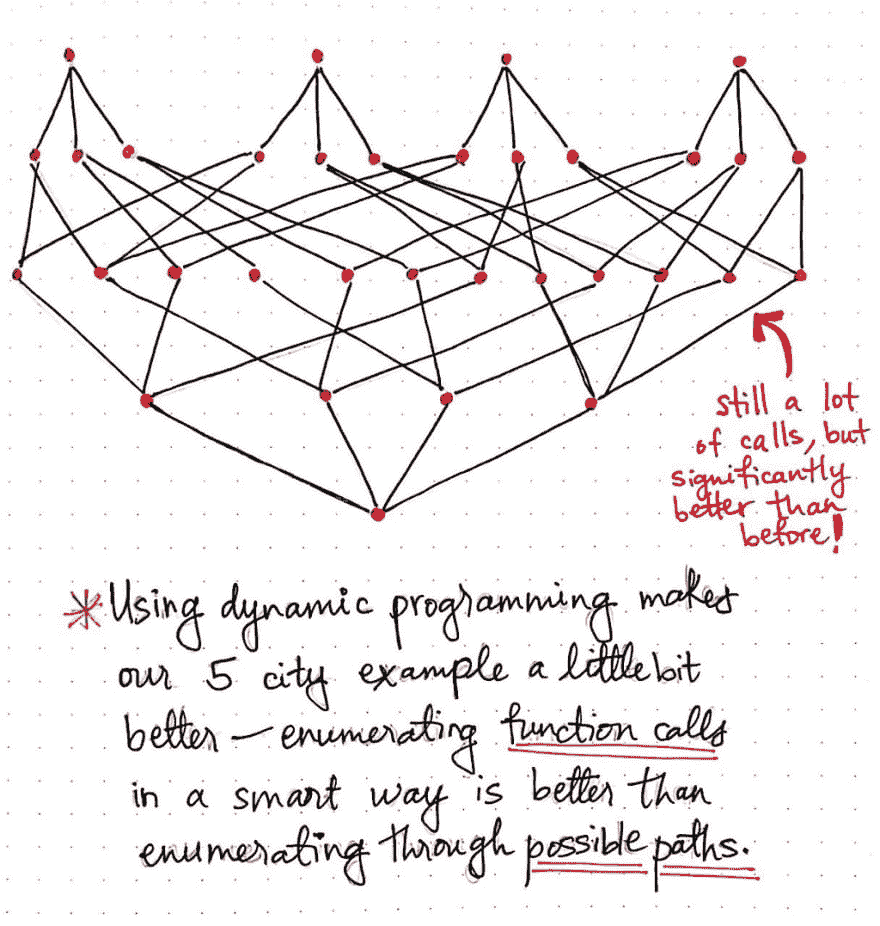](https://res.cloudinary.com/practicaldev/image/fetch/s--_1FJQ0Vg--/c_limit%2Cf_auto%2Cfl_progressive%2Cq_auto%2Cw_880/https://cdn-images-1.medium.com/max/1024/1%2A6BeiicyA4WKW0o5xdZNROA.jpeg) 

<figcaption>使用动态编程使我们的 5 个城市的例子快了一点。</figcaption>

</figure>

好的，所以我们开始沿着这条路走下去，努力迈出格言中的下一步"*让它工作，让它正确，让它快*"

可以说，我们已经使可行的解决方案变得更好，当然也更优雅，重复性更少。此处显示的插图举例说明了自下而上的 DP 方法如何适用于旅行推销员问题，其中推销员必须访问五个城市，而不是四个。我们将会看到，我们仍然在进行大量的调用，但是我们的函数调用“tree”变得更小了，并且比以前有了显著的改进。

通过使用动态编程，我们通过选择智能地枚举函数调用，而不是通过我们的推销员可能采取的每一条可能的路径，使我们对旅行推销员问题的解决方案稍有改进。

当然，我们现在要回答的唯一问题是，这个方法的运行时间与我们丑陋的阶乘 O(n！)更早的运行时？

事实证明，我们在这里探索的自下而上的方法实际上是所谓的 ***赫尔德-卡普算法*** 的基础，这也是[通常将](https://en.wikipedia.org/wiki/Held%E2%80%93Karp_algorithm)称为 ***贝尔曼-赫尔德-卡普算法*** 。这个算法是在 1962 年由迈克尔·赫尔德和理查德·m·卡普以及当时正独立进行相关研究的理查德·贝尔曼提出的。

<figure>[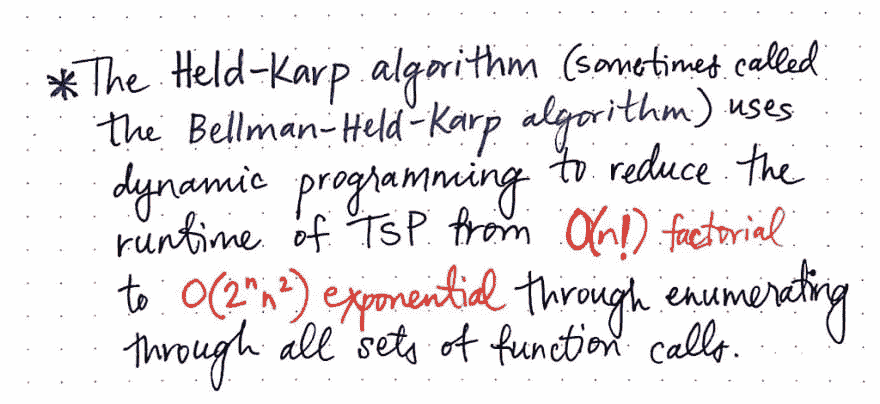](https://res.cloudinary.com/practicaldev/image/fetch/s--gVF_iShv--/c_limit%2Cf_auto%2Cfl_progressive%2Cq_auto%2Cw_880/https://cdn-images-1.medium.com/max/1024/1%2AgDVVEwuqs-y0oqztvvo80A.jpeg) 

<figcaption>赫尔德-卡普算法使用动态规划来逼近 TSP。</figcaption>

</figure>

Held-Karp 算法实际上提出了自底向上的动态规划方法，作为改进解决旅行商问题的强力方法的解决方案。贝尔曼、赫尔德和卡普的算法被确定在 ***指数*** 时间内运行，因为它仍然做了大量的工作来枚举所有可能的潜在函数调用集。Held-Karp 算法的指数运行时间仍然不完美——事实上，离完美还差得很远！但是，它没有阶乘算法那么难看，仍然是一个进步。

而且，说实话，我相信旅行推销员会很乐意接受他能得到的任何东西。

### 资源

旅行推销员问题已经被广泛地写过、研究过和教授过。事实证明，在尝试解决这个问题时，有许多不同的方法，Held-Karp 算法只是其中之一。如果您想更深入地了解这个特定的主题，这里有一些好的起点。

1.  [旅行推销员问题](https://www.youtube.com/watch?v=_51ot-Ri0ng)，0612 TV w/ NERDfirst
2.  [旅行推销员问题动态规划赫尔德-卡普](https://www.youtube.com/watch?v=-JjA4BLQyqE)，图沙尔·罗伊
3.  [什么是计算机科学中的 NP-完全？](https://stackoverflow.com/questions/210829/what-is-an-np-complete-in-computer-science)，StackOverflow
4.  [大 O 符号和复杂性](http://www.kestrelblackmore.com/blog/big-o-notation-complexity)，红隼布莱克摩尔
5.  [TSP](https://www.coursera.org/learn/algorithms-npcomplete/lecture/uVABz/a-dynamic-programming-algorithm-for-tsp)的动态规划算法，Coursera
6.  [旅行推销员问题:应用、公式和解决方法概述](https://www.intechopen.com/books/traveling-salesman-problem-theory-and-applications/traveling-salesman-problem-an-overview-of-applications-formulations-and-solution-approaches)，Rajesh Matai，Surya Singh 和 Murari Lal Mittal

* * **