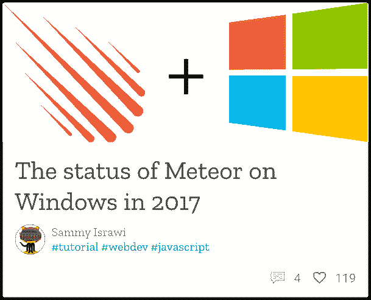
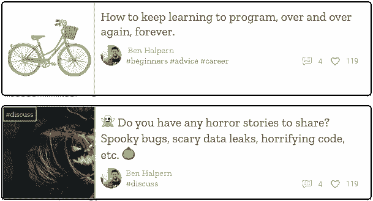
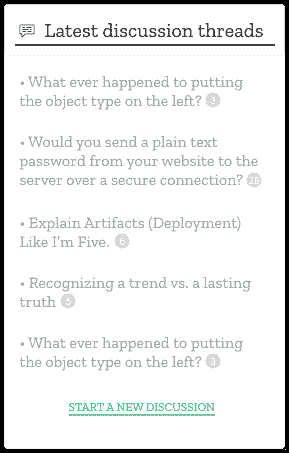
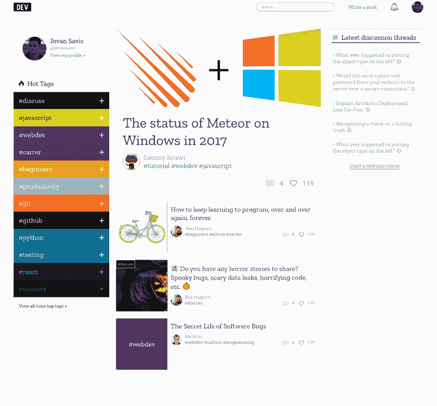

# 为了给用户带来更好的体验，需要在开发人员到用户界面方面做一些改进。

> 原文：<https://dev.to/jovan/couple-things-to-improve-in-devto-ui-to-make-a-better-experience-for-users-bcn>

大家好，这是我的第一篇帖子，我想指出我在 dev.to 主页上滚动时遇到的一些问题。正如有人曾经说过的那样:“抱怨一个问题却没有提出解决方案，这叫做抱怨。”所以我觉得有必要为我的一些问题设计解决方案。如果你想跳过所有阅读，只看最终设计，滚动到文章底部。对我来说，第一个也是最大的问题是文章标题的排版。它太大了，感觉有点太“咄咄逼人”了，所以我需要努力去读它。我做的事情是解决这个问题，改变标题的颜色为小亮暗(#444444)和字体系列为“Zilla Slab”。我还将帖子作者的字体和颜色改为灰色(#95989A)，因为我觉得我不需要先知道谁是作者，但标题对我来说非常重要，因为我将根据它来决定我是否想阅读帖子。贝娄是首页第一个帖子的图片。
 
在我向你展示主页上其余帖子的设计之前，我需要告诉你一些事情。当在主页上滚动时，首先看到帖子的缩略图会很有帮助，这样我可以更快地决定它是关于什么的，然后如果我不清楚，我会阅读标题。第一个帖子没有#标签，现在有些帖子在标题前有#标签，第二个有#标签。
 
但是，没有缩略图的帖子呢？我怀疑使用什么解决方案，这已经存在于 dev.to 中，或者代替 image 来放置带有#tag 标题和该标签背景的 div。看看下面的图片，我的决定。
 
其他我没有解释的是作者的圆角图像，看起来更像链接的标签颜色，以及非首发帖子的赞和评论的小图标。出于审美的原因也有类似的。
此外，当我只想浏览帖子时，带有讨论和播客的边栏会让我分心，因此我将链接换成了更亮的颜色(#95989A)。出于美观的原因，我把普通的纽扣改成了扁平的。看下图。

帖子，侧边栏等的卡片是#ffffff，带有 0，0，3 的框阴影，rgba(0，0，0，0.12)，页面的背景颜色更亮(#F8F8F8)，所有用户图像都是圆形的。几乎所有地方的字体都是“Zilla Slab”，除了数字(Roboto)。我没有重新设计整个主页，因为我不认为其他东西会影响体验。
下图是没有页脚和我认为对体验没有影响的元素的主页。
 
[分辨率更好的 SVG 文件](https://drive.google.com/open?id=1YVBFZenqkaVZTEf7HyO--2gaolp78IPC)

最后，我希望你留下评论，如果有什么我没有解释的，你是否同意我的观点，或者也许没有必要做这些改变。如果我没有解释清楚，请提问，因为这不仅是我在 dev.to 上的第一篇文章，也是我的第一篇博客文章。另外，我想感谢那些允许我在设计中使用他们的帖子和信息的人。