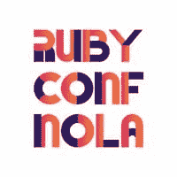

# 鲁比在大容易

> 原文：<https://dev.to/bengreenberg/ruby-in-the-big-easy-471>

[T2】](https://res.cloudinary.com/practicaldev/image/fetch/s--onyfMEr2--/c_limit%2Cf_auto%2Cfl_progressive%2Cq_auto%2Cw_880/https://thepracticaldev.s3.amazonaws.com/i/6bw85vrtzxmenhi3m9ov.jpg)

本周，我将以🛫的身份飞往新奥尔良，这是我第一次参加 RubyConf。我很幸运被选为今年 RubyConf *学者*，这意味着大会慷慨地选择支付我的出席费用，并为我联系了一位*向导*，一位更有经验的参与者，他可以帮助塑造我的经历(我甚至有两位向导:*👋嗨，斯特拉&凯勒！*)。如果没有这份慷慨，我将无法参加 RubyConf，即使我能够参加，如果没有额外的支持和编程，我的经历肯定不会如此丰富和有意义，因此我非常感激。

这将是我近 15 年来的第一次技术会议。早在 1999 年，我在圣地亚哥参与创办了一个名为 [Toorcon](https://toorcon.net/) 的信息安全会议，该会议至今仍在继续，但几年后，我的生活转向了不同的方向，直到最近，我才重新回到编程领域。如果你对我的背景更感兴趣，你可以看看我在[上的博客，拉比为什么要学习编码？](http://thecodingrabbi.com/2017/05/02/why_would_a_rabbi_learn_to_code/)在我的博客上。

当我准备好明天去 RubyConf 的时候，我认为分享我在这次会议上的一些目标是很重要的，这样既可以让我自己负责，也可以与其他可能发现自己处于类似情况的人分享。几天前，我在熨斗学校的校友兼朋友 Yechiel Kalmenson 也分享了他的想法，这些想法非常棒。在这次会议上，我希望:

*   每天至少建立两个有意义的新联系，☑
*   每天参加一次超出我现有深度的会议，扩展我的知识☑
*   每天参加 3-4 次会议，这将加深我现有的知识☑
*   不要害怕翘课去交新朋友☑
*   关于我的新学习的博客至少 1 次☑

如果你今年也参加 RubyConf，请告诉我，我们可以一起去吃点馅饼，喝点咖啡！