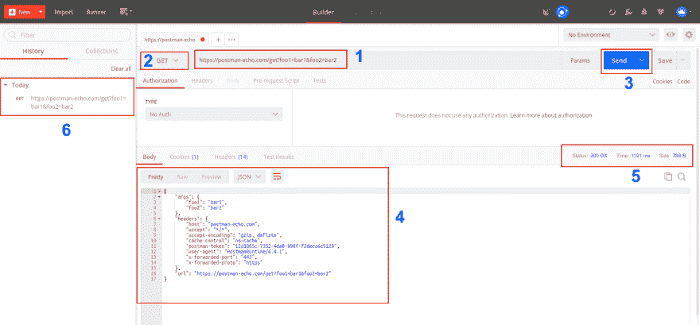
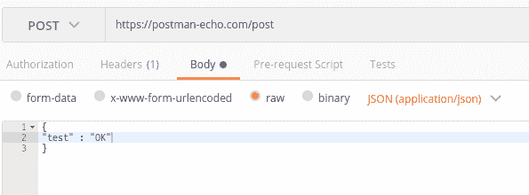
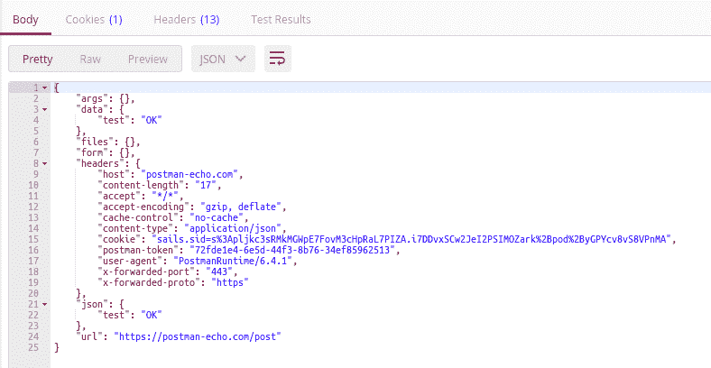
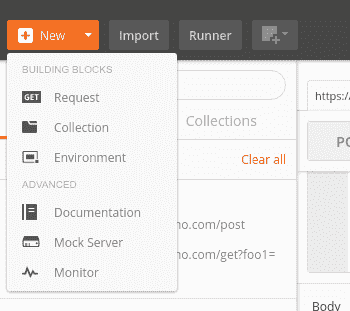
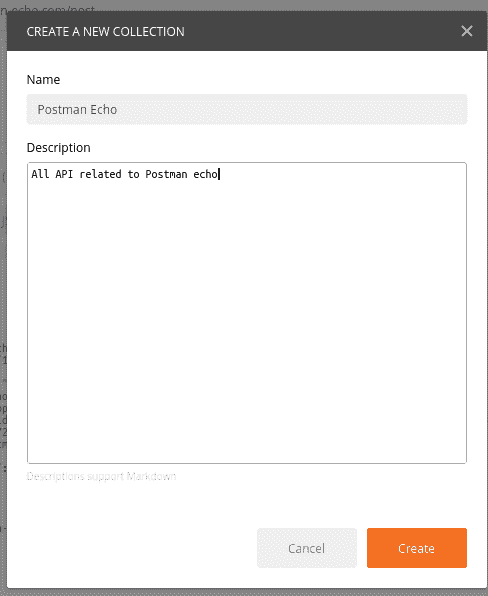
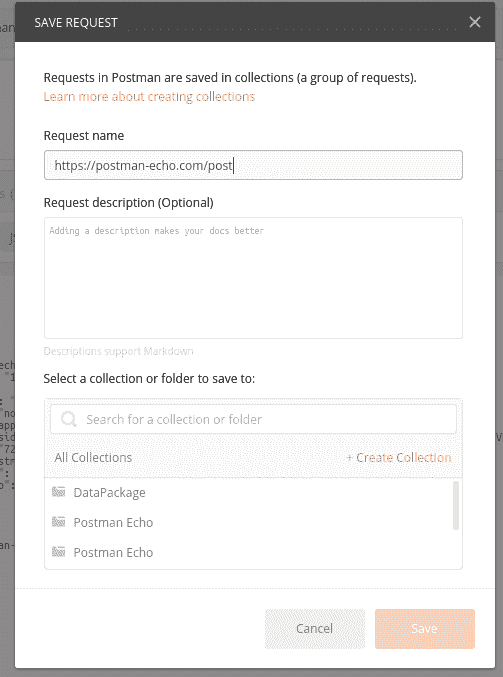
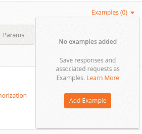
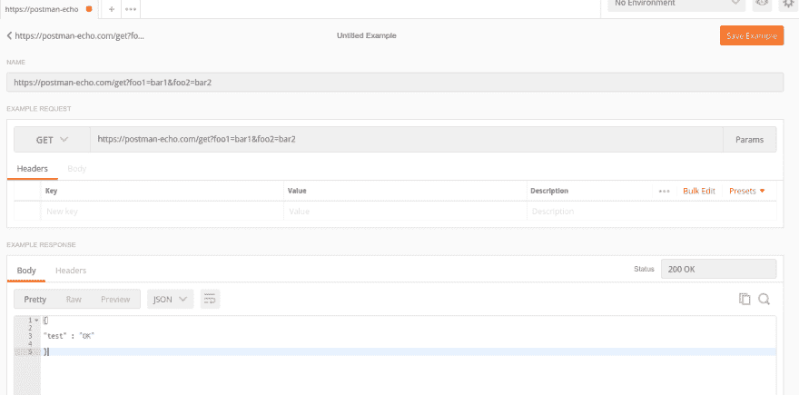
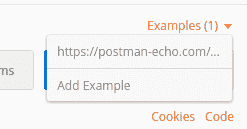

# Postman REST 客户端介绍

> 原文：<https://dev.to/harshitrathod/introduction-to-postman-rest-client-748>

这篇文章最初发表在我的博客[这里](http://harshitrathod.com/2017/11/11/introduction-postman-rest-client/)

## 总结

邮递员是一个功能丰富的 REST 客户端。成千上万的开发者用它来浏览、测试甚至记录 API。这篇文章旨在提供开始使用 Postman 所需的基本信息

## 简介

始于 2012 年的 REST client Postman 已经自我改进，支持 API 开发和测试所需的所有功能。根据 2014 年的官方数据，它拥有 300 多万活跃用户。您可以发出 HTTP 请求，比如 GET、POST、PUT 和 DELETE。您还可以使用它对您的 API 执行自动化测试。通过监控功能，您可以执行一组请求来检查其性能和响应

它可以作为 Chrome 扩展和电子版的原生应用程序使用。我建议使用原生应用程序，因为 Chrome 扩展很快就会被否决。你可以从这里下载。在本帖中，我们将使用服务调用 Postman EchoÂ来模拟我们的 API

## 发送您的第一个请求

从 Postman 调用 API 就像是小菜一碟。为了简单起见，我们将向服务器发出一个 GET 请求

[T2】](https://res.cloudinary.com/practicaldev/image/fetch/s--Pz_TR_NN--/c_limit%2Cf_auto%2Cfl_progressive%2Cq_auto%2Cw_880/http://harshitrathod.com/wp-content/uploads/2017/11/blog1.png)

1.  API 的 URL
2.  请求类型[获取、发布、上传、删除]
3.  发送按钮来调用 API
4.  API 的响应
5.  更多信息
6.  过去 API 调用的历史记录

### 发送带有请求的帖子数据:

[T2】](https://res.cloudinary.com/practicaldev/image/fetch/s--QD2bjM0E--/c_limit%2Cf_auto%2Cfl_progressive%2Cq_auto%2Cw_880/http://harshitrathod.com/wp-content/uploads/2017/11/blogrequest.png)

在对 API 进行 POST 请求时，您需要将一些数据作为主体进行传递。正如上面的截图所示，您可以在调用 API 的同时传递数据

[T2】](https://res.cloudinary.com/practicaldev/image/fetch/s--10oHS9y7--/c_limit%2Cf_auto%2Cfl_progressive%2Cq_auto%2Cw_880/http://harshitrathod.com/wp-content/uploads/2017/11/blogresonse.png)

## 收藏

邮递员提供了很好的方法来组织你的相关请求。它叫做集合，就像文件夹结构，所以你可以浏览 API。你也可以在测试脚本中使用集合，但是这将在后面解释。您可以创建和浏览收藏，如下所示

Â

[T2】](https://res.cloudinary.com/practicaldev/image/fetch/s--nD2QyqNd--/c_limit%2Cf_auto%2Cfl_progressive%2Cq_auto%2Cw_880/http://harshitrathod.com/wp-content/uploads/2017/11/createCollection1.png)

[T2】](https://res.cloudinary.com/practicaldev/image/fetch/s--hX_XqrAG--/c_limit%2Cf_auto%2Cfl_progressive%2Cq_auto%2Cw_880/http://harshitrathod.com/wp-content/uploads/2017/11/createcollection2.png)

[T2】](https://res.cloudinary.com/practicaldev/image/fetch/s--Oc2ETKa9--/c_limit%2Cf_auto%2Cfl_progressive%2Cq_auto%2Cw_880/http://harshitrathod.com/wp-content/uploads/2017/11/createcollection3.png)

[T2】](https://res.cloudinary.com/practicaldev/image/fetch/s--NXgx2Onm--/c_limit%2Cf_auto%2Cfl_progressive%2Cq_auto%2Cw_880/http://harshitrathod.com/wp-content/uploads/2017/11/createcollection4.png)

T3】β

## 举例

当你有不同的前端和后端团队时，REST API 设计是最重要的部分。由于对 API 设计的误解，前端团队不想重构他们的代码。Postman 用一个叫做“例子”的概念解决了这个问题。例如，您可以保存 API 的请求/响应参数。保存您的示例后，您可以与团队共享它。你也可以用 Postman 模拟服务器创建一个模拟服务器。前端团队可以将它作为实际 API 的替代品

[T2】](https://res.cloudinary.com/practicaldev/image/fetch/s--LXuDB0ph--/c_limit%2Cf_auto%2Cfl_progressive%2Cq_auto%2Cw_880/http://harshitrathod.com/wp-content/uploads/2017/11/e1.png)

[T2】](https://res.cloudinary.com/practicaldev/image/fetch/s--utyyPM-4--/c_limit%2Cf_auto%2Cfl_progressive%2Cq_auto%2Cw_880/http://harshitrathod.com/wp-content/uploads/2017/11/e2.png)

[T2】](https://res.cloudinary.com/practicaldev/image/fetch/s--JuviijDj--/c_limit%2Cf_auto%2Cfl_progressive%2Cq_auto%2Cw_880/http://harshitrathod.com/wp-content/uploads/2017/11/e3.png)

## 结论

Postman 是任何开发人员的日常工具。任何后端开发人员都可以快速检查他的 API，而无需任何前端应用程序。此外，开发人员可以编写测试脚本，这将有助于他们对 API 的变化进行影响分析。前端开发人员可以使用它作为实际 API 的替代品，这将使他们独立于后端团队